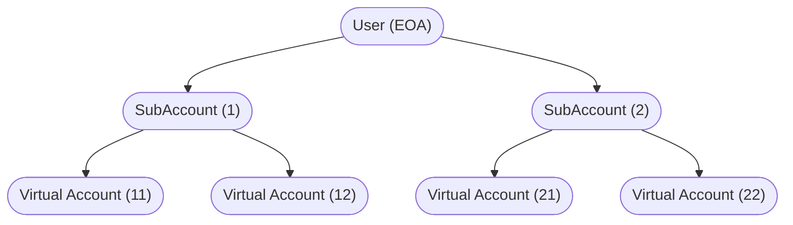
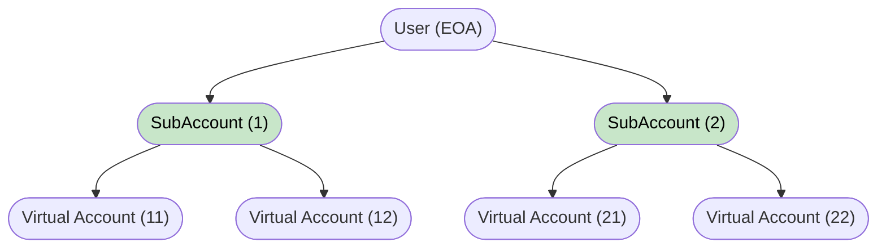
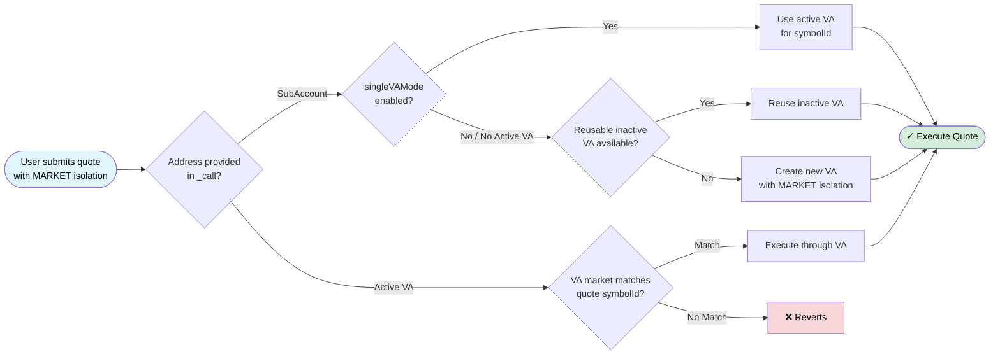
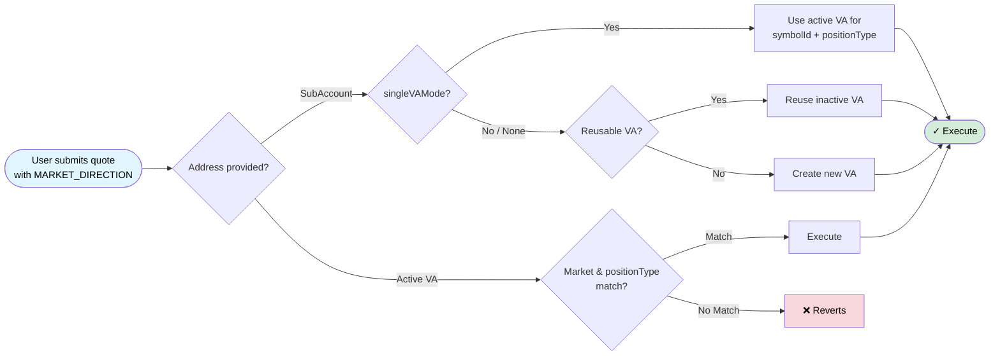
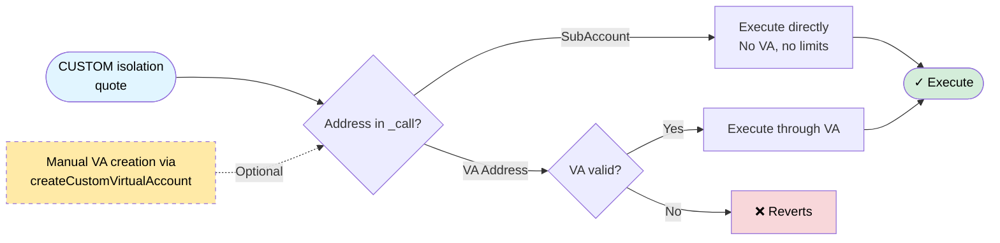
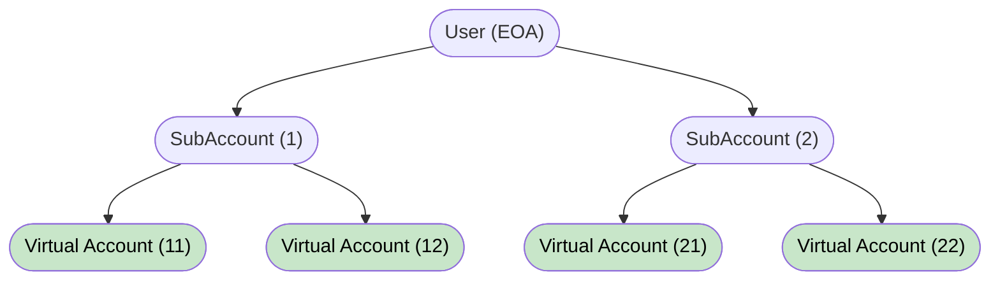
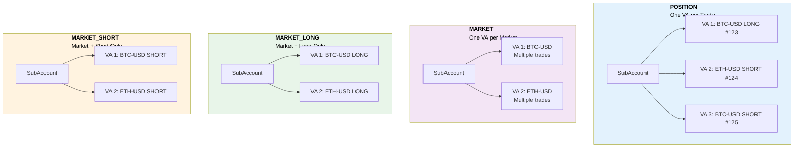

# AccountLayer

The **Symmio AccountLayer** is a unified Diamond proxy (EIP-2535) that consolidates account management, affiliate registration, and fee distribution into a single system. It replaces the previously separate MultiAccount contracts and affiliate management systems with a more efficient, flexible, and upgradeable architecture.

## Why AccountLayer

In older versions, each frontend was responsible for deploying its own **MultiAccount** contract, which Symmio then registered with **perps-core**. This approach caused several challenges:

- **Slow upgrades**: Each frontend had to redeploy contracts for updates
- **Manual onboarding**: Every affiliate required separate setup
- **Inconsistent behavior**: Different implementations across frontends
- **Limited flexibility**: Users couldn't easily manage multiple isolation strategies
- **No custom hooks**: Affiliates couldn't execute custom logic (NFT minting, cashback, loyalty points) without modifying core contracts

AccountLayer solves these issues by:

- **Unifying account logic**: A single Diamond manages all accounts
- **Standardizing affiliates**: One registry with consistent fee handling
- **Enabling flexibility**: Multiple SubAccounts with different isolation types per user
- **Supporting hooks**: Affiliates can attach custom logic without code changes
- **Reducing costs**: No contract deployment per user account

## Architecture Overview

AccountLayer uses the Diamond pattern with six core facets:

| Facet | Responsibility |
|-------|----------------|
| **CoreFacet** | SubAccount/VirtualAccount lifecycle, deposits, quote execution |
| **AffiliateFacet** | Affiliate registration, fee configuration, hook management |
| **ViewFacet** | Read-only queries for accounts, affiliates, and addresses |
| **ControlFacet** | RBAC, pause control, Symmio core whitelisting |
| **MarginFacet** | Margin transfers between SubAccounts and VirtualAccounts |
| **SymmioHookFacet** | Callbacks from Symmio core (position close, quote cancel) |

Each affiliate gets an **AccountManager** proxy (deployed once per affiliate) that serves as the entry point for user interactions.

## Account Hierarchy

User accounts are organized into a two-layer hierarchy—**SubAccounts** and **Virtual Accounts (VAs)**—providing clear separation, improved isolation, and precise control over funds, trades, and risk management.



### Fund Flow

Funds flow between layers as follows:

1. **User → SubAccount**: User deposits collateral to their SubAccount
2. **SubAccount → VirtualAccount**: Funds transfer to VA when created or via `addMargin()`
3. **VirtualAccount → SubAccount**: Funds return automatically when VA is deleted, or manually via `removeMargin()`

When a Virtual Account completes its purpose (all positions closed), remaining funds are **automatically transferred back** to the parent SubAccount before deactivation.

---

## SubAccounts



Any user (EOA) can create multiple **SubAccounts** to organize trades and manage risk. Each SubAccount is linked to:

- A specific **affiliate**
- A specific **Symmio core** (perps-core diamond)
- An **isolation type** that defines how VirtualAccounts are created and managed

### SubAccount Isolation Types

#### 1. POSITION Isolation

A SubAccount with **POSITION** isolation fully isolates each quote. When a user submits a quote:

- A new Virtual Account is created specifically for that quote
- The user must transfer margin to the VA before execution
- Each quote results in a separate VA, completely isolated from others
- Once the quote closes or cancels, the VA is destroyed and balance returns to the SubAccount

#### 2. MARKET Isolation

A SubAccount with **MARKET** isolation groups quotes by market (symbolId):



A single SubAccount may have multiple VAs, each dedicated to a specific market.

#### 3. MARKET_DIRECTION Isolation

Similar to MARKET isolation, but considers both **market** and **direction (Side)**:



#### 4. CUSTOM Isolation

A SubAccount with **CUSTOM** isolation gives full control to the user:

- When `_call()` uses a **SubAccount address**: Quote executes directly through the SubAccount (no VA created, no isolation)
- When `_call()` uses a **VA address**: Quote executes through that VA

Users can manually create VAs using `createCustomVirtualAccount()` with their desired configuration. Setting `symbolId = 0` indicates no specific market assignment.



---

## Virtual Accounts



**Virtual Accounts (VAs)** provide isolation and flexibility for trading. A VA can be created:

- **Automatically** during `sendQuote` operations
- **Manually** via `createCustomVirtualAccount()`

### Deterministic Addresses

VA addresses are **deterministic** and **predictable**. Each SubAccount maintains a nonce that increments with every new VA. The address is generated using:

```solidity
function _generateVirtualAccountAddress(address parentAccount, uint256 nonce);
```

Before executing a trade through a new VA, users must allocate margin using `addMarginToNextVA()`.

### VA Isolation Types



| Type | Description |
|------|-------------|
| **POSITION** | Dedicated to a single trade. Maximum isolation. Destroyed when trade closes. |
| **MARKET** | Tied to a specific market. Multiple trades share the same VA. |
| **MARKET_LONG** | Isolated to a market and LONG positions only. |
| **MARKET_SHORT** | Isolated to a market and SHORT positions only. |

### VA Lifecycle

Once all trades close and settlement completes, the VA's balance is **automatically transferred** to the parent SubAccount, and the VA is pooled for potential reuse.

---

## Single VA Mode

**Single VA Mode** (`singleVAMode`) controls whether multiple VAs with the same configuration can exist for a SubAccount.

### Benefits

- **Simpler frontend integration**: Once a VA is created for a market, the same address can be reused
- **Reduced address management**: No need to track multiple VA addresses per market
- **Predictable behavior**: One active VA per isolation key

### Behavior

When `singleVAMode` is enabled:

- For MARKET isolation: Only one VA per symbolId
- For MARKET_DIRECTION isolation: Only one VA per symbolId + positionType

When disabled, multiple VAs with the same configuration can coexist.

---

## VA Reuse Pool

To prevent unbounded growth of VA addresses, AccountLayer supports a **reuse mechanism**:

1. When a VA becomes inactive (all trades closed), it enters a reuse pool
2. VAs are grouped by: parent address, isolation type, and symbolId
3. When a new quote needs a VA, the system first checks for reusable VAs
4. If found, the most recently deactivated VA is reactivated instead of creating a new one

---

## Margin Management

Margin management between SubAccounts and VirtualAccounts uses dedicated functions:

### Adding Margin

```solidity
// Add margin to an existing VA
function addMargin(address virtualAccount, uint256 amount) external;

// Pre-allocate margin to the next VA that will be created
function addMarginToNextVA(
    address subAccount,
    VirtualAccountIsolationType isolationType,
    uint256 symbolId,
    uint256 amount
) external;
```

### Removing Margin

```solidity
function removeMargin(
    address virtualAccount,
    uint256 amount,
    ISymmio.SingleUpnlSig memory upnlSig
) external;
```

The `addMarginToNextVA` function is essential when creating new VAs, as margin must be allocated **before** the quote is submitted.

---

## Affiliate System

The AccountLayer provides a unified system for registering and managing affiliates (frontends/integrators).

### Affiliate Lifecycle

```
NONE → PENDING → ACTIVE → PAUSED → DEACTIVATED
         ↓
      REJECTED
```

### Registration

An affiliate starts in `PENDING` and becomes `ACTIVE` after approval.

#### Step 1: Request Registration

```solidity
function requestToRegisterAffiliate(AffiliateRegistration reg) external returns (address affiliateAddress);
```

Input structure:

```solidity
struct AffiliateRegistration {
    string name;               // Affiliate name
    string brandColor;         // Brand color
    address admin;             // Admin address for managing settings
    Stakeholder[] stakeholders; // Fee receivers with shares
    uint256 symmioShare;       // Protocol fee share (1e18 = 100%)
    bytes metadata;            // Optional metadata
    address[] legacyMultiAccounts; // Old contracts for migration
    address[] symmioCores;     // Allowed Symmio diamonds
}

struct Stakeholder {
    address receiver;
    uint256 share; // 1e18 = 100%
}
```

**Requirements**:
- Requested Symmio cores must be whitelisted in AccountLayer
- `stakeholders` + `symmioShare` must sum to `1e18` (100%)
- `affiliateAddress` is deterministically computed

#### Step 2: Approve Affiliate

An approver (`APPROVER_ROLE`) calls:

```solidity
function approveAffiliate(address affiliate) external;
```

On approval:
- AccountLayer deploys the affiliate's `AccountManager` proxy
- A **fee distributor address** is derived and stored
- The affiliate is registered on each allowed Symmio core

### Deterministic Addresses

Two addresses are deterministic:

| Address | Derivation |
|---------|------------|
| **Affiliate (AccountManager)** | `CREATE2(registrant, name)` |
| **Fee Distributor** | `CREATE2(feeDistributorFactory, keccak256(affiliate, nonce))` |

---

## User Accounts

Users interact through their affiliate's `AccountManager`:

```solidity
function addAccount(string memory name) external returns (address[] memory subAccountAddress);
```

The AccountManager calls AccountLayer and temporarily sets the signer to the user. This maintains compatibility without deploying a contract per account.

---

## Fee Distribution

Fees accrue under a **virtual fee distributor address** (deterministic, not a deployed contract).

### Claiming Fees

```solidity
function claimAllFees(address affiliate, address symmio) external;
function claimFees(address affiliate, address symmio, uint256 amount) external;
```

### Claim Flow

1. Verify affiliate is active and Symmio core is enabled
2. Use affiliate's fee distributor address
3. Call Symmio with `setSigner(feeDistributor)` to withdraw fees
4. Split and transfer to stakeholders + Symmio fee receiver

### Fee Updates

Fee configuration changes require two-step approval:

1. **Admin requests**: `requestFeeUpdate(stakeholders, symmioShare)`
2. **Approver confirms**: `approveFeeUpdate(affiliate)`

---

## Hooks

Affiliates can attach hooks for custom logic during account lifecycle events:

| Hook | Trigger |
|------|---------|
| `onAccountCreation` | SubAccount created |
| `onVirtualAccountCreation` | VirtualAccount created |
| `onVirtualAccountDeletion` | VirtualAccount deleted |
| `onSubAccountDeletion` | SubAccount deleted |
| `onCall` | Generic call executed |

### Usage Examples

- Mint an NFT on account creation
- Issue cashback or loyalty points
- Update external whitelists
- Track analytics

### Security Notes

- Hooks are external calls—a bad hook can revert transactions
- The signer is cleared before hook execution to prevent impersonation
- Only whitelisted selectors are allowed

---

## Express Deposits

Express deposits let frontends split user deposits to maintain instant-withdraw liquidity.

### Purpose

A deposit splits into:

- **Real**: Deposited into Symmio core as protocol collateral
- **Virtual**: Stays with a virtual provider for express liquidity

The user's balance increases by the full amount; the virtual portion is provider-managed.

### Entry Points

```solidity
function depositForAccountWithExpressRate(address account, uint256 amount) external;
function depositAndAllocateForAccountWithExpressRate(address account, uint256 amount) external;
```

### Flow

1. Read affiliate config: `expressRate` and `virtualProvider`
2. Split amount:
   - `virtualAmount = amount * expressRate / 1e18`
   - `realAmount = amount - virtualAmount`
3. Transfer full amount from user to AccountLayer
4. Deposit `realAmount` into Symmio core
5. Transfer `virtualAmount` to virtual provider, call `onExpressDeposit()`
6. Provider calls `virtualDepositFor()` to update accounting
7. Invariant: input amount = user balance increase (+ allocation if used)

---

## Call As Affiliate

Affiliates can execute delegated admin actions:

```solidity
function callAsAffiliate(
    address affiliate,
    address symmio,
    bytes calldata callData
) external returns (bytes memory);
```

This call:
- Restricted to affiliate admin or approved operators
- Only targets enabled Symmio cores
- Executes with `setSigner(affiliate)` on the target core

---

## Security Model

### Access Control Roles

| Role | Responsibility |
|------|----------------|
| `DEFAULT_ADMIN_ROLE` | Super admin |
| `APPROVER_ROLE` | Activate affiliates, approve fee updates |
| `SETTER_ROLE` | Manage core whitelists and configurations |
| `PAUSER_ROLE` | Pause operations |
| `UNPAUSER_ROLE` | Unpause operations |
| `SIGNER_SETTER_ROLE` | Set global signer (granted to AccountManager) |
| `DEPLOYER_ROLE` | Deploy AccountManagers |
| `DISTRIBUTOR_ROLE` | Fee distribution |

### Important Security Notes

- **Trust/roles matter**: `APPROVER_ROLE` controls which affiliates go live; `SETTER_ROLE` controls core whitelists
- **Hooks are arbitrary external calls**: Not sandboxed—a bad hook can revert flows or become an attack surface
- **Reentrancy protected**: CoreFacet, MarginFacet, AffiliateFacet use nonReentrant guards
- **Signer clearing**: Signer is cleared before hook calls to prevent impersonation

---

## Legacy Migration

For backward compatibility with old MultiAccount contracts:

```solidity
function importLegacyAccounts(address[] memory accounts) external;
```

Legacy MultiAccount addresses can be registered, allowing:
- `ownerOf()` to check legacy accounts
- `getRelatedCore()` to fall back to legacy contracts
- Existing accounts to be imported as SubAccounts with CUSTOM isolation

---

## Summary

The AccountLayer Diamond consolidates account management and affiliate handling into a single, upgradeable system:

- **Hierarchical accounts**: User → SubAccount → VirtualAccount
- **Flexible isolation**: POSITION, MARKET, MARKET_DIRECTION, CUSTOM
- **Deterministic addresses**: Predictable VA and affiliate addresses
- **Fee distribution**: Stakeholder splits with two-step updates
- **Hook system**: Custom affiliate logic without code changes
- **Express deposits**: Split deposits for instant-withdraw liquidity
- **VA reuse**: Address pooling to prevent unbounded growth
- **Legacy support**: Migration from old MultiAccount contracts
