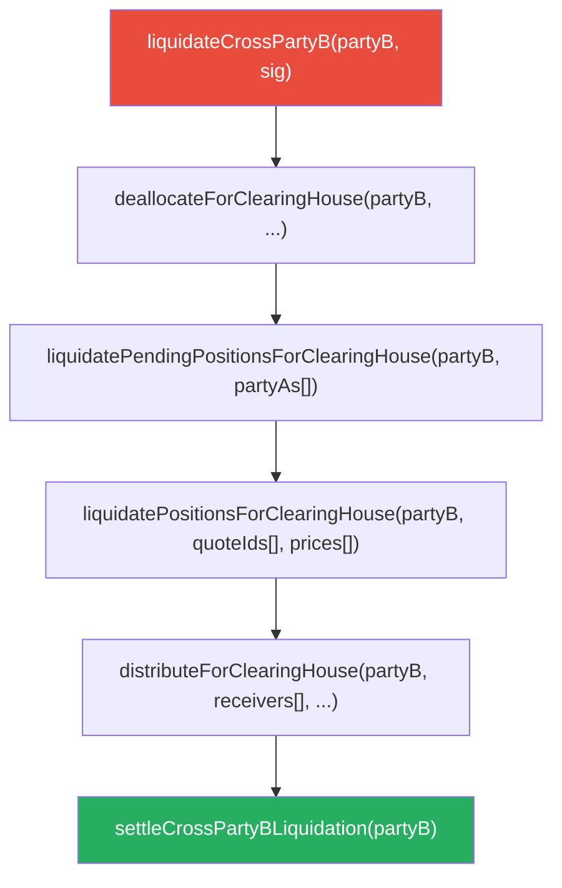
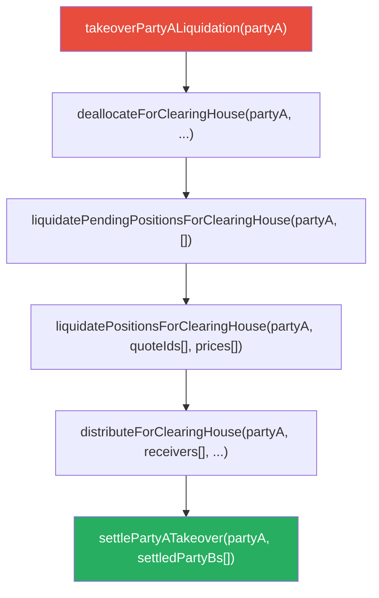
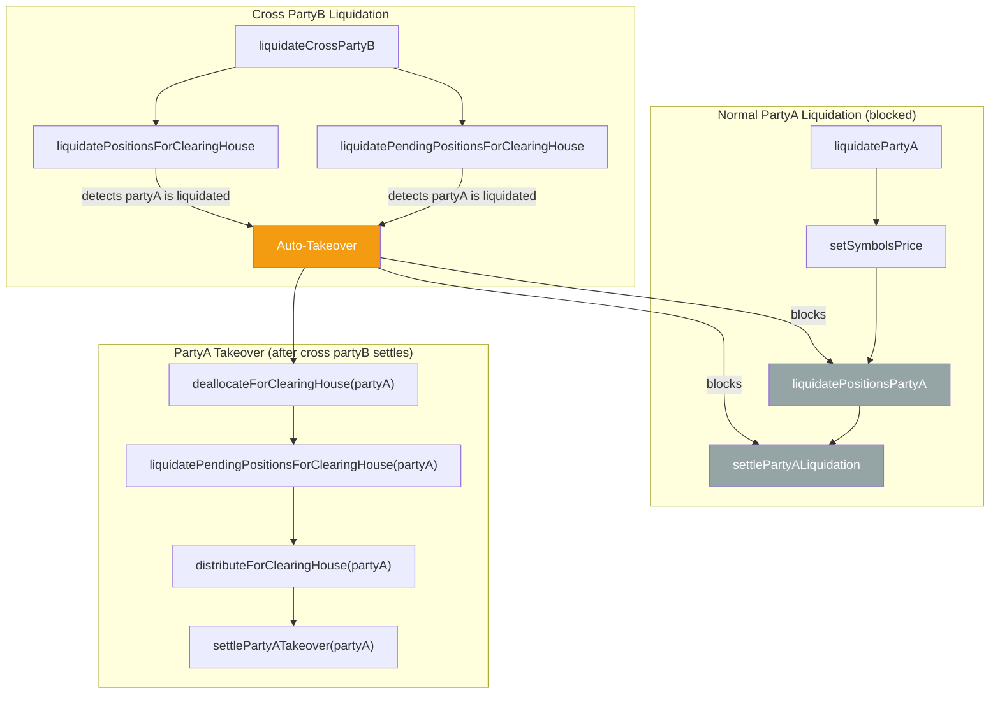
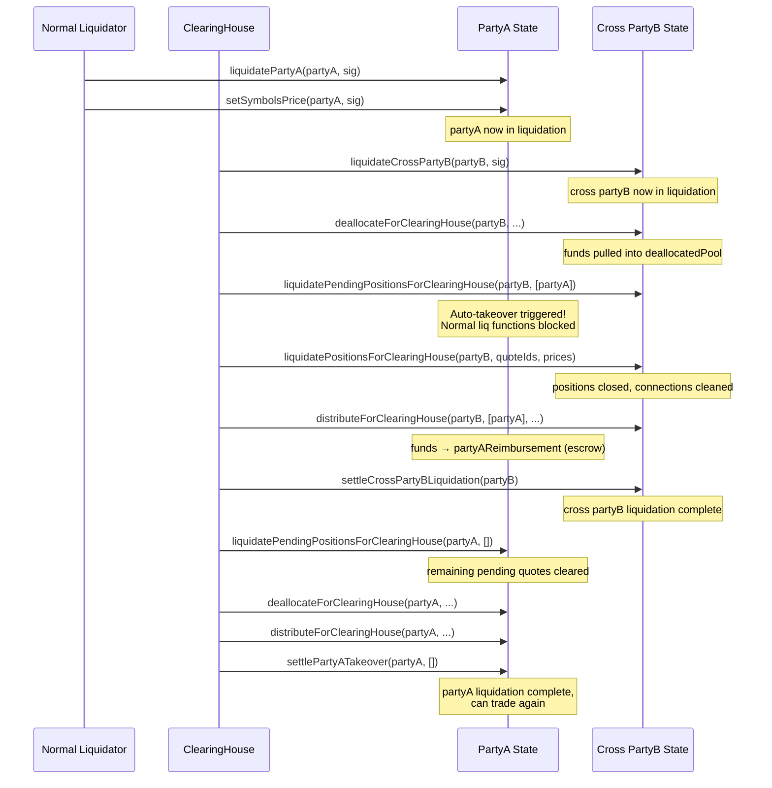

# ClearingHouse

The ClearingHouse is a privileged operator within the SYMMIO protocol that manages liquidations that the normal decentralized liquidator flow cannot handle. It covers two distinct scenarios: **Cross PartyB Liquidation** (when a hedger operating in cross-margin mode becomes insolvent) and **PartyA Takeover** (when a trader's liquidation gets stuck or disputed). It also handles a third scenario where both happen simultaneously.

## Why the ClearingHouse Exists

SYMMIO's normal liquidation flow is decentralized — any address with the `LIQUIDATOR_ROLE` can liquidate insolvent parties. This works well for isolated-mode partyBs and for partyAs in the common case, but two situations require centralized intervention:

1. **Cross-mode PartyB insolvency.** When a partyB operates in cross-margin mode, its funds are pooled in a single bucket (`address(0)`) shared across all partyAs. A decentralized liquidator cannot safely unwind this because it requires coordinated decisions about how to distribute a shared pool across multiple counterparties. The ClearingHouse handles this as a multi-step process with explicit deallocate/distribute phases.

2. **Stuck or irrecoverably disputed PartyA liquidation.** A normal partyA liquidation can get stuck — the liquidator may abandon it, or a dispute may arise where the accumulated UPNL doesn't match the Muon oracle's reported UPNL. In the normal case, the dispute resolver (a multisig) handles disputes and corrects the liquidation state. However, there are edge cases where the on-chain state is corrupted or inconsistent to the point that even the dispute resolver cannot fix it through the normal dispute resolution flow. For these cases, the ClearingHouse can take over the liquidation entirely, resetting the liquidation state and completing the process with its own price feeds.

All ClearingHouse functions require the `CLEARING_HOUSE_ROLE`, which is granted to a trusted operator address.

## Cross-Mode vs Isolated-Mode PartyB

Before understanding the liquidation flows, it helps to understand how partyB allocation modes work.

**Isolated mode** (default): PartyB allocates funds separately per partyA. Balances are tracked under `partyBAllocatedBalances[partyB][partyA]`. Each partyA relationship has its own margin pool, its own locked balances, and its own liquidation status.

**Cross mode** (opt-in via migration): PartyB pools all funds into a single bucket tracked under `partyBAllocatedBalances[partyB][address(0)]`. All positions across all partyAs draw from this shared pool. The helper `LibAccount.partyBAllocationKey(partyB, partyA)` returns `address(0)` for cross-mode and `partyA` for isolated-mode.

---

## Flow 1: Cross PartyB Liquidation

This flow handles the insolvency of a cross-mode partyB. Because funds are pooled, a single insolvency event affects all partyAs that have positions with this partyB.

### When It Triggers

The ClearingHouse operator detects that a cross-mode partyB's available balance has gone negative. This is checked via `partyBAvailableBalanceForLiquidation(upnl, partyB, address(0)) < 0`, using a Muon oracle signature for the UPNL value.

### Lifecycle



Steps 2–5 are repeatable and can be called in any order and multiple times. The settlement step (6) requires all positions closed and the deallocated pool fully distributed.

### Step-by-Step

**Step 1 — `liquidateCrossPartyB(partyB, liquidationSig)`**

Initiates the liquidation. Verifies the Muon signature, confirms the partyB is insolvent, and creates a `CrossLiquidationDetail` record with `inProgress = true`. This flag gates all subsequent operations and prevents the partyB from operating normally until settlement.

**Step 2 — `deallocateForClearingHouse(partyB, parties[], allocationKeys[], amounts[])`**

Pulls funds into a `deallocatedPool`. The ClearingHouse decides who to pull from and how much — the on-chain contract trusts the ClearingHouse to make correct decisions. Funds can be pulled from the partyB's cross bucket, but also from partyAs. For example, if the partyB has positive UPNL against a partyA (i.e., the partyA owes the partyB), the ClearingHouse will pull funds from that partyA's allocated balance as well.

```
// Pull from partyB's cross bucket and from a partyA who owes partyB
parties:        [hedgerAddress, userAddress]
allocationKeys: [address(0),    address(0)]   // cross bucket, partyA allocation
amounts:        [crossBalance,  amountOwed]
```

Multiple calls can pull from different sources across multiple parties.

**Step 3 — `liquidatePendingPositionsForClearingHouse(partyB, partyAs[])`**

Cancels all pending quotes (LOCKED, CANCEL_PENDING) where the partyB matches. For each cancelled quote:
- The opening trading fee is returned to the partyA (to `allocatedBalances` if partyA is healthy, or `partyAReimbursement` if partyA is also being liquidated).
- The quote status becomes `LIQUIDATED_PENDING`.
- PartyB's per-partyA pending arrays are cleared.

**Step 4 — `liquidatePositionsForClearingHouse(partyB, quoteIds[], prices[])`**

Closes open positions at ClearingHouse-specified prices (no Muon signature required — the ClearingHouse is trusted). For each quote:
- Validates the quote belongs to the subject partyB.
- Sets status to `LIQUIDATED`.
- Subtracts from both partyA and partyB locked balances.
- Removes from open positions tracking and decrements position counts.
- Calls affiliate and system hooks.
- Cleans up connections when a partyA has no more positions with this partyB.

**Step 5 — `distributeForClearingHouse(partyB, receivers[], allocationKeys[], amounts[])`**

Distributes funds from the `deallocatedPool` to receivers. The routing depends on the receiver type:

| Receiver | Where funds go | Event |
|----------|---------------|-------|
| PartyB (any) | `partyBAllocatedBalances[receiver][allocationKey]` | BalanceChangePartyB |
| PartyA (healthy) | `allocatedBalances[receiver]` | BalanceChangePartyA |
| PartyA (liquidating) | `partyAReimbursement[receiver]` | None (escrow) |

**Step 6 — `settleCrossPartyBLiquidation(partyB)`**

Finalizes the liquidation. Requires:
- All positions closed (`partyBPositionsCount[partyB][address(0)] == 0`)
- All funds distributed (`deallocatedPool == 0`)

Sets `inProgress = false`, allowing the partyB to resume operations.

---

## Flow 2: PartyA Takeover

This flow handles partyA liquidations that are stuck or in a state that cannot be resolved through normal means. The dispute resolver (multisig) handles normal disputes — correcting UPNL mismatches, adjusting settlement states, etc. But when the on-chain state is corrupted or inconsistent beyond what the resolver can fix, the ClearingHouse takes over as a last resort, resetting the liquidation and completing it with its own price feeds.

### When It Triggers

A partyA is already in the liquidation state (`liquidationStatus[partyA] == true`) but the process cannot be completed through normal channels. This typically means the liquidation is either abandoned (liquidator stopped processing) or disputed with state corruption that the dispute resolver multisig cannot rectify. The ClearingHouse operator decides to intervene as a last resort.

### Lifecycle



### What Takeover Does

When `takeoverPartyALiquidation` is called, it:
1. **Clears the disputed flag** — the ClearingHouse will resolve the state directly.
2. **Clears the liquidation fee** — original liquidators get nothing (they abandoned).
3. **Deletes the liquidators array** — fresh start.
4. **Sets `partyATakeoverDetails[partyA].inProgress = true`** — blocks all normal liquidation functions for this partyA.

After takeover, the normal liquidation functions (`liquidatePositionsPartyA`, `settlePartyALiquidation`, etc.) are blocked by a `require(!partyATakeoverDetails[partyA].inProgress)` check. Only ClearingHouse functions can proceed.

### Step-by-Step

**Step 1 — `takeoverPartyALiquidation(partyA)`**

Takes control from the normal liquidation flow. See above for what it clears.

**Step 2 — `deallocateForClearingHouse(partyA, parties[], allocationKeys[], amounts[])`**

Pulls funds into the takeover's `deallocatedPool`. Three source types are supported:

| Source | Party | Allocation Key | Pulls From |
|--------|-------|---------------|------------|
| PartyA allocation | partyA | `address(0)` | `allocatedBalances[partyA]` |
| PartyA reimbursement | partyA | `address(1)` | `partyAReimbursement[partyA]` |
| PartyB allocation | partyB | partyA address | `partyBAllocatedBalances[partyB][partyA]` |

The `address(1)` key (`REIMBURSEMENT_KEY`) is special — it accesses the escrow where fees and other credits accumulate during liquidation.

**Step 3 — `liquidatePendingPositionsForClearingHouse(partyA, [])`**

The counterparties parameter is ignored for takeover — all of partyA's pending quotes are processed regardless of which partyB they belong to. Fees go to `partyAReimbursement` (escrow).

**Step 4 — `liquidatePositionsForClearingHouse(partyA, quoteIds[], prices[])`**

Closes positions at ClearingHouse-specified prices. An additional check prevents liquidating positions where the counterparty partyB is itself being liquidated (either via normal isolated liquidation or cross liquidation).

**Step 5 — `distributeForClearingHouse(partyA, receivers[], ...)`**

Same routing logic as the cross partyB flow.

**Step 6 — `settlePartyATakeover(partyA, settledPartyBs[])`**

Finalizes the takeover. The `settledPartyBs` parameter is important: if the normal liquidation flow had already processed some partyBs before the takeover (creating settlement states), those states need to be cleaned up explicitly since the connections may already be removed.

Settlement:
- Releases `partyAReimbursement` back to `allocatedBalances[partyA]` (these are escrowed fees and credits that accumulated during liquidation — see the escrow routing in `distributeForClearingHouse` and fee refunds in `liquidatePendingPositionsForClearingHouse`).
- Zeros out locked balances.
- Increments partyA nonce.
- Sets `liquidationStatus[partyA] = false`.
- Deletes both `liquidationDetails` and `partyATakeoverDetails`.

After settlement, the partyA can deposit funds and trade again.

---

## Flow 3: Simultaneous PartyA + Cross PartyB Liquidation

This is the most complex scenario. A cross-mode partyB becomes insolvent, AND one or more of its counterparty partyAs are also being liquidated at the same time.

### The Problem

When the ClearingHouse processes a cross partyB liquidation, it encounters partyAs that are already mid-liquidation by regular liquidators. Two independent liquidation flows now compete over the same positions:

- The **normal partyA liquidation** wants to close positions via `liquidatePositionsPartyA` and settle via `settlePartyALiquidation`.
- The **cross partyB liquidation** wants to close the same positions via `liquidatePositionsForClearingHouse`.

Without coordination, this creates accounting conflicts — both flows would try to subtract from locked balances, track settlement states, and finalize independently.

### The Solution: Auto-Takeover

Rather than bridging the two accounting systems, the ClearingHouse automatically takes over any partyA liquidation it encounters during cross partyB processing. This collapses two concurrent flows into one coordinated flow.



### How Auto-Takeover Works

The `_autoTakeoverPartyALiquidation(partyA)` function is called at two catch points during cross partyB processing:

1. **`liquidatePositionsForClearingHouse`** — for each quote in the CROSS_PARTY_B branch, after validating `partyB == subject`, the function calls `_autoTakeoverPartyALiquidation(partyA)`. This is the common case.

2. **`liquidatePendingPositionsForClearingHouse`** — inside the counterparties loop for CROSS_PARTY_B, before processing pending quotes for each partyA.

The function is **idempotent** — safe to call multiple times for the same partyA:
- If partyA is not being liquidated → returns `false` (no-op).
- If takeover already in progress → returns `false` (no-op).
- Otherwise → executes the takeover and emits `AutoTakeoverPartyALiquidation`, returns `true`.

Both `takeoverPartyALiquidation` (manual) and `_autoTakeoverPartyALiquidation` (automatic) use the same internal `_executeTakeover` helper, which clears the disputed flag, liquidation fee, and liquidators array, then sets the takeover state.

### Settlement Guard

There is an additional guard in `settlePartyALiquidation` (the normal partyA settlement function) that prevents settling with a partyB that is in cross liquidation:

```solidity
require(
    !ClearingHouseStorage.layout().crossLiquidationDetails[partyB].inProgress,
    "LiquidationFacet: PartyB is in cross liquidation"
);
```

This catches an edge case where the normal liquidator has already closed all of a partyA's positions (with non-cross partyBs) before the cross partyB liquidation starts. In this case, auto-takeover wouldn't trigger (no positions left to process), but settlement must still be blocked because the cross-liquidated partyB's settlement state cannot be finalized through the normal flow.

### End-to-End Simultaneous Flow

Here is the full sequence when both partyA and cross partyB are liquidated at the same time:



Key observations:
- The cross partyB flow runs first and triggers auto-takeover when it encounters the liquidated partyA.
- Funds distributed to the liquidated partyA during cross partyB processing go to `partyAReimbursement` (escrow), not `allocatedBalances`.
- After cross partyB settles, the ClearingHouse completes the partyA takeover separately.
- The partyA may have remaining pending quotes (SENT status, no partyB assigned) that weren't handled by the cross partyB flow — these are processed via the takeover's `liquidatePendingPositionsForClearingHouse(partyA, [])`.
