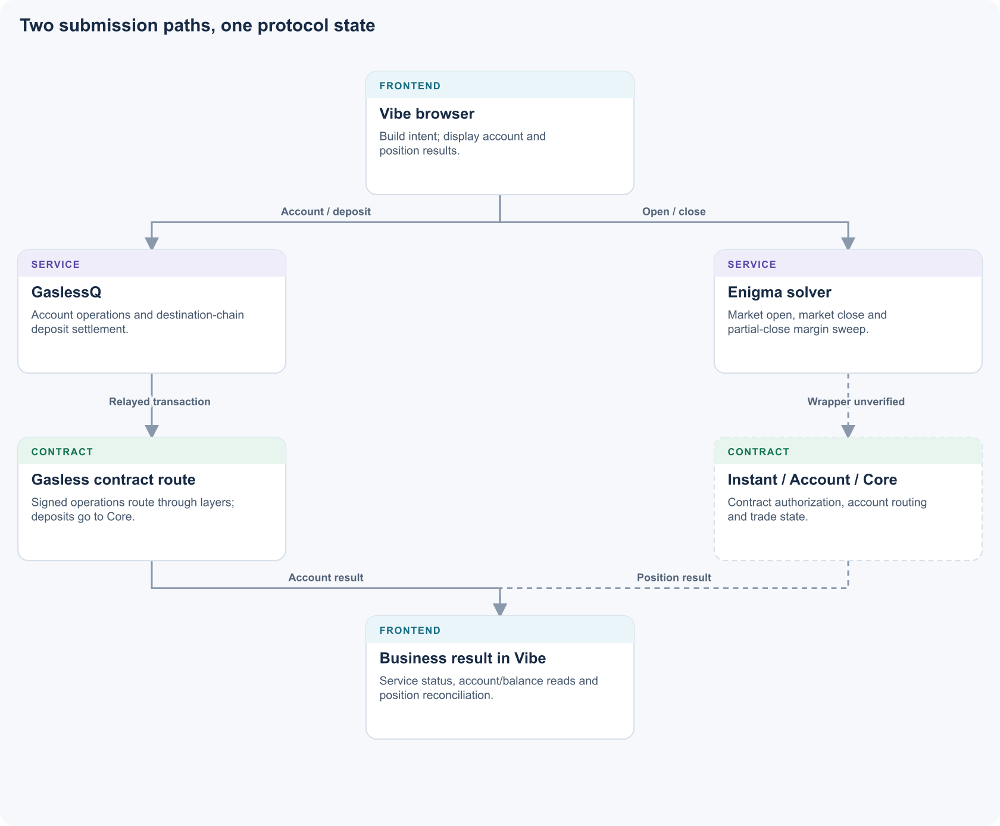
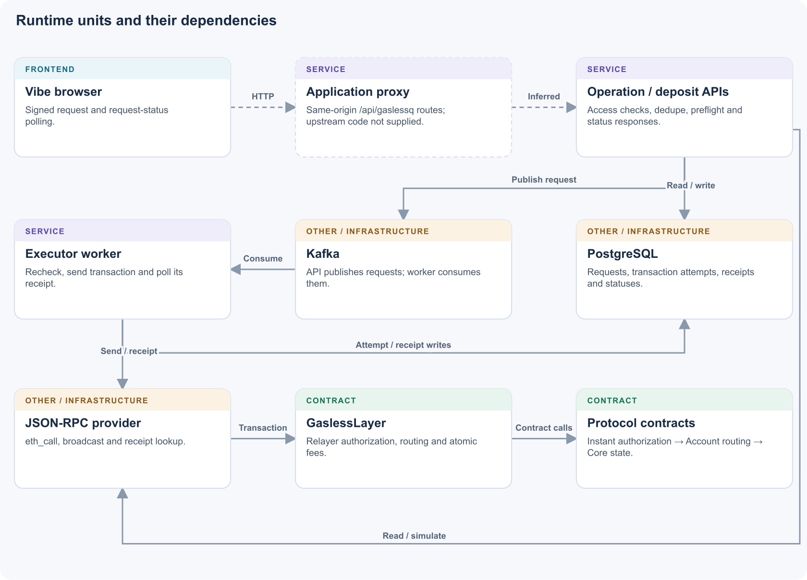
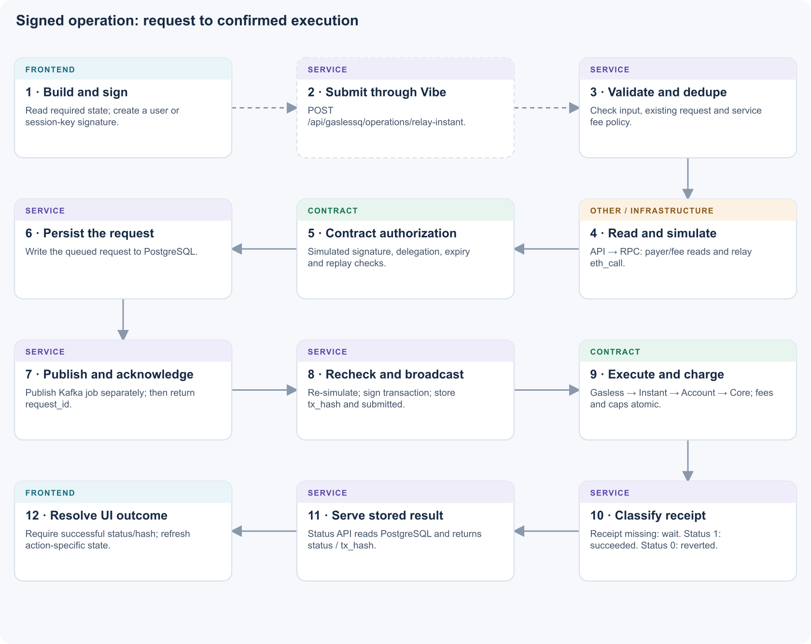
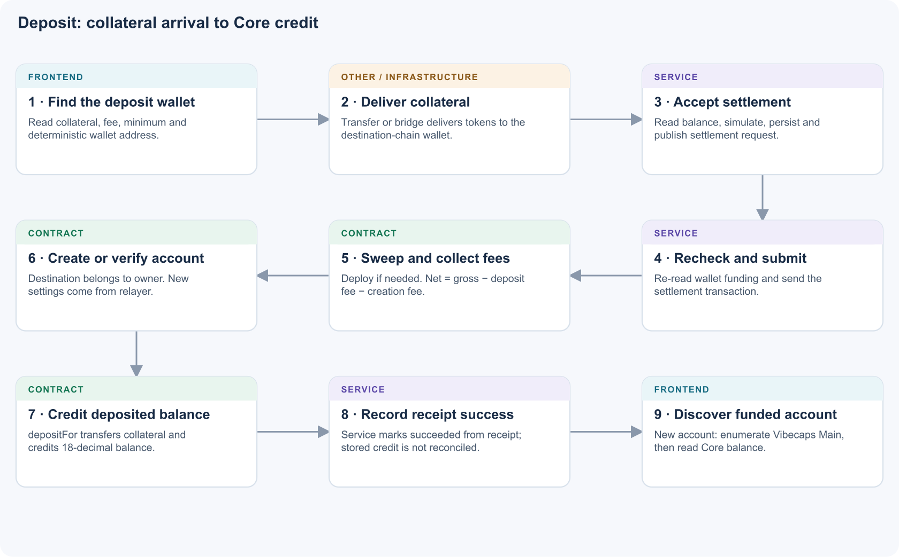
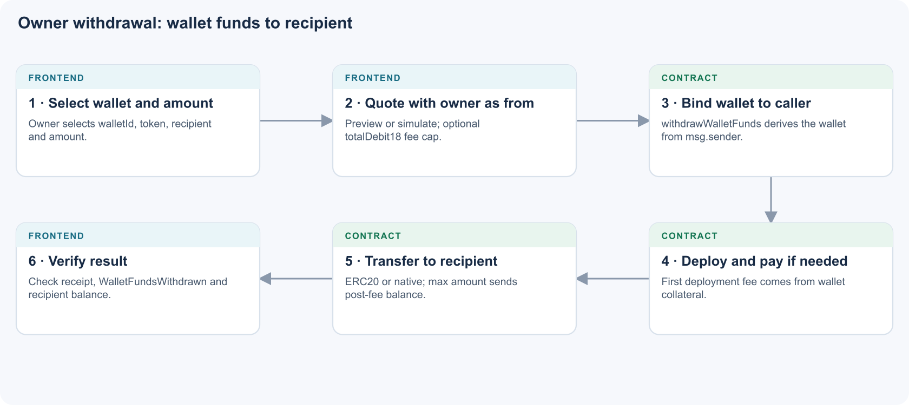
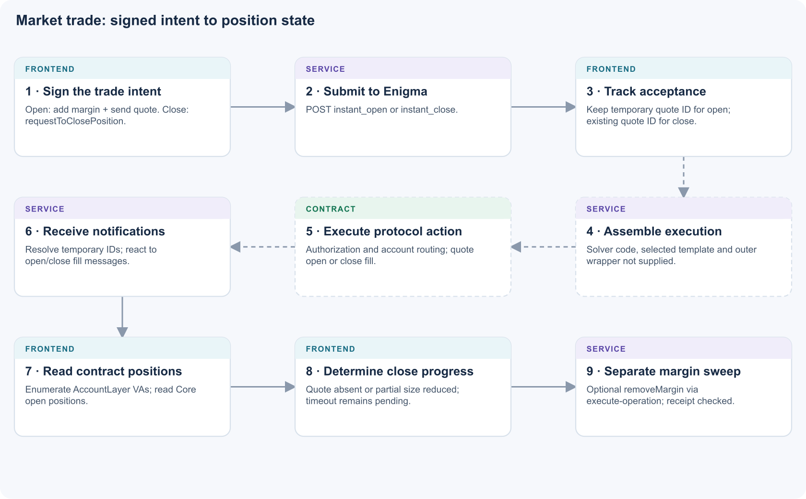
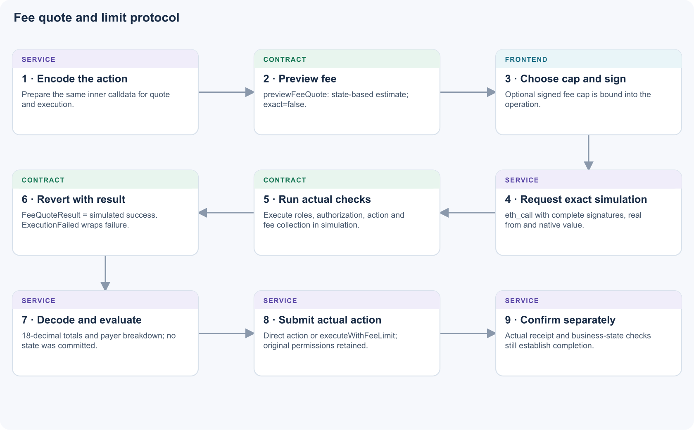
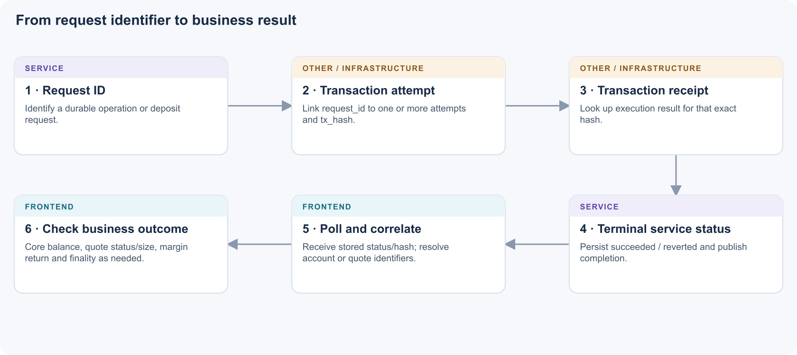

# Vibe Gasless Transaction Flow

## Frontend, service, contracts and settlement

Technical reference · 13 September 2026

## Contents

- [01. Purpose and scope](#purpose)
- [02. System architecture and ownership](#architecture)
- [03. Accounts and correlation identifiers](#identities)
- [04. Signed account-operation flow](#operations)
- [05. Deposit settlement flow](#deposits)
- [06. Market open, close and margin return](#trades)
- [07. Fee quotation and authorization limits](#fees)
- [08. Completion and settlement confirmation](#settlement)
- [09. Failure, retry and consistency behavior](#failures)
- [10. Integration requirements and known limits](#integration)
- [11. Code reference and evidence](#code)
- [A. Configuration, verification and revisions](#appendix)

## 01. Purpose and scope

This reference explains how an action in Vibe reaches SYMMIO Core and how the application discovers the result. It is intended for frontend, service and contract engineers reviewing integration and settlement behavior.

Vibe has two separate submission routes. Account operations and deposit settlements use its GaslessQ integration. Market opens and closes use Enigma's solver API. The partial-close margin sweep also uses Enigma, through `execute-operation`, despite being called “gasless” in the frontend.

GaslessQ discovers **transaction completion** by polling a transaction receipt and recording `succeeded` when `receipt.status == 1`. It does not decode that receipt into a final quote, created account, or verified credited balance. Vibe discovers the **business result** through action-specific checks: account/balance reads for onboarding deposits, notifications and Core position reads for trades, and a separate receipt for a margin sweep.

Frontend signing and contract authorization are separate steps. The browser creates a signed intent. Contract code checks whether that signer can execute the final operation. Service simulation executes those contract checks through `eth_call`; the included transaction executes them again against inclusion-time state.

**Reading guide.** Start with architecture and identities, then follow the journey you are implementing. Section 8 defines completion precisely; section 10 records integration requirements. Evidence, deployment configuration and revision details are kept at the end.

**Evidence boundary.** The contract/service paths are verified from source. Vibe behavior is tied to public bundle URLs inspected on 12 September 2026; the six cited bundles were retrieved again on 13 September. This does not establish which assets the current application entry page selects. The service diagrams describe `json_rpc` mode; its configuration class defaults to mock mode. Deployed settings, contract parity, the Vibe server proxy implementation and Enigma transaction assembly have not been verified. Labels distinguish **verified source**, **inferred connection** and **unknown deployment behavior**.

## 02. System architecture and ownership

The HTML edition includes a three-level architecture explorer.

_Figure 1. Vibe uses GaslessQ for account operations and deposit settlement, and Enigma for market trades. The actual solver transaction wrapper remains unverified._

| Owner    | Component                         | Responsibility                                                                                                          |
| -------- | --------------------------------- | ----------------------------------------------------------------------------------------------------------------------- |
| Frontend | Vibe browser                      | Read preparation state, build/sign intent, submit requests, correlate IDs and refresh business state.                   |
| Service  | Vibe server proxy                 | Expose same-origin `/api/gaslessq` routes. Its upstream translation remains unverified.                                 |
| Service  | GaslessQ operation/deposit APIs   | Input/access checks, deduplication, fee policy, simulation, queueing and status reads.                                  |
| Service  | GaslessQ executor worker          | Execution-time checks, relayer transaction submission, receipt polling and stored completion.                           |
| Service  | Enigma / notification service     | Accept market trade intents; publish the application notifications consumed by Vibe. Internal processing is unverified. |
| Other    | PostgreSQL / Kafka / RPC / bridge | Persist requests, transport jobs, access chain state and deliver destination-chain collateral.                          |
| Contract | GaslessLayer / GaslessWallet      | Relayer gate, deterministic wallet handling, deposit settlement, fee calculation/collection and fee limits.             |
| Contract | InstantLayer                      | Validate signed operations, ownership/delegation, targets, expiry and replay restrictions.                              |
| Contract | AccountLayer                      | Own sub-accounts, route virtual accounts and establish signer context.                                                  |
| Contract | Core                              | Hold protocol collateral and maintain balances, quotes and positions.                                                   |

_Figure 2. Separate services, storage, queue and contracts. The Vibe proxy-to-GaslessQ mapping is inferred; RPC reads and simulation are distinct from transaction broadcast._

Linked Solidity libraries run in contract context. They are not additional backend services. The browser creates a signature; the contracts decide whether it authorizes the action. [\[C1\]](#source-C1) [\[C2\]](#source-C2) [\[C3\]](#source-C3)

## 03. Accounts and correlation identifiers

| Identity               | Meaning                                                                | Common confusion to avoid                                                         |
| ---------------------- | ---------------------------------------------------------------------- | --------------------------------------------------------------------------------- |
| Owner wallet           | User-controlled signing identity.                                      | It need not be the Core Party A for a position.                                   |
| Session key            | Delegated signer used for one-click operations.                        | Browser login/session does not grant contract delegation.                         |
| GaslessWallet          | Deterministic, indexed wallet holding incoming or outgoing collateral. | It is not an AccountLayer sub-account.                                            |
| Sub-account            | AccountLayer account holding the parent Core balance.                  | Deposited balance is separate from VA margin.                                     |
| Virtual account (VA)   | Account used for isolated position routing and accounting.             | Fee billing can resolve to its parent while authorization remains account-scoped. |
| GaslessQ `request_id`  | Durable service request identifier.                                    | It is neither a transaction hash nor a Core quote ID.                             |
| Enigma `temp_quote_id` | Temporary identifier for an accepted open.                             | It must be correlated with the actual Core quote.                                 |
| Core `quote_id`        | Protocol quote/position identifier.                                    | Request-to-close acceptance does not mean this quote is closed.                   |
| `tx_hash`              | One blockchain transaction attempt.                                    | A hash alone does not establish successful inclusion.                             |

Keep the correlation chains separate: **GaslessQ request → attempt → transaction**, and **Enigma temporary ID → actual quote ID / VA → Core state**. [\[F2\]](#source-F2) [\[F5\]](#source-F5) [\[S5\]](#source-S5) [\[C3\]](#source-C3)

## 04. Signed account-operation flow

_Figure 3. Numbered responsibilities through the operation lifecycle. Fee quotation and simulation can run concurrently. Each colored label identifies where a step runs._

1. **Browser preparation.** Vibe constructs a `SignedOperation` with signer, signer account, target, calldata, replay header and usage/fill constraints, then signs it for the configured InstantLayer. Its nonce helper reads `InstantLayer.nonces(account)` and uses the next value. One-click use depends on on-contract ownership/delegation; possessing a browser session or producing a signature does not itself grant contract permission. [\[F2\]](#source-F2) [\[C2\]](#source-C2)
2. **Browser HTTP.** The operation client calls `POST /api/gaslessq/operations/relay-instant?network=mainnet`, with application-session context. It does not expose the entire service edge configuration. The service repository separately implements the internal `POST /v1/gateway/relay-instant` and edge routing under `/v1/instances/<instance>/operations/...`. The server-side join between these paths is not verified. [\[F2\]](#source-F2) [\[S1\]](#source-S1) [\[S9\]](#source-S9)
3. **Service preflight.** The API checks request/dedupe state, starts exact-operation simulation and fee quotation, and can check fee allowance according to configuration. Simulation uses `eth_call` with the executor as `from`. Contract signature/role/delegation checks therefore execute inside the simulated EVM call, not as a replacement authorization system in Python. [\[S1\]](#source-S1) [\[S4\]](#source-S4)
4. **Accept and queue.** The API stores a request, publishes a Kafka event and returns HTTP 202 with `request_id`, status and fee-related values. The accepted `paid_fee` value comes from quotation; it is not evidence of an actual fee transfer. Request persistence and publication are separate boundaries. [\[S1\]](#source-S1)
5. **Worker execution.** The executor loads the request, performs execution-time checks, selects an executor, obtains nonce/gas information, signs and sends the transaction, then stores its hash in a transaction attempt and marks the request `submitted`. A send result carrying `succeeded=True` in the chain adapter means the send succeeded; receipt finalization occurs separately. [\[S3\]](#source-S3) [\[S4\]](#source-S4)
6. **Contract execution.** GaslessLayer checks relayer authority and dispatches to InstantLayer. InstantLayer checks signature/identity, owner/delegation against final calldata, target whitelist, expiry and replay restrictions. For Party A operations, AccountLayer establishes signer scope and routes the sub-account or virtual account to Core; Party B operations have their own routing. Core enforces protocol rules and updates balances/quotes. GaslessLayer charges the applicable operational fee after an Instant relay in the same transaction; failure there reverts the preceding execution too. Wallet-targeted operations use GaslessLayer's wallet-verification branch and add the first-deployment creation fee, if applicable, to the Core charge. Signed tagged-salt fee limits are checked against the actual per-operation charge, including creation and any payer fallback; exceeding one reverts the transaction. Legacy salts remain uncapped. [\[C1\]](#source-C1) [\[C2\]](#source-C2) [\[C3\]](#source-C3) [\[C4\]](#source-C4) [\[C10\]](#source-C10)
7. **Receipt and return.** The worker polls receipts by stored transaction hash. Missing receipt means keep waiting; receipt status 0 means `reverted`; status 1 means `succeeded`. It saves the raw receipt and updates the request, then publishes completion. Status GET handlers read PostgreSQL; the frontend's status poll does not cause a new Core settlement check. [\[S3\]](#source-S3) [\[S5\]](#source-S5)

## 05. Deposit settlement flow

_Figure 4. Deposit settlement bypasses InstantLayer. Creation fees apply only when this transaction deploys the selected wallet. A new-account deposit adds a frontend account/balance readiness check._

The ownership check order differs by entrypoint: existing-account ownership is checked before sweeping; new-account ownership is checked after account creation and before crediting. All execute atomically in the settlement transaction. The chart groups these contract steps for readability. [\[C1\]](#source-C1)

**Money path:** collateral reaches a deterministic wallet → GaslessLayer deploys the wallet if necessary and sweeps its full collateral balance → the flat deposit fee plus any first-deployment creation fee go to treasury → the remainder is transferred into Core and credited to the sub-account's deposited balance. Actual token-unit credit is `gross − depositFee − creationFeeIfDeployedNow`; it must remain positive and the gross amount must meet `minimumDeposit`. Reusing an already deployed wallet incurs no creation fee, including a wallet originally deployed when that fee was zero. This does not automatically open a position or allocate margin to a VA. InstantLayer is not part of this deposit-settlement path. New-account settings are supplied by the relayer; the contract does not require a user SignedOperation for that settlement entrypoint, but does enforce the intended ownership constraints. [\[C1\]](#source-C1) [\[C5\]](#source-C5) [\[C8\]](#source-C8)

**Service credit calculation:** both deposit API and worker still calculate `credited = balance - fee`, where `fee` is only `depositFee`. Receipt success continues to publish the stored credit without decoding actual settlement. For an illustrative 100-token deposit, 2-token deposit fee and 3-token first-deployment fee, the service's calculation is 98 while the contract credits 95. This gap matters once the ABI incompatibilities are resolved and a nonzero creation fee is active. Direct simulation may catch a transaction that cannot cover both fees, but does not correct the service's stored credit for a successful transaction. [\[S2\]](#source-S2) [\[S3\]](#source-S3) [\[S10\]](#source-S10) [\[C8\]](#source-C8)

**Receipt reconciliation:** `WalletDepositSettled.netDeposit` reflects the amount after both fees, while its `depositFee` field still contains only the ordinary deposit fee. `WalletCreationFeeCollected(wallet,payer,amount)` reports the creation fee separately in token decimals. These are actual receipt events; the unified fee quote is a pre-execution estimate/simulation. For wallet operations billed through Core, `OperationalFeeRouted.amount18` and `InstantBatchRelayed.totalFee18` already include the creation fee converted to 18 decimals, so adding the separate creation event again would double count it. [\[C7\]](#source-C7) [\[C8\]](#source-C8)

The browser POST paths are `/api/gaslessq/deposit-settlements/new-account?network=mainnet` and `/api/gaslessq/deposit-settlements/existing-account?network=mainnet`. It polls the corresponding settlement ID for up to 180 iterations, sleeping 2 seconds while queued and 4 seconds after submission. [\[F3\]](#source-F3) [\[F4\]](#source-F4)

For a **new account**, once GaslessQ says `succeeded`, Vibe enumerates the owner's AccountLayer sub-accounts in pages of 50 and finds an existing account named `Vibecaps Main` on the configured Core. It then reads Core `balanceOf`, retrying up to 20 times at 3-second intervals. This is how it discovers the account and decides its funds are visible; the supplied service status response does not extract the newly created account from logs. [\[F4\]](#source-F4) [\[S2\]](#source-S2)

For an **existing account**, the inspected callback accepts service success, invalidates balance queries and activates faster polling. It does not perform an exact before/after net-credit assertion in that callback. [\[F4\]](#source-F4)

**Limit in the readiness check:** Vibe compares Core's raw balance directly against the service's raw credited amount. The inspected Core source uses 18-decimal internal balances, while the configured USDC uses 6 decimals. For example, 10 USDC corresponds to `10_000_000` token units but `10_000_000_000_000_000_000` Core units. Without conversion, `balance >= creditedRaw` is much weaker than proving the expected credit. It also checks a matching account's total balance rather than a transaction-specific balance delta. This is a source-level finding; runtime impact requires deployed-version verification. [\[F1\]](#source-F1) [\[F4\]](#source-F4) [\[C5\]](#source-C5)

### Identify actual deposit settlement

Decode `WalletDepositSettled(owner,walletId,subAccount,netDeposit,depositFee,destination)` from the expected GaslessLayer proxy. `destination` is `0` for a new account and `1` for an existing account. Its added enum changes the event signature/topic; use the deployed ABI. `DepositFeeCollected` attributes its first indexed address to the **owner**, while `WalletCreationFeeCollected` identifies the wallet and payer. All three deposit/creation event amounts use token units. [\[C7\]](#source-C7) [\[C15\]](#source-C15)

### Direct owner withdrawal and administrative recovery

_Figure 5. Contract-supported direct withdrawal. The owner submits and pays gas; the inspected Vibe/GaslessQ path does not establish UI adoption. This transfers GaslessWallet funds, not balances held in Core._

An owner can call `withdrawWalletFunds(walletId,token,recipient,amount)` directly on GaslessLayer, paying native transaction gas. The contract derives the wallet from `msg.sender`; no relayer, AccountLayer account, Core fee allowance or signed relay operation is required. `token=address(0)` selects native funds; `amount=type(uint256).max` sends the balance remaining after any creation fee. First deployment requires wallet collateral to cover `walletCreationFee`, even when withdrawing another token or native funds. An already deployed wallet has no creation fee. The contract emits `WalletFundsWithdrawn`; verify it and the recipient's resulting balance. This withdraws funds held by GaslessWallet, not deposited collateral or position margin held in Core. Frontend adoption is unverified. [\[C16\]](#source-C16)

Owner withdrawal preview and exact simulation must use the owner's address as `from`. `executeWithFeeLimit` can cap the creation fee through `maxTotalDebit18`; it does not cap the withdrawal principal, which is selected by `amount`. [\[C12\]](#source-C12) [\[C16\]](#source-C16)

The separate `recoverNonCollateralToken` path is restricted to `CONFIG_ADMIN_ROLE`, rejects the collateral token and sends the full selected non-collateral token balance to a nonzero recipient. It can deploy the wallet but does not collect a creation fee or move wallet collateral. Its fee preview has no payment entries. This is distinct from owner withdrawal. [\[C17\]](#source-C17)

## 06. Market open, close and margin return

_Figure 6. The frontend submits trades to Enigma. Acceptance, notifications and chain observations are asynchronous; an accepted temporary ID is not proof of an opened or closed quote._

The notification producer's implementation was not inspected, so there is deliberately no asserted direct Core-to-notification ingestion edge. Notifications are service messages, not independently verified EVM logs. GaslessQ is not established as an intermediate hop in this trade route.

**Open.** The frontend signs AccountLayer `addMarginToNextVA(...)` and a Core send-quote operation, then POSTs `{addMargin, sendQuote}` to `https://solver.enigma.bz/api/instant_trade/instant_open`. A returned `temp_quote_id` is initially used as the order/quote identifier. The immediate frontend success object can contain the requested size as `filled`; that object is not itself proof of an on-chain fill. [\[F5\]](#source-F5) [\[F6\]](#source-F6)

The source-supported instant-open architecture can execute `addMarginToNextVA → sendQuote → lockQuote → openPosition` using a registered template and result injection. The supplied frontend proves its signed inputs and solver endpoint, but not the solver's selected template, outer PartyB wrapper, on-chain operator or actual transaction. Those require solver code or a decoded current transaction. [\[C2\]](#source-C2) [\[F6\]](#source-F6)

**Open completion.** Vibe consumes notifications, maps a successful `SendQuote`/`SendQuoteTransaction` message into a `position_opened` event, resolves temporary IDs using `quote_id` and `va_address`, and invalidates position/balance queries. Position refresh enumerates AccountLayer VAs and reads Core `getPartyAOpenPositions`; pending solver/local entries are merged with these results. A visible pending row therefore must be distinguished from an actual Core quote. [\[F5\]](#source-F5)

**Close.** Vibe finds the existing quote and VA, encodes Core `requestToClosePosition(...)`, signs with that account context and POSTs the operation to `/instant_trade/instant_close`. An accepted close request is not a filled close. Success messages for `FillMarketOrderInstantClose` or `FillCloseRequest` generate `position_closed`; successful close-request notifications alone do not. [\[F5\]](#source-F5) [\[F6\]](#source-F6)

**Close completion.** `waitForVibecapsCloseSettlement` polls active quotes every 1.5 seconds for up to 90 seconds. It succeeds when the target quote is absent from the active set, or its quantity has decreased for a partial close. A websocket failure can terminate the wait; timeout is reported as pending because the request may still fill. This helper does not require a direct `getQuote(id).quoteStatus == CLOSED` assertion. The underlying VA multicall tolerates individual failures and skips failed results, so absence from that returned set is weaker than an explicit final quote-state check. [\[F5\]](#source-F5) [\[F6\]](#source-F6)

**Partial-close margin return.** Closing part of a position and returning released margin to the parent are separate operations. The frontend signs AccountLayer `removeMargin(virtualAccount, amount, upnlSig)` and sends it to Enigma `/instant_trade/execute-operation` with `action: "remove_margin"`. When a transaction hash is returned it waits for a successful receipt with one confirmation. This is an Enigma operation; it does not use GaslessQ's `request_id` polling path. Funds returned to the parent within Core are still not an ERC20 withdrawal to the owner's external wallet. [\[F6\]](#source-F6)

## 07. Fee quotation and authorization limits

**Integration status:** the contracts expose the following quote protocol and the repository supplies a TypeScript helper. The inspected GaslessQ service does not call these unified quote methods. Treat this as an available contract interface when planning the frontend/service integration.

_Figure 7. Contract-supported integration path. The supplied GaslessQ service has not adopted these unified quote calls. A successful simulation is deliberately returned through a custom revert._

- **`previewFeeQuote(callData, nativeAmount)`** uses current configuration/account state and can quote deposit fees before collateral arrives. It does not execute the action or validate signatures. A preview cannot prove sufficient funding or successful execution, and batch mutations can change the eventual payer or fee. [\[C8\]](#source-C8) [\[C9\]](#source-C9)
- **`simulateFeeQuote(callData)`** executes the original action with the caller/value preserved and records its actual simulated charges. It **always reverts**: `FeeQuoteResult(quote)` means simulation succeeded; `FeeQuoteExecutionFailed(reason)` contains the failed action's original revert. All simulated writes roll back. The quote has `exact=true` for that simulated state, not a guarantee for a later block. The provided `quoteGaslessFee` helper decodes this protocol. Sending this simulation method as a transaction also reverts; it cannot settle the request. [\[C8\]](#source-C8) [\[C9\]](#source-C9) [\[C12\]](#source-C12)
- **Quote contents and units:** payer/account/source, operational fee, deposit fee, wallet creation fee, native top-up fee, collateral exchanged for native gas, total fee/debit, quota use and sponsorship. All monetary amounts in `FeeQuote`/`FeePayment` use **18 decimals**; `collateralDecimals` records the token's units. `totalDebit18 = totalFee18 + nativeGasCollateral18` excludes deposited or withdrawn principal, Core trading/operation charges, bridge fees and transaction gas. Do not treat it as a complete wallet-cost or net-settlement result. [\[C7\]](#source-C7)
- **Signed caps:** the existing operation/delegation salt can contain an 8-byte domain tag, 16-byte maximum fee in 18 decimals and 8-byte caller salt. The cap is committed before signing and applies per use. Native top-ups instead use a signed `CappedNativeGasTopUpRequest` and an ABI-encoded `(maximum, signature)` envelope. Legacy operation salts and ordinary native signatures remain uncapped. [\[C10\]](#source-C10) [\[C11\]](#source-C11) [\[C12\]](#source-C12)
- **Caller cap:** `executeWithFeeLimit(callData,maxTotalDebit18)` preserves the underlying role checks and compares the actual aggregate debit with a limit supplied by the caller. This relayer/admin limit is separate from user-signed caps and does not make unsigned deposit settings user-authorized. [\[C8\]](#source-C8) [\[C9\]](#source-C9)

The contract uses linked `GaslessFeeQuoteLib`; deployment/upgrade tooling includes this library in its graph. The optional deployment recipe field is `gaslessLayer.walletCreationFee`; environment examples default `WALLET_CREATION_FEE` to zero. These are supported deployment inputs, not evidence of a live fee setting. [\[C13\]](#source-C13)

**Field names and initialization.** Monetary quote fields are `operationalFee18`, `depositFee18`, `walletCreationFee18`, `nativeTopUpFee18`, `nativeGasCollateral18`, `totalFee18` and `totalDebit18`. Amounts remain 18-decimal values. The canonical `IGaslessLayer` interface contains actions, views, types and events. Fresh deployment supplies `walletCreationFee_` to `initialize`; the deployment examples default it to zero. An upgrade preserves existing proxy storage rather than rerunning initialization. [\[C7\]](#source-C7) [\[C8\]](#source-C8) [\[C12\]](#source-C12)

## 08. Completion and settlement confirmation

_Figure 8. GaslessQ completion is receipt-based. Identifying the final account, credited amount or quote requires the subsequent business-state checks._

| Flow                | Correlation chain                                                                                      | Current completion signal                                                                                                                                                                         |
| ------------------- | ------------------------------------------------------------------------------------------------------ | ------------------------------------------------------------------------------------------------------------------------------------------------------------------------------------------------- |
| GaslessQ operation  | idempotency key → request ID → transaction-attempt record → transaction hash → receipt → stored status | Generic frontend helper requires `succeeded` plus `tx_hash`; subsequent business refresh depends on action.                                                                                       |
| GaslessQ deposit    | settlement request ID → transaction hash → receipt → stored settlement status                          | New account adds account/balance visibility; existing account refreshes balances. Service credit is stored/preflight data, excludes the new creation fee and is not event-derived reconciliation. |
| Enigma open         | frontend pending operation → `temp_quote_id` → notification `quote_id` / VA → Core position            | Notification plus refreshed Core position. Temporary ID is not the final quote ID.                                                                                                                |
| Enigma close        | existing quote ID → accepted close → fill notification / active-position read                          | Quote disappears or size decreases; explicit `CLOSED` check is not the current helper.                                                                                                            |
| Enigma margin sweep | signed remove-margin operation → Enigma transaction hash → receipt                                     | Successful receipt, with surrounding margin/balance refresh logic. Separate from the close request.                                                                                               |

GaslessQ's generic operation poll defaults are 1.5 seconds before submission, 3 seconds after submission, at most 80 iterations. Terminal statuses include `succeeded`, `reverted`, `failed` and `rejected`; only the successful status with a hash satisfies its generic success helper. Poll timeout does not prove that the chain transaction failed. [\[F2\]](#source-F2)

For service-side investigation, the operation API exposes canonical internal reads `GET /v1/operations/{request_id}`, `GET /v1/operations/{request_id}/transactions` and `GET /v1/transactions/{tx_hash}`. The deposit API exposes the corresponding `/v1/deposit-settlements/{request_id}` and `/{request_id}/transactions` resources. Apply the actual edge/BFF routing when accessing them externally. These records connect a request to its stored transaction attempts and raw receipt; they do not contain a normalized final trade result. [\[S1\]](#source-S1) [\[S2\]](#source-S2) [\[S5\]](#source-S5)

### Evidence required for a final result

| Evidence level                                       | What it proves                                                       | What it does not prove                                                                            |
| ---------------------------------------------------- | -------------------------------------------------------------------- | ------------------------------------------------------------------------------------------------- |
| HTTP acceptance / request ID / temp quote ID         | A service accepted or identified work                                | A transaction was included or trade filled                                                        |
| Transaction hash                                     | An identified transaction attempt                                    | Successful inclusion                                                                              |
| `FeeQuoteResult`, `exact=true` from simulation       | Complete action and fee collection succeeded in the simulated state  | A submitted transaction, actual debit, final quote/account/balance result or future fee guarantee |
| Receipt status 1                                     | Successful execution in the receipt's block                          | A particular decoded result, a user balance delta, or chain finality                              |
| Relevant receipt events                              | The transaction emitted the expected business result and identifiers | State after later transactions, or durable finality                                               |
| Fresh Core/account/token state, correctly correlated | The intended quote/account/balance outcome is visible                | Irreversible finality by itself                                                                   |
| Confirmation/finality policy                         | The required chain confidence threshold is satisfied                 | An unverified business outcome                                                                    |

The inspected GaslessQ finalizers stop at successful receipt execution. They neither decode final business events nor enforce an explicit confirmation-depth/reorg policy. Raw receipts are available through transaction-attempt records, so a caller or reconciliation component can inspect them, but that does not mean the current frontend does so. [\[S3\]](#source-S3) [\[S5\]](#source-S5)

### Contract-read locations

| Caller and point                      | Read                                                                                                   | Purpose                                                                            |
| ------------------------------------- | ------------------------------------------------------------------------------------------------------ | ---------------------------------------------------------------------------------- |
| Frontend, before an operation         | InstantLayer nonce; action-specific account and Core balance getters                                   | Build current signed intent and display/validate available state.                  |
| Frontend, before deposit funding      | Gateway `collateralToken`, `depositFee`, `minimumDeposit`, wallet-address getter; ERC20 wallet balance | Locate destination and determine funding readiness.                                |
| Operation API preflight               | AccountLayer virtual-account detail, gateway fee quote, optional Core allowance; simulated relay       | Resolve fee payer, apply fee policy, detect a contract revert before queueing.     |
| Executor before broadcast             | Re-simulation and applicable fee/allowance or deposit-balance/config reads; nonce/gas queries          | Recheck state after queue delay and prepare the transaction.                       |
| Worker after broadcast                | `eth_getTransactionReceipt(tx_hash)`                                                                   | Determine mined execution success/revert. No quote or balance reconciliation here. |
| Frontend polling GaslessQ status      | HTTP read of stored service state                                                                      | Retrieve request status/hash. This is not a contract read.                         |
| Frontend after new-account settlement | AccountLayer account enumeration, then Core `balanceOf(account)`                                       | Discover the account and wait for balance visibility.                              |
| Frontend reconciling a trade          | AccountLayer VA enumeration; Core `getPartyAOpenPositions`                                             | Display actual positions and detect close/partial-close progress.                  |

## 09. Failure, retry and consistency behavior

| Observation                                            | Meaning and expected handling                                                                                         |
| ------------------------------------------------------ | --------------------------------------------------------------------------------------------------------------------- |
| HTTP 202 / accepted temporary ID                       | Work is accepted; continue correlation and result checks.                                                             |
| No transaction receipt                                 | Continue waiting. It does not prove transaction failure.                                                              |
| Receipt status 0                                       | Included transaction reverted. Record the hash and the failed attempt.                                                |
| Receipt status 1                                       | Execution succeeded in that block. Verify the expected business result and required finality separately.              |
| GaslessQ poll timeout                                  | The frontend wait expired; the transaction may still execute. Use the stored request/attempt to resume investigation. |
| Trade-close timeout                                    | Vibe marks the close pending because it may still fill.                                                               |
| Exact fee simulation returns `FeeQuoteResult`          | Decode a successful simulated quote. No funds or quote state were committed.                                          |
| Exact fee simulation returns `FeeQuoteExecutionFailed` | Decode the inner revert and correct the action or state before submission.                                            |

Persistence has separate boundaries: create request → publish job; broadcast → store attempt → update request; save receipt → update request → publish completion. Idempotency does not make all of these one atomic operation. A receipt polling loop that only scans `submitted` attempts can require recovery if an attempt is marked confirmed but the subsequent request-status update is interrupted. This is a source-level failure window, not an observed incident. [\[S1\]](#source-S1) [\[S3\]](#source-S3) [\[S5\]](#source-S5)

**Recovery evidence.** Inspect the durable request and every transaction attempt before deciding whether a new submission is necessary. For a deposit, compare receipt-derived net credit and fees with stored service fields. For a trade, resolve the actual quote ID and inspect Core state rather than relying on temporary rows or notification text alone. [\[S3\]](#source-S3) [\[S5\]](#source-S5) [\[F5\]](#source-F5)

## 10. Integration requirements and known limits

These differences prevent treating the supplied service, deployed browser and contract checkout as one proven compatible release. They do not establish a live outage.

| Interface                      | Inspected caller                                                                                      | Current contract checkout                                                                                               |
| ------------------------------ | ----------------------------------------------------------------------------------------------------- | ----------------------------------------------------------------------------------------------------------------------- |
| Wallet address                 | Vibe calls `getGaslessWalletAddress(address)`; service default is `getGaslessQWalletAddress(address)` | `getGaslessWalletAddress(address,uint256)`                                                                              |
| Instant batch                  | Service encodes four arguments                                                                        | `relayInstantBatch` requires an additional `uint256[] walletIds`                                                        |
| Operational fee quote          | Service encodes account and operations                                                                | Getter additionally takes `walletIds`                                                                                   |
| Deposit settlement             | Service new/existing encoders have no wallet index                                                    | Both settlement entrypoints take `walletId`                                                                             |
| Operational allowance result   | Optional service check decodes six integers and treats the third as remaining allowance               | Core getter returns four values: allowance, pending allowance, reduction time, fee multiplier                           |
| Settlement receipt decoding    | Service live-test harness expects legacy deposit event names                                          | Current contract emits `WalletDepositSettled(owner,walletId,subAccount,netDeposit,depositFee,destination)`              |
| Deposit creation fee           | Service API and worker subtract only `depositFee`                                                     | Net deposit also deducts the fee if the wallet is deployed by that settlement; a separate creation-fee event records it |
| Unified quotes / caller cap    | No implementations calling the unified methods in service executable code                             | `previewFeeQuote`, `simulateFeeQuote`, `executeWithFeeLimit` and structured fee data available                          |
| Capped native top-up signature | Service requires exactly 65 bytes in `NativeGasTopUpRelayRequest.signature`                           | Capped format is a longer ABI-encoded `(uint256,bytes)` envelope; the current service rejects that shape                |

The template relay's argument shape still matches; that does not resolve the other differences. The allowance check defaults to disabled, so its decoder mismatch is conditional. Signature-string configuration can address a renamed one-argument getter, but cannot by itself provide a additional argument that the encoder never passes. Actual deployed ABI and effective settings need verification. [\[F3\]](#source-F3) [\[S4\]](#source-S4) [\[S7\]](#source-S7) [\[C1\]](#source-C1) [\[C6\]](#source-C6) [\[C7\]](#source-C7)

Operation/delegation caps reuse the existing bytes32 salt and signature shape, so they do not inherently require a new service payload field. The captured frontend's use of those tagged salts was not established. Native caps change the signature envelope length and therefore have an additional, directly verified service-validation incompatibility. [\[S11\]](#source-S11) [\[C10\]](#source-C10) [\[C11\]](#source-C11)

**Deposit proof example.** A gross 100-token deposit with a 2-token deposit fee and 3-token first-deployment fee credits 95 tokens. The service calculation of 98 requires correction or reconciliation when that creation fee is enabled. Fee quotes use 18 decimals; wallet token amounts use collateral decimals. [\[S10\]](#source-S10) [\[C15\]](#source-C15)

**Upgrade policy.** The Account/Instant upgrade tooling requires `walletCreationFee == 0`, deploys the complete five-library graph, and exports `gasless-client-upgrade-v2` integration details. The zero-fee policy leaves the creation-fee discrepancy dormant for that prescribed upgrade, but does not resolve the service ABI differences. This policy is verified in source, not as a live Vibe setting. [\[C14\]](#source-C14)

## 11. Code reference and evidence

Each reference below identifies the repository or public frontend bundle, relevant lines and a code excerpt. Open a reference to inspect the source context. The HTML embeds these excerpts and links to the exact repository revision. Contract source is pinned to `8611d928` and service source to `7a07c0c`; subsequent working-tree edits are outside this edition.

**F1 · Deployment and service configuration** — `Vibe public bundle (formatted snapshot)/0hxgr-icwjqqt.js:1072`

[Open source](https://app.vibe.trading/_next/static/immutable/chunks/0hxgr-icwjqqt.js)

**F2 · Gasless operation submit, poll, replay and nonce helpers** — `Vibe public bundle (formatted snapshot)/1cet55mc7q5bs.js:1098`

[Open source](https://app.vibe.trading/_next/static/immutable/chunks/1cet55mc7q5bs.js)

**F3 · Deposit configuration reads, wallet getter, payload and HTTP helpers** — `Vibe public bundle (formatted snapshot)/30rrs35bigwub.js:2290`

[Open source](https://app.vibe.trading/_next/static/immutable/chunks/30rrs35bigwub.js)

**F4 · Deposit callbacks and new-account readiness** — `Vibe public bundle (formatted snapshot)/3sa7q1lsq8r4x.js:17644`

[Open source](https://app.vibe.trading/_next/static/immutable/chunks/3sa7q1lsq8r4x.js)

**F5 · Enigma endpoints, notifications, VA enumeration and Core positions** — `Vibe public bundle (formatted snapshot)/3v4bnixzhlss2.js:1279`

[Open source](https://app.vibe.trading/_next/static/immutable/chunks/3v4bnixzhlss2.js)

**F6 · Open/close construction, close settlement wait and margin sweep** — `Vibe public bundle (formatted snapshot)/4210gwrj0ffk-.js:1483`

[Open source](https://app.vibe.trading/_next/static/immutable/chunks/4210gwrj0ffk-.js)

**S1 · Operation API acceptance and status** — `gaslessq-service/services/operation-api/src/operation_api/main.py:329`

[Open source](https://old-git.symmio.foundation/symmio/gaslessq/gaslessq-service/-/blob/7a07c0c2f55b3f558a39e6f715149d7633df54f7/services/operation-api/src/operation_api/main.py#L329)

**S2 · Deposit API acceptance and status** — `gaslessq-service/services/deposit-api/src/deposit_api/main.py:310`

[Open source](https://old-git.symmio.foundation/symmio/gaslessq/gaslessq-service/-/blob/7a07c0c2f55b3f558a39e6f715149d7633df54f7/services/deposit-api/src/deposit_api/main.py#L310)

**S3 · Executor and receipt finalization** — `gaslessq-service/services/executor-worker/src/executor_worker/main.py:1044`

[Open source](https://old-git.symmio.foundation/symmio/gaslessq/gaslessq-service/-/blob/7a07c0c2f55b3f558a39e6f715149d7633df54f7/services/executor-worker/src/executor_worker/main.py#L1044)

**S4 · Chain reads, simulation, transaction sending and encoding** — `gaslessq-service/packages/gaslessq_shared/src/gaslessq_shared/chain.py:464`

[Open source](https://old-git.symmio.foundation/symmio/gaslessq/gaslessq-service/-/blob/7a07c0c2f55b3f558a39e6f715149d7633df54f7/packages/gaslessq_shared/src/gaslessq_shared/chain.py#L464)

**S5 · Receipt/attempt persistence** — `gaslessq-service/packages/gaslessq_shared/src/gaslessq_shared/repository.py:395`

[Open source](https://old-git.symmio.foundation/symmio/gaslessq/gaslessq-service/-/blob/7a07c0c2f55b3f558a39e6f715149d7633df54f7/packages/gaslessq_shared/src/gaslessq_shared/repository.py#L395)

**S7 · Service configuration defaults** — `gaslessq-service/packages/gaslessq_shared/src/gaslessq_shared/config.py:250`

[Open source](https://old-git.symmio.foundation/symmio/gaslessq/gaslessq-service/-/blob/7a07c0c2f55b3f558a39e6f715149d7633df54f7/packages/gaslessq_shared/src/gaslessq_shared/config.py#L250)

**S9 · Named-instance service edge routing** — `gaslessq-service/docs/architecture.md:77`

[Open source](https://old-git.symmio.foundation/symmio/gaslessq/gaslessq-service/-/blob/7a07c0c2f55b3f558a39e6f715149d7633df54f7/docs/architecture.md#L77)

**S10 · Worker deposit calculation still omits wallet creation fee** — `gaslessq-service/services/executor-worker/src/executor_worker/main.py:636`

[Open source](https://old-git.symmio.foundation/symmio/gaslessq/gaslessq-service/-/blob/7a07c0c2f55b3f558a39e6f715149d7633df54f7/services/executor-worker/src/executor_worker/main.py#L636)

**S11 · Native top-up signature validator requires 65 bytes** — `gaslessq-service/packages/gaslessq_shared/src/gaslessq_shared/models.py:642`

[Open source](https://old-git.symmio.foundation/symmio/gaslessq/gaslessq-service/-/blob/7a07c0c2f55b3f558a39e6f715149d7633df54f7/packages/gaslessq_shared/src/gaslessq_shared/models.py#L642)

**C1 · Gasless relay/deposit dispatch, indexed wallet API and fees** — `perps-core/contracts/gaslessLayer/GaslessLayer.sol:152`

[Open source](https://old-git.symmio.foundation/symmio/contracts/perps-core/-/blob/8611d92817047bffd65096408cc1d9f10e24d7b9/contracts/gaslessLayer/GaslessLayer.sol#L152)

**C2 · InstantLayer execution and authorization** — `perps-core/contracts/instantLayer/InstantLayer.sol:943`

[Open source](https://old-git.symmio.foundation/symmio/contracts/perps-core/-/blob/8611d92817047bffd65096408cc1d9f10e24d7b9/contracts/instantLayer/InstantLayer.sol#L943)

**C3 · AccountLayer routing** — `perps-core/contracts/accountLayer/facets/Core/CoreFacet.sol:282`

[Open source](https://old-git.symmio.foundation/symmio/contracts/perps-core/-/blob/8611d92817047bffd65096408cc1d9f10e24d7b9/contracts/accountLayer/facets/Core/CoreFacet.sol#L282)

**C4 · Core operational fee collection** — `perps-core/contracts/core/libraries/LibOperationalFee.sol:62`

[Open source](https://old-git.symmio.foundation/symmio/contracts/perps-core/-/blob/8611d92817047bffd65096408cc1d9f10e24d7b9/contracts/core/libraries/LibOperationalFee.sol#L62)

**C5 · Core collateral transfer and 18-decimal credit** — `perps-core/contracts/core/facets/Account/AccountFacetImpl.sol:23`

[Open source](https://old-git.symmio.foundation/symmio/contracts/perps-core/-/blob/8611d92817047bffd65096408cc1d9f10e24d7b9/contracts/core/facets/Account/AccountFacetImpl.sol#L23)

**C6 · Core operational allowance getter** — `perps-core/contracts/core/facets/ViewFacet/ViewFacet.sol:264`

[Open source](https://old-git.symmio.foundation/symmio/contracts/perps-core/-/blob/8611d92817047bffd65096408cc1d9f10e24d7b9/contracts/core/facets/ViewFacet/ViewFacet.sol#L264)

**C7 · Current GaslessLayer events** — `perps-core/contracts/gaslessLayer/interfaces/IGaslessLayer.sol:17`

[Open source](https://old-git.symmio.foundation/symmio/contracts/perps-core/-/blob/8611d92817047bffd65096408cc1d9f10e24d7b9/contracts/gaslessLayer/interfaces/IGaslessLayer.sol#L17)

**C8 · Creation fees and unified quote/cap entrypoints** — `perps-core/contracts/gaslessLayer/GaslessLayer.sol:356`

[Open source](https://old-git.symmio.foundation/symmio/contracts/perps-core/-/blob/8611d92817047bffd65096408cc1d9f10e24d7b9/contracts/gaslessLayer/GaslessLayer.sol#L356)

**C9 · Quote dispatch, actual charge accounting and rollback result** — `perps-core/contracts/gaslessLayer/libraries/GaslessFeeQuoteLib.sol:175`

[Open source](https://old-git.symmio.foundation/symmio/contracts/perps-core/-/blob/8611d92817047bffd65096408cc1d9f10e24d7b9/contracts/gaslessLayer/libraries/GaslessFeeQuoteLib.sol#L175)

**C10 · Signed salt fee-cap layout and enforcement** — `perps-core/contracts/gaslessLayer/libraries/GaslessFeeLimits.sol:6`

[Open source](https://old-git.symmio.foundation/symmio/contracts/perps-core/-/blob/8611d92817047bffd65096408cc1d9f10e24d7b9/contracts/gaslessLayer/libraries/GaslessFeeLimits.sol#L6)

**C11 · Native top-up capped signature and charge enforcement** — `perps-core/contracts/gaslessLayer/libraries/GaslessNativeGasTopUpLib.sol:133`

[Open source](https://old-git.symmio.foundation/symmio/contracts/perps-core/-/blob/8611d92817047bffd65096408cc1d9f10e24d7b9/contracts/gaslessLayer/libraries/GaslessNativeGasTopUpLib.sol#L133)

**C12 · TypeScript quote decoder and signing helpers** — `perps-core/scripts/gaslessLayer/fee-quote.ts:32`

[Open source](https://old-git.symmio.foundation/symmio/contracts/perps-core/-/blob/8611d92817047bffd65096408cc1d9f10e24d7b9/scripts/gaslessLayer/fee-quote.ts#L32)

**C13 · library deployment graph** — `perps-core/scripts/gaslessLayer/layer-libraries.ts:49`

[Open source](https://old-git.symmio.foundation/symmio/contracts/perps-core/-/blob/8611d92817047bffd65096408cc1d9f10e24d7b9/scripts/gaslessLayer/layer-libraries.ts#L49)

**C14 · Upgrade zero-fee preservation and client handoff policy** — `perps-core/tasks/deploy/accountInstantUpgrade.ts:631`

[Open source](https://old-git.symmio.foundation/symmio/contracts/perps-core/-/blob/8611d92817047bffd65096408cc1d9f10e24d7b9/tasks/deploy/accountInstantUpgrade.ts#L631)

**C16 · Owner withdrawal and caller-bound wallet selection** — `perps-core/contracts/gaslessLayer/GaslessLayer.sol:330`

[Open source](https://old-git.symmio.foundation/symmio/contracts/perps-core/-/blob/8611d92817047bffd65096408cc1d9f10e24d7b9/contracts/gaslessLayer/GaslessLayer.sol#L330)

**C17 · Administrative non-collateral recovery without fees** — `perps-core/contracts/gaslessLayer/GaslessLayer.sol:551`

[Open source](https://old-git.symmio.foundation/symmio/contracts/perps-core/-/blob/8611d92817047bffd65096408cc1d9f10e24d7b9/contracts/gaslessLayer/GaslessLayer.sol#L551)

**C15 · Deposit sweep and net-credit calculation** — `perps-core/contracts/gaslessLayer/libraries/GaslessFeeQuoteLib.sol:42`

[Open source](https://old-git.symmio.foundation/symmio/contracts/perps-core/-/blob/8611d92817047bffd65096408cc1d9f10e24d7b9/contracts/gaslessLayer/libraries/GaslessFeeQuoteLib.sol#L42)

**S12 · Deposit receipt finalization** — `gaslessq-service/services/executor-worker/src/executor_worker/main.py:704`

[Open source](https://old-git.symmio.foundation/symmio/gaslessq/gaslessq-service/-/blob/7a07c0c2f55b3f558a39e6f715149d7633df54f7/services/executor-worker/src/executor_worker/main.py#L704)

## A. Configuration, verification and revisions

The inspected production configuration selects `mainnet`, `arbitrum-42161-vibe`, chain ID **42161 / Arbitrum One**. These are client configuration values, not verified deployed wiring.

| Component                  | Configured value                                         |
| -------------------------- | -------------------------------------------------------- |
| Gasless gateway / Layer    | `0x8347953D80037b8d82827246f37EC7442AD188B4`             |
| InstantLayer               | `0xCB8F789d6f7e59B3D266490e1Aa8e35cFb755132`             |
| AccountLayer               | `0x573310d1D6ec18cB21E1aB949414470D9bf5c24E`             |
| Core diamond               | `0x57331027091994FCb9c5Aec48ea92cEf0a93CF6A`             |
| USDC collateral            | `0xaf88d065e77c8cC2239327C5EDb3A432268e5831`, 6 decimals |
| GaslessQ service           | `https://gaslessq.symmio.foundation`                     |
| Enigma API base            | `https://solver.enigma.bz/api`                           |
| Notification stream        | `wss://notification.rasa.capital/ws/v1/subscribe`        |
| Notification replay/search | `https://notification.rasa.capital/api/v1/search`        |

Evidence: [\[F1\]](#source-F1).

### Verification record

| Item                  | Recorded evidence                                                                                                                                                                                                                           |
| --------------------- | ------------------------------------------------------------------------------------------------------------------------------------------------------------------------------------------------------------------------------------------- |
| Service revision      | `7a07c0c2f55b3f558a39e6f715149d7633df54f7`; clean checkout.                                                                                                                                                                                 |
| Contract revision     | `8611d92817047bffd65096408cc1d9f10e24d7b9`, including the public-interface/recovery changes. Excerpts come from that commit. Concurrent uncommitted Solidity edits are excluded from this edition.                                          |
| Frontend evidence     | Original 12 September inspection downloaded 94 of 97 referenced assets. The six cited immutable asset URLs were retrieved and formatted again on 13 September. Current entry-page selection and authenticated execution were not verified.  |
| Contract tests        | 181 passing in the earlier GaslessLayer/onboarding run against the pre-recovery-change source. This is historical evidence, not a test result for revision 8611d928. No application/contract suite was rerun for this documentation change. |
| Source/artifact check | Seven Gasless artifact roots and 16 reachable local Solidity sources matched during that run.                                                                                                                                               |
| Service checks        | Original HTTP-helper test and six isolated receipt-finalizer scenarios passed. Full Python service tests were unavailable.                                                                                                                  |
| Deployment proof      | No successful live RPC wiring/ABI verification or production settlement receipt. The original RPC attempt timed out.                                                                                                                        |

The document was refreshed against committed changes through `8611d928`, including owner withdrawal, fee-unit names and deposit destination events. Later working-tree changes remain outside this pinned reference. Production authority, effective settings and deployed code require independent verification.

### Document revision record

| Edition          | Scope                                                                                                                                 |
| ---------------- | ------------------------------------------------------------------------------------------------------------------------------------- |
| Source analysis  | Established Vibe submission routes and traced service/contract settlement behavior.                                                   |
| Contract refresh | Incorporated creation fees, structured fee quotes, limits, owner withdrawal, event destination and upgrade policy through 8611d928.   |
| Flow reference   | Reorganized into journeys, ownership diagrams, completion rules and source references; implementation history moved to this appendix. |

### Transaction-specific acceptance checklist

1. Resolve the request or temporary ID to its transaction hash and final account/quote ID.
2. Verify a successful receipt from the expected network and contract addresses.
3. Decode the actual settlement/open/close and fee events with the deployed ABI.
4. Verify the account owner, wallet index, net deposit or quote status/filled quantity in Core.
5. Normalize token/Core units and distinguish deposited balance, VA margin and external-wallet withdrawal.
6. Verify any separate margin sweep or withdrawal independently and apply the required finality policy.
