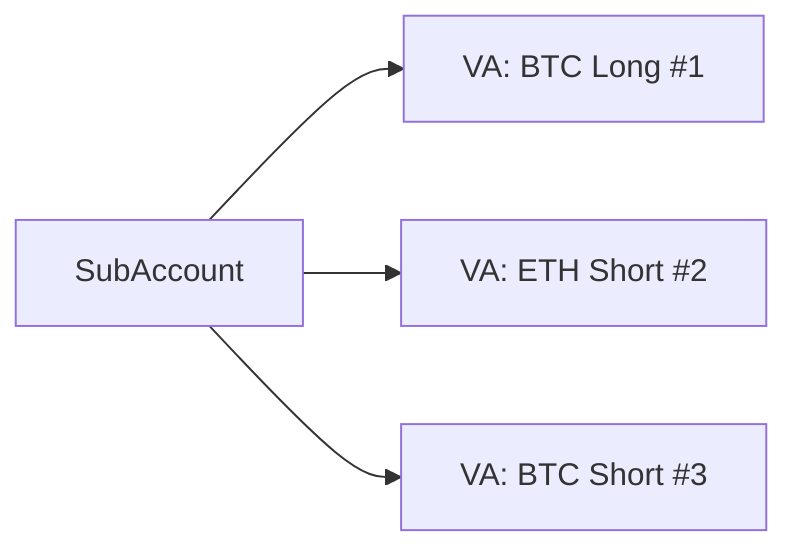
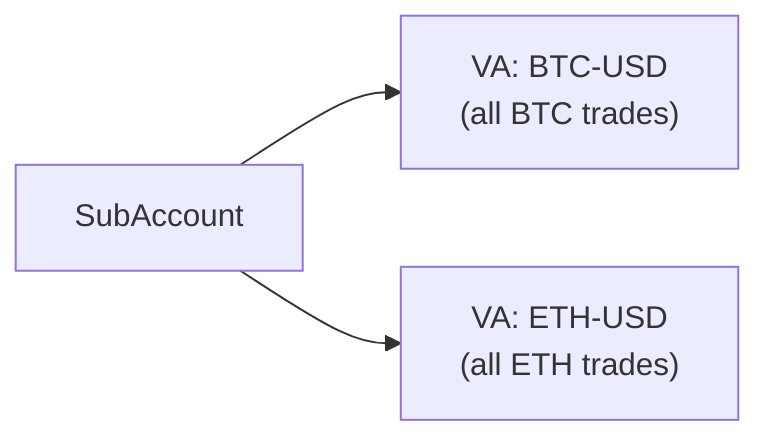
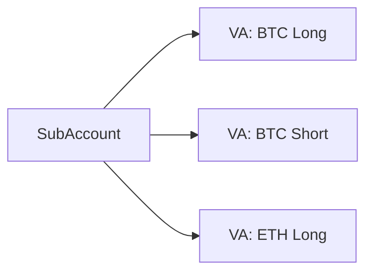

# AccountLayer

The **Symmio AccountLayer** is the unified account and affiliate management layer for the Symmio protocol. It gives **users** organized, risk-isolated trading accounts, gives **frontends** a standardized way to onboard and earn fees, and gives the **protocol** a single upgradeable system instead of fragmented per-frontend contracts.

In short: users create accounts, deposit funds, and trade -- all through one system, regardless of which frontend they use.

## Why AccountLayer

In older versions, each frontend deployed its own **MultiAccount** contract, which Symmio then registered individually. This created real problems:

- **Slow upgrades** -- each frontend had to redeploy contracts for every update
- **Manual onboarding** -- every affiliate required separate setup and registration
- **Inconsistent behavior** -- different frontends had different implementations
- **Limited flexibility** -- users could not easily manage multiple risk strategies

AccountLayer replaces all of that with:

- **One system for all accounts** -- a single Diamond proxy manages every user's accounts across all frontends
- **Standardized affiliate registry** -- consistent onboarding, fee handling, and lifecycle management
- **Flexible risk isolation** -- users choose how to isolate their positions (per-trade, per-market, or fully custom)
- **Affiliate hooks** -- frontends attach custom logic to account lifecycle events without any protocol changes
- **No per-user deployments** -- accounts are virtual addresses, not deployed contracts, reducing cost and complexity

---

## How It Works -- The User Journey

Here is the typical flow from the user's perspective:

1. **A frontend registers as an affiliate** and gets approved by the protocol. This deploys an AccountManager contract for that frontend as well. The address of this AccountManager will be their affiliate address in symmio.

2. **A user creates a SubAccount** through the frontend. The user picks a name and an isolation strategy (how positions should be separated). The SubAccount gets a deterministic address -- no contract is deployed.

3. **The user deposits collateral** into their SubAccount. The funds land in the Symmio core, credited to the SubAccount's balance.

4. **The user funds and submits trades.** Before submitting a trade, the user transfers margin to the target VA -- either to an existing VA via `addMargin`, or to the predicted next VA address via `addMarginToNextVA` (pre-funding it before it even exists, using the deterministic address). When the user sends a quote, the AccountLayer automatically creates the Virtual Account (VA) based on the chosen isolation strategy and routes the trade through it. The VA is the actual trading address on the Symmio core -- it holds the margin and the positions.

5. **When positions close**, the Symmio core notifies the AccountLayer via a callback. If the VA has no remaining positions, the AccountLayer automatically sweeps all remaining funds back to the parent SubAccount and recycles the VA address for future use.

The user never needs to manually create or clean up Virtual Accounts (unless they opt for full manual control with CUSTOM isolation) -- the system handles that automatically. However, **funding is always manual**: the user must transfer margin to the VA address before submitting a trade.

---

## Account Hierarchy

Accounts are organized into two layers: **SubAccounts** and **Virtual Accounts (VAs)**.


**SubAccounts** are the user's top-level organizational unit. A user can have multiple SubAccounts -- for example, one for conservative trading and another for aggressive strategies. Each SubAccount is linked to a specific frontend (affiliate), a specific Symmio core, and an isolation type.

**Virtual Accounts (VAs)** sit below SubAccounts and provide position isolation. Each VA is an independent trading address on the Symmio core -- it has its own balance, its own allocated margin, and its own positions. During trading, VAs are fully isolated: a liquidation in one VA cannot affect the margin or positions of another. When positions close, funds flow back to the shared parent SubAccount.

### Fund Flow

Funds move through the hierarchy like this:

1. **User -> SubAccount**: The user deposits collateral, which is credited to the SubAccount's balance on the Symmio core
2. **SubAccount -> Virtual Account**: The user **manually** transfers margin to a VA before submitting a trade -- either to an existing VA via `addMargin`, or pre-funding the next VA that will be created via `addMarginToNextVA`. There is no automatic fund transfer when a trade is submitted.
3. **Virtual Account -> SubAccount**: When all positions in a VA close, funds are **automatically** swept back to the parent SubAccount. Users can also manually pull margin back via `removeMargin`, which requires a UPNL (unrealized PnL) signature to prove the VA remains solvent after the removal.

---

## Isolation Types

When creating a SubAccount, the user chooses an **isolation type** that determines how Virtual Accounts are created and managed. This is the key decision that shapes the trading experience.

### POSITION Isolation -- One VA per Trade

Each quote gets its own dedicated Virtual Account. This provides **maximum isolation** -- each position has completely separate margin, and a liquidation on one position cannot affect any other.



- Each quote gets its own VA (a new address is generated, or a previously deleted VA is reused from the recycling pool)
- The user transfers margin to the VA before the trade executes
- When the position closes or the pending quote is cancelled, the VA is automatically destroyed and funds return to the SubAccount

**Best for**: Traders who want full isolation between every position.

### MARKET Isolation -- One VA per Market

Positions on the same market can share a Virtual Account. For example, all BTC-USD trades go to one VA and all ETH-USD trades go to another (when Single VA Mode is enabled).



- The first quote for a market creates a VA dedicated to that symbolId
- Without Single VA Mode (the default), each `sendQuote` call creates a new VA or reuses a previously deleted one -- it does not automatically route to an active VA for the same market. With Single VA Mode enabled, subsequent quotes for the same market are routed to the existing active VA.
- Positions on different markets remain fully isolated

**Best for**: Traders who want market-level isolation without managing individual position margin.

### MARKET_DIRECTION Isolation -- One VA per Market + Direction

Similar to MARKET, but also separates by direction. All BTC longs share one VA, and all BTC shorts share another.



- Combines market and direction as the isolation key
- Long and short positions on the same market are fully separated

**Best for**: Traders who want directional isolation -- ensuring a losing short does not eat into the margin of their longs.

### CUSTOM Isolation -- Full Manual Control

The user has complete control. Trades can be executed directly through the SubAccount (no VA, no isolation), or through manually created VAs with any configuration.

- The user creates VAs manually with their desired isolation type and market assignment
- Quotes can be routed to the SubAccount directly or to any of the user's VAs
- No automatic VA creation. However, VAs that are traded through (have tracked quoteIds) **are** automatically cleaned up when their last position closes or quote cancels -- this cleanup applies to all VAs regardless of the parent's isolation type.

**Best for**: Power users and integrators who need full flexibility.

---

## Virtual Account Lifecycle

VAs are created and destroyed automatically as part of normal trading. The lifecycle is:

1. **Creation** -- When a user sends a quote on a non-CUSTOM SubAccount, the system creates a new VA (or reuses an inactive one). The VA gets a deterministic address based on the parent SubAccount and a nonce.

2. **Active** -- The VA holds positions and margin. It appears as an independent trading account on the Symmio core. New quotes can be routed to it (for MARKET and MARKET_DIRECTION SubAccount types, when Single VA Mode is enabled).

3. **Deletion** -- When the last position in a VA closes (or the last pending quote cancels), the system automatically:
   - Deallocates any remaining margin from the VA (via `zeroUpnlDeallocate` -- this requires zero unrealized PnL, no signature needed)
   - Transfers all funds back to the parent SubAccount
   - Recycles the VA address into a reuse pool so future VAs can reuse it instead of generating new addresses

The user does not need to manage any of this -- it happens in the background through Symmio core callbacks.

### Deterministic Addresses

VA addresses are **predictable before creation**. The frontend can compute the next VA address in advance, but the prediction logic must account for multiple sources: first check the deletion/reuse pool (recycled VAs are reused before new ones), then check `activeVAByKey` if Single VA Mode is enabled, and finally fall back to generating a new address from the SubAccount address and the current nonce. The AccountLayer's `ViewFacet` exposes a `predictNextVirtualAccountAddress` helper for this. This predictability is important because margin must be transferred to the VA address **before** the quote is submitted -- knowing the address ahead of time makes this possible in a single transaction flow.

---

## Margin Management

Margin flows between SubAccounts and Virtual Accounts through dedicated operations:

**Adding margin to a VA** -- Transfers funds from the SubAccount's balance to the VA's allocated balance (via Symmio's `internalTransfer`). This is needed before submitting trades.

**Pre-funding the next VA** -- Before a new VA is even created, the user can pre-allocate margin to the predicted next VA address. When the quote is submitted and the VA is created, the margin is already there. This enables atomic trade submission through the InstantLayer.

**Removing margin from a VA** -- Pulls excess margin from a VA back to the parent SubAccount. Requires a UPNL (unrealized PnL) signature to prove the VA remains solvent after the removal.

**Emergency recovery** -- If margin was sent to a predicted VA address that was never actually created (e.g., due to a failed transaction), it can be recovered back to the parent SubAccount.

---

## Single VA Mode

**Single VA Mode** is an optional setting for MARKET and MARKET_DIRECTION SubAccounts that simplifies address management.

When enabled, the system ensures only **one active VA** exists per market (or per market + direction). Instead of potentially creating multiple VAs for the same market over time, the same VA address is reused as long as it has open positions. This means:

- The frontend always knows which VA address is handling a given market
- No need to track multiple VA addresses per market
- Simpler integration logic

When disabled (the default), each new batch of trades can create a new VA even if one already exists for that market. This can be toggled at any time, as long as no VAs are currently active on the SubAccount.

---

## Affiliate System

Affiliates are frontends and integrators that bring users to the protocol. The AccountLayer provides a complete lifecycle for managing them.

### Registration and Approval

1. **Request** -- Anyone can request to register as an affiliate, providing: a name, brand color, admin address, fee stakeholder configuration, and which Symmio core(s) to use.

2. **Approval** -- A protocol approver reviews and approves the request. On approval:
   - An **AccountManager** proxy contract is deployed for the affiliate (deterministic address based on registrant + name)
   - A **fee distributor address** is generated for collecting trading fees
   - The affiliate is registered on each allowed Symmio core

3. **Active** -- The affiliate is live. Users can create SubAccounts under it.

The actual state transitions implemented in code are: `NONE -> PENDING -> ACTIVE <-> PAUSED`. A pending registration can be cancelled or rejected, which deletes the data entirely (resetting to `NONE`).

### The AccountManager

Each affiliate gets an AccountManager contract. Its primary purpose is **migration convenience** -- it gives each frontend a single contract address that replaces their old MultiAccount contract, minimizing the code changes needed to integrate with the new system. Frontends that previously called their MultiAccount can point to the AccountManager instead and get a nearly identical API:

- Create accounts
- Deposit (with or without express rate)
- Withdraw
- Execute trades and other operations
- List accounts

Beyond this backward-compatible entry point, there is no particular reason to use the AccountManager directly -- all the real logic lives in the AccountLayer Diamond. The AccountManager simply authenticates the caller (temporarily setting the user as the signer on the AccountLayer) and proxies the call through.

### Custom Logic via Hooks

In the old model, frontends owned their MultiAccount contracts and could add any custom logic they wanted -- NFT minting on signup, cashback distribution, automatic partyB binding, analytics tracking, etc. With AccountLayer, that same flexibility is preserved through the **hook system**. Affiliates register hook contracts for lifecycle events (account creation, VA creation/deletion, SubAccount deletion), and the hooks fire automatically during those events. This means frontends do not lose any customization power by moving to AccountLayer -- they just express it through hooks instead of custom contract code.

### Delegated Actions

Affiliates can execute certain protocol-level operations through `callAsAffiliate`, which lets the affiliate admin (or authorized operators) call whitelisted functions on the Symmio core with the affiliate's identity. This is useful for administrative tasks like fee configuration.

---

## Fee Distribution

Trading fees generated by users of an affiliate accrue under a virtual **fee distributor address** on the Symmio core. This address is deterministic and does not require a deployed contract.

### How Fees Are Split

When an affiliate registers, they configure **stakeholders** -- a list of addresses and their percentage shares. For example:

- Frontend operator: 70%
- Referral partner: 20%
- Protocol (symmioShare): 10%

All shares (including `symmioShare`) must sum to exactly `1e18` (representing 100%). Each individual share is expressed on an 18-decimal scale.

### Claiming Fees

Any stakeholder **receiver address** (or a holder of `DISTRIBUTOR_ROLE`) can trigger fee claims. The system:

1. Withdraws the accumulated fees from the Symmio core
2. Splits the amount according to the configured stakeholder shares
3. Transfers each portion to the respective recipient

### Updating Fee Configuration

Fee changes are two-step to prevent unilateral modifications:

1. The affiliate admin **requests** a fee update with new stakeholder shares
2. A protocol **approver** reviews and confirms the change

---

## Hooks

Affiliates can attach **hooks** -- external contracts that execute custom logic when account lifecycle events occur:

| Event | When It Fires |
|-------|---------------|
| Account creation | A new SubAccount is created |
| Virtual account creation | A new VA is created (auto or manual) |
| Virtual account deletion | A VA is cleaned up (all positions closed) |
| SubAccount deletion | A SubAccount is removed |

> **Note for integrators**: The `IAccountHubHook` interface also defines an `onCall` function, but it is not currently triggered by any code path. The four events above are the only active hook events.

### What Hooks Enable

Hooks let affiliates customize the user experience without any changes to the protocol:

- **Mint an NFT** when a user creates their first account
- **Issue loyalty points** or cashback on trades
- **Auto-bind accounts** to a specific PartyB (hedger)
- **Update external whitelists** or analytics systems

Hooks can also **call back into the Symmio core** during execution to perform operations on behalf of the account (e.g., auto-allocating funds or binding to a PartyB). Only protocol-whitelisted function selectors are allowed for these callbacks.

### Hook Execution Model

When a hook fires, the system:

1. Saves and **clears `globalSigner`** -- the hook cannot impersonate the user via `getSigner()`
2. Sets `HookContext` with the current account, affiliate, and symmioCore (plus `isActive = true`)
3. Calls the hook contract via a low-level `call`
4. Clears `HookContext` (`isActive = false`)
5. Restores `globalSigner`
6. If the hook reverted, the entire transaction reverts with `HookFailed`

During step 3, the hook can call `CoreFacet.executeForAccount(callData)` to execute operations on the Symmio core on behalf of the account. This is gated by:
- `hookContext.isActive` must be `true` (only during hook execution)
- The function selector in `callData` must be in `hookAllowedSelectors[affiliate]` (set by `SETTER_ROLE`)

**Audit focus**: Hooks are **unsandboxed external calls**. A malicious or buggy hook can: revert and block the entire operation (griefing), consume excessive gas, or execute arbitrary logic. The signer clearing prevents impersonation, but hooks can still affect liveness. The protocol admin (`SETTER_ROLE`) controls which selectors hooks can call back via `hookAllowedSelectors`, limiting the blast radius of callback operations.

---

## Express Deposits

Express deposits let affiliates split user deposits to maintain **instant-withdrawal liquidity**. This is covered in detail in the [Express Deposit](express-deposit.md) doc, but here is the summary:

A deposit is split into two portions based on the affiliate's configured **express rate**:

- **Real portion** -- deposited into the Symmio core as protocol collateral
- **Virtual portion** -- sent to a Virtual Provider that credits the user immediately with virtual funds

The user sees the full deposit amount in their balance right away. The virtual portion builds a liquidity pool that can be used to offer express (instant) withdrawals. The system enforces a strict invariant: the total balance increase must equal the deposited amount.

---

## Security Model

### Access Control Roles

| Role Constant | What It Controls |
|------|------------------|
| `DEFAULT_ADMIN_ROLE` | Role admin for all roles -- can grant/revoke any role and assign role admins. Does **not** implicitly hold other roles (cannot bypass `onlyRole` checks for PAUSER, SETTER, etc.) |
| `APPROVER_ROLE` | Activates affiliates, approves fee updates |
| `SETTER_ROLE` | Manages core whitelists, hook/call allowed selectors, AccountManager implementation, fee receiver |
| `PAUSER_ROLE` | Pause operations (also: affiliate admin can pause their own affiliate) |
| `UNPAUSER_ROLE` | Unpause operations |
| `SIGNER_SETTER_ROLE` | Can set `globalSigner` -- granted to each AccountManager during affiliate approval |
| `DEPLOYER_ROLE` | Defined but not currently used by any code path. AccountManager deployment is handled inside `approveAffiliate` (gated by `APPROVER_ROLE`) |
| `DISTRIBUTOR_ROLE` | Trigger fee distribution |
| `INSTANT_LAYER_ROLE` | Bypass ownership checks -- granted to the InstantLayer for batched execution |

Role admins are managed separately from role holders: `setRoleAdmin(user, role, status)` grants/revokes admin power for a specific role. A `DEFAULT_ADMIN_ROLE` holder is implicitly a role admin for all roles.

### Authentication Chain

The AccountLayer uses a **global signer pattern** instead of relying on `msg.sender` directly. This is the most security-critical mechanism in the system:

```
User (EOA) calls AccountManager
    → AccountManager.withSigner() sets globalSigner = msg.sender
        → AccountLayer.getSigner() returns globalSigner (the user) instead of msg.sender (the AccountManager)
            → AccountLayer.executeWithSigner(account, callData) calls symmio.setSigner(account), executes, clears
        → AccountManager.withSigner() clears globalSigner = address(0)
```

The core functions:

```solidity
// Returns globalSigner if set, otherwise msg.sender
function getSigner() internal view returns (address) {
    address signer = AccountHubStorage.layout().globalSigner;
    return signer == address(0) ? msg.sender : signer;
}

// AccountManager modifier that authenticates the user
modifier withSigner() {
    IAccountLayerDiamond(accountHub).setSigner(msg.sender);
    _;
    IAccountLayerDiamond(accountHub).setSigner(address(0));
}
```

**Audit focus**: Any path where `globalSigner` is non-zero during an external call is a potential impersonation vector. The system mitigates this by clearing `globalSigner` before every external call (hooks, ERC20 transfers, virtual provider callbacks) and restoring it afterward.

### Signer Clearing Mechanism

All external calls are wrapped to prevent callback attacks:

```solidity
// Used for hooks, virtual provider callbacks, and other external calls
function safeExternalCall(address target, bytes memory data) internal {
    address previousSigner = ahLayout.globalSigner;
    ahLayout.globalSigner = address(0);     // Clear before external call
    (bool success, bytes memory reason) = target.call(data);
    ahLayout.globalSigner = previousSigner; // Restore after
    // ... error handling
}
```

The same pattern is used in `LibAccountLayerSafeERC20` for `safeTransfer`, `safeTransferFrom`, and `safeIncreaseAllowance`. It is also used in `callHook()` with the additional step of setting and clearing the `HookContext`.

**Why this matters**: Without signer clearing, a malicious hook or token contract could re-enter the AccountLayer during an external call. Since `getSigner()` would still return the user's address, the attacker could execute operations as the user.

### Key Invariants

1. **Express deposit balance invariant** -- After an express deposit, `(user's balance increase) + (user's allocated increase) == (amount * 1e18) / (10 ** collateralDecimals)`. The expected increase is the deposited amount normalized to 18-decimal precision. Enforced in `CoreFacet` after the split between real deposit and virtual provider.

2. **Fee share invariant** -- `sum(stakeholder.share) + symmioShare == 1e18` (100%). Enforced during registration and fee updates.

3. **VA cleanup completeness** -- When a VA is deleted (last quote removed), `deallocateAndTransferBalance` sweeps **all** allocated balance and **all** free balance back to the parent SubAccount. No funds can be stranded in a deleted VA.

4. **VA isolation enforcement** -- A POSITION-type VA reverts if it already has a quoteId. MARKET_LONG reverts on SHORT quotes. MARKET/MARKET_LONG/MARKET_SHORT revert if `symbolId` does not match. These checks happen in `_handleVirtualAccountSendQuote`.

5. **Signer always cleared** -- After every `withSigner` modifier, after every `executeWithSigner` call, after every `safeExternalCall`, and after every `callHook`, `globalSigner` is reset to `address(0)`. Any code path that leaves `globalSigner` set is a bug.

6. **`internalTransferToBalance` blocked from `_call`** -- Users cannot directly call `internalTransferToBalance` through `_call()`. This function is reserved for internal VA cleanup. Attempting it reverts with `Unauthorized`.

### Reentrancy Protection

A custom reentrancy guard uses a dedicated storage slot (`keccak256("diamond.standard.storage.accountlayer.reentrancy")`), separate from any Diamond storage. The `nonReentrant` modifier is applied to the primary entry points: `_call`, `createSubAccounts`, `deleteSubAccount`, `createCustomVirtualAccount`, deposit functions, and all MarginFacet functions. Note that not all state-changing functions use `nonReentrant` -- administrative functions in AffiliateFacet (registration, fee updates, hooks, operators) and ControlFacet (role management, pause) rely on access control rather than reentrancy guards. The SymmioHookFacet's `onClosePosition` uses `nonReentrant`, but `onCancelQuote` does not.

### Key Security Properties

- **No per-user contracts** -- SubAccounts and VAs are virtual addresses, not deployed contracts. The AccountLayer manages them centrally.
- **Signer isolation** -- The authenticated signer context is always cleared before any external call to prevent impersonation attacks.
- **Independent pause** -- The AccountLayer has its own pause mechanism (`AccountLayerStorage.globalPaused`), independent of the Symmio core's pause.
- **Hook context gating** -- `executeForAccount` (hook callback into Symmio core) only works when `hookContext.isActive == true` AND the function selector is in `hookAllowedSelectors`. Outside hook execution, it always reverts.

---

## Legacy Migration

Frontends that used the old MultiAccount system can migrate their users' existing accounts into the AccountLayer:

- Existing account addresses are imported as SubAccounts with CUSTOM isolation
- Ownership is preserved -- only the actual owner can import their accounts
- Once imported, accounts can use all AccountLayer features
- Double-import is prevented

This ensures backward compatibility while allowing a smooth transition to the new system.

---

## Architecture Reference

### Facets

| Facet | Responsibility |
|-------|----------------|
| **CoreFacet** | SubAccount and VA lifecycle, deposits, trade execution routing, hook callbacks |
| **AffiliateFacet** | Affiliate registration, fee configuration, hooks, operators, express config |
| **MarginFacet** | Margin transfers between SubAccounts and VAs, emergency recovery |
| **ViewFacet** | Read-only queries for accounts, affiliates, addresses, and predictions |
| **ControlFacet** | Role management, pause control, core whitelisting, allowed selectors |
| **SymmioHookFacet** | Receives callbacks from Symmio core for automatic VA cleanup |

### Storage Layout

The AccountLayer uses four separate storage slots following the Diamond storage pattern:

| Storage Contract | Slot Key | Contents |
|---|---|---|
| `AccountHubStorage` | `keccak256("diamond.standard.storage.accounthub")` | SubAccount/VA data, nonces, globalSigner, AccountManager bytecode |
| `AffiliateHubStorage` | `keccak256("diamond.standard.storage.affiliatehub")` | Affiliate configs, fee details, hooks, operators, hookContext |
| `AccountLayerStorage` | `keccak256("diamond.standard.storage.accountlayer")` | RBAC (hasRole, roleAdmins), globalPaused |
| Reentrancy Guard | `keccak256("diamond.standard.storage.accountlayer.reentrancy")` | Reentrancy status flag |

### Key Data Structures

```solidity
// SubAccount isolation types (set once at creation, immutable)
enum SubAccountIsolationType { POSITION, MARKET, MARKET_DIRECTION, CUSTOM }

// VA isolation types (determined by parent SubAccount's type + direction)
enum VirtualAccountIsolationType { POSITION, MARKET, MARKET_LONG, MARKET_SHORT }

struct SubAccountData {
    string name;
    address owner;
    bool isExists;
    bool singleVAMode;
    bytes metadata;
    address affiliate;
    address symmioCore;
    SubAccountIsolationType isolationType;
}

struct VirtualAccountData {
    bool isExists;
    bytes metadata;
    address parentAccount;      // Always set, even after deletion (used to detect deleted VAs)
    uint256 symbolId;
    VirtualAccountIsolationType isolationType;
    EnumerableSet.UintSet quoteIds;  // Active quote IDs on this VA
}

struct AffiliateData {
    string name;
    string brandColor;
    address admin;
    address pendingAdmin;
    AffiliateState state;       // NONE, PENDING, ACTIVE, PAUSED
    FeeDetails feeDetails;      // symmioShare, stakeholders[], feeDistributor address
    bytes metadata;
    address[] legacyMultiAccounts;
    EnumerableSet.AddressSet symmioCores;
    mapping(bytes4 => address) hooks;
    address accountManager;
    address registrant;
    uint256 expressRate;        // 0 to 1e18 (0% to 100%)
    address virtualProvider;
}

struct HookContext {
    address account;
    address affiliate;
    address symmioCore;
    bool isActive;              // True only during hook execution
}
```

### Deterministic Address Generation

SubAccounts, VAs, and fee distributors are **virtual addresses** -- no contracts are deployed. AccountManagers are deployed via real CREATE2. All follow the CREATE2 address formula: `keccak256(0xff, deployer, salt, initCodeHash)`.

```solidity
// SubAccount (virtual -- no contract deployed)
// deployer = affiliate, salt = keccak256(user, globalNonce), initCodeHash = keccak256("ACC_V1")
address(uint160(uint256(keccak256(abi.encodePacked(
    bytes1(0xff), affiliate, keccak256(abi.encodePacked(user, nonce)), keccak256("ACC_V1")
)))))

// Virtual Account (virtual -- no contract deployed)
// deployer = parentAccount, salt = keccak256(nonce), initCodeHash = keccak256("VACC_V1")
address(uint160(uint256(keccak256(abi.encodePacked(
    bytes1(0xff), parentAccount, keccak256(abi.encodePacked(nonce)), keccak256("VACC_V1")
)))))

// AccountManager (real CREATE2 deployment)
// deployer = AccountLayer diamond, salt = keccak256(ACM_V1_HASH, registrant, name)
// initCode = accountManagerImplementation ++ abi.encode(accountLayerDiamond)
bytes32 salt = keccak256(abi.encodePacked(keccak256("ACM_V1"), registrant, name));
bytes32 initCodeHash = keccak256(abi.encodePacked(implementation, abi.encode(diamond)));

// Fee Distributor (virtual -- no contract deployed)
// deployer = affiliate, salt = keccak256(globalNonce), initCodeHash = keccak256("VFD_V1")
// Note: nonce comes from AccountHubStorage.globalNonce (shared with SubAccount generation)
address(uint160(uint256(keccak256(abi.encodePacked(
    bytes1(0xff), affiliate, keccak256(abi.encodePacked(nonce)), keccak256("VFD_V1")
)))))
```

### Critical Code Paths

#### The `_call()` Routing Logic

`_call(account, callDatas[])` is the primary entry point for all user operations. For each calldata in the batch:

1. **Block `internalTransferToBalance`** -- always reverts with `Unauthorized`
2. **Deleted VA check** -- if `account` is a deleted VA (isExists=false but parentAccount is set), reverts
3. **Legacy account** -- if not a SubAccount or VA, falls through to legacy handling
4. **sendQuote interception** -- if the calldata is a `sendQuote` variant:
   - On a **VA**: enforces isolation rules (POSITION allows max 1 quote, MARKET/MARKET_LONG/MARKET_SHORT enforce symbolId/direction match), then executes and tracks the quoteId
   - On a **SubAccount**: auto-creates or reuses a VA based on isolation type, routes the quote through the VA, and tracks the quoteId
   - On a **CUSTOM SubAccount**: executes directly, no VA created
5. **All other calls** -- executes directly via `executeWithSigner`

#### VA Automatic Deletion (SymmioHookFacet)

When the Symmio core calls `onClosePosition` or `onCancelQuote`:

```
onClosePosition(quoteId, partyA) → _removeQuoteFromAccount(quoteId, partyA)
    → vData.quoteIds.remove(quoteId)
    → if quoteIds is empty → _deleteVirtualAccount(account)
        → deallocateAndTransferBalance(va, parent, core)  // Sweep all funds
        → vData.isExists = false
        → clear activeVAByKey if this was the active VA
        → push to deletedVirtualAccountsPool              // Recycle address
        → remove from parent's VA set
        → fire onVirtualAccountDeletion hook
```

#### Fee Claiming Path

```
claimAllFees(affiliate, symmio)
    → setSigner(feeDistributor) on Symmio core
    → initiateWithdraw(feeDistributor, amount, symmio)
    → finalizeWithdrawRequest(feeDistributor, symmio)     // Tokens arrive at AccountLayer
    → setSigner(address(0))
    → distribute tokens proportionally to stakeholders and symmioFeeReceiver
```

### Function Signatures

#### CoreFacet

```solidity
function createSubAccounts(address affiliate, SubAccountCreationData[] memory accountsData) external returns (address[] memory);
function editAccountName(address account, string memory name) external;
function setSingleVAMode(address subAccount, bool enabled) external;
function deleteSubAccount(address subAccount) external;
function createCustomVirtualAccount(address parentAccount, bytes memory metadata, VirtualAccountIsolationType isolationType, uint256 symbolId) external returns (address);
function depositForAccount(address account, uint256 amount) external;
function depositAndAllocateForAccount(address account, uint256 amount) external;
function depositForAccountWithExpressRate(address account, uint256 amount) external;
function depositAndAllocateForAccountWithExpressRate(address account, uint256 amount) external;
function _call(address account, bytes[] calldata callDatas) external returns (bytes[] memory);
function executeForAccount(bytes calldata callData) external;  // Only callable during hook execution
function importLegacyAccounts(address legacyContract, address affiliate, address[] calldata symmioCores, LegacyAccountImportData[] calldata accountsData) external returns (address[] memory);
```

#### MarginFacet

```solidity
function addMargin(address virtualAccount, uint256 amount) external;
function addMarginToNextVA(address subAccount, VirtualAccountIsolationType isolationType, uint256 symbolId, uint256 amount) external;
function removeMargin(address virtualAccount, uint256 amount, ISymmio.SingleUpnlSig memory upnlSig) external;
function emergencyRecoverMargin(address subAccount, uint256 nonce) external;
```

#### AffiliateFacet

```solidity
// Registration
function requestToRegisterAffiliate(AffiliateRegistration memory reg) external returns (address affiliateAddress);
function cancelRegistration(address affiliate) external;
function rejectRegistration(address affiliate) external;
function approveAffiliate(address affiliate) external;

// Admin
function proposeAdminTransfer(address affiliate, address newAdmin) external;
function acceptAdminTransfer(address affiliate) external;
function updateAffiliateDetails(address affiliate, string memory name, string memory brandColor) external;
function pauseAffiliate(address affiliate) external;
function unpauseAffiliate(address affiliate) external;

// Fees
function requestFeeUpdate(address affiliate, Stakeholder[] memory newStakeholders, uint256 newSymmioShare) external;
function approveFeeUpdate(address affiliate) external;
function claimAllFees(address affiliate, address symmio) external;
function claimFees(address affiliate, address symmio, uint256 amount) external;

// Hooks & Operators
function setHook(address affiliate, bytes4 selector, address hook) external;
function removeHook(address affiliate, bytes4 selector) external;
function setOperator(address affiliate, bytes4 selector, address operator, bool status) external;

// Express & Delegated
function setExpressRate(address affiliate, uint256 expressRate) external;
function setVirtualProvider(address affiliate, address virtualProvider) external;
function callAsAffiliate(address affiliate, address symmio, bytes calldata callData) external returns (bytes memory);
```

#### SymmioHookFacet (called by Symmio core, not users)

```solidity
function onOpenPosition(uint256 quoteId, uint256 filledAmount, uint256 openedPrice, address partyA, address partyB) external;    // No-op
function onClosePosition(uint256 quoteId, uint256 filledAmount, uint256 closedPrice, address partyA, address partyB) external;  // Triggers VA cleanup
function onCancelQuote(uint256 quoteId, address partyA, address partyB) external;                                                // Triggers VA cleanup
function onFeeCharged(uint256 quoteId, uint256 amount, address partyA, address partyB, uint256 symbolId, address affiliate, uint8 feeType) external;  // No-op
```

### Cross-Contract Permissions

The AccountLayer requires specific roles on the Symmio core diamond to function:

| Role on Symmio Core | Why |
|---|---|
| `SIGNER_ADMIN_ROLE` | Set signer context when executing operations on behalf of SubAccounts/VAs |
| `AFFILIATE_MANAGER_ROLE` | Register affiliates and set fee collectors on the core |
| `INTERNAL_TRANSFER_TO_BALANCE_ROLE` | Transfer funds between VAs and parent SubAccounts during cleanup |

The InstantLayer requires `INSTANT_LAYER_ROLE` on the AccountLayer to bypass ownership checks during batched template execution.
