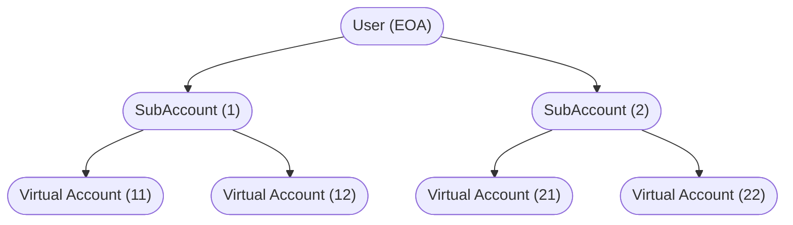
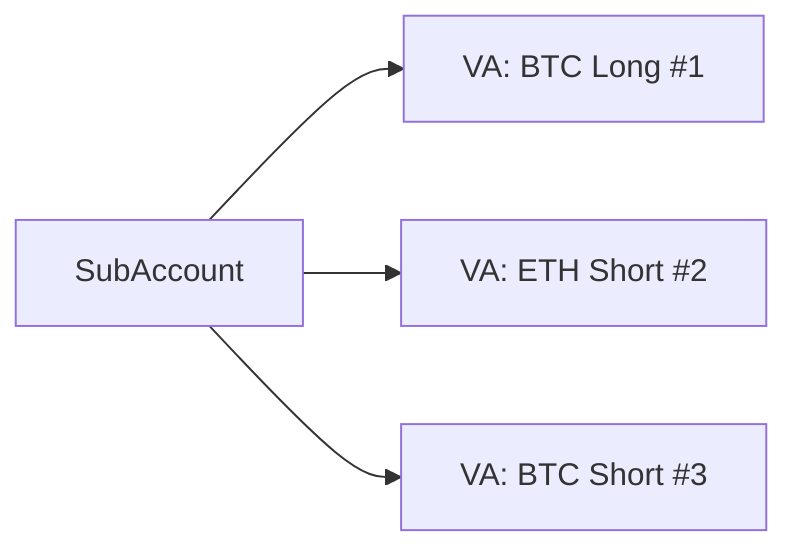
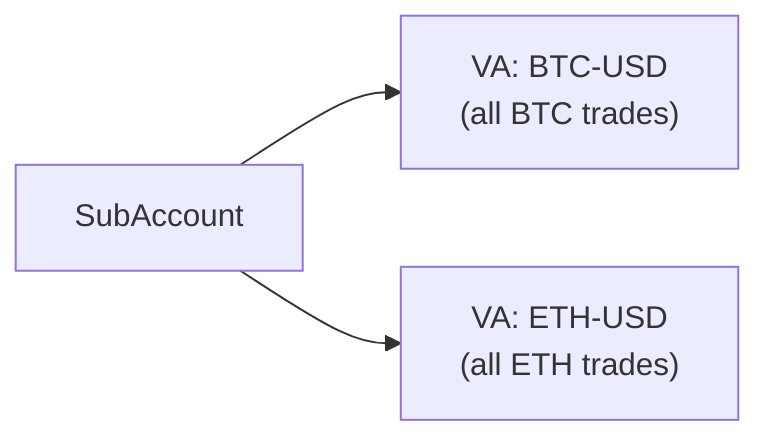
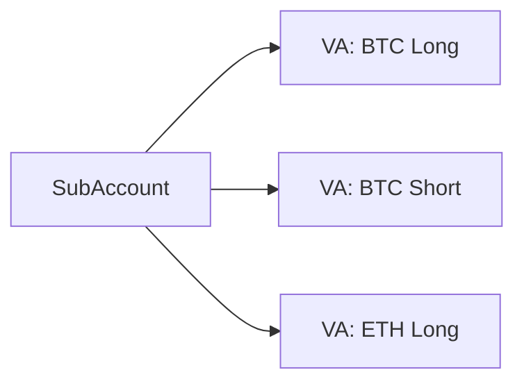

# AccountLayer

The **Symmio AccountLayer** is the unified account and affiliate management layer for the Symmio protocol. It replaces the old per-frontend MultiAccount contracts with a single Diamond proxy that manages every user's accounts, standardizes affiliate onboarding and fee handling, and provides flexible position isolation -- all without deploying a contract per user.

## The Problem It Solves

Previously, each frontend deployed its own MultiAccount contract, which Symmio registered individually. Upgrades required every frontend to redeploy. Affiliate onboarding was manual. Implementations diverged. Users were locked into rigid account structures.

AccountLayer consolidates all of that into one system: a single Diamond proxy, a standardized affiliate registry, virtual accounts with deterministic addresses, and configurable isolation strategies.

---

## Account Hierarchy

Accounts are organized into two layers.



**SubAccounts** are the user's top-level organizational unit. Each one is bound to a specific frontend (affiliate), a Symmio core instance, and an isolation type chosen at creation. A user might have one SubAccount for conservative trades and another for aggressive strategies.

**Virtual Accounts (VAs)** sit below SubAccounts and provide position isolation. Each VA is an independent trading address on the Symmio core with its own balance, allocated margin, and positions. A liquidation in one VA cannot touch another. When a VA's last position closes, its funds are automatically swept back to the parent SubAccount and the VA address is recycled for future use.

Both SubAccounts and VAs are **virtual addresses** -- deterministic CREATE2-style addresses with no deployed contract behind them. The AccountLayer manages their state centrally.

### Fund Flow

```
User  ──deposit──►  SubAccount  ──addMargin──►  Virtual Account
                    SubAccount  ◄──auto-sweep──  Virtual Account (on last position close)
```

1. **User to SubAccount** -- The user deposits collateral, credited to the SubAccount's balance on the Symmio core.
2. **SubAccount to VA** -- The user *manually* transfers margin to a VA before trading. This can target an existing VA (`addMargin`) or pre-fund the predicted next VA address (`addMarginToNextVA`) before it exists.
3. **VA to SubAccount** -- Automatic when the VA's last position closes. Users can also manually pull margin back via `removeMargin`, which requires a UPNL signature to prove the VA remains solvent.

---

## Isolation Types

The isolation type, chosen when creating a SubAccount, determines how VAs are created and managed during trading.

### POSITION -- One VA per Trade

Every quote gets its own VA. Maximum isolation: each position has separate margin, and a liquidation on one cannot affect any other. When the position closes, the VA is destroyed and funds return to the SubAccount.



### MARKET -- One VA per Market

Positions on the same market share a VA. All BTC-USD trades go to one VA, all ETH-USD trades to another. Different markets remain fully isolated.



Without **Single VA Mode** (the default), each `sendQuote` creates a new VA even if one already exists for that market. With Single VA Mode enabled, subsequent quotes for the same market route to the existing active VA. This setting can be toggled when no VAs are active on the SubAccount.

### MARKET_DIRECTION -- One VA per Market + Direction

Like MARKET, but also separates by direction. All BTC longs share one VA; all BTC shorts share another.



### CUSTOM -- Full Manual Control

No automatic VA creation. Trades can execute directly through the SubAccount (no isolation), or through manually created VAs with any configuration the user chooses. VAs that track quoteIds are still automatically cleaned up when their last position closes.

---

## The Trading Flow

Here is how a trade moves through the system, end to end:

1. **Pre-fund** -- The user transfers margin to the target VA address. For a new trade, this means calling `addMarginToNextVA` with the predicted next VA address (which the `ViewFacet.predictNextVirtualAccountAddress` helper can compute). For an existing VA, `addMargin` works.

2. **Send quote** -- The user submits a `sendQuote` through `_call()`. The AccountLayer intercepts it:
   - On a **non-CUSTOM SubAccount**: creates or reuses a VA based on the isolation type, routes the quote through it, and tracks the quoteId.
   - On a **CUSTOM SubAccount**: executes directly, no VA involved.
   - On a **VA directly**: enforces isolation rules (POSITION allows max 1 quote; MARKET/MARKET_LONG/MARKET_SHORT enforce symbolId and direction match), then executes and tracks the quoteId.

3. **Position opens** -- The Symmio core calls `onOpenPosition` (a no-op on the AccountLayer side).

4. **Position closes** -- The Symmio core calls `onClosePosition`. The AccountLayer removes the quoteId from the VA. If the VA has no remaining quoteIds:
   - All remaining margin is deallocated (via `zeroUpnlDeallocate` -- zero unrealized PnL, no signature needed)
   - All funds are transferred back to the parent SubAccount
   - The VA address is pushed into a recycling pool
   - The VA deletion hook fires (if configured)

The user never manages VA lifecycle manually (unless using CUSTOM isolation). Funding is always manual.

---

## Affiliate System

Affiliates are frontends and integrators that bring users to the protocol. The AccountLayer manages their full lifecycle: registration, approval, fee splitting, hooks, and delegated actions.

### Registration

1. Anyone can **request** registration, providing a name, brand color, admin address, fee stakeholder configuration, and which Symmio core(s) to use.
2. A protocol `APPROVER_ROLE` holder **reviews and approves**. On approval, an AccountManager proxy is deployed (deterministic CREATE2), a fee distributor address is generated, and the affiliate is registered on each allowed Symmio core.
3. The affiliate is **active**. Users can create SubAccounts under it.

State transitions: `NONE -> PENDING -> ACTIVE <-> PAUSED`. Pending registrations can be cancelled or rejected, which deletes the data entirely (resetting to `NONE`).

### The AccountManager

Each affiliate gets an AccountManager contract whose primary purpose is **migration convenience**. It provides a nearly identical API to the old MultiAccount contracts -- create accounts, deposit, withdraw, execute trades, list accounts -- so frontends can swap contract addresses with minimal code changes. Under the hood, it authenticates the caller (by temporarily setting `globalSigner` on the AccountLayer) and proxies the call through. There is no reason to use it directly beyond backward compatibility.

### Fee Distribution

Trading fees accrue under a virtual fee distributor address on the Symmio core. When an affiliate registers, they configure **stakeholders** -- a list of addresses and percentage shares (e.g., frontend operator 70%, referral partner 20%, protocol 10%). All shares including `symmioShare` must sum to exactly `1e18`.

Any stakeholder receiver or `DISTRIBUTOR_ROLE` holder can trigger fee claims. The system withdraws accumulated fees from the core, splits them according to configured shares, and transfers each portion to the respective recipient.

Fee changes are two-step: the affiliate admin requests an update, then a protocol approver confirms it.

### Hooks

Affiliates can attach hook contracts to account lifecycle events:

| Event | Trigger |
|-------|---------|
| Account creation | A new SubAccount is created |
| VA creation | A new VA is created (auto or manual) |
| VA deletion | A VA is cleaned up (last position closed) |
| SubAccount deletion | A SubAccount is removed |
| Call execution | `_call` is invoked on an account (fires after all calls complete) |

Hooks preserve the customization power frontends had when they owned their MultiAccount contracts -- NFT minting on signup, cashback, auto-binding to a PartyB, analytics tracking. During execution, hooks can **call back into the Symmio core** via `CoreFacet.executeForAccount(callData)`, gated by two conditions: `hookContext.isActive` must be true (only during hook execution), and the function selector must be in `hookAllowedSelectors[affiliate]` (controlled by `SETTER_ROLE`).

**Audit note**: Hooks are unsandboxed external calls. A malicious hook can revert and block the operation (griefing) or consume excessive gas. The signer clearing mechanism (see Security below) prevents impersonation, and `hookAllowedSelectors` limits callback scope, but hooks can still affect liveness.

### Delegated Actions

Affiliates can execute protocol-level operations through `callAsAffiliate`, which lets the affiliate admin (or authorized operators) call whitelisted functions on the Symmio core with the affiliate's identity. Useful for administrative tasks like fee configuration.

### Express Deposits

Express deposits let affiliates split user deposits to maintain instant-withdrawal liquidity. A deposit is divided by the affiliate's configured **express rate**: the real portion goes to the Symmio core as collateral, the virtual portion goes to a Virtual Provider that credits the user immediately. See [Express Deposit](express-deposit.md) for details.

---

## Security Model

### The Global Signer Pattern

The AccountLayer authenticates users through a `globalSigner` variable instead of relying on `msg.sender` directly. This is the most security-critical mechanism in the system:

```
User (EOA)  ──calls──►  AccountManager.withSigner()
                            sets globalSigner = msg.sender
                            ──delegates──►  AccountLayer
                                              getSigner() returns globalSigner (the user)
                                              executes operation
                            clears globalSigner = address(0)
```

```solidity
function getSigner() internal view returns (address) {
    address signer = AccountHubStorage.layout().globalSigner;
    return signer == address(0) ? msg.sender : signer;
}
```

### Signer Clearing

Every external call -- hooks, ERC20 transfers, virtual provider callbacks -- is wrapped to prevent callback attacks:

```solidity
function safeExternalCall(address target, bytes memory data) internal {
    address previousSigner = ahLayout.globalSigner;
    ahLayout.globalSigner = address(0);     // Clear before external call
    (bool success, bytes memory reason) = target.call(data);
    ahLayout.globalSigner = previousSigner; // Restore after
}
```

The same pattern is used in `LibAccountLayerSafeERC20` for token transfers and in `callHook()` (with the additional step of setting/clearing `HookContext`).

Without this, a malicious hook or token contract could re-enter the AccountLayer during an external call and, since `getSigner()` would still return the user's address, execute operations as the user.

### Access Control

| Role | Controls |
|------|----------|
| `DEFAULT_ADMIN_ROLE` | Can grant/revoke any role and assign role admins. Does **not** implicitly hold other roles. |
| `APPROVER_ROLE` | Activate affiliates, approve fee updates |
| `SETTER_ROLE` | Core whitelists, hook/call allowed selectors, AccountManager implementation, fee receiver |
| `PAUSER_ROLE` | Pause operations (affiliate admins can also pause their own affiliate) |
| `UNPAUSER_ROLE` | Unpause operations |
| `SIGNER_SETTER_ROLE` | Set `globalSigner` -- granted to each AccountManager during affiliate approval |
| `DEPLOYER_ROLE` | Defined but unused; AccountManager deployment is handled inside `approveAffiliate` |
| `DISTRIBUTOR_ROLE` | Trigger fee distribution |
| `INSTANT_LAYER_ROLE` | Bypass ownership checks for InstantLayer batched execution |

Role admins are managed via `setRoleAdmin(user, role, status)`. A `DEFAULT_ADMIN_ROLE` holder is implicitly a role admin for all roles.

### Reentrancy Protection

A custom reentrancy guard uses a dedicated storage slot (`keccak256("diamond.standard.storage.accountlayer.reentrancy")`). The `nonReentrant` modifier covers primary entry points: `_call`, `createSubAccounts`, `deleteSubAccount`, `createCustomVirtualAccount`, deposits, and MarginFacet functions. Administrative functions rely on access control instead. `SymmioHookFacet.onClosePosition` uses `nonReentrant`; `onCancelQuote` does not.

### Key Invariants

1. **Express deposit balance** -- After an express deposit: `(balance increase) + (allocated increase) == (amount * 1e18) / (10 ** collateralDecimals)`.
2. **Fee shares** -- `sum(stakeholder.share) + symmioShare == 1e18`.
3. **VA cleanup completeness** -- On deletion, `deallocateAndTransferBalance` sweeps all allocated and free balance back to the parent. No funds can be stranded.
4. **VA isolation enforcement** -- POSITION VAs revert if they already have a quoteId. MARKET_LONG rejects SHORT quotes. MARKET/MARKET_LONG/MARKET_SHORT revert on symbolId mismatch.
5. **Signer always cleared** -- After every `withSigner`, `executeWithSigner`, `safeExternalCall`, and `callHook`, `globalSigner` is reset to `address(0)`.
6. **`internalTransferToBalance` blocked from `_call`** -- Reserved for internal VA cleanup; user calls revert with `Unauthorized`.

---

## Legacy Migration

Frontends on the old MultiAccount system can import existing accounts into the AccountLayer as SubAccounts with CUSTOM isolation. Ownership is preserved (only the actual owner can import), double-import is prevented, and imported accounts gain access to all AccountLayer features.

---

## Architecture Reference

### Facets

| Facet | Responsibility |
|-------|----------------|
| **CoreFacet** | SubAccount/VA lifecycle, deposits, trade execution routing, hook callbacks |
| **AffiliateFacet** | Affiliate registration, fee config, hooks, operators, express config |
| **MarginFacet** | Margin transfers between SubAccounts and VAs, emergency recovery |
| **ViewFacet** | Read-only queries for accounts, affiliates, addresses, predictions |
| **ControlFacet** | Role management, pause control, core whitelisting, allowed selectors |
| **SymmioHookFacet** | Receives callbacks from Symmio core for automatic VA cleanup |

### Storage Layout

| Storage Contract | Slot Key | Contents |
|---|---|---|
| `AccountHubStorage` | `keccak256("diamond.standard.storage.accounthub")` | SubAccount/VA data, nonces, globalSigner, AccountManager bytecode |
| `AffiliateHubStorage` | `keccak256("diamond.standard.storage.affiliatehub")` | Affiliate configs, fee details, hooks, operators, hookContext |
| `AccountLayerStorage` | `keccak256("diamond.standard.storage.accountlayer")` | RBAC (hasRole, roleAdmins), globalPaused |
| Reentrancy Guard | `keccak256("diamond.standard.storage.accountlayer.reentrancy")` | Reentrancy status flag |

### Key Data Structures

```solidity
enum SubAccountIsolationType { POSITION, MARKET, MARKET_DIRECTION, CUSTOM }
enum VirtualAccountIsolationType { POSITION, MARKET, MARKET_LONG, MARKET_SHORT }

struct SubAccountData {
    string name;
    address owner;
    bool isExists;
    bool singleVAMode;
    bytes metadata;
    address affiliate;
    address symmioCore;
    SubAccountIsolationType isolationType;
}

struct VirtualAccountData {
    bool isExists;
    bytes metadata;
    address parentAccount;      // Always set, even after deletion (detects deleted VAs)
    uint256 symbolId;
    VirtualAccountIsolationType isolationType;
    EnumerableSet.UintSet quoteIds;
}

struct AffiliateData {
    string name;
    string brandColor;
    address admin;
    address pendingAdmin;
    AffiliateState state;       // NONE, PENDING, ACTIVE, PAUSED
    FeeDetails feeDetails;      // symmioShare, stakeholders[], feeDistributor address
    bytes metadata;
    address[] legacyMultiAccounts;
    EnumerableSet.AddressSet symmioCores;
    mapping(bytes4 => address) hooks;
    address accountManager;
    address registrant;
    uint256 expressRate;        // 0 to 1e18 (0% to 100%)
    address virtualProvider;
}

struct HookContext {
    address account;
    address affiliate;
    address symmioCore;
    bool isActive;              // True only during hook execution
}
```

### Deterministic Address Generation

SubAccounts, VAs, and fee distributors are virtual addresses (no deployed contracts). AccountManagers are real CREATE2 deployments. All follow the CREATE2 formula: `keccak256(0xff, deployer, salt, initCodeHash)`.

```solidity
// SubAccount: deployer=affiliate, salt=keccak256(user, globalNonce), initCodeHash=keccak256("ACC_V1")
address(uint160(uint256(keccak256(abi.encodePacked(
    bytes1(0xff), affiliate, keccak256(abi.encodePacked(user, nonce)), keccak256("ACC_V1")
)))))

// Virtual Account: deployer=parentAccount, salt=keccak256(nonce), initCodeHash=keccak256("VACC_V1")
address(uint160(uint256(keccak256(abi.encodePacked(
    bytes1(0xff), parentAccount, keccak256(abi.encodePacked(nonce)), keccak256("VACC_V1")
)))))

// AccountManager (real deployment): deployer=AccountLayer diamond
bytes32 salt = keccak256(abi.encodePacked(keccak256("ACM_V1"), registrant, name));
bytes32 initCodeHash = keccak256(abi.encodePacked(implementation, abi.encode(diamond)));

// Fee Distributor: deployer=affiliate, salt=keccak256(globalNonce), initCodeHash=keccak256("VFD_V1")
// Note: nonce comes from AccountHubStorage.globalNonce (shared with SubAccount generation)
address(uint160(uint256(keccak256(abi.encodePacked(
    bytes1(0xff), affiliate, keccak256(abi.encodePacked(nonce)), keccak256("VFD_V1")
)))))
```

### Critical Code Paths

#### `_call()` Routing

`_call(account, callDatas[])` is the primary entry point for all user operations. For each calldata:

1. Block `internalTransferToBalance` -- always reverts with `Unauthorized`
2. Deleted VA check -- if `account` is a deleted VA (`isExists=false` but `parentAccount` is set), revert
3. Legacy account -- if not a SubAccount or VA, fall through to legacy handling
4. `sendQuote` interception -- create/reuse VA based on isolation type, route quote, track quoteId
5. All other calls -- execute directly via `executeWithSigner`

#### VA Automatic Deletion

```
onClosePosition(quoteId, partyA)
  → vData.quoteIds.remove(quoteId)
  → if quoteIds is empty:
      → deallocateAndTransferBalance(va, parent, core)
      → vData.isExists = false
      → clear activeVAByKey if applicable
      → push to deletedVirtualAccountsPool
      → remove from parent's VA set
      → fire onVirtualAccountDeletion hook
```

#### Fee Claiming

```
claimAllFees(affiliate, symmio)
  → setSigner(feeDistributor) on Symmio core
  → initiateWithdraw + finalizeWithdrawRequest (tokens arrive at AccountLayer)
  → setSigner(address(0))
  → distribute tokens proportionally to stakeholders and symmioFeeReceiver
```

### Function Signatures

#### CoreFacet

```solidity
function createSubAccounts(address affiliate, SubAccountCreationData[] memory accountsData) external returns (address[] memory);
function editAccountName(address account, string memory name) external;
function setSingleVAMode(address subAccount, bool enabled) external;
function deleteSubAccount(address subAccount) external;
function createCustomVirtualAccount(address parentAccount, bytes memory metadata, VirtualAccountIsolationType isolationType, uint256 symbolId) external returns (address);
function depositForAccount(address account, uint256 amount) external;
function depositAndAllocateForAccount(address account, uint256 amount) external;
function depositForAccountWithExpressRate(address account, uint256 amount) external;
function depositAndAllocateForAccountWithExpressRate(address account, uint256 amount) external;
function _call(address account, bytes[] calldata callDatas) external returns (bytes[] memory);
function executeForAccount(bytes calldata callData) external;
function importLegacyAccounts(address legacyContract, address affiliate, address[] calldata symmioCores, LegacyAccountImportData[] calldata accountsData) external returns (address[] memory);
```

#### MarginFacet

```solidity
function addMargin(address virtualAccount, uint256 amount) external;
function addMarginToNextVA(address subAccount, VirtualAccountIsolationType isolationType, uint256 symbolId, uint256 amount) external;
function removeMargin(address virtualAccount, uint256 amount, ISymmio.SingleUpnlSig memory upnlSig) external;
function emergencyRecoverMargin(address subAccount, uint256 nonce) external;
```

#### AffiliateFacet

```solidity
// Registration
function requestToRegisterAffiliate(AffiliateRegistration memory reg) external returns (address affiliateAddress);
function cancelRegistration(address affiliate) external;
function rejectRegistration(address affiliate) external;
function approveAffiliate(address affiliate) external;

// Admin
function proposeAdminTransfer(address affiliate, address newAdmin) external;
function acceptAdminTransfer(address affiliate) external;
function updateAffiliateDetails(address affiliate, string memory name, string memory brandColor) external;
function pauseAffiliate(address affiliate) external;
function unpauseAffiliate(address affiliate) external;

// Fees
function requestFeeUpdate(address affiliate, Stakeholder[] memory newStakeholders, uint256 newSymmioShare) external;
function approveFeeUpdate(address affiliate) external;
function claimAllFees(address affiliate, address symmio) external;
function claimFees(address affiliate, address symmio, uint256 amount) external;

// Hooks & Operators
function setHook(address affiliate, bytes4 selector, address hook) external;
function removeHook(address affiliate, bytes4 selector) external;
function setOperator(address affiliate, bytes4 selector, address operator, bool status) external;

// Express & Delegated
function setExpressRate(address affiliate, uint256 expressRate) external;
function setVirtualProvider(address affiliate, address virtualProvider) external;
function callAsAffiliate(address affiliate, address symmio, bytes calldata callData) external returns (bytes memory);
```

#### SymmioHookFacet (called by Symmio core, not users)

```solidity
function onOpenPosition(uint256 quoteId, uint256 filledAmount, uint256 openedPrice, address partyA, address partyB) external;
function onClosePosition(uint256 quoteId, uint256 filledAmount, uint256 closedPrice, address partyA, address partyB) external;
function onCancelQuote(uint256 quoteId, address partyA, address partyB) external;
function onFeeCharged(uint256 quoteId, uint256 amount, address partyA, address partyB, uint256 symbolId, address affiliate, uint8 feeType) external;
```

### Cross-Contract Permissions

| Role on Symmio Core | Why |
|---|---|
| `SIGNER_ADMIN_ROLE` | Set signer context when executing operations on behalf of SubAccounts/VAs |
| `AFFILIATE_MANAGER_ROLE` | Register affiliates and set fee collectors on the core |
| `INTERNAL_TRANSFER_TO_BALANCE_ROLE` | Transfer funds between VAs and parent SubAccounts during cleanup |

The InstantLayer requires `INSTANT_LAYER_ROLE` on the AccountLayer to bypass ownership checks during batched template execution.
