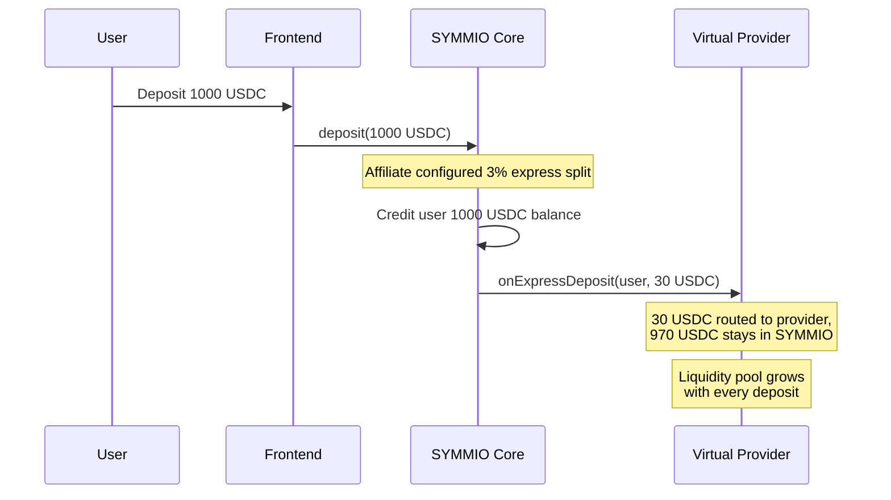
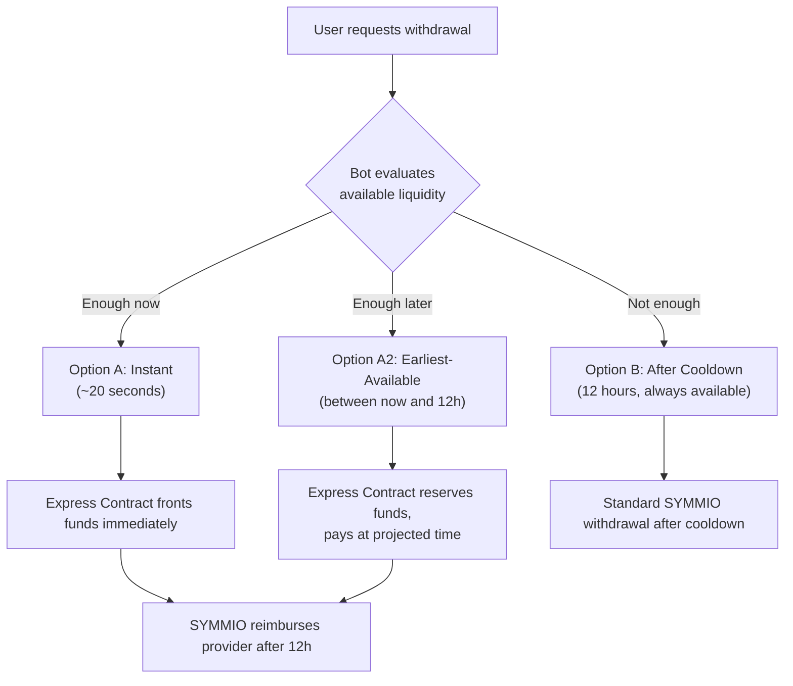
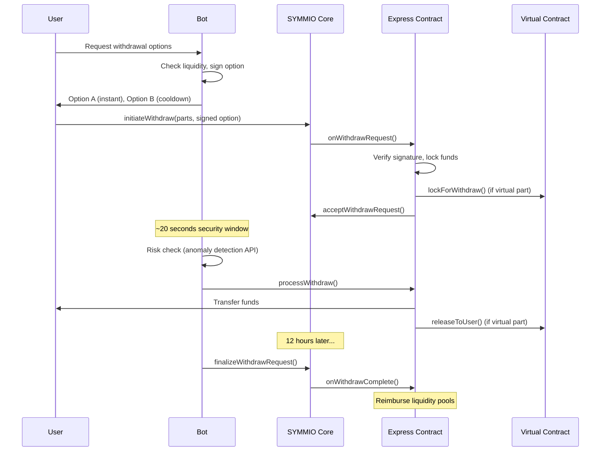

# Express Deposit & Withdrawal System

## The Problem

SYMMIO enforces a withdrawal cooldown (typically 12 hours from the user's last deallocation) to protect against attack vectors. While essential for security, this creates real friction -- users who need timely access to funds have no option but to wait. Frontends can't differentiate on withdrawal speed, and failed withdrawals due to insufficient contract balance lead to poor UX.

## What We Introduced in SYMMIO Core

v0.8.5 adds express deposit hooks and virtual provider integration into the core protocol. When a user deposits through an affiliate's frontend, the affiliate can configure a percentage (X%) of that deposit to be automatically routed to an external provider contract via the `onExpressDeposit` callback. This is built on top of the [Virtual Fund System](virtual-funds.md) -- the provider contract is registered as a virtual provider in SYMMIO and implements the `IVirtualProvider` lifecycle callbacks (`onExpressDeposit`, `onWithdrawRequest`, `onWithdrawComplete`, etc.).

The core protocol also adds the withdraw system hooks that let registered express providers accept, process, cancel, and finalize withdrawal requests through callbacks.

The deposit fee percentage is each affiliate's own decision and their own capital responsibility. SYMMIO core provides the mechanism, but the affiliate chooses what percentage to allocate. The protocol does not manage or guarantee these funds.

**What the core provides:**
- Express deposit splitting on the deposit path (configurable % per affiliate)
- Virtual provider registration and callback interface
- Express provider registration and withdraw lifecycle hooks (accept, complete, cancel, suspend)
- Withdraw request data field for passing signed options from providers

**What the core does NOT provide (not yet implemented):**
- The actual Express and Virtual provider contracts
- The off-chain bot
- Withdrawal option generation and signing

---

## The Future System: Express & Virtual Withdrawals

The hooks above are designed to enable a full Express and Virtual Withdrawal System that will give users fast access to their funds. Here's what that system will look like.

### Overview

An **Express Contract** and **Virtual Contract** will be deployed as the provider-side infrastructure. Together with an off-chain **Bot**, they will offer users up to three withdrawal options:

**Option A -- Instant (~20 seconds):** If enough liquidity exists right now across the Express and Virtual pools, the user gets funds almost immediately. The Express Contract fronts the money, and after the 12-hour cooldown completes, SYMMIO reimburses the provider.

**Option A2 -- Earliest-Available (between now and 12 hours):** When instant liquidity isn't sufficient but the Express Contract can project when enough funds will become available (based on other pending withdrawals finalizing), it offers the user a specific earlier payout time. A user might wait 2 hours instead of 12. The Express Contract uses a 12-bucket ring buffer representing hourly time slots to track expected inflows and reservations, preventing the same future liquidity from being promised twice.

**Option B -- After Cooldown (12 hours):** Always available as a guaranteed fallback. This is the standard SYMMIO withdrawal -- no provider capital needed.

The frontend shows the best available option. If instant is possible, show that. If not but earliest-available is, show that. Otherwise, fall back to the standard 12-hour flow.

### Instant Withdrawal Flow

### Components

**Express Contract** (one per chain): The main coordinator. Manages two types of liquidity pools -- a general pool available to all users, and per-frontend pools funded by frontend operators. Validates bot-signed withdrawal options, locks/reserves funds, and handles the full withdrawal lifecycle. For earliest-available withdrawals, the bucket-based scheduling ensures the same future liquidity can't be promised to multiple users.

**Virtual Contract** (one per chain per frontend): Holds the liquidity funded by the express deposit fee percentage. Locks funds when included in withdrawal requests, releases them to users on Express Contract instruction. Also serves as a fallback when SYMMIO's own contract balance is insufficient for a standard after-cooldown withdrawal.

**Bot** (one globally): Off-chain orchestrator that provides the withdrawal options API, signs options with replay-protected nonces, monitors events, performs risk assessment through an anomaly detection API, and schedules processing calls at the right times.

### Liquidity Priority

When constructing instant withdrawal options, the system will draw from pools in this order:
1. Express Contract frontend-specific balance (lowest system risk)
2. Virtual Contract frontend balance (auto-funded from deposits)
3. Express Contract general balance (system-wide fallback)

For after-cooldown withdrawals, SYMMIO's own balance is used first, with the Virtual Contract as fallback.

### Safety Guarantees

- **Permissionless fallback**: If the bot goes down, users can process their own withdrawals after a tolerance period. No one is ever permanently locked out of their funds.
- **Risk gating**: The bot checks an anomaly detection API before processing instant withdrawals. Flagged users get their withdrawal locked for admin review rather than auto-processed.
- **Replay protection**: Every signed option includes a per-user nonce consumed on-chain.
- **Option B always works**: The after-cooldown withdrawal is a guaranteed fallback regardless of provider state.

