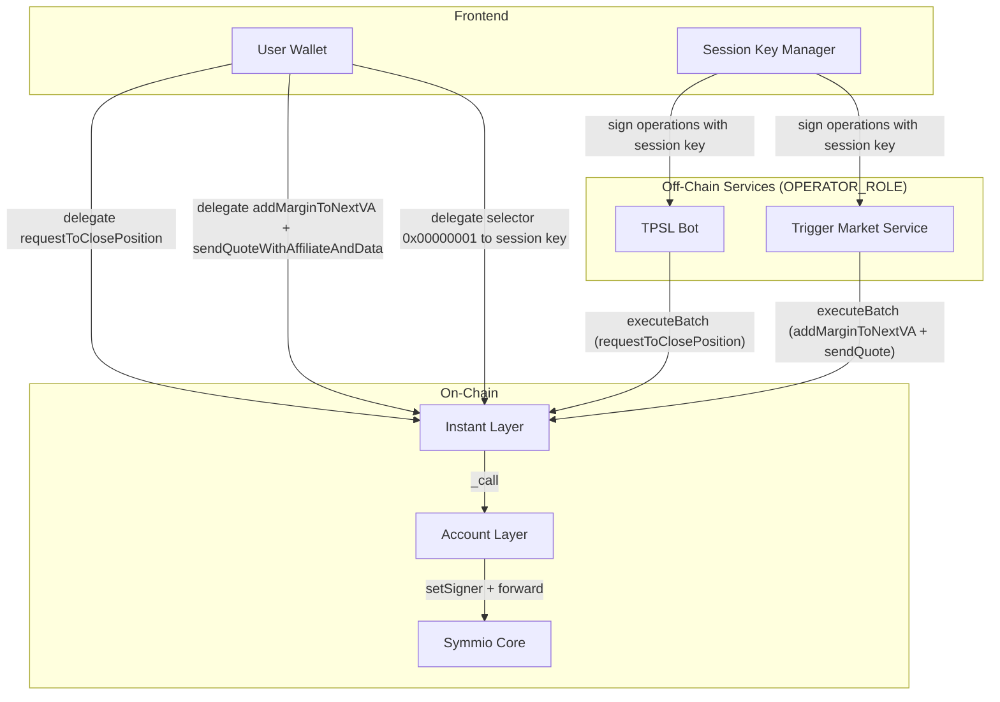
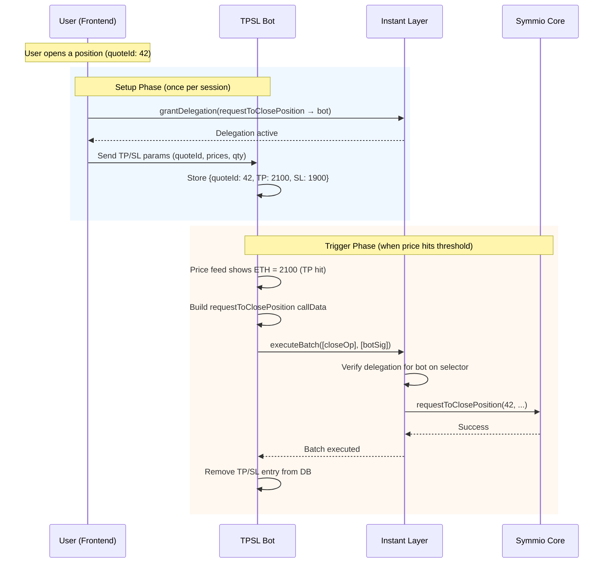
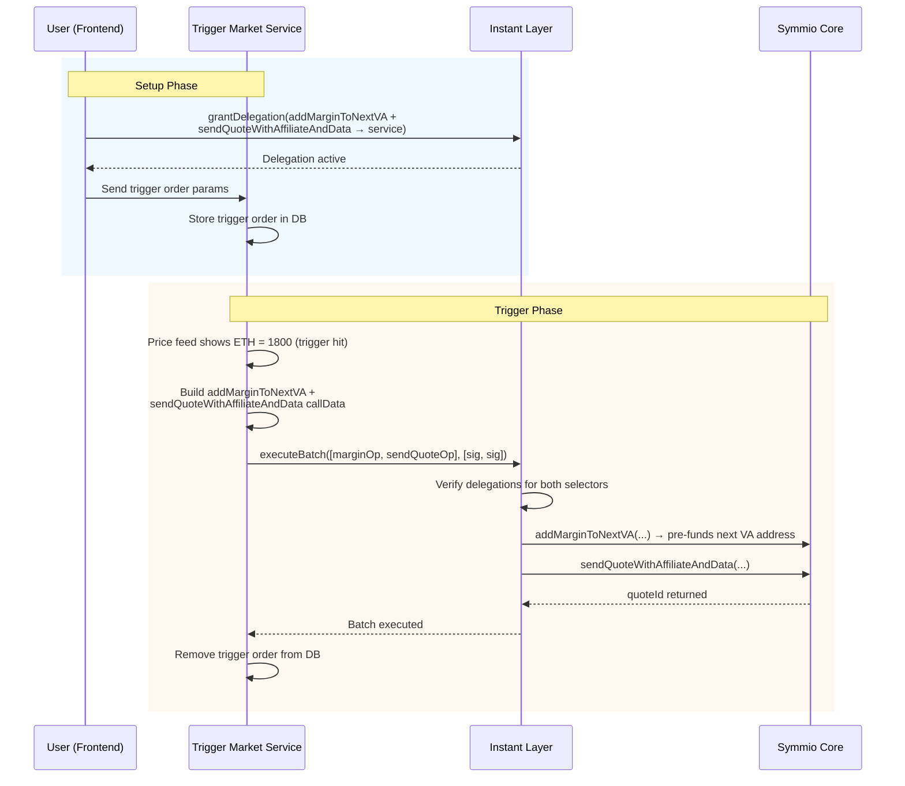
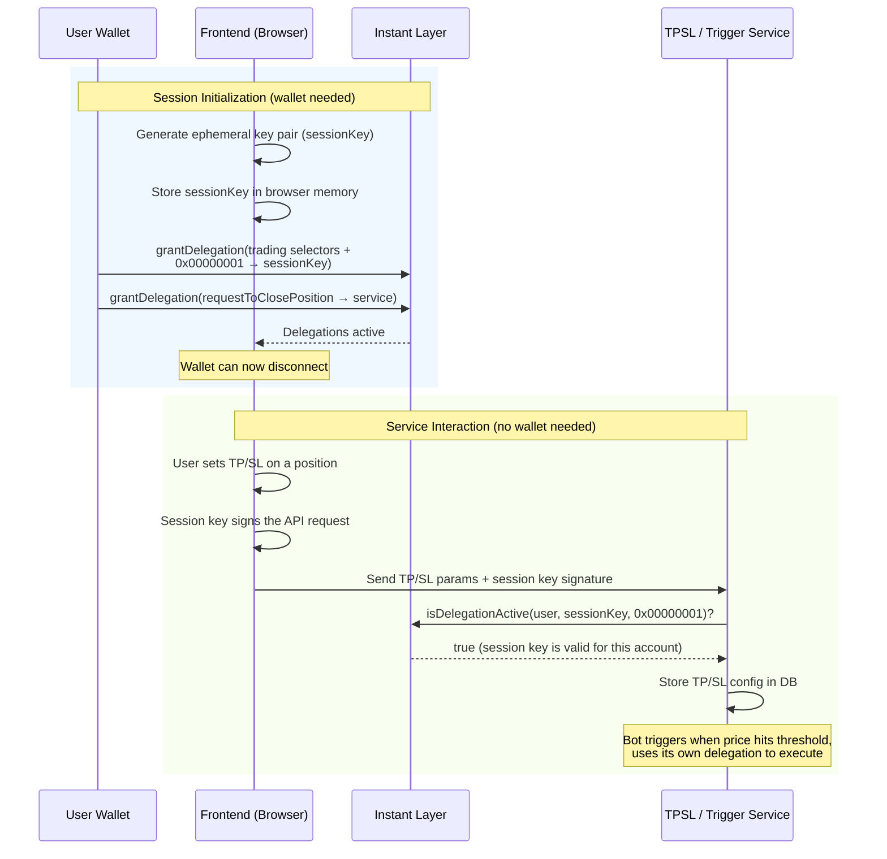
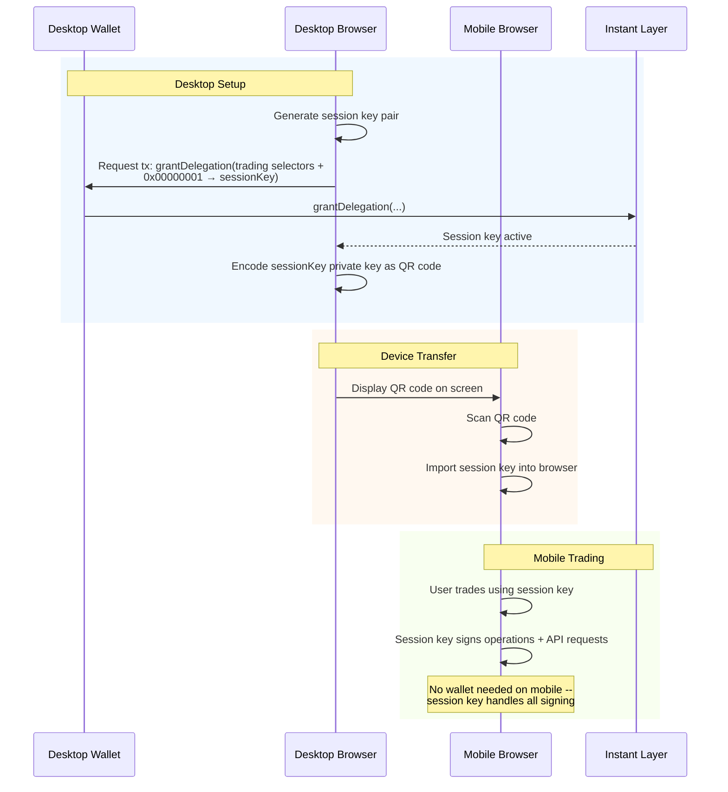
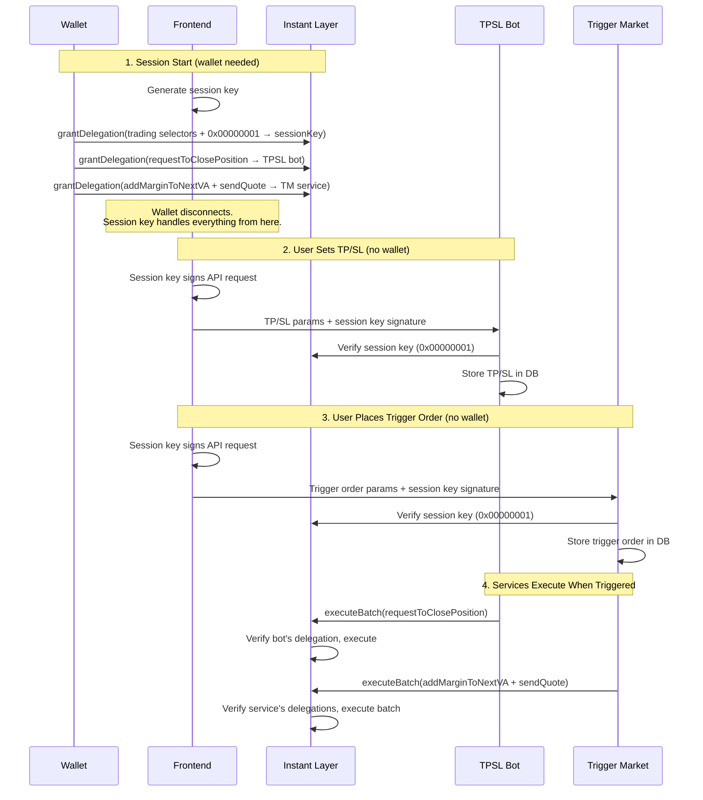

# Instant Layer Service Integration Guide

This guide covers how third-party services integrate with Symmio through the Instant Layer to provide **StopLoss/TakeProfit (TPSL)**, **Trigger Market Orders**, and **Session Key** functionality. It is intended for both frontend developers implementing the user-facing flows and backend developers building the services.

---

## Architecture Overview

Three services share a common pattern: the user delegates specific permissions via the Instant Layer, and an off-chain service acts on the user's behalf when conditions are met.



### Key Concept: Selector-Based Delegation

All three services rely on the Instant Layer's **delegation system**. A delegation grants a specific address permission to call specific functions on behalf of a user's trading account. Each delegation is scoped to one or more **function selectors** (the first 4 bytes of a function signature).

The delegation flow is always the same:
1. The user (or their session key) calls `grantDelegation` on the Instant Layer, specifying the delegate address, the allowed selectors, and an expiry timestamp
2. The delegated address can now sign operations for that user, and submit them via `executeBatch`
3. InstantLayer verifies the delegation is active for the specific function selector being called

Delegations have an **expiry timestamp** enforced on-chain and can be **revoked** through a two-step cooldown process.

### Selectors Used

| Function | Selector | Used By | Target Contract |
|---|---|---|---|
| `requestToClosePosition` | `0xeaa31b19` | TPSL Bot | Symmio Core |
| `sendQuoteWithAffiliateAndData` | `0x1e5efc6c` | Trigger Market Service | Symmio Core |
| `addMarginToNextVA` | `0xa6d66852` | Trigger Market Service | AccountLayer |
| Session Key Convention | `0x00000001` | All services (off-chain) | N/A |

---

## 1. StopLoss / TakeProfit (TPSL) Bot

The TPSL bot monitors price feeds and automatically closes user positions when stop-loss or take-profit thresholds are hit.

### How It Works

The user opens a position through the normal trading flow. Then, on the frontend, they configure TP/SL parameters for that position. At this point:

1. **Frontend** calls `grantDelegation` on the Instant Layer, granting `requestToClosePosition` to the TPSL bot's signer address
2. **Frontend** sends the TP/SL parameters (quote ID, TP price, SL price, quantity) to the bot's API
3. **Bot** stores the TP/SL config in its database
4. **Bot** continuously monitors price feeds. When a threshold is hit, it constructs a `requestToClosePosition` call, signs it with its own key, and submits it via `executeBatch`
5. InstantLayer verifies the bot has an active delegation for the `requestToClosePosition` selector on the user's account, then executes the call

The bot acts on the user's behalf but can **only** call `requestToClosePosition` -- the delegation is scoped to that single selector.

### Flow Diagram



### Important Details

- The bot's signer address goes in the `signer` field of the operation. The user's trading account goes in `signerAccount.addr`. InstantLayer checks that the bot has a delegation from the user's account for the specific selector.
- The bot uses **salt-only mode** (`nonce: 0`) with unique salts, since trigger timing is non-deterministic.
- The delegation expiry should be aligned with the user's session or a reasonable window (e.g., 24 hours).

---

## 2. Trigger Market Orders

The Trigger Market service allows users to place conditional orders (e.g., "buy ETH-PERP if price drops to 1800") that execute as market orders when the trigger price is reached.

### How It Works

This frontend uses **virtual accounts** -- each quote is sent from a dedicated virtual account. This means the service needs to do two things when triggered: pre-fund the next virtual account address with margin, then send the quote (which creates the VA and executes from it). Both happen in a single atomic batch.

1. **Frontend** calls `grantDelegation` on the Instant Layer, granting **two selectors** to the service: `addMarginToNextVA` (to pre-fund the next virtual account with margin from the sub-account) and `sendQuoteWithAffiliateAndData` (to send the quote)
2. **Frontend** sends the trigger order parameters to the service's API
3. **Service** stores the trigger order in its database
4. **Service** monitors price feeds. When the trigger price is reached, it batches **two operations** into a single `executeBatch` call:
   - **Operation 1**: `addMarginToNextVA` on AccountLayer -- transfers margin from the user's sub-account to the predicted next virtual account address
   - **Operation 2**: `sendQuoteWithAffiliateAndData` on Symmio Core -- sends the quote from that virtual account
5. InstantLayer verifies the service has active delegations for **both** selectors, then executes both calls atomically

> **Why two operations?** `addMarginToNextVA` pre-funds the predicted next virtual account address by transferring margin from the sub-account. The subsequent `sendQuoteWithAffiliateAndData` then triggers the actual VA creation (based on the sub-account's isolation type) and sends the quote from it. Without the pre-funding step, the newly created VA would have no margin to trade with.

### Flow Diagram



### Important Details

- The two operations target **different contracts**: `addMarginToNextVA` targets the AccountLayer, `sendQuoteWithAffiliateAndData` targets Symmio Core. Both are whitelisted targets.
- The `signerAccount.addr` differs between the two operations: the margin operation uses the sub-account, the send-quote operation uses the virtual account address.
- The service needs to know the virtual account address in advance (it is deterministic -- the "next VA" for a given sub-account).
- The service calculates margin values (cva, lf, partyAmm, partyBmm) based on the user's leverage, quantity, and symbol configuration, and fetches the Muon UPNL signature at execution time.

---

## 3. Session Keys

Session keys allow users to trade without signing every transaction with their main wallet. A temporary key pair is generated in the browser, the user delegates access to it via a single wallet signature, and all subsequent operations are signed by the session key -- no wallet popups needed.

### The Convention: Selector `0x00000001`

The Instant Layer's delegation system is selector-based -- each delegation grants permission for specific function selectors. Session keys exploit this by using a **predefined non-functional selector** as an opt-in signal:

```
SESSION_KEY_SELECTOR = 0x00000001
```

**Why this works:**
- `0x00000001` does not correspond to any real function selector on Symmio or AccountLayer
- It cannot be used in an `executeBatch` call (no function has this selector)
- It serves purely as an **off-chain convention**: if a user has delegated `0x00000001` to an address, services treat that address as an authorized session key
- The delegation is fully on-chain and verifiable -- anyone can call `isDelegationActive(user, sessionKey, 0x00000001)` to confirm

### How It Works

**Session initialization (one wallet transaction):**

1. Frontend generates an ephemeral key pair (the "session key") and stores it in browser memory
2. User calls `grantDelegation` on the Instant Layer, granting the **trading selectors** (`requestToClosePosition`, `addMarginToNextVA`, `sendQuoteWithAffiliateAndData`) AND `0x00000001` to the session key address, with a time-bound expiry (e.g., 24 hours)
3. User also grants delegations to the services they want to use (TPSL bot gets `requestToClosePosition`, Trigger Market gets `addMarginToNextVA` + `sendQuoteWithAffiliateAndData`) -- these are separate `grantDelegation` calls from the wallet
4. The wallet can now disconnect.

**Direct trading (session key signs operations):**

5. When the user wants to trade directly, the session key signs the operation (e.g., `sendQuoteWithAffiliateAndData`) and the frontend sends it to an operator for submission via `executeBatch`. No wallet interaction needed.

**Authenticating with services (the `0x00000001` trick):**

6. The TPSL bot and Trigger Market service already have their own delegations from step 3. But when a user submits a TP/SL or trigger order to a service's API, the service needs to verify that the requester actually controls this account.
7. Instead of requiring a wallet signature for API authentication, the user signs the API request with their **session key**.
8. The service checks `isDelegationActive(userAccount, sessionKeyAddress, 0x00000001)` on-chain. If active, the session key is authorized for that account, and the request is accepted.
9. When the trigger condition is met, the service uses **its own delegation** (from step 3) to execute the on-chain operation.

**What services check:** When a service receives a request signed by address X for account Y:
1. Is X the account owner? If yes, proceed.
2. If not, does Y have an active delegation of `0x00000001` to X? (session key check)
3. If yes, X is an authorized session key for Y -- accept the request.

### Flow Diagram: Desktop Session Key



### Flow Diagram: Cross-Device via QR Code

A powerful use case is transferring a session to another device (e.g., desktop to mobile) without needing the wallet on the second device.

1. Desktop generates a session key and activates it on-chain (as above)
2. Desktop encodes the session key's private key as a QR code
3. Mobile scans the QR code and imports the session key
4. Mobile can now trade using the session key -- no wallet app needed on mobile



---

## Putting It All Together

A typical user session combines all three features. Here is the complete end-to-end flow:



---

## Security Considerations

### Session Keys

- **Expiry**: Always set a reasonable expiry on session key delegations (e.g., 24 hours). The delegation's `expiryTimestamp` is enforced on-chain.
- **Storage**: Prefer `sessionStorage` (cleared on tab close) over `localStorage` for session keys. Never store in cookies.
- **Rotation**: Generate a new session key each session. Do not reuse keys across sessions.
- **QR transfer**: The QR code contains the raw private key. Display it only briefly and warn users not to screenshot it.
- **Revocation**: If a session key is compromised, the user can revoke it via `initiateRevokeDelegation` + `finalizeRevokeDelegation` (subject to the revocation cooldown period).

### Service Delegations

- **Minimal selectors**: Only delegate the exact selectors a service needs. The TPSL bot only needs `requestToClosePosition`. The Trigger Market service needs `sendQuoteWithAffiliateAndData` + `addMarginToNextVA`.
- **Expiry**: Set reasonable expiry timestamps on service delegations. Services receive their delegations directly from the user's wallet during session setup.
- **Operator trust**: Services hold `OPERATOR_ROLE` and can submit batches. The delegation system ensures they can only call functions they have been explicitly authorized for, but users should still only delegate to trusted services.

### Replay Protection

- Services should always use salt-only mode (`nonce: 0`) with unique salts for triggered operations, since the execution order is non-deterministic (depends on which price threshold is hit first).

---

## Implementation Reference

This section contains the EIP-712 types, helper functions, and code examples needed to implement the flows described above.

### Common Configuration

#### EIP-712 Domain and Operation Types

These are needed for signing operations that services submit via `executeBatch`:

```typescript
import { randomBytes } from "crypto"

const domain = {
  name: "SymmioInstantLayer",
  version: "1",
  chainId: chainId,
  verifyingContract: instantLayerAddress,
}

const operationTypes = {
  Account: [
    { name: "addr", type: "address" },
    { name: "isPartyB", type: "bool" },
  ],
  ReplayAttackHeader: [
    { name: "nonce", type: "uint256" },
    { name: "deadline", type: "uint256" },
    { name: "salt", type: "bytes32" },
  ],
  SignedOperation: [
    { name: "signer", type: "address" },
    { name: "target", type: "address" },
    { name: "callData", type: "bytes" },
    { name: "signerAccount", type: "Account" },
    { name: "replayAttackHeader", type: "ReplayAttackHeader" },
  ],
}

function generateSalt(): string {
  return "0x" + randomBytes(32).toString("hex")
}
```

#### Granting Delegation

`grantDelegation` is a direct transaction called by the account owner (or session key). No EIP-712 signing is needed -- the caller's identity is verified on-chain via `msg.sender`.

```typescript
async function grantDelegationTo(
  signer: ethers.Signer,    // account owner or session key
  userAccount: string,
  delegateTo: string,
  selectors: string[],
  expiryTimestamp: number,
) {
  await instantLayer.connect(signer).grantDelegation({
    account: { addr: userAccount, isPartyB: false },
    delegatedSigner: delegateTo,
    selectors: selectors,
    expiryTimestamp: expiryTimestamp,
  })
}
```

### TPSL Bot

#### Frontend: Delegate and Submit TP/SL

```typescript
const REQUEST_TO_CLOSE_SELECTOR = "0xeaa31b19"

async function setupTPSL(
  signer: ethers.Signer,      // user's wallet or session key
  userAccount: string,
  botSignerAddress: string,
  expiryTimestamp: number,
  quoteId: number,
  takeProfitPrice: bigint | null,
  stopLossPrice: bigint | null,
  quantityToClose: bigint,
) {
  // 1. Grant delegation on-chain
  await grantDelegationTo(
    signer,
    userAccount,
    botSignerAddress,
    [REQUEST_TO_CLOSE_SELECTOR],
    expiryTimestamp,
  )

  // 2. Send TP/SL params to bot API
  await fetch(`${TPSL_BOT_URL}/api/tpsl`, {
    method: "POST",
    headers: { "Content-Type": "application/json" },
    body: JSON.stringify({
      quoteId,
      userAccount,
      takeProfitPrice: takeProfitPrice?.toString(),
      stopLossPrice: stopLossPrice?.toString(),
      quantityToClose: quantityToClose.toString(),
    }),
  })
}
```

#### Backend: Trigger Close

```typescript
async function triggerClose(entry: TPSLEntry, triggerPrice: bigint) {
  const symmioInterface = new ethers.Interface([
    "function requestToClosePosition(uint256 quoteId, uint256 closePrice, uint256 quantityToClose, uint8 orderType, uint256 deadline)",
  ])

  const deadline = Math.floor(Date.now() / 1000) + 300
  const callData = symmioInterface.encodeFunctionData(
    "requestToClosePosition",
    [entry.quoteId, triggerPrice, entry.quantityToClose, 1, deadline], // 1 = MARKET
  )

  const operation = {
    signer: botSignerAddress,
    target: symmioCoreAddress,
    callData: callData,
    signerAccount: { addr: entry.userAccount, isPartyB: false },
    replayAttackHeader: {
      nonce: 0n,
      deadline: BigInt(deadline),
      salt: generateSalt(),
    },
  }

  const signature = await botSigner.signTypedData(
    domain,
    operationTypes,
    operation,
  )

  await instantLayer.executeBatch([operation], [signature])
}
```

### Trigger Market Service

#### Frontend: Delegate and Submit Trigger Order

```typescript
const SEND_QUOTE_SELECTOR = "0x1e5efc6c"
const ADD_MARGIN_TO_NEXT_VA_SELECTOR = "0xa6d66852"

async function setupTriggerOrder(
  signer: ethers.Signer,      // user's wallet or session key
  userAccount: string,
  serviceSignerAddress: string,
  expiryTimestamp: number,
  symbolId: number,
  positionType: number,       // 0 = LONG, 1 = SHORT
  triggerPrice: bigint,
  quantity: bigint,
  leverage: number,
  partyBsWhiteList: string[],
  affiliate: string,
) {
  // 1. Grant delegation on-chain (both selectors in one call)
  await grantDelegationTo(
    signer,
    userAccount,
    serviceSignerAddress,
    [SEND_QUOTE_SELECTOR, ADD_MARGIN_TO_NEXT_VA_SELECTOR],
    expiryTimestamp,
  )

  // 2. Send trigger order params to service API
  await fetch(`${TRIGGER_SERVICE_URL}/api/trigger-order`, {
    method: "POST",
    headers: { "Content-Type": "application/json" },
    body: JSON.stringify({
      userAccount,
      symbolId,
      positionType,
      triggerPrice: triggerPrice.toString(),
      quantity: quantity.toString(),
      leverage,
      partyBsWhiteList,
      affiliate,
    }),
  })
}
```

#### Backend: Trigger the Batched Quote

```typescript
async function triggerSendQuote(order: TriggerOrder) {
  const accountLayerInterface = new ethers.Interface([
    "function addMarginToNextVA(address subAccount, uint8 isolationType, uint256 symbolId, uint256 amount)",
  ])

  const symmioInterface = new ethers.Interface([
    "function sendQuoteWithAffiliateAndData(address[],uint256,uint8,uint8,uint256,uint256,uint256,uint256,uint256,uint256,uint256,address,(bytes,uint256,int256,uint256),(bytes32,uint8,uint16,uint256[]))",
  ])

  const deadline = Math.floor(Date.now() / 1000) + 300

  // --- Operation 1: Pre-fund next virtual account with margin ---
  const marginCallData = accountLayerInterface.encodeFunctionData(
    "addMarginToNextVA",
    [
      order.subAccount,           // user's sub-account
      order.isolationType,        // VirtualAccountIsolationType (0=CROSS, 1=ISOLATED)
      order.symbolId,
      order.marginAmount,         // total margin to allocate
    ],
  )

  const marginOp = {
    signer: serviceSignerAddress,
    target: accountLayerAddress,  // AccountLayer, not Symmio core
    callData: marginCallData,
    signerAccount: { addr: order.subAccount, isPartyB: false },
    replayAttackHeader: {
      nonce: 0n,
      deadline: BigInt(deadline),
      salt: generateSalt(),
    },
  }

  // --- Operation 2: Send quote from the new virtual account ---
  const sendQuoteCallData = symmioInterface.encodeFunctionData(
    "sendQuoteWithAffiliateAndData",
    [
      order.partyBsWhiteList,
      order.symbolId,
      order.positionType,
      1,                          // OrderType.MARKET
      order.triggerPrice,
      order.quantity,
      order.cva,                  // calculated by service
      order.lf,                   // calculated by service
      order.partyAmm,             // calculated by service
      order.partyBmm,             // calculated by service
      deadline,
      order.affiliate,
      order.upnlSig,              // Muon signature (fetched by service)
      order.data,                 // custom quote data
    ],
  )

  const sendQuoteOp = {
    signer: serviceSignerAddress,
    target: symmioCoreAddress,
    callData: sendQuoteCallData,
    signerAccount: { addr: order.virtualAccount, isPartyB: false },
    replayAttackHeader: {
      nonce: 0n,
      deadline: BigInt(deadline),
      salt: generateSalt(),
    },
  }

  // Sign both operations
  const marginSig = await serviceSigner.signTypedData(
    domain, operationTypes, marginOp,
  )
  const sendQuoteSig = await serviceSigner.signTypedData(
    domain, operationTypes, sendQuoteOp,
  )

  // Execute as a batch -- addMarginToNextVA first, then sendQuote
  await instantLayer.executeBatch(
    [marginOp, sendQuoteOp],
    [marginSig, sendQuoteSig],
  )
}
```

### Session Keys

#### Frontend: Generate, Activate, and Transfer

```typescript
import { ethers } from "ethers"

const SESSION_KEY_SELECTOR = "0x00000001"

interface SessionKey {
  address: string
  privateKey: string
  createdAt: number
  expiresAt: number
}

// --- Generate ---

function generateSessionKey(expiryHours: number = 24): SessionKey {
  const wallet = ethers.Wallet.createRandom()
  const now = Math.floor(Date.now() / 1000)
  return {
    address: wallet.address,
    privateKey: wallet.privateKey,
    createdAt: now,
    expiresAt: now + expiryHours * 3600,
  }
}

function storeSessionKey(sessionKey: SessionKey) {
  sessionStorage.setItem("symmio_session_key", JSON.stringify(sessionKey))
}

function getSessionKey(): SessionKey | null {
  const stored = sessionStorage.getItem("symmio_session_key")
  if (!stored) return null
  const key = JSON.parse(stored) as SessionKey
  if (key.expiresAt < Math.floor(Date.now() / 1000)) {
    sessionStorage.removeItem("symmio_session_key")
    return null
  }
  return key
}

// --- Activate on-chain (requires wallet tx) ---

const REQUEST_TO_CLOSE_SELECTOR = "0xeaa31b19"
const SEND_QUOTE_SELECTOR = "0x1e5efc6c"
const ADD_MARGIN_TO_NEXT_VA_SELECTOR = "0xa6d66852"

async function activateSessionKey(
  userSigner: ethers.Signer,   // user's main wallet
  userAccount: string,
  sessionKey: SessionKey,
) {
  // Grant trading selectors + session key convention to the session key
  await grantDelegationTo(
    userSigner,
    userAccount,
    sessionKey.address,
    [
      SESSION_KEY_SELECTOR,              // 0x00000001 -- off-chain auth convention
      REQUEST_TO_CLOSE_SELECTOR,         // for direct close operations
      SEND_QUOTE_SELECTOR,               // for direct open operations
      ADD_MARGIN_TO_NEXT_VA_SELECTOR,    // for pre-funding VAs
    ],
    sessionKey.expiresAt,
  )
}

// --- Sign API requests with session key (for service authentication) ---

async function signServiceRequest(
  sessionKey: SessionKey,
  payload: object,
): Promise<{ signature: string; signerAddress: string }> {
  const sessionSigner = new ethers.Wallet(sessionKey.privateKey)
  const message = JSON.stringify(payload)
  const signature = await sessionSigner.signMessage(message)
  return { signature, signerAddress: sessionKey.address }
}

// --- QR code for cross-device transfer ---

import QRCode from "qrcode"

async function generateSessionQR(sessionKey: SessionKey): Promise<string> {
  const payload = JSON.stringify({
    pk: sessionKey.privateKey,
    account: userAccount,
    chain: chainId,
    il: instantLayerAddress,
    exp: sessionKey.expiresAt,
  })
  return await QRCode.toDataURL(payload)
}

function importSessionFromQR(scannedData: string): SessionKey {
  const payload = JSON.parse(scannedData)
  return {
    address: new ethers.Wallet(payload.pk).address,
    privateKey: payload.pk,
    createdAt: Math.floor(Date.now() / 1000),
    expiresAt: payload.exp,
  }
}
```

#### Backend: Verifying Session Keys

```typescript
async function isValidSessionKey(
  userAccount: string,
  sessionKeyAddress: string,
): Promise<boolean> {
  return await instantLayer.isDelegationActive(
    userAccount,
    sessionKeyAddress,
    SESSION_KEY_SELECTOR,
  )
}

async function authenticateRequest(
  userAccount: string,
  message: string,
  signature: string,
): Promise<void> {
  // Recover the signer from the signed API request
  const signerAddress = ethers.verifyMessage(message, signature)

  // Check: is the signer the account owner?
  const owner = await accountLayer.ownerOf(userAccount)
  if (signerAddress === owner) return // authorized

  // Check: is the signer a valid session key for this account?
  const isSession = await isValidSessionKey(userAccount, signerAddress)
  if (isSession) return // authorized via session key

  throw new Error("Unauthorized: not account owner or valid session key")
}

async function handleTPSLRequest(req: Request) {
  const { userAccount, message, signature, ...params } = req.body

  // Verify the request came from the account owner or their session key
  await authenticateRequest(userAccount, message, signature)

  // Authenticated -- store TP/SL config in database.
  // When triggered, the bot uses its own delegation to execute on-chain.
}
```

---

## Related Documentation

- [Instant Layer Overview](./instant-layer-overview.md) -- Core architecture and concepts
- [Instant Layer PartyB Integration](./instant-layer-partyb-integration.md) -- PartyB-specific integration guide
