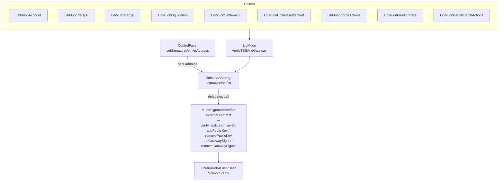

# Muon Signature Verification and Key Management

SYMMIO relies on the Muon oracle network to provide off-chain data that is verified on-chain: unrealized PnL, asset prices, liquidation parameters, and settlement values. Every state-changing operation that depends on external market data passes through the Muon signature verification layer. This document covers the external `MuonSignatureVerifier` contract, how it replaced the original single-key storage fields, and the Schnorr-based verification flow that underpins every critical protocol operation.

## Why This Exists

In the original design, SYMMIO stored a single Muon public key and a single valid gateway address directly in `MuonStorage` inside the diamond. This had three problems:

1. **Single point of failure.** If the sole Muon TSS key was compromised, every signature check in the protocol was compromised. There was no way to have redundant keys.

2. **Key rotation required contract changes.** Rotating the Muon public key or gateway signer meant calling `setMuonConfig` on the diamond, coordinating the cutover, and accepting a window where either the old or new key could be invalid.

3. **No decentralized signer set.** The Muon network itself uses threshold signature schemes (TSS) where the signing committee can change over time. A single on-chain key cannot represent a rotating committee.

The `MuonSignatureVerifier` contract solves all three by externalizing key management into a standalone contract that supports multiple public keys and multiple gateway signers, with independent add/remove operations.

## Architecture Overview



## The IMuonSignatureVerifier Interface

The interface defines two categories of operations -- signature verification and key management -- plus two data structures:

```solidity
// contracts/core/interfaces/IMuonSignatureVerifier.sol

interface IMuonSignatureVerifier {
    struct PublicKey {
        uint256 x;
        uint8 parity;
    }

    struct SchnorrSign {
        uint256 signature;
        address owner;
        address nonce;
    }

    // === Signature Verification ===
    function verify(bytes32 hash, SchnorrSign memory sign, bytes calldata gatewaySignature) external view;

    // === Public Key Management ===
    function addPublicKey(PublicKey memory pubKey) external;
    function removePublicKey(PublicKey memory pubKey) external;
    function getAllPublicKeys() external view returns (PublicKey[] memory);

    // === Gateway Signer Management ===
    function addGatewaySigner(address signer) external;
    function removeGatewaySigner(address signer) external;
    function getAllGatewaySigners() external view returns (address[] memory);
}
```

**PublicKey** represents a compressed secp256k1 public key. The `x` coordinate must be less than `HALF_Q` (half the group order), a constraint imposed by the Schnorr verification's use of `ecrecover`. The `parity` byte (0 or 1) indicates whether the y coordinate is even or odd.

**SchnorrSign** carries the Schnorr signature components: the `signature` scalar (called `s` in the math), the `owner` field (unused in verification but part of the Muon protocol envelope), and the `nonce` field which is the Ethereum address derived from the nonce point `k*G`.

## The MuonSignatureVerifier Contract

The concrete implementation lives at `contracts/helpers/verification/SymmioSignatureVerifier.sol` and is deployed as an independent contract (not part of the diamond). It uses OpenZeppelin's `AccessControlEnumerable` for role-based access:

```solidity
// contracts/helpers/verification/SymmioSignatureVerifier.sol

contract MuonSignatureVerifier is IMuonSignatureVerifier, AccessControlEnumerable {
    using ECDSA for bytes32;

    bytes32 public constant SETTER_ROLE = keccak256("SETTER_ROLE");

    PublicKey[] public publicKeys;
    address[] public gatewaySigners;

    constructor(address _admin) {
        _setupRole(DEFAULT_ADMIN_ROLE, _admin);
        _setupRole(SETTER_ROLE, _admin);
    }

    // ...
}
```

### Verification Logic

The `verify` function performs two independent checks. Both must pass or the call reverts:

```solidity
function verify(bytes32 hash, SchnorrSign memory sign, bytes memory gatewaySignature) external view {
    // 1. Verify TSS (Threshold Signature Scheme) via Schnorr
    bool verifiedTSS = false;
    for (uint256 i = 0; i < publicKeys.length; i++) {
        if (LibMuonV04ClientBase.muonVerify(uint256(hash), sign, publicKeys[i])) {
            verifiedTSS = true;
            break;
        }
    }
    require(verifiedTSS, "MuonSignatureVerifier: TSS not verified");

    // 2. Verify Gateway Signature (ECDSA)
    address signer = hash.toEthSignedMessageHash().recover(gatewaySignature);
    bool gatewayVerified = false;
    for (uint256 i = 0; i < gatewaySigners.length; i++) {
        if (signer == gatewaySigners[i]) {
            gatewayVerified = true;
            break;
        }
    }
    require(gatewayVerified, "MuonSignatureVerifier: Gateway is not valid");
}
```

**TSS check**: iterates over all registered public keys and attempts Schnorr verification against each one. If any key validates the signature, the check passes. This is what enables key rotation -- the old key and new key can coexist during a transition period.

**Gateway check**: recovers the ECDSA signer from a standard Ethereum signed message and checks it against the registered gateway signers list. The gateway is the Muon network node that relayed the TSS-signed data to the user. This second signature prevents a compromised TSS key from being exploited without also compromising a gateway node.

### Key Management Functions

All management functions require `SETTER_ROLE`:

```solidity
function addPublicKey(PublicKey memory pubKey) external onlyRole(SETTER_ROLE) {
    publicKeys.push(pubKey);
    emit PublicKeyAdded(pubKey.x, pubKey.parity);
}

function removePublicKey(PublicKey memory pubKey) external onlyRole(SETTER_ROLE) {
    for (uint256 i = 0; i < publicKeys.length; i++) {
        if (publicKeys[i].x == pubKey.x && publicKeys[i].parity == pubKey.parity) {
            publicKeys[i] = publicKeys[publicKeys.length - 1];
            publicKeys.pop();
            break;
        }
    }
    emit PublicKeyRemoved(pubKey.x, pubKey.parity);
}
```

Removal uses the swap-and-pop pattern for gas efficiency. The same pattern applies to `addGatewaySigner` / `removeGatewaySigner`.

Key rotation procedure:
1. Call `addPublicKey` with the new TSS committee's public key.
2. Both old and new keys now validate signatures -- no downtime.
3. Once all Muon nodes have switched to the new key, call `removePublicKey` on the old key.
4. Same process applies independently for gateway signers.
