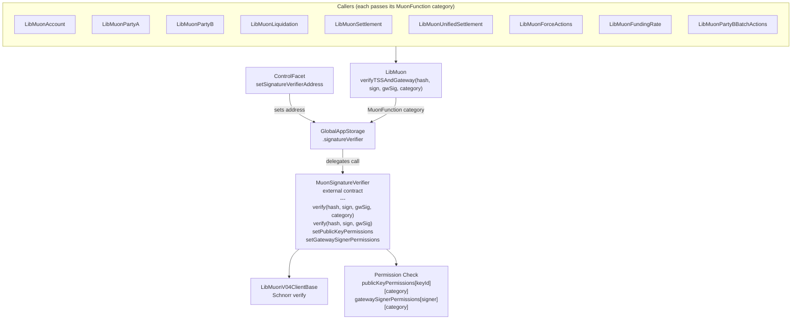

# Muon Signature Verification and Key Management

SYMMIO relies on the Muon oracle network to provide off-chain data that is verified on-chain: unrealized PnL, asset prices, liquidation parameters, and settlement values. Every state-changing operation that depends on external market data passes through the Muon signature verification layer. This document covers the external `MuonSignatureVerifier` contract, how it replaced the original single-key storage fields, the Schnorr-based verification flow that underpins every critical protocol operation, and the per-category authorization system that controls which keys can sign for which operations.

## Why This Exists

In the original design, SYMMIO stored a single Muon public key and a single valid gateway address directly in `MuonStorage` inside the diamond. This had three problems:

1. **Single point of failure.** If the sole Muon TSS key was compromised, every signature check in the protocol was compromised. There was no way to have redundant keys.

2. **Key rotation required contract changes.** Rotating the Muon public key or gateway signer meant calling `setMuonConfig` on the diamond, coordinating the cutover, and accepting a window where either the old or new key could be invalid.

3. **No decentralized signer set.** The Muon network itself uses threshold signature schemes (TSS) where the signing committee can change over time. A single on-chain key cannot represent a rotating committee.

4. **No function-level isolation.** Every registered key could sign for every operation -- liquidations, quote locking, funding rate charges, and settlements all shared the same trust set. A compromised key authorized for routine operations could also sign liquidation data.

The `MuonSignatureVerifier` contract solves all four by externalizing key management into a standalone contract that supports multiple public keys and multiple gateway signers, with independent add/remove operations and per-category authorization.

## Architecture Overview



## The IMuonSignatureVerifier Interface

The interface defines three categories of operations -- signature verification, key management, and per-category authorization -- plus two data structures and an operation category enum:

```solidity
// contracts/core/interfaces/IMuonSignatureVerifier.sol

enum MuonFunction {
    Trading,           // SendQuote, LockQuote, OpenPosition, FillCloseRequest, etc.
    AccountManagement, // Deallocate, SafeDeallocate, DeallocateForPartyB, TransferAllocation
    Settlement,        // SettleUpnl, SettleUpnlUnified
    ForceClose,        // ForceClose, InitializeForceClose, SettleUpnlForForceClose, etc.
    Funding,           // ChargeFundingRate, ChargeAccumulatedFundingFee
    LiquidationPartyA, // LiquidatePartyA, SetSymbolsPrice, DeferredLiquidatePartyA, DeferredSetSymbolsPrice
    LiquidationPartyB  // LiquidatePartyB, LiquidatePositionsPartyB
}

interface IMuonSignatureVerifier {
    struct PublicKey {
        uint256 x;
        uint8 parity;
    }

    struct SchnorrSign {
        uint256 signature;
        address owner;
        address nonce;
    }

    // === Signature Verification ===
    function verify(bytes32 hash, SchnorrSign memory sign, bytes calldata gatewaySignature, MuonFunction func) external view;
    function verify(bytes32 hash, SchnorrSign memory sign, bytes calldata gatewaySignature) external view; // no authorization check

    // === Public Key Management ===
    function addPublicKey(PublicKey memory pubKey) external;
    function removePublicKey(PublicKey memory pubKey) external;
    function getAllPublicKeys() external view returns (PublicKey[] memory);

    // === Gateway Signer Management ===
    function addGatewaySigner(address signer) external;
    function removeGatewaySigner(address signer) external;
    function getAllGatewaySigners() external view returns (address[] memory);

    // === Per-Function Authorization ===
    function setPublicKeyPermissions(PublicKey memory pubKey, MuonFunction[] calldata functions, bool allowed) external;
    function setGatewaySignerPermissions(address signer, MuonFunction[] calldata functions, bool allowed) external;
    function isPublicKeyAuthorized(PublicKey memory pubKey, MuonFunction func) external view returns (bool);
    function isGatewaySignerAuthorized(address signer, MuonFunction func) external view returns (bool);
}
```

The `MuonFunction` enum is defined at file level (not inside the interface) so it can be imported independently. Each enum value represents a category of related operations. The `verify` overload without `MuonFunction` skips authorization checks -- it is used by the ViewFacet's `verifyMuonTSSAndGateway` which is a read-only utility that doesn't need permission gating.

**PublicKey** represents a compressed secp256k1 public key. The `x` coordinate must be less than `HALF_Q` (half the group order), a constraint imposed by the Schnorr verification's use of `ecrecover`. The `parity` byte (0 or 1) indicates whether the y coordinate is even or odd.

**SchnorrSign** carries the Schnorr signature components: the `signature` scalar (called `s` in the math), the `owner` field (unused in verification but part of the Muon protocol envelope), and the `nonce` field which is the Ethereum address derived from the nonce point `k*G`.

## The MuonSignatureVerifier Contract

The concrete implementation lives at `contracts/helpers/verification/SymmioSignatureVerifier.sol` and is deployed as an independent contract (not part of the diamond). It uses OpenZeppelin's `AccessControlEnumerable` for role-based access:

```solidity
// contracts/helpers/verification/SymmioSignatureVerifier.sol

contract MuonSignatureVerifier is IMuonSignatureVerifier, AccessControlEnumerable {
    using ECDSA for bytes32;

    bytes32 public constant SETTER_ROLE = keccak256("SETTER_ROLE");

    PublicKey[] public publicKeys;
    address[] public gatewaySigners;

    // Per-function authorization
    mapping(bytes32 => mapping(MuonFunction => bool)) public publicKeyPermissions;
    mapping(address => mapping(MuonFunction => bool)) public gatewaySignerPermissions;

    constructor(address _admin) {
        _setupRole(DEFAULT_ADMIN_ROLE, _admin);
        _setupRole(SETTER_ROLE, _admin);
    }

    // ...
}
```

The `publicKeyPermissions` mapping uses `keccak256(abi.encodePacked(pubKey.x, pubKey.parity))` as the key identifier. Permission state is independent of the key lifecycle -- permissions can be set before a key is added and persist after removal.

### Verification Logic

The `verify` function performs three checks. All must pass or the call reverts:

```solidity
function verify(bytes32 hash, SchnorrSign memory sign, bytes memory gatewaySignature, MuonFunction func) external view {
    // 1. Verify TSS (Threshold Signature Scheme) via Schnorr
    bool verifiedTSS = false;
    for (uint256 i = 0; i < publicKeys.length; i++) {
        if (LibMuonV04ClientBase.muonVerify(uint256(hash), sign, publicKeys[i])) {
            // 2. Check per-function authorization for this key
            require(publicKeyPermissions[_publicKeyId(publicKeys[i])][func],
                "MuonSignatureVerifier: Key not authorized for function");
            verifiedTSS = true;
            break;
        }
    }
    require(verifiedTSS, "MuonSignatureVerifier: TSS not verified");

    // 3. Verify Gateway Signature (ECDSA) + per-function authorization
    address signer = hash.toEthSignedMessageHash().recover(gatewaySignature);
    bool gatewayVerified = false;
    for (uint256 i = 0; i < gatewaySigners.length; i++) {
        if (signer == gatewaySigners[i]) {
            require(gatewaySignerPermissions[signer][func],
                "MuonSignatureVerifier: Gateway not authorized for function");
            gatewayVerified = true;
            break;
        }
    }
    require(gatewayVerified, "MuonSignatureVerifier: Gateway is not valid");
}
```

**TSS check**: iterates over all registered public keys and attempts Schnorr verification against each one. If any key validates the signature, the check passes. This is what enables key rotation -- the old key and new key can coexist during a transition period.

**Per-category authorization**: after a matching key or gateway signer is found, the contract checks that the key/signer is explicitly authorized for the `MuonFunction` category being verified. A key that validates the Schnorr signature but lacks permission for the requested category will cause a revert. This means a key authorized only for `Trading` cannot produce valid signatures for `LiquidationPartyA`.

**Gateway check**: recovers the ECDSA signer from a standard Ethereum signed message and checks it against the registered gateway signers list. The gateway is the Muon network node that relayed the TSS-signed data to the user. This second signature prevents a compromised TSS key from being exploited without also compromising a gateway node. The gateway signer is also subject to per-category authorization.

A second `verify` overload without the `MuonFunction` parameter performs only TSS and gateway checks without authorization. This is used by the ViewFacet's `verifyMuonTSSAndGateway` which is a read-only utility.

### Key Management Functions

All management functions require `SETTER_ROLE`:

```solidity
function addPublicKey(PublicKey memory pubKey) external onlyRole(SETTER_ROLE) {
    publicKeys.push(pubKey);
    emit PublicKeyAdded(pubKey.x, pubKey.parity);
}

function removePublicKey(PublicKey memory pubKey) external onlyRole(SETTER_ROLE) {
    for (uint256 i = 0; i < publicKeys.length; i++) {
        if (publicKeys[i].x == pubKey.x && publicKeys[i].parity == pubKey.parity) {
            publicKeys[i] = publicKeys[publicKeys.length - 1];
            publicKeys.pop();
            break;
        }
    }
    emit PublicKeyRemoved(pubKey.x, pubKey.parity);
}
```

Removal uses the swap-and-pop pattern for gas efficiency. The same pattern applies to `addGatewaySigner` / `removeGatewaySigner`.

Key rotation procedure:
1. Call `addPublicKey` with the new TSS committee's public key.
2. Call `setPublicKeyPermissions` to authorize the new key for the required functions.
3. Both old and new keys now validate signatures -- no downtime.
4. Once all Muon nodes have switched to the new key, call `removePublicKey` on the old key.
5. Same process applies independently for gateway signers.

## Per-Category Authorization

### Overview

Not all signing keys need the same level of trust. A key used for routine trading operations should not automatically be able to sign liquidation data. Per-category authorization enforces this separation by requiring each key to be explicitly granted permission for each operation category it needs to sign for.

The model is **opt-in**: newly added keys and gateway signers start with no permissions and cannot validate any signatures until explicitly authorized.

The ViewFacet's `verifyMuonTSSAndGateway` is exempt from authorization -- it is a read-only utility that verifies signatures without gating by category.

### The MuonFunction Enum

Each value in the `MuonFunction` enum represents a category of related operations:

| Category | Facet Functions |
|---|---|
| `Trading` | `sendQuoteWithAffiliate`, `lockQuote`, `openPosition`, `fillCloseRequest`, `fillCloseRequestToLiquidation`, `emergencyClosePosition`, `openPositions`, `closePositions` |
| `AccountManagement` | `deallocate`, `safeDeallocate`, `deallocateForPartyB`, `transferAllocation` |
| `Settlement` | `settleUpnl`, `settleUpnlUnified` |
| `ForceClose` | `forceClosePosition`, `initializeForceClose`, `settleUpnlForForceClose`, `settleUPNL` (legacy), `finalizeForceClose` |
| `Funding` | `chargeFundingRate`, `chargeAccumulatedFundingFee` |
| `LiquidationPartyA` | `liquidatePartyA`, `setSymbolsPrice`, `deferredLiquidatePartyA`, `deferredSetSymbolsPrice` |
| `LiquidationPartyB` | `liquidatePartyB`, `liquidatePositionsPartyB` |

### Permission Management

Permissions are managed via two functions, both restricted to `SETTER_ROLE`:

```solidity
// Grant or revoke permissions for a TSS public key
function setPublicKeyPermissions(
    PublicKey memory pubKey,
    MuonFunction[] calldata functions,
    bool allowed
) external onlyRole(SETTER_ROLE);

// Grant or revoke permissions for a gateway signer
function setGatewaySignerPermissions(
    address signer,
    MuonFunction[] calldata functions,
    bool allowed
) external onlyRole(SETTER_ROLE);
```

Both functions accept an array of `MuonFunction` values to set in a single transaction. Setting `allowed = true` grants permission; `allowed = false` revokes it.

Query functions are available for off-chain verification:

```solidity
function isPublicKeyAuthorized(PublicKey memory pubKey, MuonFunction func) external view returns (bool);
function isGatewaySignerAuthorized(address signer, MuonFunction func) external view returns (bool);
```

### Call Chain

The `MuonFunction` category originates at each FacetImpl call site and is threaded through the entire verification chain:

```
FacetImpl (e.g. PartyBQuoteActionsFacetImpl.lockQuote)
  → LibMuonPartyB.verifyPartyBUpnl(..., MuonFunction.Trading)
    → LibMuon.verifyTSSAndGateway(..., MuonFunction.Trading)
      → IMuonSignatureVerifier.verify(..., MuonFunction.Trading)
        → publicKeyPermissions[keyId][Trading] must be true
        → gatewaySignerPermissions[signer][Trading] must be true
```

### Setup Procedure

When deploying or rotating keys:

1. Add the public key: `addPublicKey(pubKey)`
2. Add the gateway signer: `addGatewaySigner(signerAddress)`
3. Grant permissions for the required categories:
   ```solidity
   MuonFunction[] memory cats = new MuonFunction[](2);
   cats[0] = MuonFunction.Trading;
   cats[1] = MuonFunction.AccountManagement;
   verifier.setPublicKeyPermissions(pubKey, cats, true);
   verifier.setGatewaySignerPermissions(signerAddress, cats, true);
   ```
4. To grant all permissions (e.g. for a fully trusted key), pass all 7 enum values.
