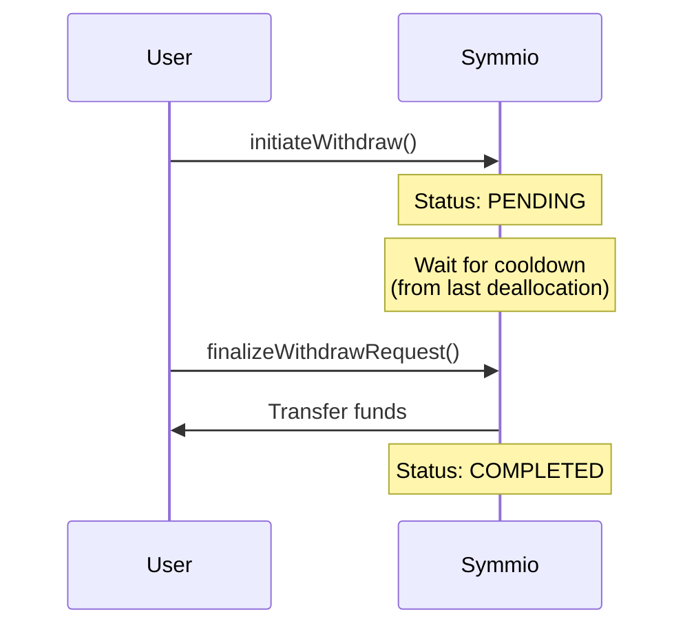
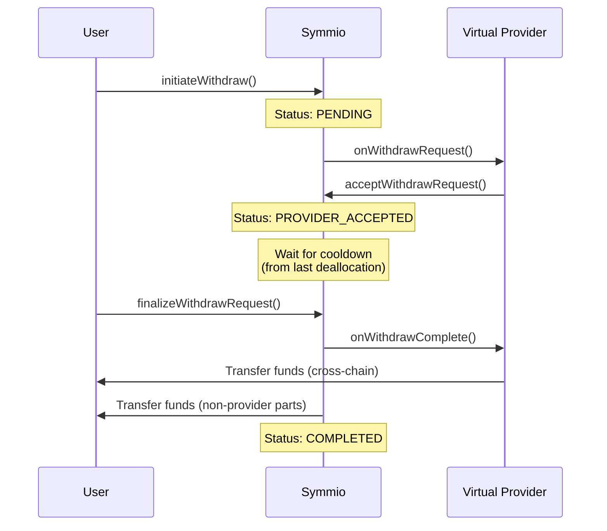
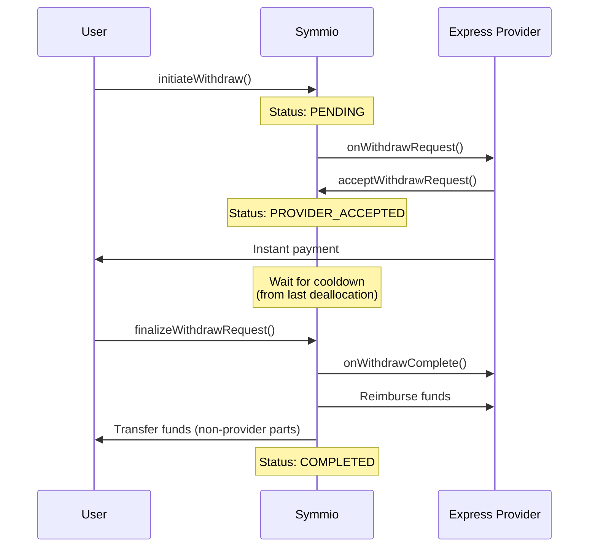
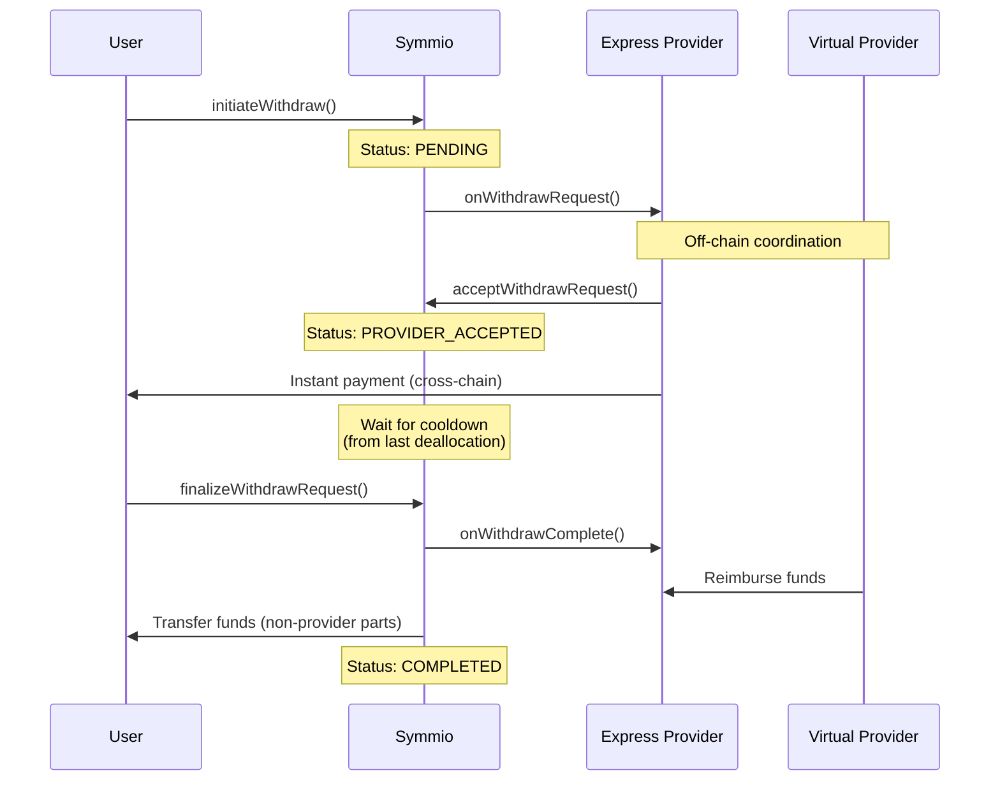

# New Withdraw System

## Overview

The new withdrawal system allows users to withdraw funds through a flexible multi-provider architecture. Users can withdraw funds across multiple chains with different timing options--from deallocation-based cooldowns to instant express withdrawals. The withdrawal cooldown is tied to the user's last deallocation time, not the withdrawal initiation--if funds have been idle for the full cooldown period (typically 12 hours), withdrawals can be finalized immediately.

### Legacy System Limitations

1. **Fragmented Withdrawal Paths:** Withdrawals were split between the Bridge facet (instant withdrawals with no cooldown) and the standard withdrawal function (12-hour cooldown)
2. **Cooldown Reset Behavior:** Each deallocation reset the 12-hour cooldown timer, creating friction for PartyBs and automated trading systems
4. **Single Queue Limitation:** Only one withdrawal could be queued at a time
5. **Incompatibility with New Features:** Virtual funds and cross-chain withdrawals required a fundamental redesign

## Architecture

A withdrawal request consists of one or more **receiver parts**, allowing users to split a single withdrawal across different chains and providers within one atomic request.

### Provider Types

| Provider | Purpose |
|----------|---------|
| **Express Provider** | Bypasses the 12-hour cooldown by paying the user immediately. Fronts funds and reclaims them after cooldown expires. Typically charges a fee. |
| **Virtual Provider** | Enables cross-chain withdrawals within the Virtual Fund System. Delivers funds on the user's chosen destination chain. |

> Providers must be registered within Symmio. A provider cannot serve both roles simultaneously.

### Withdrawal Types

| Type | Express | Virtual | Description |
|------|---------|---------|-------------|
| **Normal (Classic)** | ✗ | ✗ | Standard 12-hour cooldown, same-chain delivery |
| **Pure Express** | ✓ | ✗ | Instant same-chain withdrawal |
| **Pure Virtual** | ✗ | ✓ | Standard cooldown, cross-chain delivery |
| **Virtual Express** | ✓ | ✓ | Instant cross-chain withdrawal |

## Cooldown Mechanics

The withdrawal cooldown is calculated from the user's **last deallocation time** (`deallocateTimestamp`), not from the withdrawal initiation. When `initiateWithdraw` is called, the system computes:

```
cooldownEndTime = max(deallocateTimestamp + withdrawCooldownPeriod, block.timestamp)
```

This means:

- If the user deallocated recently, they wait the remaining cooldown from that deallocation
- If the cooldown period has already elapsed since the last deallocation, the withdrawal can be finalized immediately after initiation
- The cooldown period is stored in `MAStorage.withdrawCooldownPeriod` (typically 12 hours)

The `cooldownEndTime` is stored in the `WithdrawRequest` struct and returned by `initiateWithdraw`. Subsequent deallocations do **not** affect the cooldown of already-initiated withdrawals.

The `getWithdrawableTime(address user)` view function returns the earliest time a withdrawal initiated now could be finalized.

## Withdrawal Flows

### Normal (Classic) Withdraw

The simplest withdrawal type with no providers involved.



**Cancellation:** User may cancel at any time before finalization without external approval.

### Pure Virtual Withdraw

Only a virtual provider is specified for cross-chain delivery.



**Cancellation:**
- Before provider accepts (`PENDING`): Cancels immediately
- After acceptance, outside blackout: Cancels immediately
- After acceptance, inside blackout: Transitions to `CANCEL_REQUESTED`, awaits provider approval

### Pure Express Withdraw

Only an express provider is specified for instant same-chain withdrawal.



### Virtual Express Withdraw

Both provider types for instant cross-chain withdrawal.



> Virtual providers coordinate with express providers off-chain for acceptance and payment logistics.

## Summary Table

| Type | Acceptance Required | Instant Payment | Finalization Payout |
|------|---------------------|-----------------|---------------------|
| Normal | No | — | Symmio → User |
| Pure Virtual | Virtual provider | — | Virtual → User, Symmio → User |
| Pure Express | Express provider | Express → User | Symmio → Express, Symmio → User |
| Virtual Express | Express provider | Express → User | Virtual → Express, Symmio → User |

## Administrative Features

### Force Cancel

Administrators with `WITHDRAW_FORCE_CANCEL_ROLE` can force-cancel any withdrawal request **before** the cooldown expires.

- Works on all withdrawal types (classic, virtual, express)
- Valid for `PENDING`, `PROVIDER_ACCEPTED`, or `CANCEL_REQUESTED` status
- Returns locked balance to user's available balance
- Notifies providers via `onForceWithdrawCancel` callback

### Pure Virtual Cancel Blackout

The `pureVirtualCancelBlackout` parameter creates a window before cooldown expiry during which users cannot cancel pure virtual withdrawals. This gives virtual providers certainty that accepted requests won't be cancelled at the last moment.

### Withdrawal Suspension

A global flag can suspend users, preventing them from calling balance-changing functions. Suspended users' withdrawal requests can be cancelled, returning locked balance to their available balance.

### Withdrawal Speed-Up

Designated users can reduce their cooldown period:

1. Admin adds user to speed-up whitelist
2. User initiates withdrawal with `speedUp` flag enabled
3. Admin accepts speed-up via `acceptSpeedUpRequest` with new cooldown duration

A system-wide `minWithdrawCooldown` enforces the minimum allowed cooldown.

## Technical Reference

### Enums

```solidity
enum WithdrawStatus {
    PENDING,            // 0: Created, awaiting provider acceptance
    PROVIDER_ACCEPTED,  // 1: Provider approved the request
    PROVIDER_REJECTED,  // 2: Provider declined; request refunded
    COMPLETED,          // 3: Finalized successfully
    CANCEL_REQUESTED,   // 4: User requested cancellation, awaiting provider
    CANCELLED,          // 5: Request fully cancelled and refunded
    SUSPENDED           // 6: Suspended due to user-level restriction
}
```

### Structs

```solidity
struct WithdrawReceiverPart {
    uint256 id;              // Part ID (set by caller)
    uint256 amount;          // Amount of collateral to withdraw
    int256 chainId;          // Destination chain ID
    bytes receiver;          // Destination address (20 bytes for EVM)
    address virtualProvider; // Zero for classic/pure-express
    address expressProvider; // Zero for classic/pure-virtual
}

struct WithdrawRequest {
    uint256 id;
    address user;
    WithdrawReceiverPart[] parts;
    uint256 timestamp;
    uint256 cooldownEndTime;
    WithdrawStatus status;
    bool speedUp;
    bool isCooldownModified;
    address provider;
    bool isPureVirtual;
    bytes providerData;
    uint256 totalAmount;
    uint256 totalVirtualAmount;
}
```

### Read Functions

```solidity
function getWithdrawRequests(address user, uint256 requestId) external view returns (WithdrawRequest memory);
function getWithdrawableTime(address user) external view returns (uint256);
function isExpressProviderRegistered(address provider) external view returns (bool);
function isVirtualProviderRegistered(address provider) external view returns (bool);
function isSpeedUpEligible(address user) external view returns (bool);
function getModifiedCooldownEndTime(address user, uint256 requestId) external view returns (uint256);
```

### User Functions

```solidity
// Initiate a withdrawal request
// Returns the request ID and the cooldown end timestamp
function initiateWithdraw(
    WithdrawReceiverPart[] calldata parts,
    bool speedUp,
    bytes calldata providerData
) external returns (uint256 requestId, uint256 cooldownEndTime);

// Finalize after cooldown expires
function finalizeWithdrawRequest(address user, uint256 requestId) external;

// Request cancellation
// - Classic/pure-virtual (outside blackout): cancels immediately
// - Express or pure-virtual (inside blackout): transitions to CANCEL_REQUESTED
function requestCancelWithdraw(uint256 requestId) external;
```

### Admin Functions

```solidity
// Force-cancel before cooldown expires (requires WITHDRAW_FORCE_CANCEL_ROLE)
function forceCancelWithdraw(address user, uint256 requestId) external;

// Set blackout period for pure virtual cancellations (requires COOLDOWN_ADMIN_ROLE)
function setPureVirtualCancelBlackout(uint256 blackout) external;
```

## Provider Callbacks

Providers must implement these callbacks:

### IVirtualProvider

```solidity
function onWithdrawRequest(WithdrawRequest calldata request) external;
function onWithdrawComplete(WithdrawRequest calldata request) external;
function onWithdrawCancelRequest(WithdrawRequest calldata request) external;
function onForceWithdrawCancel(WithdrawRequest calldata request) external;
```

### IExpressProvider

```solidity
function onWithdrawRequest(WithdrawRequest calldata request) external;
function onWithdrawComplete(WithdrawRequest calldata request) external;
function onWithdrawCancelRequest(WithdrawRequest calldata request) external;
function onForceWithdrawCancel(WithdrawRequest calldata request) external;
```
