# Express Provider Bot Operations Checklist

Complete reference of every flow, state, edge case, and scenario the operator bot must handle.

---

## Table of Contents

1. [State Machine](#1-state-machine)
2. [Withdrawal Flows by Option Type](#2-withdrawal-flows-by-option-type)
3. [Bot Actions Checklist](#3-bot-actions-checklist)
4. [Options API: Constructing & Signing](#4-options-api-constructing--signing)
5. [Event Monitoring & Reactions](#5-event-monitoring--reactions)
6. [Fee Computation & Validation](#6-fee-computation--validation)
7. [Sponsor System](#7-sponsor-system)
8. [Validator System](#8-validator-system)
9. [Multi-Part Withdrawals](#10-multi-part-withdrawals)
11. [Credit Line Integration](#11-credit-line-integration)
12. [Risk Lock / Unlock Flows](#12-risk-lock--unlock-flows)
13. [Cancellation & Suspension](#13-cancellation--suspension)
14. [Permissionless Fallback](#14-permissionless-fallback)
15. [Timing Reference](#15-timing-reference)
16. [Error Catalog](#16-error-catalog)
17. [Edge Cases & Race Conditions](#17-edge-cases--race-conditions)
18. [Pool Management](#18-pool-management)
19. [Role Reference](#19-role-reference)
20. [Operational Invariants](#20-operational-invariants)
21. [Complete State x Option Type Decision Matrix](#21-complete-state-x-option-type-decision-matrix)

---

## 1. State Machine

### ExpressProvider Internal Status

| Status | Value | Meaning |
|--------|-------|---------|
| `NONE` | 0 | No withdrawal exists for this (user, requestId) |
| `ACCEPTED` | 1 | Withdrawal accepted, funds locked (INSTANT/IMMEDIATE). Awaiting processing |
| `LOCKED` | 2 | Risk-flagged by LOCKER_ROLE. Processing blocked until resolved |
| `PROCESSED` | 3 | Funds transferred to user. Awaiting SYMMIO finalization to replenish pools |
| `FINALIZED` | 4 | Terminal. Pools replenished (INSTANT/IMMEDIATE) or tokens arrived (STANDARD) |
| `CANCELLED` | 5 | Terminal. All locks released, sponsor refunded |
| `SUSPENDED` | 6 | Terminal. All locks released, sponsor refunded |

### State Transition Diagrams

#### IMMEDIATE State Machine

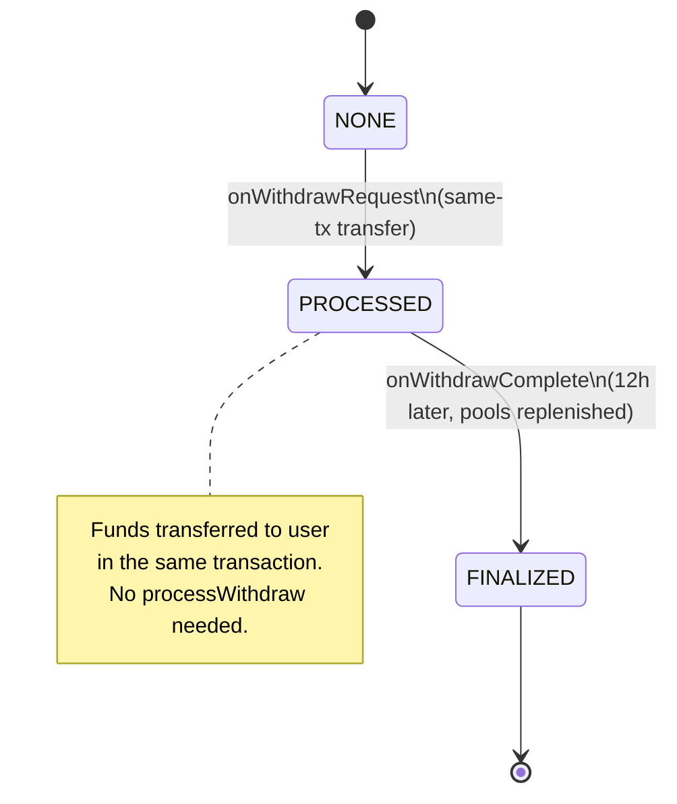
```mermaid
stateDiagram-v2
    [*] --> NONE
    NONE --> PROCESSED : onWithdrawRequest\n(same-tx transfer)
    PROCESSED --> FINALIZED : onWithdrawComplete\n(12h later, pools replenished)
    FINALIZED --> [*]

    note right of PROCESSED
        Funds transferred to user
        in the same transaction.
        No processWithdraw needed.
    end note
```

#### INSTANT State Machine

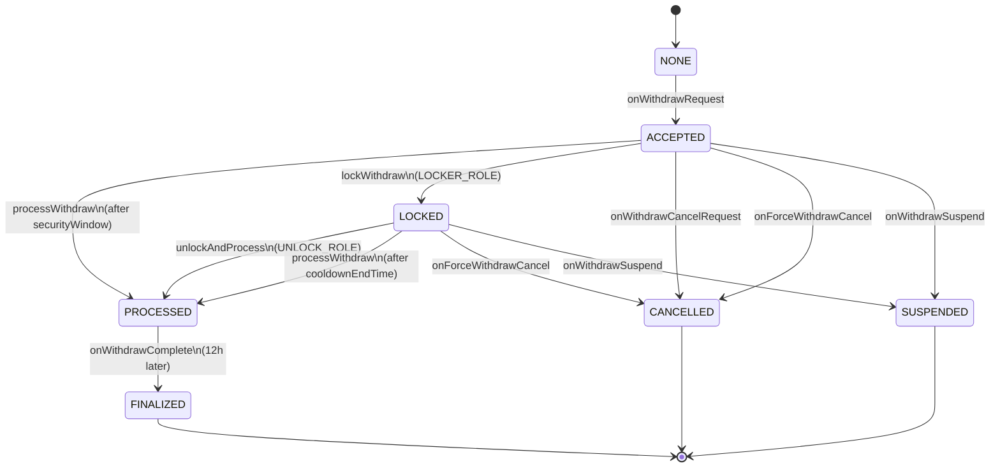
```mermaid
stateDiagram-v2
    [*] --> NONE
    NONE --> ACCEPTED : onWithdrawRequest

    ACCEPTED --> PROCESSED : processWithdraw\n(after securityWindow)
    ACCEPTED --> LOCKED : lockWithdraw\n(LOCKER_ROLE)
    ACCEPTED --> CANCELLED : onWithdrawCancelRequest
    ACCEPTED --> CANCELLED : onForceWithdrawCancel
    ACCEPTED --> SUSPENDED : onWithdrawSuspend

    LOCKED --> PROCESSED : unlockAndProcess\n(UNLOCK_ROLE)
    LOCKED --> PROCESSED : processWithdraw\n(after cooldownEndTime)
    LOCKED --> CANCELLED : onForceWithdrawCancel
    LOCKED --> SUSPENDED : onWithdrawSuspend

    PROCESSED --> FINALIZED : onWithdrawComplete\n(12h later)
    FINALIZED --> [*]
    CANCELLED --> [*]
    SUSPENDED --> [*]
```

#### STANDARD State Machine

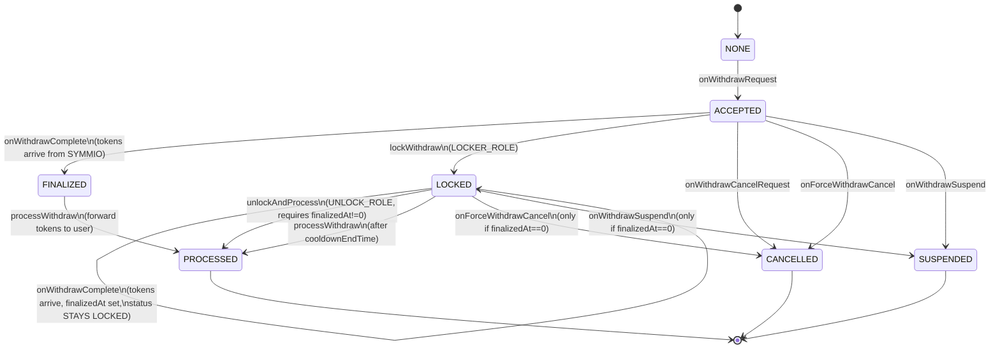
```mermaid
stateDiagram-v2
    [*] --> NONE
    NONE --> ACCEPTED : onWithdrawRequest

    ACCEPTED --> FINALIZED : onWithdrawComplete\n(tokens arrive from SYMMIO)
    ACCEPTED --> LOCKED : lockWithdraw\n(LOCKER_ROLE)
    ACCEPTED --> CANCELLED : onWithdrawCancelRequest
    ACCEPTED --> CANCELLED : onForceWithdrawCancel
    ACCEPTED --> SUSPENDED : onWithdrawSuspend

    FINALIZED --> PROCESSED : processWithdraw\n(forward tokens to user)

    LOCKED --> LOCKED : onWithdrawComplete\n(tokens arrive, finalizedAt set,\nstatus STAYS LOCKED)
    LOCKED --> PROCESSED : unlockAndProcess\n(UNLOCK_ROLE, requires finalizedAt!=0)
    LOCKED --> PROCESSED : processWithdraw\n(after cooldownEndTime)
    LOCKED --> CANCELLED : onForceWithdrawCancel\n(only if finalizedAt==0)
    LOCKED --> SUSPENDED : onWithdrawSuspend\n(only if finalizedAt==0)

    PROCESSED --> [*]
    CANCELLED --> [*]
    SUSPENDED --> [*]
```

### Transition Triggers

| From | To | Trigger | Who |
|------|----|---------|-----|
| NONE | ACCEPTED | `onWithdrawRequest` (INSTANT/STANDARD) | SYMMIO callback |
| NONE | PROCESSED | `onWithdrawRequest` (IMMEDIATE, same-tx transfer) | SYMMIO callback |
| ACCEPTED | PROCESSED | `processWithdraw` | OPERATOR_ROLE (or anyone after tolerancePeriod) |
| ACCEPTED | LOCKED | `lockWithdraw` | LOCKER_ROLE |
| ACCEPTED | CANCELLED | `onWithdrawCancelRequest` or `onForceWithdrawCancel` | SYMMIO callback |
| ACCEPTED | SUSPENDED | `onWithdrawSuspend` | SYMMIO callback |
| LOCKED | PROCESSED | `unlockAndProcess` | UNLOCK_ROLE |
| LOCKED | PROCESSED | `processWithdraw` (after cooldownEndTime) | OPERATOR_ROLE (or anyone) |
| LOCKED | CANCELLED | `onForceWithdrawCancel` (only if finalizedAt == 0) | SYMMIO callback |
| LOCKED | SUSPENDED | `onWithdrawSuspend` (only if finalizedAt == 0) | SYMMIO callback |
| LOCKED | LOCKED (finalizedAt set) | `onWithdrawComplete` (STANDARD only) | SYMMIO callback |
| PROCESSED | FINALIZED | `onWithdrawComplete` | SYMMIO callback |
| ACCEPTED | FINALIZED | `onWithdrawComplete` (STANDARD only) | SYMMIO callback |

### Numeric Example: State Transitions for a 500 USDC INSTANT Withdrawal

```
Scenario: Single-part INSTANT withdrawal, no credit, no sponsor

Setup:
  generalBalance          = 10,000 USDC   lockedGeneralBalance          = 0
  affiliateBalances[aff]  =  5,000 USDC   lockedAffiliateBalances[aff]  = 0
  affiliateConfigs[aff]   = { feeRate: 50 (0.5%), operatorFee: 1e6 (1 USDC) }
  sponsorBalances[aff]    = 0 USDC
  securityWindow          = 20s           tolerancePeriod               = 60s
  nonces[user]            = 7

Step 1 — Bot sees: user requests a 500 USDC express withdrawal quote
  Bot reads on-chain:
    - nonces[user]                                            = 7
    - generalBalance - lockedGeneralBalance                   = 10,000 - 0 = 10,000 USDC available
    - affiliateBalances[aff] - lockedAffiliateBalances[aff]   = 5,000 - 0  = 5,000 USDC available
    - affiliateConfigs[aff].feeRate                           = 50 bps
    - affiliateConfigs[aff].operatorFee                       = 1e6 (1 USDC)
  Bot computes:
    - 1 part: { amount: 500e6, expressProvider: EP, virtualProvider: 0x0 }
    - expressAmount        = 500e6
    - creditAmount         = 0
    - affiliateAmount      = 200e6 (bot decides how much to draw from affiliate pool)
    - generalAmount        = expressAmount - affiliateAmount = 500e6 - 200e6 = 300e6
    - feeBasis             = expressAmount = 500e6
    - fee                  = 500e6 * 50 / 10000 = 2,500,000 (2.5 USDC)
    - operatorFee          = 1e6 (must match on-chain config exactly; reverts OperatorFeeMismatch otherwise)
    - totalFee             = 2.5 + 1 = 3.5 USDC
    - sponsorCoverage      = 0 (no sponsor balance)
    - maxUserFee           = 3.5 USDC
  Bot checks:
    - generalBalance - lockedGeneralBalance >= generalAmount?   10,000 >= 300?   YES
    - affiliateBalances[aff] - lockedAffiliateBalances[aff] >= affiliateAmount?   5,000 >= 200?   YES
    - fee + operatorFee <= feeBasis?   3.5e6 <= 500e6?   YES
  Decision: Offer INSTANT (optionType=1). Sign EIP-712 option with nonce=7, deadline=now+60s.

    What if generalBalance were only 200 USDC?
      300 > 200 — bot cannot offer INSTANT. Must fall back to STANDARD.

    What if feeRate were 10000 (100%) and operatorFee were 1e6?
      fee = 500e6, fee + operatorFee = 501e6 > 500e6 — reverts FeesExceedExpressAmount.
      Bot must detect this before offering and refuse the quote.

Step 2 — Bot sees: SYMMIO calls onWithdrawRequest (acceptance tx)
  User submits the signed option to SYMMIO. SYMMIO calls onWithdrawRequest on ExpressProvider.
  Bot reads (contract verifies automatically):
    - EIP-712 signer has SIGNER_ROLE?                                              YES
    - nonces[user] == opt.nonce?   7 == 7?                                         YES (nonce increments to 8)
    - block.timestamp <= opt.deadline?                                             YES
    - opt.fee == feeBasis * feeRate / 10000?   2.5e6 == 2.5e6?                     YES (reverts FeeMismatch otherwise)
    - opt.operatorFee == affiliateConfigs[aff].operatorFee?   1e6 == 1e6?           YES (reverts OperatorFeeMismatch otherwise)
    - generalBalance - lockedGeneralBalance >= generalAmount?   10,000 >= 300?      YES (reverts InsufficientGeneralBalance otherwise)
    - affiliateBalances[aff] - lockedAffiliateBalances[aff] >= affiliateAmount?
      5,000 >= 200?                                                                YES (reverts InsufficientAffiliateBalance otherwise)
  Contract locks funds:
    - lockedGeneralBalance:          0 + 300 = 300
    - lockedAffiliateBalances[aff]:  0 + 200 = 200
  Contract stores WithdrawInfo:
    - status = ACCEPTED, acceptedAt = T0, cooldownEndTime = T0 + 12h
  Decision: Request accepted. Bot starts the securityWindow countdown (20 seconds).

Step 3 — Bot sees: securityWindow has elapsed (T0 + 20s)
  Bot reads on-chain:
    - withdrawInfos[user][reqId].status    = ACCEPTED
    - withdrawInfos[user][reqId].acceptedAt = T0
    - block.timestamp                       = T0 + 20s
  Bot checks:
    - Is status == ACCEPTED?                                YES
    - Is block.timestamp >= acceptedAt + securityWindow?    T0+20 >= T0+20?   YES
    - Did the risk-detection service flag this withdrawal?  NO
  Decision: Process now. Call processWithdraw(user, reqId, parts).

    What if the bot tried at T0 + 15s?
      T0+15 < T0+20 — contract reverts TooEarly. Bot must wait.

    What if the risk service flagged this withdrawal at T0 + 10s?
      Bot (LOCKER_ROLE) calls lockWithdraw(user, reqId), setting status = LOCKED.
      processWithdraw then reverts NotAccepted.
      Resolution requires either:
        (a) UNLOCK_ROLE calls unlockAndProcess — immediately processes the withdrawal, or
        (b) Bot waits until cooldownEndTime (T0+12h), at which point processWithdraw
            becomes callable even for LOCKED requests (risk window is over).

    What if a non-operator (anyone) tried processWithdraw at T0 + 25s?
      Non-operators must wait securityWindow + tolerancePeriod = 20 + 60 = 80s.
      T0+25 < T0+80 — reverts TooEarly. Permissionless fallback activates at T0+80.

  Contract executes processWithdraw:
    - userFee = totalFee - sponsorCoverage = 3.5 - 0 = 3.5 USDC
    - Fee cascading across parts:
        feeRemaining = 3.5e6
        Part 1 (500 express-only): deduction = min(3.5e6, 500e6) = 3.5e6
          Transfer to receiver: 500e6 - 3.5e6 = 496.5e6 (496.5 USDC)
          feeRemaining = 0
    - Pool updates:
        lockedGeneralBalance:          300 - 300 = 0
        lockedAffiliateBalances[aff]:  200 - 200 = 0
        generalBalance:                10,000 - 300 = 9,700
        affiliateBalances[aff]:        5,000 - 200 = 4,800
        collectedFees[aff]            += 2.5 USDC
        collectedOperatorFees[aff]    += 1 USDC
    - status = PROCESSED

Step 4 — Bot sees: cooldownEndTime reached (T0 + 12h)
  Bot reads on-chain:
    - withdrawInfos[user][reqId].status         = PROCESSED
    - withdrawInfos[user][reqId].cooldownEndTime = T0 + 12h
    - block.timestamp                            >= T0 + 12h
  Bot checks:
    - Is status == PROCESSED?   YES (required for non-STANDARD finalization)
    - Has cooldown elapsed?     YES
  Decision: Finalize. Call ISymmio(symmio).finalizeWithdrawRequest(user, reqId).

  SYMMIO sends 500 USDC (expressAmount) to ExpressProvider, then calls onWithdrawComplete.
  Contract replenishes pools:
    - generalBalance:          9,700 + 300 = 10,000 (restored by generalAmount)
    - affiliateBalances[aff]:  4,800 + 200 = 5,000 (restored by affiliateAmount)
    - status = FINALIZED

Result:
  User received 496.5 USDC after a ~20s wait.
  Pools are fully restored to pre-withdrawal levels.
  Bot earned 3.5 USDC total (2.5 affiliate fee + 1 operator fee).
  Net capital at risk for 12 hours: 500 USDC (fronted from pools, repaid by SYMMIO).
```

---

## 2. Withdrawal Flows by Option Type

### 2.1 IMMEDIATE (optionType = 0)

**User experience:** Same-transaction transfer. Fastest possible.

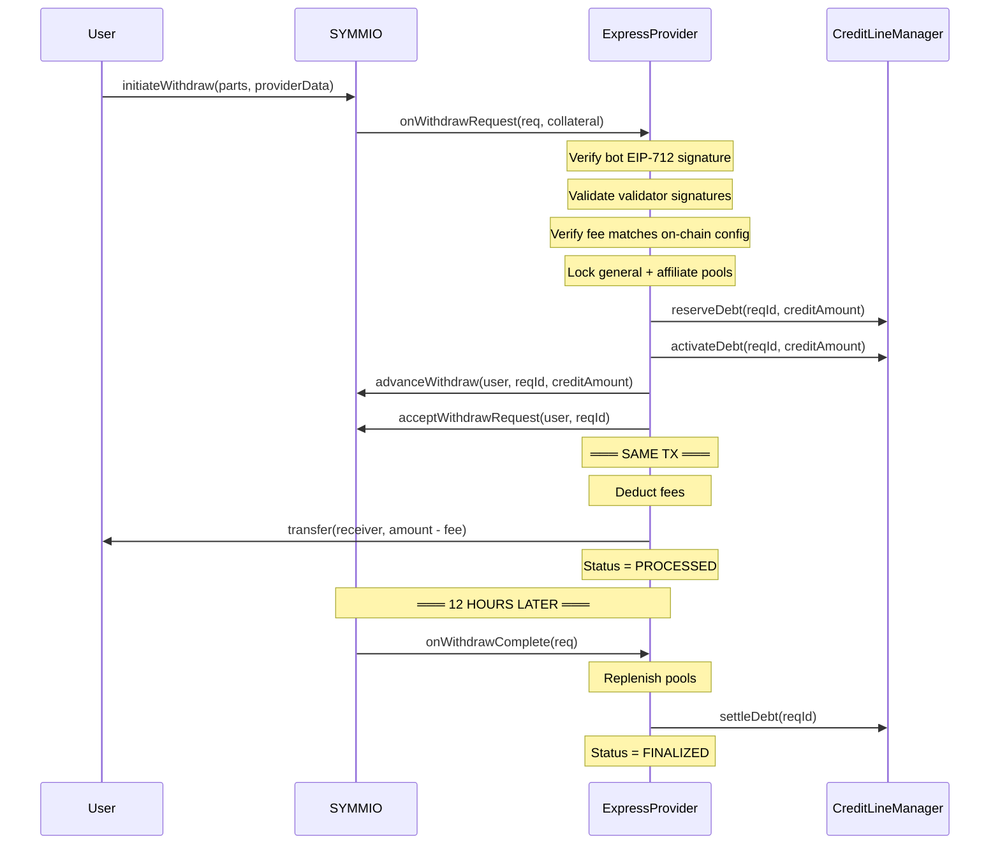
```mermaid
sequenceDiagram
    participant U as User
    participant S as SYMMIO
    participant EP as ExpressProvider
    participant CLM as CreditLineManager

    U->>S: initiateWithdraw(parts, providerData)
    S->>EP: onWithdrawRequest(req, collateral)

    Note over EP: Verify bot EIP-712 signature
    Note over EP: Validate validator signatures
    Note over EP: Verify fee matches on-chain config
    Note over EP: Lock general + affiliate pools
    EP->>CLM: reserveDebt(reqId, creditAmount)
    EP->>CLM: activateDebt(reqId, creditAmount)
    EP->>S: advanceWithdraw(user, reqId, creditAmount)
    EP->>S: acceptWithdrawRequest(user, reqId)

    Note over EP: ═══ SAME TX ═══
    Note over EP: Deduct fees
    EP->>U: transfer(receiver, amount - fee)
    Note over EP: Status = PROCESSED

    Note over EP,S: ═══ 12 HOURS LATER ═══
    S->>EP: onWithdrawComplete(req)
    Note over EP: Replenish pools
    EP->>CLM: settleDebt(reqId)
    Note over EP: Status = FINALIZED
```

**Prerequisites:**
- [ ] `minValidatorSignatures > 0` (REQUIRED, reverts `ValidatorsRequiredForImmediate` otherwise)
- [ ] Sufficient general pool liquidity
- [ ] Sufficient affiliate pool liquidity (if affiliateAmount > 0)
- [ ] Sufficient credit line capacity (if creditAmount > 0)
- [ ] Valid validator attestations gathered

**Bot checklist:**
- [ ] Gather >= `minValidatorSignatures` validator sigs before offering IMMEDIATE
- [ ] Validator sigs must be address-sorted ascending (dedup check)
- [ ] Each validator timestamp must be within `validatorApprovalTimeout` of current time
- [ ] Verify `symmioNonce` matches user's current SYMMIO nonce
- [ ] Schedule `finalizeWithdrawRequest` at `cooldownEndTime`
- [ ] No `processWithdraw` needed (funds already sent)
- [ ] Cannot be cancelled once accepted (funds already transferred)
- [ ] Cannot be locked (already PROCESSED)

#### Numeric Example: IMMEDIATE 1,000 USDC

```
Scenario: Credit-backed IMMEDIATE withdrawal with express + credit line, no sponsor

Setup:
  generalBalance          = 10,000 USDC   lockedGeneralBalance          = 0
  affiliateBalances[aff]  =  5,000 USDC   lockedAffiliateBalances[aff]  = 0
  affiliateConfigs[aff]   = { feeRate: 100 (1%), operatorFee: 2e6 (2 USDC) }
  minValidatorSignatures  = 2             validatorApprovalTimeout      = 30s
  CLM.availableCredit     =  3,000 USDC   CLM.outstandingDebt           = 0
  nonces[user]            = 3
  sponsorBalances[aff]    = 0 USDC (no sponsor)

Step 1 — Bot sees: user requests an express withdrawal for 1,000 USDC
  Bot reads on-chain:
    - minValidatorSignatures                                = 2 (must be > 0 for IMMEDIATE; reverts
      ValidatorsRequiredForImmediate otherwise)
    - generalBalance - lockedGeneralBalance                 = 10,000 - 0 = 10,000 USDC available
    - affiliateBalances[aff] - lockedAffiliateBalances[aff] = 5,000 - 0  = 5,000 USDC available
    - CLM.availableCredit                                   = 3,000 USDC available
    - nonces[user]                                          = 3
    - affiliateConfigs[aff].feeRate                         = 100 bps (1%)
    - affiliateConfigs[aff].operatorFee                     = 2e6 (2 USDC)
  Bot decides: This user qualifies for IMMEDIATE. Validators are configured, and pools
  plus credit line have sufficient liquidity.
  Bot constructs parts:
    Part 1: { amount: 1000e6, expressProvider: EP, virtualProvider: 0x0, receiver: 0xUser }
  Bot computes fee parameters:
    - expressAmount        = 1000e6 (total withdrawal amount)
    - affiliateAmount      = 300e6 (bot chooses how much of expressAmount to draw from affiliate pool)
    - creditAmount         = 200e6 (portion backed by credit line)
    - generalAmount        = expressAmount - affiliateAmount - creditAmount = 1000e6 - 300e6 - 200e6 = 500e6
    - feeBasis             = expressAmount = 1000e6
    - fee                  = feeBasis * feeRate / 10000 = 1,000e6 * 100 / 10000 = 10e6 (10 USDC)
    - operatorFee          = 2e6 (must match on-chain config exactly)
    - totalFee             = 10 + 2 = 12 USDC
    - sponsorCoverage      = 0 (no sponsor)
    - maxUserFee           = 12 USDC
  Bot checks before signing:
    - generalBalance - lockedGeneralBalance >= generalAmount?   10,000 >= 500?   YES
    - affiliateBalances[aff] - lockedAffiliateBalances[aff] >= affiliateAmount?   5,000 >= 300?   YES
    - CLM.availableCredit >= creditAmount?   3,000 >= 200?   YES
    - fee + operatorFee <= feeBasis?   12e6 <= 1,000e6?   YES
  Decision: Offer IMMEDIATE (optionType=0). Proceed to gather validator attestations.

    What if CLM.availableCredit were only 150 USDC?
      200 > 150 — CreditLineManager would revert InsufficientCredit during reserveDebt.
      Bot must reduce creditAmount to 150 (and increase generalAmount to 550),
      or fall back to INSTANT without credit.

    What if minValidatorSignatures were 0?
      Contract reverts ValidatorsRequiredForImmediate. Bot cannot offer IMMEDIATE.
      Must fall back to INSTANT (optionType=1), which adds a securityWindow delay.

Step 2 — Bot sees: validator attestations gathered
  Bot reads on-chain:
    - ISymmio(symmio).getUserNonce(user)                    = 42 (SYMMIO-side nonce)
    - block.timestamp                                       = T_now
  Bot requests ValidatorApproval signatures from 2 independent VALIDATOR_ROLE holders:
    Each validator signs: ValidatorApproval(user, nonce=3, amount=1000e6, timestamp=T_now, symmioNonce=42)
  Bot checks:
    - Received 2 signatures?                                                       YES
    - Each signature timestamp within validatorApprovalTimeout (30s) of current time? YES
    - Validator addresses sorted ascending (contract enforces DuplicateValidator)?   YES
    - Each signer has VALIDATOR_ROLE?                                               YES
  Decision: All attestations valid. Sign the EIP-712 option with nonce=3, optionType=0,
  deadline=T_now+30s, then send both option + validator data to the user.

    What if one validator timestamp were 45s old?
      45 > 30 (validatorApprovalTimeout) — contract reverts ValidatorApprovalExpired.
      Bot must request a fresh signature from that validator.

    What if both validators had the same address (or unsorted)?
      Contract reverts DuplicateValidator. Bot must sort signer addresses ascending.

Step 3 — Bot sees: user submits withdrawal (SYMMIO calls onWithdrawRequest — entire step in ONE tx)
  Contract executes all of the following atomically:
  a. Decode + verify EIP-712 option signature:
     - Recovered signer has SIGNER_ROLE?                                           YES
     - nonces[user] == opt.nonce?   3 == 3?                                        YES (increments to 4)
     - block.timestamp <= opt.deadline?                                            YES
  b. Verify fees match on-chain config:
     - opt.fee == feeBasis * feeRate / 10000?   10e6 == 10e6?                       YES (reverts FeeMismatch otherwise)
     - opt.operatorFee == affiliateConfigs[aff].operatorFee?   2e6 == 2e6?          YES (reverts OperatorFeeMismatch otherwise)
     - fee + operatorFee <= feeBasis?   12e6 <= 1,000e6?                           YES (reverts FeesExceedExpressAmount otherwise)
  c. Validate 2 validator signatures:
     - Each signer has VALIDATOR_ROLE?   YES
     - Each timestamp within 30s?   YES
     - Addresses sorted ascending?   YES
     - getUserNonce(user) == symmioNonce?   42 == 42?   YES (reverts InvalidNonce otherwise)
  d. Lock general + affiliate pools (_lockFunds, IMMEDIATE path):
     - lockedGeneralBalance:          0 + 500 = 500
     - lockedAffiliateBalances[aff]:  0 + 300 = 300
  e. Reserve and activate credit line debt:
     - CLM.reserveDebt(reqId, 200e6)
     - CLM.activateDebt(reqId, 200e6)
     - CLM.availableCredit:  3,000 - 200 = 2,800
     - CLM.outstandingDebt:  0 + 200     = 200
  f. Advance credit-backed funds from SYMMIO:
     - SYMMIO.advanceWithdraw(user, reqId, 200e6)
  g. Lock fee (sponsor coverage = 0, so userFee = totalFee = 12 USDC)
  h. acceptWithdrawRequest on SYMMIO
  i. IMMEDIATE path — _collectAndTransfer runs IN THE SAME TX:
     userFee = totalFee - sponsorCoverage = 12 - 0 = 12 USDC
     Fee deduction from the single part (feeRemaining = 12e6):
       Part 1 (1000 express):
         deduction = min(12e6, 1000e6) = 12e6
         Transfer to receiver: 1000e6 - 12e6 = 988e6 (988 USDC)
         feeRemaining = 0
  j. Pool deductions (unlocking then deducting):
     lockedGeneralBalance:          500 - 500 = 0
     lockedAffiliateBalances[aff]:  300 - 300 = 0
     generalBalance:                10,000 - 500 = 9,500
     affiliateBalances[aff]:        5,000 - 300 = 4,700
     collectedFees[aff]            += 10 USDC
     collectedOperatorFees[aff]    += 2 USDC
  k. status = PROCESSED (skips ACCEPTED — funds already sent)
  Decision: No further bot action needed until finalization. User received funds in this tx.

  Result: User receives 988 USDC in the same transaction as initiateWithdraw.

    What if the bot had offered INSTANT (optionType=1) instead?
      Step (i) would NOT execute. Status would be ACCEPTED, not PROCESSED.
      The user would wait securityWindow (20s) before the bot calls processWithdraw.
      IMMEDIATE skips that wait by requiring validators upfront as a substitute for
      the post-acceptance risk window.

Step 4 — Bot sees: cooldownEndTime reached (T0 + 12h)
  Bot reads on-chain:
    - withdrawInfos[user][reqId].status         = PROCESSED
    - withdrawInfos[user][reqId].cooldownEndTime = T0 + 12h
    - block.timestamp                            >= T0 + 12h
  Bot checks:
    - Is status == PROCESSED?   YES (required — onWithdrawComplete reverts NotProcessed otherwise)
    - Has cooldown elapsed?     YES
  Decision: Finalize. Call ISymmio(symmio).finalizeWithdrawRequest(user, reqId).

  SYMMIO sends 1000 USDC (expressAmount) to ExpressProvider.
  SYMMIO calls onWithdrawComplete(req).
  Contract replenishes pools and settles credit debt:
    - generalBalance:          9,500 + 500 = 10,000 (restored by generalAmount)
    - affiliateBalances[aff]:  4,700 + 300 = 5,000 (restored by affiliateAmount)
    - CLM.settleDebt(reqId)
    - CLM.outstandingDebt:     200 - 200   = 0 (debt fully settled)
    - CLM.availableCredit:     2,800 + 200 = 3,000 (credit capacity restored)
    - status = FINALIZED

    What if the bot forgot to call finalizeWithdrawRequest?
      Pools remain depleted (generalBalance = 9,500, affiliateBalances = 4,700).
      Credit debt remains outstanding (CLM.outstandingDebt = 200).
      The 1000 USDC stays locked in SYMMIO. No one else can trigger
      finalization for this request. Bot should schedule this call reliably.

Result:
  User received 988 USDC instantly (same transaction, zero wait).
  Pools are fully restored to pre-withdrawal levels after 12h.
  Credit line debt is fully settled after 12h (no outstanding debt remains).
  Bot earned 12 USDC total (10 affiliate fee + 2 operator fee).
  Net capital at risk for 12 hours: 800 USDC (fronted from general + affiliate pools)
    + 200 USDC credit line debt (settled on finalization).
```

---

### 2.2 INSTANT (optionType = 1)

**User experience:** ~20 seconds. Capital fronted from pools.

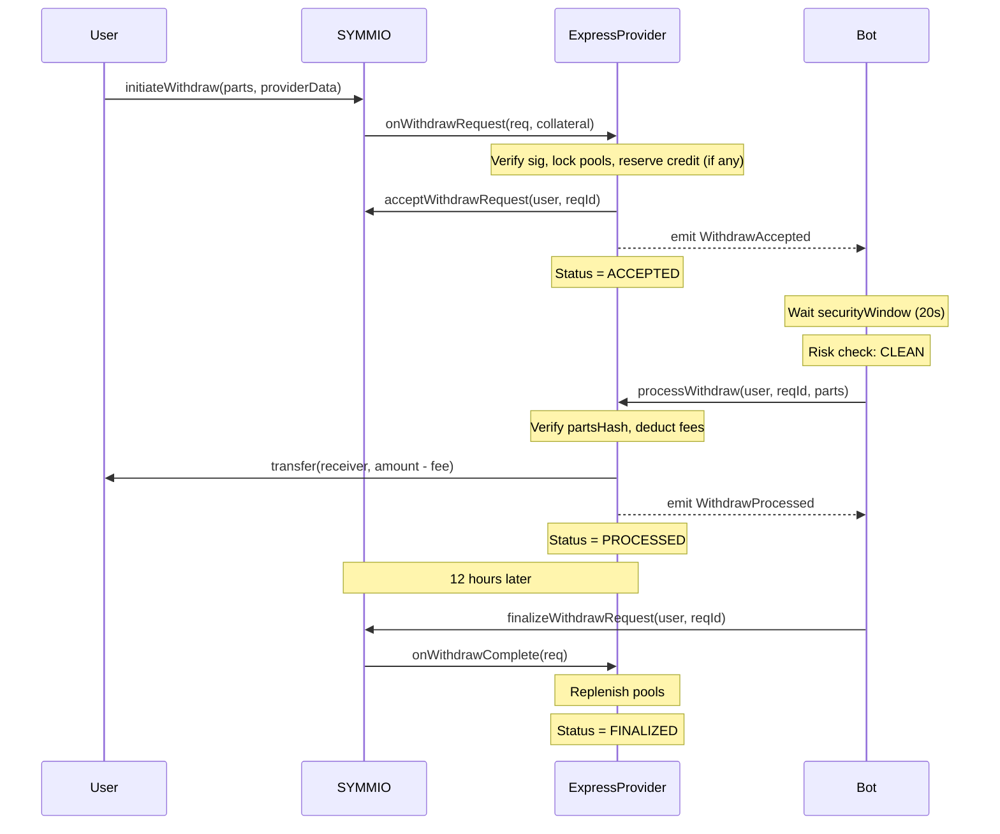
```mermaid
sequenceDiagram
    participant U as User
    participant S as SYMMIO
    participant EP as ExpressProvider
    participant Bot as Bot

    U->>S: initiateWithdraw(parts, providerData)
    S->>EP: onWithdrawRequest(req, collateral)
    Note over EP: Verify sig, lock pools, reserve credit (if any)
    EP->>S: acceptWithdrawRequest(user, reqId)
    EP-->>Bot: emit WithdrawAccepted
    Note over EP: Status = ACCEPTED

    Note over Bot: Wait securityWindow (20s)
    Note over Bot: Risk check: CLEAN

    Bot->>EP: processWithdraw(user, reqId, parts)
    Note over EP: Verify partsHash, deduct fees
    EP->>U: transfer(receiver, amount - fee)
    EP-->>Bot: emit WithdrawProcessed
    Note over EP: Status = PROCESSED

    Note over EP,S: 12 hours later
    Bot->>S: finalizeWithdrawRequest(user, reqId)
    S->>EP: onWithdrawComplete(req)
    Note over EP: Replenish pools
    Note over EP: Status = FINALIZED
```

**Bot checklist:**
- [ ] Wait at least `securityWindow` after `acceptedAt` before calling `processWithdraw`
- [ ] Perform risk check during security window
- [ ] If risky: call `lockWithdraw` (LOCKER_ROLE), do NOT call `processWithdraw`
- [ ] Provide exact same `parts` array to `processWithdraw` (verified by partsHash)
- [ ] Schedule `finalizeWithdrawRequest` at `cooldownEndTime`
- [ ] Monitor for user-initiated cancel (status goes CANCELLED, cancel scheduled processing)
- [ ] Cancellable while ACCEPTED (before processing)

#### Numeric Example: INSTANT 500 USDC

```
Scenario: User requests 500 USDC express withdrawal; bot fronts capital from pools
          with sponsor-covered fees, then processes after the security window.

Setup:
  generalBalance              = 10,000 USDC
  lockedGeneralBalance        = 0
  affiliateBalances[affiliate] = 5,000 USDC
  lockedAffiliateBalances[affiliate] = 0
  affiliateConfigs[affiliate] = { feeRate: 50 bps (0.5%), operatorFee: 1 USDC }
  securityWindow              = 20s
  tolerancePeriod             = 60s
  sponsorBalances[affiliate]  = 100 USDC
  sponsorConfigs[affiliate]   = { maxFeePerWithdraw: 0, maxWithdrawAmount: 0 }  (no caps)
  nonces[user]                = 5

Step 1 — Bot sees: User requests a 500 USDC withdrawal through this affiliate.
  Bot reads on-chain:
    - unlocked general   = generalBalance - lockedGeneralBalance = 10,000 - 0 = 10,000
    - unlocked affiliate = affiliateBalances - lockedAffiliateBalances = 5,000 - 0 = 5,000
    - sponsorBalances[affiliate] = 100 (sponsor active, no caps)
  Bot decides pool split:
    - affiliateAmount = 200   (bot chooses how much to draw from affiliate pool)
    - generalAmount   = 500 - 200 = 300
  Bot checks: Can INSTANT work?
    - unlocked general (10,000) >= generalAmount (300)?  YES
    - unlocked affiliate (5,000) >= affiliateAmount (200)?  YES
    --> Both pools have enough. INSTANT is feasible.
  Bot computes fees (must match on-chain affiliateConfigs exactly):
    - feeBasis    = expressAmount = 500
    - fee         = 500 * 50 / 10,000 = 2.50 USDC
    - operatorFee = 1 USDC
    - totalFee    = 2.50 + 1 = 3.50 USDC
  Bot reasons about sponsor coverage:
    - maxFeePerWithdraw = 0 (no cap)      --> maxCoverage = totalFee = 3.50
    - maxWithdrawAmount = 0 (no cap)      --> feeBearingAmount 500 is allowed
    - sponsorCoverage = min(sponsorBal=100, maxCoverage=3.50) = 3.50
    - actualUserFee = 3.50 - 3.50 = 0    --> user pays nothing
  Decision: Sign INSTANT option (optionType=1), nonce=5, maxUserFee=0.

  What if unlocked general was only 200 instead of 10,000?
    200 < generalAmount (300) --> _lockFunds would revert InsufficientGeneralBalance.
    Bot cannot offer INSTANT. Must fall back to STANDARD.

Step 2 — Bot sees: WithdrawAccepted event (SYMMIO called onWithdrawRequest).
  What happened on-chain during acceptance:
    Contract verified the bot's EIP-712 signature and nonce.
    Contract verified fee == feeBasis * feeRate / 10000 and operatorFee == affiliateConfigs.operatorFee.
    _lockFunds (INSTANT path):
      - lockedGeneralBalance:          0 --> 300   (300 locked from general pool)
      - lockedAffiliateBalances:       0 --> 200   (200 locked from affiliate pool)
    _lockFee (sponsor coverage):
      - sponsorBalances[affiliate]:  100 --> 96.50 (3.50 locked for this withdrawal)
      - info.sponsorCoverage = 3.50
    actualUserFee = 3.50 - 3.50 = 0 <= maxUserFee (0)? YES
    nonces[user] = 5 --> 6
    Status = ACCEPTED
  Bot reads on-chain:
    - withdrawInfos[user][reqId].status    = ACCEPTED (1)
    - withdrawInfos[user][reqId].acceptedAt = T0

Step 3 — Bot decides: Process or lock? (security window decision)
  Bot reads on-chain:
    - status = ACCEPTED
    - acceptedAt = T0
    - block.timestamp = T0 + 5s  (still within 20s securityWindow)
  Bot runs risk check (off-chain anomaly detection):
    - Check user history, funding source, transaction patterns...
    - Result: CLEAN. No anomalies.
  Decision: Wait until T0+20s, then call processWithdraw.

  BRANCH — What if risk was detected at T0+5s?
    Bot (using LOCKER_ROLE key, separate from OPERATOR_ROLE) calls:
      lockWithdraw(user, reqId)
    Status changes: ACCEPTED --> LOCKED
    Effect: processWithdraw now reverts with NotAccepted.
    Resolution requires UNLOCK_ROLE holder to call unlockAndProcess (false alarm)
    or SYMMIO admin to call onWithdrawSuspend (confirmed bad actor).
    Bot (OPERATOR_ROLE) cannot unilaterally unlock — role separation enforced.

Step 4 — Bot sees: block.timestamp >= T0 + 20s (securityWindow elapsed).
  Bot reads on-chain:
    - status = ACCEPTED (still — not locked, not cancelled)
    - block.timestamp = T0 + 20s
    - processableAt = acceptedAt + securityWindow = T0 + 20s
  Bot checks: block.timestamp (T0+20) >= processableAt (T0+20)?  YES
  Decision: Process now. Call processWithdraw(user, reqId, parts).
  Contract executes _collectAndTransfer:
    - userFee = totalFee - sponsorCoverage = 3.50 - 3.50 = 0
    - feeRemaining = 0
    - Part 1 (500 express-only): deduction = min(0, 500e6) = 0
        collateral.safeTransfer(receiver, 500e6)
    - User receives: 500 USDC (full amount — sponsor paid all fees)
  Contract updates pools:
    - lockedGeneralBalance:        300 --> 0
    - lockedAffiliateBalances:     200 --> 0
    - generalBalance:           10,000 --> 9,700  (deducted 300 — capital fronted)
    - affiliateBalances:         5,000 --> 4,800  (deducted 200 — capital fronted)
    - collectedFees[affiliate]         += 2.50
    - collectedOperatorFees[affiliate] += 1
  Status = PROCESSED

  BRANCH — What if a non-operator tried to process at T0+20s?
    processableAt = acceptedAt + securityWindow + tolerancePeriod = T0 + 20 + 60 = T0 + 80s
    At T0+20s: block.timestamp < processableAt --> REVERT TooEarly.
    Non-operators must wait until T0+80s (permissionless fallback if bot goes down).

Step 5 — Bot sees: block.timestamp >= cooldownEndTime (~T0 + 12h).
  Bot reads on-chain:
    - withdrawInfos[user][reqId].status = PROCESSED
    - withdrawInfos[user][reqId].cooldownEndTime = T0 + 12h
  Decision: Finalize. Call SYMMIO.finalizeWithdrawRequest(user, reqId).
  SYMMIO transfers 500 USDC (expressAmount) to ExpressProvider, then calls onWithdrawComplete.
  Contract replenishes pools:
    - generalBalance:    9,700 + 300 = 10,000  (restored)
    - affiliateBalances: 4,800 + 200 = 5,000  (restored)
  Status = FINALIZED
  Sponsor balance stays at 96.50 (fees were earned, not refunded).

  BRANCH — What if user had cancelled at T0+10s (before processing)?
    SYMMIO calls onWithdrawCancelRequest.
    Contract checks: INSTANT --> cancellable.
    Contract checks: status == ACCEPTED? YES --> allowed.
    _releaseWithdraw:
      - lockedGeneralBalance:    300 --> 0
      - lockedAffiliateBalances: 200 --> 0
      - sponsorBalances:       96.50 + 3.50 = 100  (sponsor coverage refunded)
    Status = CANCELLED. User receives nothing. All pools fully restored.
```

---

### 2.3 STANDARD (optionType = 2)
**User experience:** ~12 hours. No capital fronting. ExpressProvider acts as intermediary.

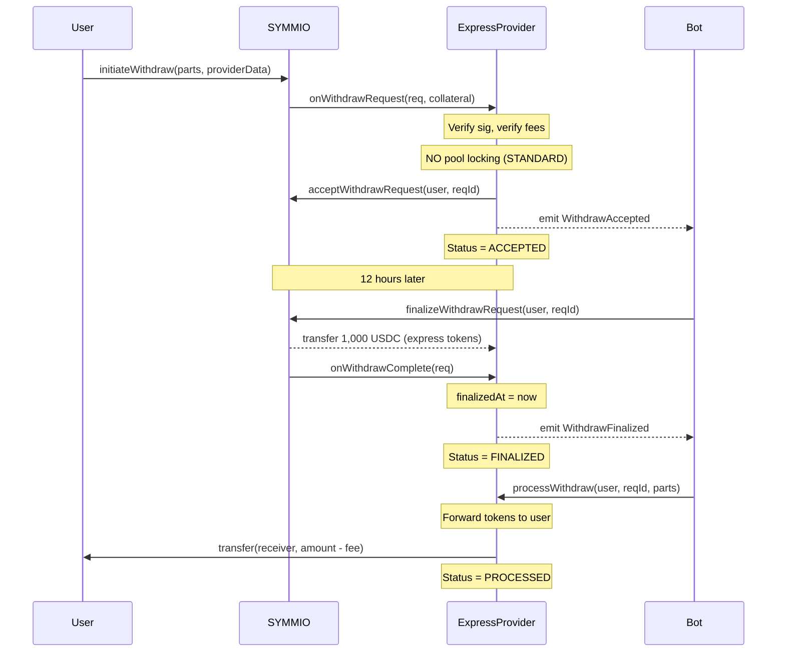
```mermaid
sequenceDiagram
    participant U as User
    participant S as SYMMIO
    participant EP as ExpressProvider
    participant Bot as Bot

    U->>S: initiateWithdraw(parts, providerData)
    S->>EP: onWithdrawRequest(req, collateral)
    Note over EP: Verify sig, verify fees
    Note over EP: NO pool locking (STANDARD)
    EP->>S: acceptWithdrawRequest(user, reqId)
    EP-->>Bot: emit WithdrawAccepted
    Note over EP: Status = ACCEPTED

    Note over EP,S: 12 hours later
    Bot->>S: finalizeWithdrawRequest(user, reqId)
    S-->>EP: transfer 1,000 USDC (express tokens)
    S->>EP: onWithdrawComplete(req)
    Note over EP: finalizedAt = now
    EP-->>Bot: emit WithdrawFinalized
    Note over EP: Status = FINALIZED

    Bot->>EP: processWithdraw(user, reqId, parts)
    Note over EP: Forward tokens to user
    EP->>U: transfer(receiver, amount - fee)
    Note over EP: Status = PROCESSED
```

**Bot checklist:**
- [ ] Do NOT call `processWithdraw` before finalization (reverts `NotFinalized`)
- [ ] Operator can process immediately after finalization
- [ ] Anyone can process after finalization + `tolerancePeriod`
- [ ] Schedule `finalizeWithdrawRequest` on SYMMIO at `cooldownEndTime`
- [ ] After `onWithdrawComplete`, call `processWithdraw`
- [ ] Cancellable while ACCEPTED (before finalization)
- [ ] Once finalized: cannot cancel or suspend (tokens already on ExpressProvider)
- [ ] LOCKED + finalized STANDARD: must be resolved via `unlockAndProcess` (UNLOCK_ROLE)

#### Numeric Example: STANDARD 1,000 USDC

```
Scenario: Simple STANDARD withdrawal — all from express pools, no credit

Setup:
  generalBalance = 10,000 USDC, lockedGeneralBalance = 8,000
  affiliateBalances[affiliate] = 5,000, lockedAffiliateBalances[affiliate] = 4,600
  affiliateConfigs[affiliate] = { feeRate: 50 bps (0.5%), operatorFee: 0 }
  sponsorBalances[affiliate] = 0, nonces[user] = 0
  NOTE: Credit is NOT supported for STANDARD (CreditNotSupportedForStandard error).

Step 1 — Bot sees: User requests withdrawal of 1,000 USDC
  Bot reads on-chain:
    - generalBalance - lockedGeneralBalance = 10,000 - 8,000 = 2,000 (unlocked general)
    - affiliateBalances - lockedAffiliateBalances = 5,000 - 4,600 = 400 (unlocked affiliate)
    - affiliateConfigs[affiliate] = { feeRate: 50, operatorFee: 0 }
  Bot checks: Can I offer INSTANT?
    INSTANT requires locking generalAmount from the general pool immediately.
    expressAmount = 1,000, affiliateAmount = 400, generalAmount = 1,000 - 400 = 600.
    Unlocked general = 2,000 >= 600. FEASIBLE, but bot prefers STANDARD for this user.
  Decision: Offer STANDARD. No capital fronting, no pool locks.

Step 2 — Bot constructs parts and signs
  Bot constructs parts (all parts have virtualProvider = 0x0):
    Part 0: { amount: 400, expressProvider: EP, virtualProvider: 0x0 }   — affiliate pool
    Part 1: { amount: 600, expressProvider: EP, virtualProvider: 0x0 }   — general pool
  Bot computes:
    expressAmount = 1,000 (sum of all parts, all virtualProvider == 0x0)
    creditAmount = 0 (credit NOT supported for STANDARD)
    affiliateAmount = 400 (from unlocked affiliate pool)
    generalAmount = expressAmount - affiliateAmount = 1,000 - 400 = 600
    feeBasis = expressAmount = 1,000
    fee = 1,000 * 50 / 10,000 = 5 USDC
    operatorFee = 0, totalFee = 5, sponsorCoverage = 0, maxUserFee = 5
  Decision: Sign STANDARD option with nonce=0, affiliateAmount=400, fee=5, availableAt=0

Step 3 — Bot sees: WithdrawAccepted event (SYMMIO called onWithdrawRequest)
  Bot reads on-chain:
    - status = ACCEPTED (1), nonces[user] = 1
    - lockedGeneralBalance = 8,000 (unchanged — STANDARD skips _lockFunds)
    - lockedAffiliateBalances[affiliate] = 4,600 (unchanged — STANDARD skips _lockFunds)
    NOTE: Pools are NOT locked for STANDARD.
    The 1,000 USDC will arrive from SYMMIO only after the 12h cooldown.
  Decision: Schedule finalizeWithdrawRequest call at cooldownEndTime (T+12h). Wait.

    What if risk is detected at T=30s?
      LOCKER_ROLE calls lockWithdraw → Status = LOCKED.
      processWithdraw now reverts for any caller.
      Resolution requires UNLOCK_ROLE (unlockAndProcess) or waiting past cooldownEndTime.

    What if user cancels at T=5min?
      STANDARD + ACCEPTED is cancellable. onWithdrawCancelRequest triggers _releaseWithdraw:
        No pool unlocking needed (pools were never locked for STANDARD).
        Status = CANCELLED. No pool changes, no sponsor refund (sponsor=0).

Step 4 — Bot sees: block.timestamp >= cooldownEndTime (T=12h)
  Bot reads on-chain:
    - status == ACCEPTED (still — no lock or cancel happened)
    - cooldownEndTime = T+12h, block.timestamp >= cooldownEndTime
  Bot checks: Is status still ACCEPTED or FINALIZED? ACCEPTED — need to finalize first.
  Decision: Call SYMMIO.finalizeWithdrawRequest(user, reqId).

  On-chain result:
    SYMMIO transfers 1,000 USDC (expressAmount) to ExpressProvider.
    SYMMIO calls onWithdrawComplete(req):
      optionType == STANDARD, status == ACCEPTED → status = FINALIZED (4)
      finalizedAt = block.timestamp
      generalBalance: unchanged (STANDARD does NOT replenish — tokens are forwarded)

Step 5 — Bot sees: WithdrawFinalized event
  Bot reads on-chain:
    - status = FINALIZED (4), finalizedAt = T+12h
    - optionType = STANDARD → processableAt = finalizedAt
  Bot checks: Am I OPERATOR_ROLE? YES → processableAt = finalizedAt (no tolerancePeriod).
    block.timestamp >= processableAt? YES.
  Decision: Call processWithdraw(user, reqId, parts) immediately.

    What if I'm NOT OPERATOR_ROLE?
      processableAt = finalizedAt + tolerancePeriod = T+12h + 60s.
      At T+12h: REVERT TooEarly. Must wait until T+12h+60s.

  Fee cascading in transferToReceivers:
    userFee = fee + operatorFee - sponsorCoverage = 5 + 0 - 0 = 5
    feeRemaining = 5

    Part 0 (400, affiliate pool):
      deduction = min(5, 400) = 5
      feeRemaining = 0
      collateral.safeTransfer(receiver, 400 - 5 = 395)

    Part 1 (600, general pool):
      deduction = min(0, 600) = 0
      collateral.safeTransfer(receiver, 600 - 0 = 600)

  Pool updates: optionType == STANDARD → no generalBalance or affiliateBalance deduction.
  collectedFees[affiliate] += 5
  Status = PROCESSED (terminal for STANDARD — no further FINALIZED step)

Final accounting:
  User receives: 395 + 600 = 995 USDC
  Fees collected: 5 USDC
  Total: 995 + 5 = 1,000 ✓
  generalBalance = 10,000 (unchanged — STANDARD doesn't touch it)
  affiliateBalances[affiliate] = 5,000 (unchanged — STANDARD doesn't touch it)
```

---

### 2.5 Credit-Backed Withdrawal

For IMMEDIATE and INSTANT options, the bot can include a `creditAmount` in the signed option to draw from the affiliate's credit line (CreditLineManager). This supplements pool liquidity:

- `generalAmount = expressAmount - affiliateAmount - creditAmount`
- Credit requires a valid Muon oracle attestation (`CreditData`)
- Credit is NOT supported for STANDARD (`CreditNotSupportedForStandard` error)
- Credit debt follows the lifecycle: reserved → activated → settled (see Section 11)

When pool liquidity alone is insufficient for INSTANT but the affiliate has eligible credit capacity, the bot can offer a credit-backed option:

```
Example: 500 USDC withdrawal
  - affiliateAmount = 100 (from affiliate pool)
  - creditAmount = 200 (from credit line)
  - generalAmount = 200 (from general pool)
  - expressAmount = 500 (total)
```

The bot MUST verify:
- [ ] `creditLineManagers(affiliate) != address(0)` — credit line is configured
- [ ] CreditLineManager is not paused
- [ ] User is not blacklisted on the CreditLineManager
- [ ] `affiliateAmount + creditAmount <= expressAmount` (else reverts `FundingSplitExceedsExpress`)

---

## 3. Bot Actions Checklist

### 3.1 Options API Decision Flow

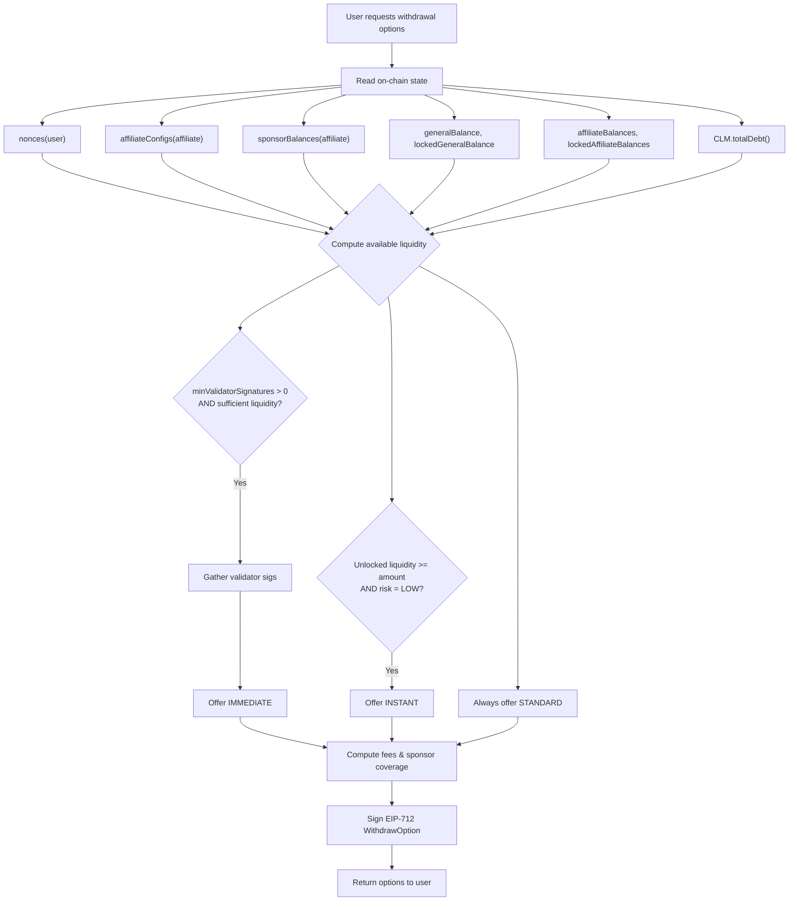
```mermaid
flowchart TD
    A[User requests withdrawal options] --> B[Read on-chain state]
    B --> B1["nonces(user)"]
    B --> B2["affiliateConfigs(affiliate)"]
    B --> B3["sponsorBalances(affiliate)"]
    B --> B4["generalBalance, lockedGeneralBalance"]
    B --> B5["affiliateBalances, lockedAffiliateBalances"]
    B --> B6["CLM.totalDebt()"]

    B1 & B2 & B3 & B4 & B5 & B6 --> C{Compute available liquidity}

    C --> D{minValidatorSignatures > 0\nAND sufficient liquidity?}
    D -->|Yes| D1[Gather validator sigs]
    D1 --> D2[Offer IMMEDIATE]

    C --> E{Unlocked liquidity >= amount\nAND risk = LOW?}
    E -->|Yes| E1[Offer INSTANT]

    C --> G[Always offer STANDARD]

    D2 & E1 & G --> H[Compute fees & sponsor coverage]
    H --> I[Sign EIP-712 WithdrawOption]
    I --> J[Return options to user]
```

### 3.2 On User Withdrawal Request

- [ ] Read `expressProvider.nonces(user)` for current nonce
- [ ] Read `affiliateConfigs(affiliate)` for `feeRate` and `operatorFee`
- [ ] Compute fee: `fee = expressAmount * feeRate / 10000`
- [ ] Read `sponsorBalances(affiliate)` and `sponsorConfigs(affiliate)` for sponsor coverage
- [ ] Compute `maxUserFee = (fee + operatorFee) - sponsorCoverage`
- [ ] Check `fee + operatorFee <= expressAmount` (else reverts `FeesExceedExpressAmount`)
- [ ] Check available general pool: `generalBalance - lockedGeneralBalance >= generalAmount`
- [ ] Check available affiliate pool: `affiliateBalances[affiliate] - lockedAffiliateBalances[affiliate] >= affiliateAmount`
- [ ] Check credit line capacity: `creditLineManagers(affiliate) != address(0)` if using credit
- [ ] For IMMEDIATE: verify `minValidatorSignatures > 0`
- [ ] If validators required: gather >= `minValidatorSignatures` attestations
- [ ] Construct `WithdrawReceiverPart[]` array
- [ ] Compute `partsHash = keccak256(abi.encode(parts))`
- [ ] Sign EIP-712 `WithdrawOption` with SIGNER_ROLE key
- [ ] Return `{ parts, providerData, fee, operatorFee, maxUserFee, estimatedTime }`

### 3.3 Signing Requirements

**WithdrawOption EIP-712 fields (all must be exact):**
- [ ] `user` -- the withdrawing user address
- [ ] `nonce` -- must match `nonces[user]` at execution time
- [ ] `optionType` -- 0-2
- [ ] `availableAt` -- 0 (reserved field)
- [ ] `affiliate` -- affiliate address
- [ ] `affiliateAmount` -- amount from affiliate pool
- [ ] `fee` -- must equal `(feeBasis * feeRate) / 10000` on-chain
- [ ] `operatorFee` -- must match `affiliateConfigs[affiliate].operatorFee` exactly
- [ ] `maxUserFee` -- max fee user pays after sponsor coverage
- [ ] `partsHash` -- `keccak256(abi.encode(parts))`
- [ ] `deadline` -- signature expiry timestamp (future)
- [ ] `signature` -- signed by SIGNER_ROLE holder

**Domain:** `name="ExpressProvider"`, `version="1"`, `chainId`, `verifyingContract=diamond address`

### 3.4 After Acceptance

| Option | Schedule processWithdraw at | Schedule finalizeWithdrawRequest at |
|--------|----------------------------|-------------------------------------|
| IMMEDIATE | N/A (already processed) | `cooldownEndTime` |
| INSTANT | `acceptedAt + securityWindow` | `cooldownEndTime` |
| STANDARD | After `onWithdrawComplete` | `cooldownEndTime` |

### 3.5 Processing (`processWithdraw`)

- [ ] Verify status is correct for the option type:
  - INSTANT: must be ACCEPTED (or LOCKED after cooldown)
  - STANDARD: must be FINALIZED (or LOCKED after cooldown)
- [ ] Provide exact `parts` array (verified against stored `partsHash`)
- [ ] Check timing:
  - INSTANT: `block.timestamp >= acceptedAt + securityWindow`
  - STANDARD: `block.timestamp >= finalizedAt` (operator) or `+ tolerancePeriod` (anyone)
  - LOCKED after cooldown: `block.timestamp >= cooldownEndTime`
- [ ] For LOCKED STANDARD without finalization: `processWithdraw` calls `finalizeWithdrawRequest` on SYMMIO first
- [ ] After successful processing: schedule `finalizeWithdrawRequest` at `cooldownEndTime`

### 3.6 Finalization (`finalizeWithdrawRequest` on SYMMIO)

- [ ] Call on SYMMIO (not ExpressProvider)
- [ ] Must wait until `block.timestamp >= cooldownEndTime`
- [ ] SYMMIO transfers express-only token amounts to ExpressProvider
- [ ] SYMMIO calls `onWithdrawComplete` on ExpressProvider
- [ ] Pools are replenished (INSTANT/IMMEDIATE) or tokens arrive (STANDARD)
- [ ] Verify status becomes FINALIZED (or stays LOCKED for STANDARD)

#### Numeric Example: Bot Action Timeline for a 500 USDC INSTANT

```
Scenario: User requests 500 USDC INSTANT withdrawal; bot shepherds it through
          sign -> accept -> risk-check -> process -> finalize.

Setup:
  generalBalance           = 10,000e6 USDC
  lockedGeneralBalance     =  2,000e6 USDC  (from other pending withdrawals)
  affiliateBalances[0xAff] =  3,000e6 USDC
  lockedAffiliateBalances  =      0e6 USDC
  nonces(0xUser)           = 3
  affiliateConfigs(0xAff)  = { feeRate: 50 bps, operatorFee: 1e6 }
  sponsorBalances(0xAff)   = 0                (no sponsor -- user pays full fee)
  securityWindow           = 20s
  tolerancePeriod          = 60s
  cooldownEndTime will be  = T+12h            (set by SYMMIO at acceptance)

----------------------------------------------------------------------

Step 1 -- Bot sees: User requests withdrawal options for 500 USDC
  (T=0s, off-chain API call)

  Bot reads on-chain:
    nonces(0xUser) = 3
    affiliateConfigs(0xAff).feeRate = 50, .operatorFee = 1e6
    generalBalance - lockedGeneralBalance = 10,000 - 2,000 = 8,000e6 unlocked
    affiliateBalances[0xAff] - lockedAffiliateBalances[0xAff] = 3,000 - 0 = 3,000e6 unlocked
    sponsorBalances(0xAff) = 0
    minValidatorSignatures = 0

  Bot decides the parts split:
    1 part, express-only: 500e6 to 0xReceiver, expressProvider=0xEP, virtualProvider=0x0
    expressAmount = 500e6, creditAmount = 0
    affiliateAmount = 200e6 (bot chooses to draw 200 from affiliate pool)
    generalAmount = 500 - 200 = 300e6

  Bot checks: "Can I offer INSTANT?"
    Unlocked general (8,000e6) >= generalAmount (300e6)?  YES
    Unlocked affiliate (3,000e6) >= affiliateAmount (200e6)?  YES
    INSTANT is feasible.

  Bot checks: "Can I offer IMMEDIATE?"
    minValidatorSignatures = 0 -- NO (validators required for IMMEDIATE)

  Bot computes fee:
    feeBasis = expressAmount = 500e6
    fee = 500e6 * 50 / 10000 = 2.5e6 (2.50 USDC)
    operatorFee = 1e6 (1.00 USDC)
    sponsorCoverage = 0 (no sponsor balance)
    maxUserFee = 2.5e6 + 1e6 - 0 = 3.5e6
    Check: fee + operatorFee (3.5e6) <= feeBasis (500e6)?  YES

  Bot computes partsHash = keccak256(abi.encode(parts))

  Bot signs EIP-712 WithdrawOption:
    { user: 0xUser, nonce: 3, optionType: 1 (INSTANT), availableAt: 0,
      affiliate: 0xAff, affiliateAmount: 200e6, fee: 2.5e6, operatorFee: 1e6,
      maxUserFee: 3.5e6, partsHash: <hash>, deadline: now+3600 }

  Decision: Return signed INSTANT option to user.

  What if unlocked general were only 100e6?
    generalAmount (300e6) > 100e6 -- INSTANT not feasible.
    Bot must fall back to STANDARD.

----------------------------------------------------------------------

Step 2 -- Bot sees: WithdrawAccepted(0xUser, 7, INSTANT)
  (T=5s, on-chain event from ExpressProvider)

  Bot reads on-chain:
    withdrawInfos(0xUser, 7).status = ACCEPTED
    withdrawInfos(0xUser, 7).acceptedAt = T=5s
    withdrawInfos(0xUser, 7).cooldownEndTime = T+12h
    lockedGeneralBalance is now 2,300e6 (+300 locked)
    lockedAffiliateBalances[0xAff] is now 200e6 (+200 locked)

  Bot checks: "When can I call processWithdraw?"
    Earliest = acceptedAt + securityWindow = T+5s + 20s = T+25s

  Decision: Schedule processWithdraw(0xUser, 7, parts) for T=25s.
            Start risk check immediately (20s security window).

  What if bot detects suspicious activity during risk check?
    Bot calls lockWithdraw(0xUser, 7) using LOCKER_ROLE.
    Status becomes LOCKED, processWithdraw is blocked.
    Must wait for UNLOCK_ROLE to call unlockAndProcess, OR
    wait until cooldownEndTime passes (then processWithdraw allowed).

----------------------------------------------------------------------

Step 3 -- Bot sees: securityWindow elapsed, time to process
  (T=25s, bot's scheduled action fires)

  Bot reads on-chain:
    withdrawInfos(0xUser, 7).status = ACCEPTED  (still -- not locked or cancelled)
    block.timestamp (T=25s) >= acceptedAt + securityWindow (T=25s)?  YES

  Bot checks: "Is the risk check clean?"
    Risk check result = CLEAN

  Decision: Call processWithdraw(0xUser, 7, parts) with OPERATOR_ROLE.

  On-chain effect:
    _collectAndTransfer runs:
      totalFee = 2.5e6 + 1e6 = 3.5e6
      sponsorCoverage = 0
      userFee = 3.5e6
      collectedFees[0xAff] += 2.5e6
      collectedOperatorFees[0xAff] += 1e6
      Part 0 (express-only, 500e6): deduction = min(3.5e6, 500e6) = 3.5e6
        Transfer 500 - 3.5 = 496.5e6 USDC to 0xReceiver
    Pool balance updates:
      lockedGeneralBalance -= 300e6   (back to 2,000e6)
      lockedAffiliateBalances[0xAff] -= 200e6 (back to 0)
      generalBalance -= 300e6         (now 9,700e6)
      affiliateBalances[0xAff] -= 200e6 (now 2,800e6)
    Status = PROCESSED
    Emits WithdrawProcessed(0xUser, 7)

  Bot sees: WithdrawProcessed(0xUser, 7)
  Decision: Schedule finalizeWithdrawRequest at cooldownEndTime (T+12h).

  What if status were LOCKED when the schedule fires?
    processWithdraw would revert (NotAccepted).
    Bot cancels the scheduled action, waits for resolution.

  What if someone else already called processWithdraw (permissionless)?
    Bot sees WithdrawProcessed event for a request it didn't process.
    Bot cancels its own scheduled processWithdraw.
    Bot still schedules finalizeWithdrawRequest at cooldownEndTime.

----------------------------------------------------------------------

Step 4 -- Bot sees: cooldownEndTime reached
  (T=12h, bot's scheduled action fires)

  Bot reads on-chain:
    withdrawInfos(0xUser, 7).status = PROCESSED
    block.timestamp >= cooldownEndTime?  YES

  Decision: Call SYMMIO.finalizeWithdrawRequest(0xUser, 7).

  On-chain effect (SYMMIO side):
    SYMMIO transfers 500e6 USDC (expressAmount) to ExpressProvider.
    SYMMIO calls onWithdrawComplete on ExpressProvider:
      status == PROCESSED -- replenish pools:
        generalBalance += 300e6    (back to 10,000e6)
        affiliateBalances[0xAff] += 200e6 (back to 3,000e6)
      Status = FINALIZED
      Emits WithdrawFinalized(0xUser, 7)

  Bot sees: WithdrawFinalized(0xUser, 7)
  Decision: Cycle complete. Remove from active tracking. Update liquidity cache.

  What if SYMMIO suspended the withdrawal before T=12h?
    Status was already PROCESSED -- suspend is impossible.
    (onWithdrawSuspend reverts if status != ACCEPTED and != LOCKED.)
    No action needed. The cycle completes normally.
```

---

## 4. Options API: Constructing & Signing

### 4.1 Available Options Decision Tree

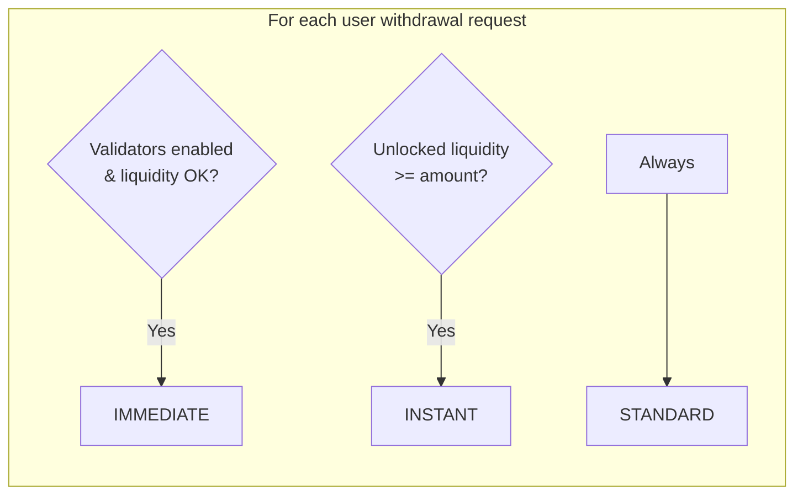
```mermaid
flowchart LR
    subgraph "For each user withdrawal request"
        A{Validators enabled\n& liquidity OK?} -->|Yes| IM[IMMEDIATE]
        B{Unlocked liquidity\n>= amount?} -->|Yes| IN[INSTANT]
        D[Always] --> ST[STANDARD]
    end
```

### 4.2 Parts Construction

Each `WithdrawReceiverPart`:

| Field | Express part | Non-express |
|-------|-------------|-------------|
| `expressProvider` | ExpressProvider address | `address(0)` |
| `virtualProvider` | `address(0)` (DEPRECATED, must be zero) | varies |
| `amount` | collateral decimals | collateral decimals |
| `receiver` | user's receiver address | user's receiver address |

**Amount classification:**
- `expressAmount` = sum of parts where `expressProvider == address(this)`
- `generalAmount = expressAmount - affiliateAmount - creditAmount`
- `feeBasis = expressAmount`

Note: `virtualProvider` must always be `address(0)`. Any non-zero value reverts `VirtualProviderDeprecated`.

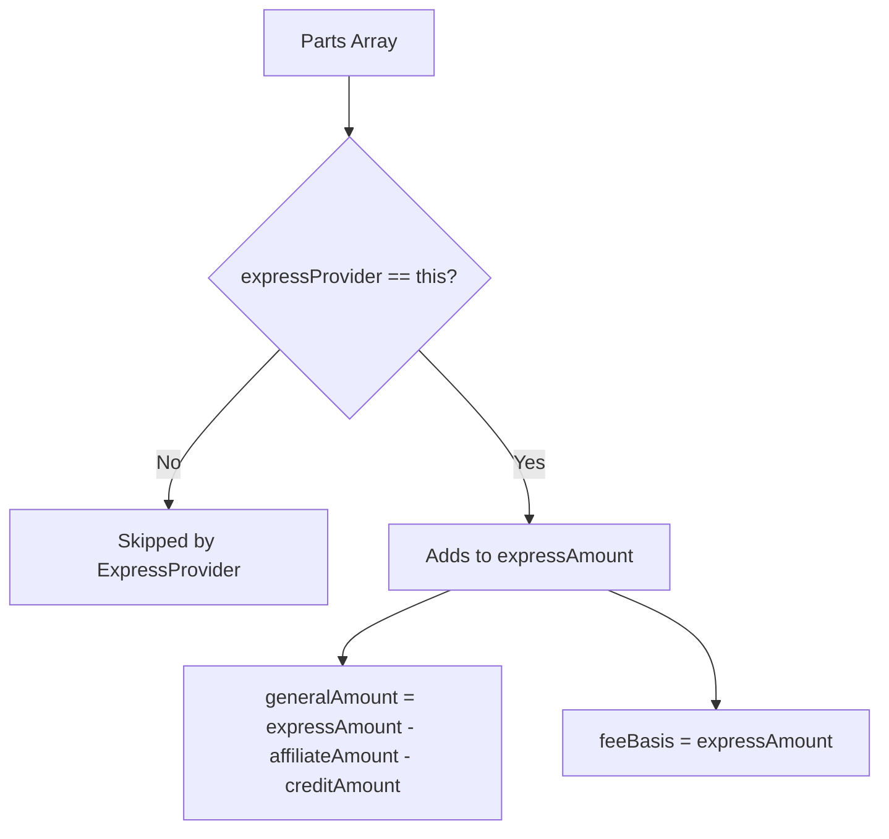
```mermaid
flowchart TD
    P[Parts Array] --> C1{expressProvider == this?}
    C1 -->|No| SKIP[Skipped by ExpressProvider]
    C1 -->|Yes| EO[Adds to expressAmount]

    EO --> GA["generalAmount = expressAmount - affiliateAmount - creditAmount"]
    EO --> FB["feeBasis = expressAmount"]
```

### 4.3 providerData Encoding

```
providerData = abi.encode(optionData, validatorData, creditDataRaw)
  where:
    optionData = abi.encode(DecodedOption struct — includes creditAmount field)
    validatorData = abi.encode(bytes[] signatures, uint256[] timestamps, uint256 symmioNonce)
    creditDataRaw = abi.encode(CreditData) if creditAmount > 0, else empty bytes
```

If no validators needed, `validatorData = abi.encode(new bytes[](0), new uint256[](0), uint256(0))`.
If no credit used, `creditDataRaw` is empty bytes (`""`).

#### Numeric Example: Parts Construction for Credit-Backed Withdrawal

```
Scenario: User wants to withdraw 1,500 USDC, sent to two different receivers.
          Bot must decide how to split across pools and credit line,
          construct the parts array, and compute all derived amounts.

Setup:
  generalBalance           = 5,000e6 USDC
  lockedGeneralBalance     = 4,600e6 USDC   (heavy utilization)
  affiliateBalances[0xAff] = 1,000e6 USDC
  lockedAffiliateBalances  =     0e6 USDC
  creditLineManagers[0xAff]= 0xCLM           (affiliate's credit line manager)
  CLM.totalDebt()          = 200e6 USDC      (existing debt)
  CLM.protocolMaxDebt      = 5,000e6         (plenty of headroom)
  affiliateConfigs(0xAff)  = { feeRate: 100 bps, operatorFee: 2e6 }
  sponsorBalances(0xAff)   = 10e6 USDC
  sponsorConfigs(0xAff)    = { maxFeePerWithdraw: 0, maxWithdrawAmount: 0 } (no caps)

----------------------------------------------------------------------

Step 1 -- Bot sees: User requests options for 1,500 USDC withdrawal
  Receivers: 1,000 USDC to 0xReceiverA, 500 USDC to 0xReceiverB

  Bot reads on-chain:
    Unlocked general = generalBalance - lockedGeneralBalance = 5,000 - 4,600 = 400e6
    Unlocked affiliate = affiliateBalances[0xAff] - lockedAffiliateBalances[0xAff] = 1,000 - 0 = 1,000e6

  Bot checks: "Can I cover 1,500 USDC from pools alone?"
    Total unlocked = 400 (general) + 1,000 (affiliate) = 1,400e6
    1,400 < 1,500 -- NO, not enough from pools alone.

  Bot checks: "Can I cover the gap using the credit line?"
    Shortfall = 1,500 - 1,400 = 100e6 minimum from credit
    CLM headroom = protocolMaxDebt - totalDebt = 5,000 - 200 = 4,800e6
    100 <= 4,800 -- YES, credit line has headroom.
    Bot also obtains Muon attestation for the affiliate's aggregate eligibleBase.

  Decision: Use pools + credit line. creditAmount = 100e6 to cover the gap.

----------------------------------------------------------------------

Step 2 -- Bot decides: How to split into parts and funding sources

  Strategy: Maximize affiliate pool usage, use credit for the shortfall.

  affiliateAmount = 1,000e6 (use full unlocked affiliate pool)
  creditAmount    = 100e6   (cover the shortfall via credit line)
  generalAmount   = expressAmount - affiliateAmount - creditAmount
                  = 1,500 - 1,000 - 100 = 400e6
  Unlocked general (400e6) >= generalAmount (400e6)?  YES, exactly enough.

  Bot checks: affiliateAmount + creditAmount <= expressAmount?
    1,000 + 100 = 1,100 <= 1,500?  YES (else reverts FundingSplitExceedsExpress)

  Final parts array (all virtualProvider = address(0)):
  [
    { id: 0, amount: 1000e6, receiver: 0xReceiverA,
      expressProvider: 0xEP, virtualProvider: 0x0 },
    { id: 1, amount: 500e6, receiver: 0xReceiverB,
      expressProvider: 0xEP, virtualProvider: 0x0 },
  ]

----------------------------------------------------------------------

Step 3 -- Bot computes: Fee computation

  From the parts array, computeAmounts will derive:
    expressAmount   = 1,000 + 500 = 1,500e6
    generalAmount   = 1,500 - 1,000 - 100 = 400e6

  feeBasis = expressAmount = 1,500e6
  fee = 1,500e6 * 100 / 10000 = 15e6 (15 USDC, at 1% rate)
  operatorFee = 2e6 (2 USDC)
  totalFee = 15 + 2 = 17e6

  Bot checks: fee + operatorFee (17e6) <= feeBasis (1,500e6)?  YES

  Bot computes sponsor coverage:
    sponsorBalances(0xAff) = 10e6
    sponsorConfigs: maxFeePerWithdraw = 0 (no cap), maxWithdrawAmount = 0 (no cap)
    maxCoverage = min(totalFee, no-cap) = 17e6
    sponsorCoverage = min(sponsorBal=10e6, maxCoverage=17e6) = 10e6
    maxUserFee = 17 - 10 = 7e6  (user pays 7 USDC out of 17 total)

  partsHash = keccak256(abi.encode(parts))  -- bot MUST store this

  Decision: Sign the option (including creditAmount=100e6) and return to user.

----------------------------------------------------------------------

Step 4 -- What happens on-chain at acceptance (for reference)

  onWithdrawRequest will:
    1. Verify EIP-712 signature and nonce (includes creditAmount in struct hash)
    2. Call computeAmounts -> expressAmount=1500, generalAmount=400
    3. Verify fee = (1500e6 * 100) / 10000 = 15e6  (matches signed fee)
    4. Verify operatorFee = 2e6  (matches on-chain config)
    5. Lock general pool: lockedGeneralBalance += 400e6  (now 5,000e6)
    6. Lock affiliate pool: lockedAffiliateBalances[0xAff] += 1,000e6
    7. Reserve credit: CLM.reserveDebt(user, reqId, 100e6, creditData)
       CLM.reservedDebt += 100e6
    8. Lock sponsor coverage: sponsorBalances[0xAff] -= 10e6 (now 0)
    9. Store WithdrawInfo with partsHash, creditAmount=100, creditLineManager=0xCLM
   10. Status = ACCEPTED

  At processWithdraw:
    1. Activate credit: CLM.activateDebt -> reservedDebt -= 100, activeDebt += 100
    2. Advance from core: SYMMIO.advanceWithdraw(user, reqId, 100e6)
    3. Fee deduction cascades across parts in order:
       userFee = 17 - 10 (sponsor) = 7e6 remaining
       Part 0 (1,000e6): deduction = min(7e6, 1,000e6) = 7e6
         Transfer 1,000 - 7 = 993e6 USDC to 0xReceiverA
         feeRemaining = 0
       Part 1 (500e6): deduction = 0
         Transfer 500e6 USDC to 0xReceiverB

  Net result:
    0xReceiverA gets 993 USDC
    0xReceiverB gets 500 USDC
    collectedFees[0xAff] += 15e6
    collectedOperatorFees[0xAff] += 2e6
    User deposited 1,500, got back 1,500 - 7 = 1,493.
    Credit line: 100 USDC active debt, settled on finalization.
```

---

## 5. Event Monitoring & Reactions

### 5.1 Event Handling Flow

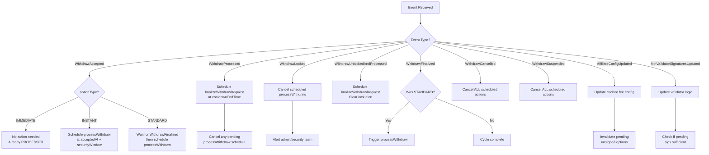
```mermaid
flowchart TD
    E[Event Received] --> T{Event Type?}

    T -->|WithdrawAccepted| A1{optionType?}
    A1 -->|IMMEDIATE| A2[No action needed\nAlready PROCESSED]
    A1 -->|INSTANT| A3["Schedule processWithdraw\nat acceptedAt + securityWindow"]
    A1 -->|STANDARD| A5["Wait for WithdrawFinalized\nthen schedule processWithdraw"]

    T -->|WithdrawProcessed| B1["Schedule finalizeWithdrawRequest\nat cooldownEndTime"]
    B1 --> B2[Cancel any pending\nprocessWithdraw schedule]

    T -->|WithdrawLocked| C1[Cancel scheduled processWithdraw]
    C1 --> C2[Alert admin/security team]

    T -->|WithdrawUnlockedAndProcessed| D1["Schedule finalizeWithdrawRequest\nClear lock alert"]

    T -->|WithdrawFinalized| E1{Was STANDARD?}
    E1 -->|Yes| E2[Trigger processWithdraw]
    E1 -->|No| E3[Cycle complete]

    T -->|WithdrawCancelled| F1[Cancel ALL scheduled actions]
    T -->|WithdrawSuspended| G1[Cancel ALL scheduled actions]

    T -->|AffiliateConfigUpdated| H1[Update cached fee config]
    H1 --> H2[Invalidate pending\nunsigned options]

    T -->|MinValidatorSignaturesUpdated| I1[Update validator logic]
    I1 --> I2[Check if pending\nsigs sufficient]
```

### 5.2 Events to Monitor

| Event | Source | Bot Action |
|-------|--------|------------|
| `WithdrawAccepted(user, requestId, optionType)` | ExpressProvider | Schedule `processWithdraw` at appropriate time (skip for IMMEDIATE) |
| `WithdrawProcessed(user, requestId)` | ExpressProvider | Schedule `finalizeWithdrawRequest` on SYMMIO at `cooldownEndTime`. Cancel any pending `processWithdraw` schedule |
| `WithdrawLocked(user, requestId)` | ExpressProvider | Cancel scheduled `processWithdraw`. Alert admin. Monitor for resolution |
| `WithdrawUnlockedAndProcessed(user, requestId)` | ExpressProvider | Schedule `finalizeWithdrawRequest`. Clear lock alert |
| `WithdrawFinalized(user, requestId)` | ExpressProvider | Cycle complete. Update internal tracking. For STANDARD: trigger `processWithdraw` |
| `WithdrawCancelled(user, requestId)` | ExpressProvider | Cancel all scheduled actions for this withdrawal |
| `WithdrawSuspended(user, requestId)` | ExpressProvider | Cancel all scheduled actions for this withdrawal |
| `AffiliateConfigUpdated(affiliate, feeRate, operatorFee)` | ExpressProvider | Update cached fee config. Re-sign any pending options |
| `SponsorConfigUpdated(affiliate, ...)` | ExpressProvider | Update cached sponsor config |
| `MinValidatorSignaturesUpdated(min)` | ExpressProvider | Update validator gathering logic. If raised, pending ops may be invalidated |
| `ValidatorApprovalTimeoutUpdated(timeout)` | ExpressProvider | Update timestamp freshness check. Pending sigs may expire |
| `GeneralDeposit(amount)` | ExpressProvider | Update available liquidity tracking |
| `GeneralWithdraw(amount)` | ExpressProvider | Update available liquidity tracking |
| `AffiliateDeposit(affiliate, amount)` | ExpressProvider | Update per-affiliate liquidity tracking |
| `AffiliateWithdraw(affiliate, amount)` | ExpressProvider | Update per-affiliate liquidity tracking |
| `SponsorDeposit(affiliate, amount)` | ExpressProvider | Update sponsor balance tracking |
| `SponsorWithdraw(affiliate, amount)` | ExpressProvider | Update sponsor balance tracking |

### 5.3 Idempotency Requirements

- [ ] Handle duplicate events (same event emitted in re-org scenarios)
- [ ] Do not schedule duplicate `processWithdraw` calls for same (user, requestId)
- [ ] Do not schedule duplicate `finalizeWithdrawRequest` calls
- [ ] Detect if someone else (permissionless user) already processed the withdrawal
- [ ] If `WithdrawProcessed` received for a withdrawal bot didn't process, cancel bot's scheduled processing

#### Numeric Example: Event Sequence for INSTANT with Lock

```
Scenario: INSTANT withdrawal accepted, then risk-locked before processing

Setup:
  generalBalance         = 5,000 USDC
  lockedGeneralBalance   = 1,200 USDC
  securityWindow         = 20s
  tolerancePeriod        = 60s
  cooldownEndTime        = T + 43,200s (12h)
  User: 0xAlice, requestId: 5, generalAmount: 800 USDC

Step 1 — Bot sees: WithdrawAccepted(0xAlice, 5, INSTANT) at T=0s (block 100)
  Bot reads on-chain:
    withdrawInfos[Alice][5].status     = ACCEPTED
    withdrawInfos[Alice][5].acceptedAt = T
    withdrawInfos[Alice][5].optionType = INSTANT
  Bot checks:
    processableAt = acceptedAt + securityWindow = T + 20s
    Current time T=0s < T+20s — too early to process
  Decision: Schedule processWithdraw(Alice, 5, parts) for T+20s (~block 102)

Step 2 — Bot sees: WithdrawLocked(0xAlice, 5) at T=10s (block 101)
  Bot reads on-chain:
    withdrawInfos[Alice][5].status = LOCKED
  Bot checks:
    Status is LOCKED — processWithdraw requires ACCEPTED or LOCKED-after-cooldown
    T=10s is far before cooldownEndTime (T+43,200s) — LOCKED-after-cooldown path unavailable
  Decision: CANCEL scheduled processWithdraw for (Alice, 5)
            Alert admin: "Withdrawal 5 for 0xAlice locked by LOCKER_ROLE at block 101"
  What if bot ignores the lock and calls processWithdraw at T=20s?
    status is LOCKED and block.timestamp (T+20s) < cooldownEndTime (T+43,200s)
    -> Reverts: NotAccepted — bot wastes gas

Step 3 — Bot sees: WithdrawUnlockedAndProcessed(0xAlice, 5) at T=1,000s (block 200)
  Bot reads on-chain:
    withdrawInfos[Alice][5].status = PROCESSED
  Bot checks:
    Status is PROCESSED — UNLOCK_ROLE already called unlockAndProcess (funds sent to user)
    Bot does NOT need to call processWithdraw
    cooldownEndTime = T + 43,200s — finalization still pending
  Decision: Schedule finalizeWithdrawRequest(Alice, 5) at T+43,200s
            Clear lock alert
  What if UNLOCK_ROLE never acts?
    Bot monitors: if block.timestamp >= cooldownEndTime and status is still LOCKED,
    bot (OPERATOR_ROLE) can call processWithdraw — LOCKED-after-cooldown path applies
    processableAt = cooldownEndTime; non-operators wait + tolerancePeriod (60s) extra

Step 4 — Bot sees: cooldownEndTime reached at T=43,200s (~block 43400)
  Bot reads on-chain:
    withdrawInfos[Alice][5].status = PROCESSED
  Bot checks:
    Status is PROCESSED — eligible for finalization on SYMMIO
  Decision: Call SYMMIO.finalizeWithdrawRequest(Alice, 5)
    -> SYMMIO sends 800 USDC to ExpressProvider
    -> onWithdrawComplete: generalBalance += 800 (5,000 - 800 + 800 = 5,000 restored)
    -> Status becomes FINALIZED
    Mark withdrawal cycle complete
```

---

## 6. Fee Computation & Validation

### 6.1 Fee Calculation Flow

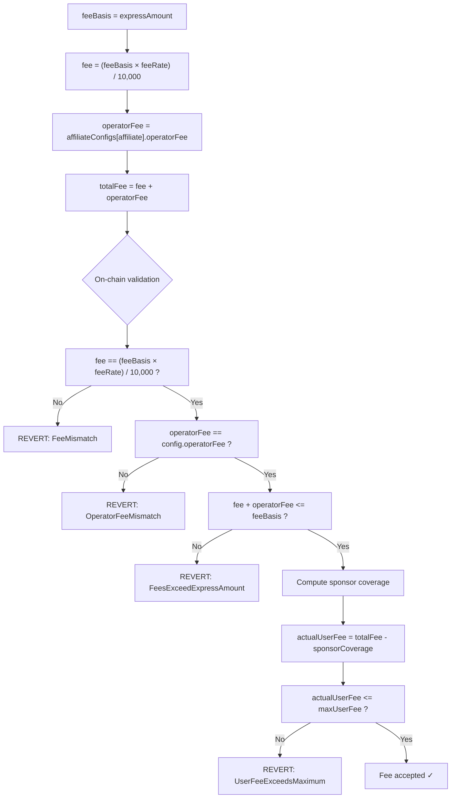
```mermaid
flowchart TD
    A["feeBasis = expressAmount"] --> B["fee = (feeBasis × feeRate) / 10,000"]
    B --> C["operatorFee = affiliateConfigs[affiliate].operatorFee"]
    C --> D["totalFee = fee + operatorFee"]
    D --> E{On-chain validation}

    E --> F["fee == (feeBasis × feeRate) / 10,000 ?"]
    F -->|No| F1["REVERT: FeeMismatch"]
    F -->|Yes| G["operatorFee == config.operatorFee ?"]
    G -->|No| G1["REVERT: OperatorFeeMismatch"]
    G -->|Yes| H["fee + operatorFee <= feeBasis ?"]
    H -->|No| H1["REVERT: FeesExceedExpressAmount"]
    H -->|Yes| I[Compute sponsor coverage]
    I --> J["actualUserFee = totalFee - sponsorCoverage"]
    J --> K["actualUserFee <= maxUserFee ?"]
    K -->|No| K1["REVERT: UserFeeExceedsMaximum"]
    K -->|Yes| L[Fee accepted ✓]
```

### 6.2 Fee Deduction Order (in `transferToReceivers`)

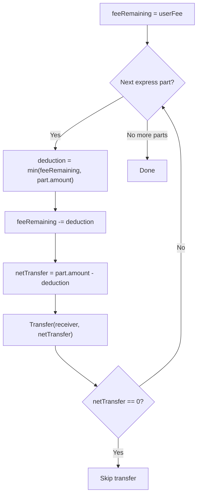
```mermaid
flowchart TD
    A["feeRemaining = userFee"] --> B{Next express part?}
    B -->|Yes| C["deduction = min(feeRemaining, part.amount)"]
    C --> D["feeRemaining -= deduction"]
    D --> E["netTransfer = part.amount - deduction"]
    E --> G["Transfer(receiver, netTransfer)"]
    G --> I{netTransfer == 0?}
    I -->|Yes| J[Skip transfer]
    I -->|No| B
    B -->|No more parts| K[Done]
```

#### Numeric Example: Fee Cascading Across 3 Parts

```
Scenario: Bot pre-computes fee distribution across 3 parts before signing

Setup:
  affiliate              = 0xFrontend
  feeRate                = 150 bps (1.5%)
  operatorFee            = 0 USDC
  sponsorBalance         = 0 USDC (no sponsor)
  expressAmount          = 1,000 USDC (all 3 parts combined, express-only)
  Parts (order matters for fee cascading):
    Part 0: { amount: 100 USDC, express-only, virtualProvider: 0x0, receiver: 0xA }
    Part 1: { amount: 400 USDC, express-only, virtualProvider: 0x0, receiver: 0xB }
    Part 2: { amount: 500 USDC, express-only, virtualProvider: 0x0, receiver: 0xC }

Step 1 — Bot sees: withdraw request from Alice for 1,000 USDC across 3 parts
  Bot reads on-chain:
    affiliateConfigs[0xFrontend].feeRate    = 150
    affiliateConfigs[0xFrontend].operatorFee = 0
    sponsorBalances[0xFrontend]             = 0
  Bot checks:
    feeBasis   = expressAmount = 1,000 USDC
    fee        = (1,000 * 150) / 10,000 = 15 USDC
    operatorFee = 0 USDC
    totalFee   = 15 + 0 = 15 USDC
    fee + operatorFee (15) <= feeBasis (1,000)? YES
    sponsorCoverage = 0 (no sponsor)
    userFee    = 15 - 0 = 15 USDC
  Decision: Sign option with fee=15, operatorFee=0, maxUserFee=15

Step 2 — Bot pre-computes: how will 15 USDC fee cascade across parts?
  (Bot simulates transferToReceivers to verify receivers get expected amounts)

  feeRemaining = 15

  Part 0 (100 USDC, express-only, receiver 0xA):
    deduction = min(15, 100) = 15
    feeRemaining = 15 - 15 = 0
    netTransfer = 100 - 15 = 85 USDC
    -> collateral.safeTransfer(0xA, 85)
    Receiver A gets: 85 USDC

  Part 1 (400 USDC, express-only, receiver 0xB):
    deduction = min(0, 400) = 0
    feeRemaining = 0
    netTransfer = 400 - 0 = 400 USDC
    -> collateral.safeTransfer(0xB, 400)
    Receiver B gets: 400 USDC

  Part 2 (500 USDC, express-only, receiver 0xC):
    deduction = min(0, 500) = 0
    feeRemaining = 0
    netTransfer = 500 - 0 = 500 USDC
    -> collateral.safeTransfer(0xC, 500)
    Receiver C gets: 500 USDC

  Decision: Proceed — total received = 85 + 400 + 500 = 985 USDC (out of 1,000; 15 fee)
            collectedFees[0xFrontend] += 15

  What if feeRate were 1,000 bps (10%) instead?
    fee = (1,000 * 1,000) / 10,000 = 100 USDC, userFee = 100
    Part 0: deduction = min(100, 100) = 100, netTransfer = 0 -> skip (zero-amount)
    Part 1: deduction = min(0, 400)   = 0,   netTransfer = 400 -> 0xB gets 400
    Part 2: deduction = min(0, 500)   = 0,   netTransfer = 500 -> 0xC gets 500
    Receiver A gets NOTHING — bot should warn user that small parts may be fully consumed by fees

  What if feeRate changed on-chain between signing and tx execution?
    Contract recomputes: fee == (feeBasis * newFeeRate) / 10,000
    If different from signed fee -> Reverts: FeeMismatch
    Bot's signed option becomes invalid — must re-sign with current rate
```

### 6.3 Bot Must Read Before Signing

- [ ] `affiliateConfigs(affiliate).feeRate` -- current fee rate
- [ ] `affiliateConfigs(affiliate).operatorFee` -- current operator fee
- [ ] If these change between signing and execution, the tx reverts

---

## 7. Sponsor System

### 7.1 Sponsor Coverage Flow

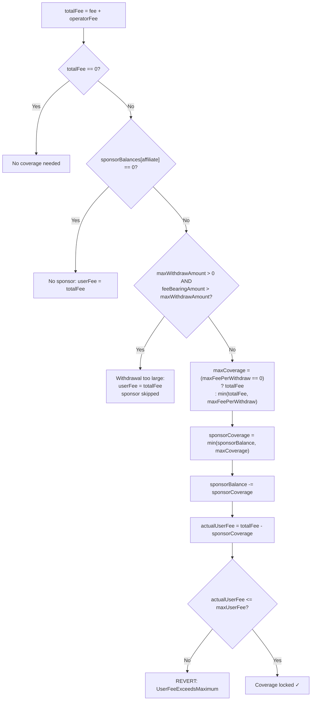
```mermaid
flowchart TD
    A["totalFee = fee + operatorFee"] --> B{totalFee == 0?}
    B -->|Yes| SKIP[No coverage needed]
    B -->|No| C{"sponsorBalances[affiliate] == 0?"}
    C -->|Yes| NOSPONSOR["No sponsor: userFee = totalFee"]
    C -->|No| D{"maxWithdrawAmount > 0 AND\nfeeBearingAmount > maxWithdrawAmount?"}
    D -->|Yes| TOOBIG["Withdrawal too large:\nuserFee = totalFee\nsponsor skipped"]
    D -->|No| E["maxCoverage = (maxFeePerWithdraw == 0)\n? totalFee\n: min(totalFee, maxFeePerWithdraw)"]
    E --> F["sponsorCoverage = min(sponsorBalance, maxCoverage)"]
    F --> G["sponsorBalance -= sponsorCoverage"]
    G --> H["actualUserFee = totalFee - sponsorCoverage"]
    H --> I{"actualUserFee <= maxUserFee?"}
    I -->|No| REVERT["REVERT: UserFeeExceedsMaximum"]
    I -->|Yes| OK["Coverage locked ✓"]
```

### 7.2 Sponsor Scenarios

| Scenario | Bot Must Handle |
|----------|----------------|
| Full sponsor coverage | `maxUserFee = 0`, user pays nothing |
| Partial sponsor coverage | `maxUserFee = totalFee - min(sponsorBalance, maxCoverage)` |
| No sponsor | `maxUserFee = totalFee` |
| Sponsor drained between sign and tx | Reverts `UserFeeExceedsMaximum` if `maxUserFee` was set too low |
| Sponsor balance changes mid-flight | Coverage locked at acceptance time, not processing time |
| Cancel/suspend refunds sponsor | `sponsorBalances[affiliate] += info.sponsorCoverage` |
| maxWithdrawAmount gate | Large withdrawals skip sponsorship entirely |
| maxFeePerWithdraw cap | Sponsor covers at most this much per withdrawal |
| Both caps active | Both checked independently |
| Zero caps | 0 means "no limit" for both settings |

### 7.3 Bot Checklist for Sponsors

- [ ] Read `sponsorBalances(affiliate)` at signing time
- [ ] Read `sponsorConfigs(affiliate)` for caps
- [ ] Compute expected `sponsorCoverage` using the same formula as the contract
- [ ] Set `maxUserFee` = `totalFee - sponsorCoverage`
- [ ] Account for concurrent withdrawals draining sponsor between sign and execution
- [ ] Consider setting `maxUserFee` slightly higher than computed to absorb race conditions
- [ ] After cancel/suspend: sponsor balance is restored (update tracking)

#### Numeric Example: Sponsor Coverage with Caps

```
Scenario: Bot checks sponsor balance and caps, decides user fee vs sponsor fee

Setup:
  affiliate              = 0xFrontend
  feeRate                = 200 bps (2%)
  operatorFee            = 5 USDC
  sponsorBalances[0xFrontend]         = 100 USDC
  sponsorConfigs[0xFrontend]:
    maxFeePerWithdraw    = 8 USDC
    maxWithdrawAmount    = 600 USDC

--- Scenario A: 500 USDC withdrawal (within maxWithdrawAmount) ---

Step 1 — Bot sees: Alice requests express withdrawal of 500 USDC
  Bot reads on-chain:
    affiliateConfigs[0xFrontend].feeRate     = 200
    affiliateConfigs[0xFrontend].operatorFee = 5e6
    sponsorBalances[0xFrontend]              = 100e6
    sponsorConfigs[0xFrontend].maxFeePerWithdraw  = 8e6
    sponsorConfigs[0xFrontend].maxWithdrawAmount  = 600e6
  Bot checks (replaying _lockFee logic):
    feeBasis        = 500 USDC
    fee             = (500 * 200) / 10,000 = 10 USDC
    totalFee        = 10 + 5 = 15 USDC
    feeBearingAmount = 500 <= maxWithdrawAmount (600)? YES -> sponsor eligible
    maxCoverage     = min(totalFee, maxFeePerWithdraw) = min(15, 8) = 8 USDC
    sponsorCoverage = min(sponsorBalance, maxCoverage) = min(100, 8) = 8 USDC
    actualUserFee   = totalFee - sponsorCoverage = 15 - 8 = 7 USDC
  Decision: Sign option with fee=10, operatorFee=5, maxUserFee=7
    On-chain: sponsorBalances[0xFrontend] decreases 100 -> 92

--- Scenario B: 700 USDC withdrawal (exceeds maxWithdrawAmount) ---

Step 1 — Bot sees: Bob requests express withdrawal of 700 USDC
  Bot reads on-chain: (same config as above)
  Bot checks:
    feeBasis         = 700 USDC
    fee              = (700 * 200) / 10,000 = 14 USDC
    totalFee         = 14 + 5 = 19 USDC
    feeBearingAmount = 700 > maxWithdrawAmount (600)? YES -> sponsor SKIPPED
    (contract: if config.maxWithdrawAmount > 0 && feeBearingAmount > config.maxWithdrawAmount: return)
    sponsorCoverage  = 0
    actualUserFee    = 19 USDC
  Decision: Sign option with fee=14, operatorFee=5, maxUserFee=19
    Bot does NOT assume sponsor will cover anything — the withdrawal is too large

--- Scenario C: concurrent race (two users, sponsor has only 10 USDC) ---

Setup change: sponsorBalances[0xFrontend] = 10 USDC

Step 1 — Bot sees: Alice and Bob both request 500 USDC withdrawals simultaneously
  Bot reads on-chain:
    sponsorBalances[0xFrontend] = 10 USDC
  Bot checks for Alice:
    totalFee = 15, maxCoverage = min(15, 8) = 8, sponsorCoverage = min(10, 8) = 8
    actualUserFee = 15 - 8 = 7  -> sign maxUserFee = 7
  Bot checks for Bob:
    totalFee = 15, maxCoverage = min(15, 8) = 8, sponsorCoverage = min(10, 8) = 8
    actualUserFee = 15 - 8 = 7  -> sign maxUserFee = 7

  What happens if Alice's tx lands first?
    Alice acceptance: sponsorCoverage = 8, sponsorBalance: 10 -> 2
    Bob acceptance: maxCoverage = min(15, 8) = 8, but min(2, 8) = 2
    Bob's actualUserFee = 15 - 2 = 13
    13 > maxUserFee (7) -> REVERT: UserFeeExceedsMaximum
    Bob's withdrawal fails

  Decision: For concurrent requests, bot should sign maxUserFee = totalFee (15)
    as worst case (sponsor fully drained before this tx lands)
    This guarantees acceptance even if sponsor balance drops to 0
    User sees lower actual fee if sponsor has funds, higher if drained
```

#### Numeric Example: Sponsor Concurrent Depletion (Simplified Setup)

```
Scenario: Two users request withdrawals concurrently, sponsor has limited balance

Setup:
  sponsorBalances[aff] = 10 USDC
  sponsorConfigs[aff] = { maxFeePerWithdraw: 8, maxWithdrawAmount: 0 (no cap) }

Step 1 — Bot sees: Alice requests 500 USDC INSTANT, fee = 5 USDC, operatorFee = 1
  Bot reads: sponsorBalances[aff] = 10
  Bot computes: totalFee = 5 + 1 = 6
    sponsorCoverage = min(10, min(8, 6)) = 6
    maxUserFee = 6 - 6 = 0
  BUT WAIT — Bob's request is also pending...

Step 2 — Bot sees: Bob requests 500 USDC INSTANT, fee = 5, operatorFee = 1
  Bot reads: sponsorBalances[aff] = 10 (hasn't changed yet — Alice's tx not mined)
  Bot naively computes: sponsorCoverage = 6, maxUserFee = 0

Step 3 — Alice's tx mines first:
  sponsorBalances = 10 - 6 = 4

Step 4 — Bob's tx mines second:
  sponsorCoverage = min(4, min(8, 6)) = 4
  actualUserFee = 6 - 4 = 2
  But bot signed maxUserFee = 0 → REVERTS UserFeeExceedsMaximum

Correct strategy:
  For concurrent requests, bot should sign maxUserFee = totalFee (worst case: sponsor drained)
  OR serialize: wait for Alice's tx to confirm before signing Bob's option
```

#### Best Practice: maxUserFee Safety Margin

```
Scenario: Bot uses maxUserFee = totalFee as a safety margin

Setup:
  sponsorBalances[aff] = 50 USDC
  sponsorConfigs[aff] = { maxFeePerWithdraw: 10, maxWithdrawAmount: 0 }
  Alice requests 1000 USDC INSTANT, fee = 20 USDC, operatorFee = 5

Step 1 — Bot computes expected fees:
  totalFee = 20 + 5 = 25
  expectedSponsorCoverage = min(50, min(10, 25)) = 10
  expectedUserFee = 25 - 10 = 15

Step 2 — Bot signs maxUserFee = totalFee (25), NOT expectedUserFee (15)
  This way, even if the sponsor is completely drained before Alice's tx lands,
  the user pays at most totalFee (25) — the contract never charges more than totalFee.

Step 3 — What actually happens on-chain:
  Case A: sponsor still has funds   → actualUserFee = 25 - 10 = 15 (user pays 15)
  Case B: sponsor drained to 3 USDC → actualUserFee = 25 - 3  = 22 (user pays 22, still <= 25)
  Case C: sponsor fully drained     → actualUserFee = 25 - 0  = 25 (user pays 25, still <= 25)
  All three cases succeed because maxUserFee = totalFee covers the worst case.

  If bot had signed maxUserFee = 15 (expectedUserFee):
    Cases B and C would revert UserFeeExceedsMaximum.

Best practice:
  - Bot computes expectedUserFee for display to the user ("estimated fee: 15, max fee: 25")
  - Bot signs maxUserFee = totalFee for the on-chain option
  - User is informed of the fee range upfront: they pay at most totalFee, likely less if sponsor active
  - This eliminates all sponsor-related race condition reverts
```

#### Numeric Example: Sponsor Config Change Between Signing and Execution

```
Scenario: Admin changes sponsor config after bot signs option but before user submits

Setup:
  sponsorBalances[aff] = 100 USDC
  sponsorConfigs[aff] = { maxFeePerWithdraw: 20, maxWithdrawAmount: 0 }
  Alice requests 500 USDC INSTANT, fee = 10, operatorFee = 5

Step 1 — Bot reads on-chain state and signs:
  totalFee = 10 + 5 = 15
  maxCoverage = min(15, 20) = 15
  sponsorCoverage = min(100, 15) = 15
  actualUserFee = 15 - 15 = 0
  Bot signs maxUserFee = 0 (expecting full sponsor coverage)

Step 2 — Admin calls setSponsorConfig(aff, maxFeePerWithdraw=5, maxWithdrawAmount=0)
  sponsorConfigs[aff].maxFeePerWithdraw is now 5 (was 20)

Step 3 — Alice submits the signed option to SYMMIO, which calls onWithdrawRequest:
  On-chain _lockFee computes:
    totalFee = 15
    maxCoverage = min(15, 5) = 5       ← reduced by new config
    sponsorCoverage = min(100, 5) = 5
    actualUserFee = 15 - 5 = 10
  Check: actualUserFee (10) > maxUserFee (0)?  YES → REVERT UserFeeExceedsMaximum

  Alice's withdrawal fails because the sponsor config changed after signing.

Correct strategy:
  - Sign maxUserFee = totalFee to absorb config changes
  - OR monitor setSponsorConfig / SponsorConfigUpdated events
    and invalidate in-flight options when config changes
  - Invalidation approach: set short option deadlines (e.g., 60 seconds)
    so stale options expire quickly and users re-request fresh ones
```

---

## 8. Validator System

### 8.1 Validator Attestation Flow

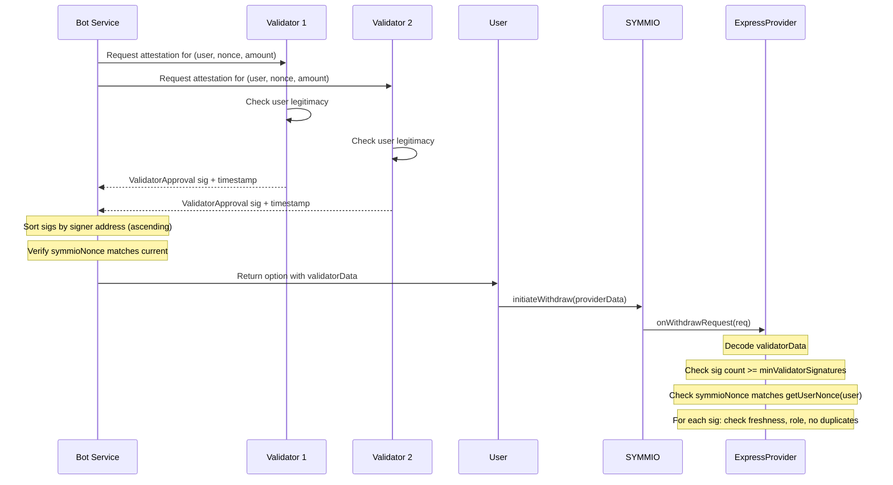
```mermaid
sequenceDiagram
    participant Bot as Bot Service
    participant V1 as Validator 1
    participant V2 as Validator 2
    participant U as User
    participant S as SYMMIO
    participant EP as ExpressProvider

    Bot->>V1: Request attestation for (user, nonce, amount)
    Bot->>V2: Request attestation for (user, nonce, amount)
    V1->>V1: Check user legitimacy
    V2->>V2: Check user legitimacy
    V1-->>Bot: ValidatorApproval sig + timestamp
    V2-->>Bot: ValidatorApproval sig + timestamp

    Note over Bot: Sort sigs by signer address (ascending)
    Note over Bot: Verify symmioNonce matches current

    Bot->>U: Return option with validatorData
    U->>S: initiateWithdraw(providerData)
    S->>EP: onWithdrawRequest(req)

    Note over EP: Decode validatorData
    Note over EP: Check sig count >= minValidatorSignatures
    Note over EP: Check symmioNonce matches getUserNonce(user)
    Note over EP: For each sig: check freshness, role, no duplicates
```

### 8.2 When Validators Are Required

| Condition | Validators Checked? |
|-----------|-------------------|
| `minValidatorSignatures > 0` | Yes, for ALL option types |
| `minValidatorSignatures == 0` | No |
| IMMEDIATE option type | ALWAYS required (reverts `ValidatorsRequiredForImmediate` if disabled) |

### 8.3 ValidatorApproval EIP-712 Structure

```
ValidatorApproval(address user, uint256 nonce, uint256 amount, uint256 timestamp, uint256 symmioNonce)
```

- `user` -- withdrawing user
- `nonce` -- same nonce as the WithdrawOption (the user's current nonce on ExpressProvider)
- `amount` -- `expressAmount` (total fee-bearing amount)
- `timestamp` -- when the validator signed (must be <= `block.timestamp`)
- `symmioNonce` -- user's current nonce on SYMMIO (`getUserNonce(user)`)

### 8.4 Validation Rules

- [ ] `signatures.length == timestamps.length` (else `ArrayLengthMismatch`)
- [ ] `signatures.length >= minValidatorSignatures` (else `InsufficientValidatorSignatures`)
- [ ] `symmioNonce == ISymmio(symmio).getUserNonce(user)` (else `InvalidNonce`)
- [ ] For each signature:
  - [ ] `timestamps[i] <= block.timestamp` (no future-dating, else `ValidatorApprovalExpired`)
  - [ ] `block.timestamp - timestamps[i] <= validatorApprovalTimeout` (not stale, else `ValidatorApprovalExpired`)
  - [ ] Recovered signer has `VALIDATOR_ROLE` (else `InvalidValidator`)
  - [ ] Signers are sorted ascending by address (else `DuplicateValidator`)
  - [ ] No duplicate signers

### 8.5 Bot Checklist for Validators

- [ ] Gather >= `minValidatorSignatures` from distinct VALIDATOR_ROLE holders
- [ ] Sort signatures by signer address (ascending) before encoding
- [ ] Verify each timestamp is recent (within `validatorApprovalTimeout` of expected block time)
- [ ] Verify user's SYMMIO nonce hasn't changed since validators signed
- [ ] If user acts on SYMMIO after validators sign: re-gather all attestations
- [ ] If admin raises `minValidatorSignatures`: previously gathered sets may be insufficient
- [ ] If admin reduces `validatorApprovalTimeout`: previously valid sigs may expire
- [ ] Monitor `RoleRevoked` events for VALIDATOR_ROLE: revoked validators' pending sigs become invalid

### 8.6 Edge Cases

| Edge Case | Result |
|-----------|--------|
| Exact expiry boundary (`timestamp + timeout == block.timestamp`) | VALID (strict `>` check) |
| Future-dated timestamp | REJECTED (`ValidatorApprovalExpired`) |
| Same validator signs twice | REJECTED (`DuplicateValidator`) |
| Wrong amount in validator sig | REJECTED (`InvalidValidator` -- recovered address differs) |
| Wrong nonce in validator sig | REJECTED (`InvalidValidator` -- recovered address differs) |
| Validator role revoked after signing | REJECTED at submission time |
| More sigs than minimum | All validated, extras must also be valid |
| symmioNonce changed after signing | REJECTED (`InvalidNonce`) |

#### Numeric Example: Validator Attestation for IMMEDIATE

```
Scenario: Bot gathers validator sigs, checks timestamps, decides if enough valid sigs

Setup:
  minValidatorSignatures  = 2
  validatorApprovalTimeout = 30s
  Validators with VALIDATOR_ROLE:
    V1 at 0xAAA...1
    V2 at 0xBBB...2
    V3 at 0xCCC...3
  User: 0xAlice
    nonces[Alice]          = 5  (ExpressProvider nonce)
    getUserNonce(Alice)     = 12 (SYMMIO nonce)
    expressAmount = 1,000e6 (1,000 USDC)

Step 1 — Bot sees: Alice requests IMMEDIATE withdrawal of 1,000 USDC
  Bot reads on-chain:
    minValidatorSignatures  = 2
    validatorApprovalTimeout = 30s
    nonces[Alice]           = 5
    getUserNonce(Alice)      = 12
  Bot checks:
    IMMEDIATE requires minValidatorSignatures > 0? YES (2 > 0) — validators enabled
    Need >= 2 valid signatures from distinct VALIDATOR_ROLE holders
  Decision: Request attestations from V1, V2 (and optionally V3 as backup)

Step 2 — Bot sees: validator responses arrive
  V1 responds at T=100: signs ValidatorApproval(Alice, 5, 1000e6, 100, 12) -> sig_V1
  V2 responds at T=102: signs ValidatorApproval(Alice, 5, 1000e6, 102, 12) -> sig_V2
  Bot checks each response:
    V1 timestamp 100: is it in the past? YES (current time ~102)
    V2 timestamp 102: is it in the past? YES
    Both used nonce=5 matching nonces[Alice]? YES
    Both used symmioNonce=12 matching getUserNonce(Alice)? YES
    Both used amount=1000e6 matching expressAmount? YES
    Count: 2 valid sigs >= minValidatorSignatures (2)? YES
  Decision: Sort by signer address for encoding
    0xAAA...1 < 0xBBB...2 -> order: [sig_V1, sig_V2], timestamps: [100, 102]
    Encode: validatorData = abi.encode([sig_V1, sig_V2], [100, 102], 12)

Step 3 — Bot checks: will sigs still be valid when user submits?
  Bot estimates user will submit at ~T=115 (13s from now)
  Bot checks freshness for each sig at T=115:
    V1: 115 - 100 = 15s <= 30s (timeout)? YES — still valid
    V2: 115 - 102 = 13s <= 30s (timeout)? YES — still valid
  Decision: Return signed option + validatorData to Alice
  What if user delays until T=135?
    V1: 135 - 100 = 35s > 30s -> EXPIRED
    -> Reverts: ValidatorApprovalExpired
    -> Bot should warn user: "submit within 28s or sigs expire"

Step 4 — Bot considers: what if Alice acted on SYMMIO between T=102 and submission?
  Bot reads on-chain (just before returning option to Alice):
    getUserNonce(Alice) = 12 (unchanged) -> safe to proceed
  What if Alice makes a SYMMIO action (e.g., another withdrawal) after receiving the option?
    SYMMIO nonce becomes 13
    On submission: contract checks getUserNonce(Alice) == symmioNonce (12)
    12 != 13 -> Reverts: InvalidNonce
    -> Bot must re-gather ALL attestations with symmioNonce = 13
    -> Previous validator sigs are permanently invalidated (wrong symmioNonce baked in)

  What if V2's VALIDATOR_ROLE is revoked between T=102 and submission?
    On submission: contract recovers signer from sig_V2, checks hasRole(VALIDATOR_ROLE, V2)
    V2 no longer has role -> Reverts: InvalidValidator
    -> Bot monitors RoleRevoked events; if V2 revoked, re-gather with V3 replacing V2

  What if bot sends only 1 sig (from V1)?
    signatures.length (1) < minValidatorSignatures (2)
    -> Reverts: InsufficientValidatorSignatures
    -> Bot must always gather at least minValidatorSignatures before returning option
```

---

## 10. Multi-Part Withdrawals

### 10.1 Part Classification

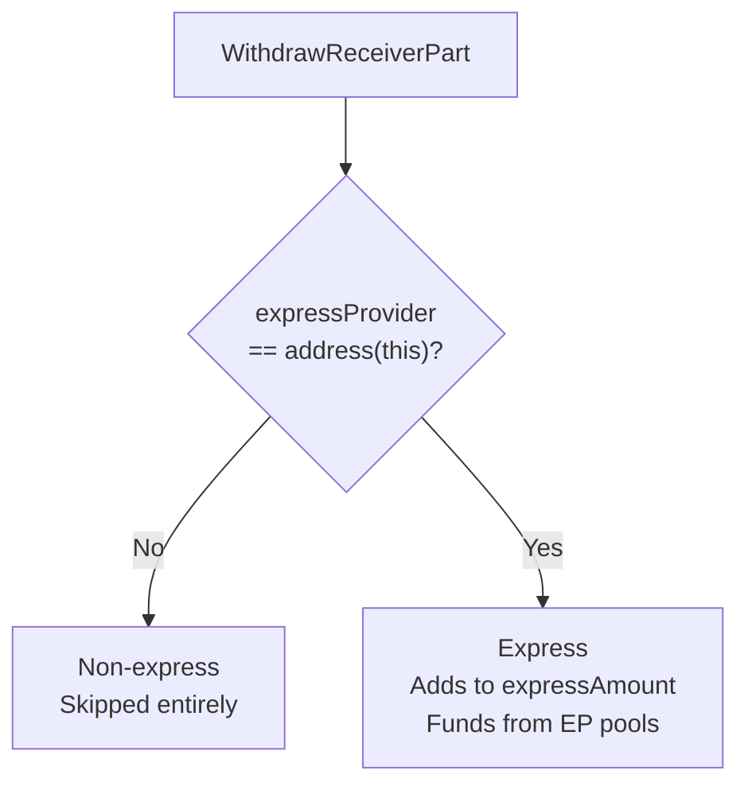
```mermaid
flowchart TD
    A[WithdrawReceiverPart] --> B{"expressProvider\n== address(this)?"}
    B -->|No| C[Non-express\nSkipped entirely]
    B -->|Yes| D["Express\nAdds to expressAmount\nFunds from EP pools"]
```

| Part Type | Condition | Contributes to |
|-----------|-----------|---------------|
| Express | `expressProvider == this` (virtualProvider must be `address(0)`) | `expressAmount` |
| Non-express | `expressProvider != this` | Skipped entirely |

### 10.2 Multi-Part Fee Cascading

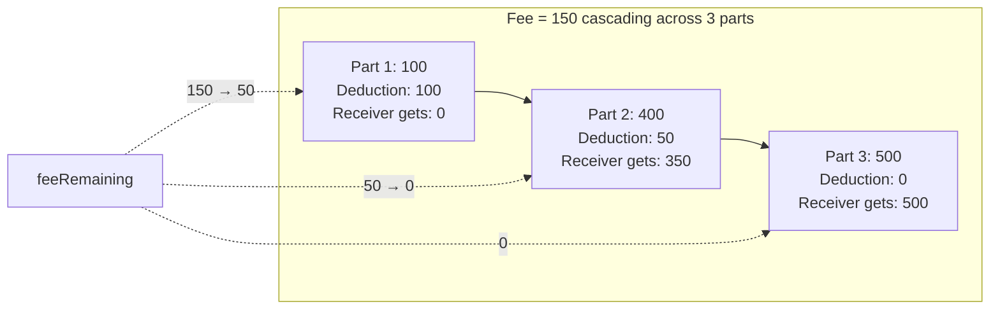
```mermaid
flowchart LR
    subgraph "Fee = 150 cascading across 3 parts"
        P1["Part 1: 100\nDeduction: 100\nReceiver gets: 0"] --> P2["Part 2: 400\nDeduction: 50\nReceiver gets: 350"]
        P2 --> P3["Part 3: 500\nDeduction: 0\nReceiver gets: 500"]
    end
    FEE["feeRemaining"] -.->|"150 → 50"| P1
    FEE -.->|"50 → 0"| P2
    FEE -.->|"0"| P3
```

### 10.3 Credit Line in Multi-Part Withdrawals

When a withdrawal uses credit (creditAmount > 0), the credit line applies to the total withdrawal, not per-part:
- At acceptance: `reserveDebt(creditAmount)` reserves the total credit across all parts
- At processing: `activateDebt(creditAmount)` activates the debt when funds are transferred
- At finalization: `settleDebt(creditAmount)` settles when SYMMIO reimburses
- On cancel/suspend: `cancelReservation(creditAmount)` releases the reserved credit

### 10.4 partsHash Integrity

- [ ] `partsHash = keccak256(abi.encode(parts))` stored at acceptance
- [ ] `processWithdraw` and `unlockAndProcess` verify provided parts match
- [ ] ANY difference (amounts, receivers, order, count) causes `PartsMismatch` revert
- [ ] Bot MUST store and replay the exact same parts array

#### Numeric Example: 3-Part Express Withdrawal with Credit

```
Scenario: Bot handles a multi-part INSTANT withdrawal with credit line

Setup:
  generalBalance = 5,000 USDC,   lockedGeneralBalance = 4,500 USDC (500 unlocked)
  affiliateBalances[0xAffiliate] = 200 USDC, lockedAffiliateBalances[0xAffiliate] = 0
  creditLine.available() = 1,000 USDC
  affiliateConfigs[0xAffiliate] = { feeRate: 100 (1%), operatorFee: 2e6 }
  sponsorBalances[0xAffiliate] = 0 (no sponsor)

Step 1 -- Bot sees: 0xAlice requests withdrawal of 1,300 USDC total, split into 3 parts:
  Part 0: { amount: 300, expressProvider: EP, virtualProvider: 0x0, receiver: 0xA }
  Part 1: { amount: 600, expressProvider: EP, virtualProvider: 0x0, receiver: 0xA }
  Part 2: { amount: 400, expressProvider: EP, virtualProvider: 0x0, receiver: 0xB }

Step 2 -- Bot classifies parts and computes amounts:
  Bot reads each part's expressProvider:
    Part 0: expressProvider == EP -> express
    Part 1: expressProvider == EP -> express
    Part 2: expressProvider == EP -> express
  Bot computes:
    expressAmount = 300 + 600 + 400 = 1,300 (sum of all express parts)

Step 3 -- Bot decides the affiliate/general/credit split:
  Bot checks: affiliateBalances[0xAffiliate] - lockedAffiliateBalances[0xAffiliate]
              = 200 - 0 = 200 unlocked affiliate USDC
  Bot checks: generalBalance - lockedGeneralBalance = 500 unlocked general USDC
  Bot checks: creditLine.available() = 1,000 USDC
  Bot decides: allocate affiliateAmount = 200, generalAmount = 500, creditAmount = 600
    -> expressAmount = affiliateAmount + generalAmount + creditAmount = 200 + 500 + 600 = 1,300
  Bot checks: 500 <= 500 (unlocked general) -> OK
              200 <= 200 (unlocked affiliate) -> OK
              600 <= 1,000 (available credit) -> OK

Step 4 -- Bot computes fees:
  Bot reads on-chain: affiliateConfigs[0xAffiliate].feeRate = 100 (1%)
  Bot reads on-chain: affiliateConfigs[0xAffiliate].operatorFee = 2e6
  Bot computes:
    feeBasis = expressAmount = 1,300
    fee = 1,300 * 100 / 10,000 = 13 USDC
    operatorFee = 2 USDC
    totalFee = 13 + 2 = 15 USDC
  Bot checks: sponsorBalances[0xAffiliate] = 0 -> no sponsor coverage
    sponsorCoverage = 0, userFee = 15, maxUserFee = 15
  Bot checks: totalFee (15) <= feeBasis (1,300) -> OK (fees do not exceed amount)
  Decision: Sign INSTANT option with these fee values.

Step 5 -- Bot checks credit line capacity before signing:
  Bot reads on-chain:
    creditLine.available() = 1,000 >= 600 (creditAmount) -> OK
  Decision: Credit line has sufficient capacity. Sign and offer.
  At acceptance: reserveDebt(600) reserves 600 USDC on the credit line.
    Decision: Reject the request or offer a smaller amount.

Step 6 -- Bot observes: WithdrawAccepted(0xAlice, 99, INSTANT) event
  Bot reads on-chain (what the contract did during acceptance):
    lockedGeneralBalance: 4,500 -> 5,000 (+500 generalAmount)
    lockedAffiliateBalances[0xAffiliate]: 0 -> 200 (+200 affiliateAmount)
    CLM.reserveDebt(0xAlice, 99, 600, creditData): reservedDebt += 600
    partsHash stored for integrity check
  Bot checks: withdrawInfos[0xAlice][99].status == ACCEPTED
  Bot stores: the exact parts array (needed for processWithdraw)
  Decision: Schedule processWithdraw after securityWindow (20s).

Step 7 -- Bot processes after security window:
  Bot checks: block.timestamp >= acceptedAt + 20s (securityWindow)
  Bot checks: status still ACCEPTED (not LOCKED, not CANCELLED)
  Decision: Call processWithdraw(0xAlice, 99, parts).

  Contract executes fee cascading through transferToReceivers:
    feeRemaining = 15 (userFee)

    Part 0 (300, express-only, receiver 0xA):
      deduction = min(15, 300) = 15
      feeRemaining = 15 - 15 = 0
      EP transfers 300 - 15 = 285 USDC to 0xA

    Part 1 (600, VP1, receiver 0xA):
      deduction = min(0, 600) = 0 (fee already exhausted)
      VP1.releaseToUser(0xAlice, 99, 0xA, 600)
      -> VP1._lockedBalance: 600 -> 0, 600 USDC transferred to 0xA

    Part 2 (400, VP2, receiver 0xB):
      deduction = 0
      VP2.releaseToUser(0xAlice, 99, 0xB, 400)
      -> VP2._lockedBalance: 400 -> 0, 400 USDC transferred to 0xB

  Pool balance updates:
    lockedGeneralBalance -= 200, lockedAffiliateBalances[0xAffiliate] -= 100
    generalBalance -= 200, affiliateBalances[0xAffiliate] -= 100
    collectedFees[0xAffiliate] += 13, collectedOperatorFees[0xAffiliate] += 2

  Results:
    0xA receives: 285 (from EP) + 600 (from VP1) = 885 USDC
    0xB receives: 400 USDC (from VP2)
    Total disbursed: 1,285 out of 1,300 (15 USDC fee retained)
    Status -> PROCESSED

  What if the user had cancelled before processWithdraw?
    Contract calls _releaseWithdraw:
      lockedGeneralBalance -= 200, lockedAffiliateBalances -= 100
      VP1.unlock(0xAlice, 99): VP1._balance restored 200 -> 800
      VP2.unlock(0xAlice, 99): VP2._balance restored 200 -> 600
      All locks released, no funds transferred, Status -> CANCELLED
```

---

## 11. Credit Line Integration

### 11.1 VirtualProvider is DEPRECATED

The `virtualProvider` field in `WithdrawReceiverPart` **must be `address(0)`**. Any part with a non-zero `virtualProvider` causes the contract to revert with `VirtualProviderDeprecated`. The Credit Line system fully replaces VirtualProvider for fast withdrawals.

```
// In LibParts.computeAmounts and transferToReceivers:
if (parts[i].virtualProvider != address(0)) revert LibErrors.VirtualProviderDeprecated();
```

- [ ] **Never set `virtualProvider`** in any withdrawal part -- always `address(0)`
- [ ] **Remove all VirtualProvider monitoring** from the bot (balance polling, lock tracking, etc.)
- [ ] **Do not deploy new VirtualProvider contracts** -- existing ones are inert

### 11.2 Credit Debt Lifecycle

Each credit-backed withdrawal tracks a debt through four possible states.

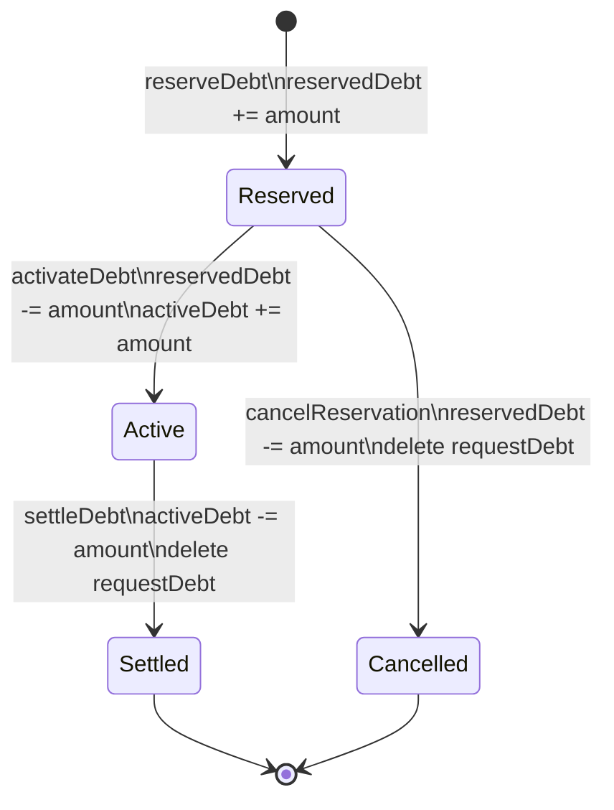
```mermaid
stateDiagram-v2
    [*] --> Reserved : reserveDebt\nreservedDebt += amount

    Reserved --> Active : activateDebt\nreservedDebt -= amount\nactiveDebt += amount

    Active --> Settled : settleDebt\nactiveDebt -= amount\ndelete requestDebt

    Reserved --> Cancelled : cancelReservation\nreservedDebt -= amount\ndelete requestDebt

    Settled --> [*]
    Cancelled --> [*]
```

```
reserveDebt:         reservedDebt += creditAmount  (on acceptance, before payout)
activateDebt:        reservedDebt -= amount, activeDebt += amount  (on processing, funds advanced)
settleDebt:          activeDebt -= amount, delete requestDebt[key]  (on finalization, debt cleared)
cancelReservation:   reservedDebt -= amount, delete requestDebt[key]  (cancel/suspend before payout)
```

**Who calls what:**

| Lifecycle event | Trigger | Called by |
|-----------------|---------|-----------|
| `reserveDebt` | `onWithdrawRequest` (acceptance) | ExpressProvider via SymmioHookFacet |
| `activateDebt` | `processWithdraw` / IMMEDIATE acceptance | ExpressProvider via LibCreditLine.activate |
| `settleDebt` | `onWithdrawComplete` (finalization) | ExpressProvider via LibCreditLine.settle |
| `cancelReservation` | `onWithdrawCancelRequest` / `onForceWithdrawCancel` / `onSuspendWithdraw` | ExpressProvider via LibCreditLine.releaseReservation |

**Key invariant:** `CreditLineManager.totalDebt() == reservedDebt + activeDebt`

**Credit is NOT supported for STANDARD withdrawals.** The contract reverts `CreditNotSupportedForStandard` if `opt.creditAmount > 0` and `opt.optionType == STANDARD`.

### 11.3 Bot Monitoring for Credit Lines

Each affiliate has its own `CreditLineManager` (a UUPS proxy). The bot must track one CLM per active affiliate.

- [ ] **Check `totalDebt()`** -- total outstanding credit exposure (reserved + active). Compare against caps to estimate remaining capacity.
- [ ] **Check `paused`** -- if `true`, all `reserveDebt` calls revert `CreditLinePaused`. The bot must not sign options with `creditAmount > 0` for this affiliate.
- [ ] **Check `blacklisted[user]`** -- if `true` for the requesting user, `reserveDebt` reverts `UserBlacklisted`. The bot must reject credit for blacklisted users.
- [ ] **Monitor debt cap headroom:**
  - `protocolMaxDebt` and `affiliateMaxDebt` -- absolute caps (0 = no limit). The effective cap is the tighter (non-zero minimum) of the two.
  - `protocolMaxDebtBps` and `affiliateMaxDebtBps` -- percentage caps as basis points of Muon `eligibleBase` (0 = no limit). Same tighter-of-two logic.
  - New debt is allowed only if `totalDebt() + creditAmount <= effectiveMaxDebt` AND `totalDebt() + creditAmount <= eligibleBase * effectiveMaxBps / 10000`.
- [ ] **Monitor `reservedDebt` vs `activeDebt` ratio** -- high `reservedDebt` means many accepted-but-not-yet-processed credit withdrawals. This is normal during the security window but may indicate processing delays if it persists.
- [ ] **Listen for CLM events** to maintain an accurate local state:
  - `DebtReserved(user, requestId, amount)` -- new credit accepted
  - `DebtActivated(user, requestId, amount)` -- credit advanced to user
  - `DebtSettled(user, requestId, amount)` -- credit repaid on finalization
  - `DebtCancelled(user, requestId, amount)` -- credit released on cancel
  - `PausedUpdated(bool)` -- credit line paused/unpaused
  - `UserBlacklistUpdated(user, bool)` -- user blacklist change
- [ ] **Alert on approaching caps** -- when `totalDebt()` exceeds 80% of `effectiveMaxDebt`, alert the affiliate operator
- [ ] **Verify CLM is set** -- `s.creditLineManagers[affiliate]` must not be `address(0)`. If unset, the contract reverts `CreditLineManagerNotSet` and credit cannot be used for that affiliate.

### 11.4 How Credit Lines Work

Credit lines let the ExpressProvider front more capital than it holds in its general and affiliate pools. The shortfall is covered by a "credit advance" from SYMMIO core via `advanceWithdraw`, backed by the affiliate's pool as implicit collateral.

**Muon oracle attestation:** Before accepting a credit-backed withdrawal, the contract verifies a Muon-signed `CreditData` struct:

```solidity
struct CreditData {
    bytes   reqId;             // Muon request identifier
    uint256 eligibleBase;      // Muon-computed aggregate eligible balance for the affiliate
    uint256 timestamp;         // when the Muon oracle produced this attestation
    bytes   gatewaySignature;  // Muon gateway signature
    IMuonSignatureVerifier.SchnorrSign sigs;  // Schnorr signature for verification
}
```

The Muon oracle computes `eligibleBase` off-chain as `freeEligible + haircutted(allocatedEligible) - excludedEligible`. The on-chain contract verifies:
1. **Freshness:** `block.timestamp <= data.timestamp + muonFreshnessWindow` (default 60s). Stale signatures revert `MuonSignatureExpired`.
2. **Schnorr signature:** The hash covers `(muonAppId, reqId, CLM address, eligibleBase, timestamp, chainId)`. Invalid signatures revert in the MuonSignatureVerifier.
3. **Debt caps:** Both absolute and percentage caps are checked against `totalDebt + creditAmount`.

**Flow during acceptance (`onWithdrawRequest`):**
1. Bot signs option with `creditAmount > 0` and provides encoded `CreditData` as `creditDataRaw`.
2. Contract looks up `s.creditLineManagers[affiliate]`; reverts if `address(0)`.
3. Contract calls `CLM.reserveDebt(user, requestId, creditAmount, creditData)`.
4. CLM verifies pause/blacklist, Muon signature, and caps. Records `requestDebt[key] = creditAmount`, increments `reservedDebt`.

**Flow during processing (`processWithdraw` or IMMEDIATE):**
1. `LibCreditLine.activate` calls `CLM.activateDebt(user, requestId)` -- moves debt from reserved to active.
2. `LibCreditLine.activate` calls `SYMMIO.advanceWithdraw(user, requestId, creditAmount)` -- SYMMIO transfers `creditAmount` of collateral to the ExpressProvider, which can then pay the user.

**Flow during finalization (`onWithdrawComplete`):**
1. SYMMIO sends back the non-credit portion of the withdrawal.
2. `LibCreditLine.settle` calls `CLM.settleDebt(user, requestId)` -- clears active debt and deletes the record.

**Flow on cancellation (before payout):**
1. `LibCreditLine.releaseReservation` calls `CLM.cancelReservation(user, requestId)` -- decrements `reservedDebt`, deletes the record.

**Credit loss on post-payout rollback:** If a withdrawal is force-cancelled or suspended after processing (Status = PROCESSED), the credit amount has already been advanced and paid to the user. `LibCreditLine.coverLoss` deducts `creditAmount` from `s.affiliateBalances[affiliate]` (the affiliate pool absorbs the loss) and calls `settleDebt` to clear the record.

### 11.5 Bot Decision Logic for Credit

```
On withdrawal request with creditAmount > 0:
  1. Verify: optionType != STANDARD (credit not supported)
  2. Verify: s.creditLineManagers[affiliate] != address(0)
  3. Read CLM state:
     - clm.paused() == false
     - clm.blacklisted(user) == false
     - currentDebt = clm.totalDebt()
  4. Estimate cap headroom (requires knowing eligibleBase from Muon):
     - effectiveMaxDebt = tighter_of(protocolMaxDebt, affiliateMaxDebt)
     - effectiveMaxBps  = tighter_of(protocolMaxDebtBps, affiliateMaxDebtBps)
     - absoluteOk = effectiveMaxDebt == 0 || currentDebt + creditAmount <= effectiveMaxDebt
     - percentOk  = effectiveMaxBps == 0  || currentDebt + creditAmount <= eligibleBase * effectiveMaxBps / 10000
  5. If all checks pass: sign the option and include fresh CreditData
  6. If any check fails: reject credit, or sign with creditAmount = 0
```

#### Numeric Example: INSTANT Withdrawal with Credit Line

```
Scenario: 500 USDC INSTANT withdrawal, 200 USDC backed by credit line

Setup:
  Affiliate: 0xAffiliate
  CreditLineManager: CLM (deployed as UUPS proxy for 0xAffiliate)
  affiliateConfigs[0xAffiliate] = { feeRate: 100 (1%), operatorFee: 0 }
  ExpressProvider pools:
    generalBalance = 2,000 USDC
    affiliateBalances[0xAffiliate] = 500 USDC
  CLM state:
    reservedDebt = 0, activeDebt = 0
    protocolMaxDebt = 10,000 USDC, affiliateMaxDebt = 5,000 USDC
    paused = false, blacklisted[0xAlice] = false

Step 1 -- Bot sees: withdrawal request for 500 USDC from 0xAlice
  Part 0: { amount: 500e6, expressProvider: EP, virtualProvider: address(0), receiver: 0xAlice }
  Bot decides to use credit for 200 USDC of the 500 USDC total.
  Bot computes funding split:
    creditAmount = 200e6
    affiliateAmount = 100e6  (from affiliate pool)
    generalAmount  = 200e6  (from general pool, computed as 500 - 100 - 200)
    expressAmount  = 500e6  (total across all parts for this EP)
  Bot computes fee:
    fee = 500 * 100 / 10,000 = 5 USDC (1% of 500)
    operatorFee = 0
    userFee = 5 USDC (no sponsor)

  Bot reads CLM state:
    clm.paused() = false -> OK
    clm.blacklisted(0xAlice) = false -> OK
    clm.totalDebt() = 0 -> headroom = 5,000 (affiliateMaxDebt)
    0 + 200 = 200 <= 5,000 -> within absolute cap -> OK
  Bot obtains fresh CreditData from Muon oracle:
    eligibleBase = 50,000 USDC, timestamp = now - 10s
    effectiveMaxBps = min(protocolMaxDebtBps, affiliateMaxDebtBps) -- say 1000 (10%)
    200 <= 50,000 * 1000 / 10,000 = 5,000 -> within percentage cap -> OK

  Decision: Sign INSTANT option with creditAmount = 200e6 and include CreditData.

Step 2 -- On-chain acceptance (SymmioHookFacet.onWithdrawRequest):
  Contract validates parts: virtualProvider == address(0) -> OK
  Contract checks: optionType == INSTANT, creditAmount > 0 -> not STANDARD -> OK
  Contract calls CLM.reserveDebt(0xAlice, reqId=7, 200e6, creditData):
    CLM verifies: not paused, not blacklisted -> OK
    CLM verifies: timestamp + 60 >= block.timestamp -> fresh -> OK
    CLM verifies: Muon Schnorr signature -> valid -> OK
    CLM verifies: 0 + 200e6 <= 5,000e6 (effective absolute cap) -> OK
    CLM verifies: 0 + 200e6 <= 50,000e6 * 1000 / 10,000 = 5,000e6 -> OK
    CLM state after:
      requestDebt[key] = 200e6
      reservedDebt = 200e6
      activeDebt = 0
  Contract locks pools:
    generalBalance: 2,000 -> 1,800 (locked 200)
    affiliateBalances[0xAffiliate]: 500 -> 400 (locked 100)
  Emits WithdrawAccepted(0xAlice, 7, INSTANT)

Step 3 -- Bot processes after security window (20s):
  Bot checks: block.timestamp >= acceptedAt + 20s -> YES
  Bot checks: withdrawInfos[0xAlice][7].status == ACCEPTED -> YES
  Decision: Call processWithdraw(0xAlice, 7, parts).

  Contract executes:
    a) LibCreditLine.activate(symmio, 0xAlice, 7, info):
       CLM.activateDebt(0xAlice, 7):
         requestActivated[key] = true
         reservedDebt: 200e6 -> 0
         activeDebt: 0 -> 200e6
       SYMMIO.advanceWithdraw(0xAlice, 7, 200e6):
         SYMMIO transfers 200 USDC to ExpressProvider
         (these are locked funds released early from SYMMIO's withdrawal escrow)

    b) transferToReceivers with userFee = 5e6:
       Part 0 (500e6, EP, receiver 0xAlice):
         deduction = min(5e6, 500e6) = 5e6
         feeRemaining = 0
         collateral.transfer(EP, 5e6)       -- 5 USDC fee to EP
         collateral.transfer(0xAlice, 495e6) -- 495 USDC to user

    ExpressProvider state after processing:
      generalBalance = 1,800 (locked portion was spent, replenished by advance)
      affiliateBalances[0xAffiliate] = 400
      collectedFees[0xAffiliate] += 5e6
      CLM: reservedDebt = 0, activeDebt = 200e6
    Status -> PROCESSED

  Where did the 500 USDC come from?
    200 USDC from general pool
    100 USDC from affiliate pool
    200 USDC from SYMMIO advance (credit)
    Total: 500 USDC paid to user (minus 5 USDC fee = 495 USDC received)

Step 4a -- Finalization (happy path, ~12 hours later):
  SYMMIO finalizes: sends back the non-advanced portion (500 - 200 = 300 USDC)
  to the ExpressProvider via onWithdrawComplete.
  Contract replenishes pools:
    generalBalance: 1,800 + 200 = 2,000 (restored)
    affiliateBalances[0xAffiliate]: 400 + 100 = 500 (restored)
  LibCreditLine.settle(0xAlice, 7, info):
    CLM.settleDebt(0xAlice, 7):
      activeDebt: 200e6 -> 0
      delete requestDebt[key]
      delete requestActivated[key]
  Final CLM state: reservedDebt = 0, activeDebt = 0 -- fully cleared.
  Status -> FINALIZED

Step 4b -- Cancellation before processing (alternative to step 3):
  Bot sees: onWithdrawCancelRequest or onForceWithdrawCancel for 0xAlice, request 7
  Contract calls LibCreditLine.releaseReservation(0xAlice, 7, info):
    CLM.cancelReservation(0xAlice, 7):
      reservedDebt: 200e6 -> 0
      delete requestDebt[key]
  Contract unlocks pools:
    generalBalance: 1,800 + 200 = 2,000 (restored)
    affiliateBalances[0xAffiliate]: 400 + 100 = 500 (restored)
  CLM state: reservedDebt = 0, activeDebt = 0 -- fully cleared, no loss.
  Status -> CANCELLED

Step 4c -- Post-payout rollback (force-cancel after PROCESSED, rare):
  If SYMMIO force-cancels AFTER processing (status was PROCESSED):
    The 200 USDC credit advance was already paid to 0xAlice.
    SYMMIO will not send those funds on finalization (they were already advanced).
    LibCreditLine.coverLoss(collateral, symmio, 0xAlice, 7, info):
      affiliateBalances[0xAffiliate] -= 200e6  (affiliate pool absorbs the loss)
      CLM.settleDebt(0xAlice, 7):
        activeDebt: 200e6 -> 0
        delete requestDebt[key]
    The 200 USDC loss comes from the affiliate pool.
    Note: In practice, forceCancelWithdraw requires block.timestamp < cooldownEndTime,
    so this path is extremely unlikely for PROCESSED express withdrawals.
```

---

## 12. Risk Lock / Unlock Flows

### 12.1 Lock Resolution Paths

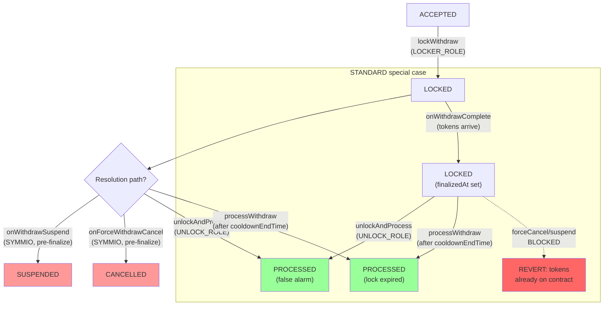
```mermaid
flowchart TD
    A["ACCEPTED"] -->|"lockWithdraw\n(LOCKER_ROLE)"| B["LOCKED"]

    B --> C{Resolution path?}

    C -->|"unlockAndProcess\n(UNLOCK_ROLE)"| D["PROCESSED\n(false alarm)"]
    C -->|"processWithdraw\n(after cooldownEndTime)"| E["PROCESSED\n(lock expired)"]
    C -->|"onWithdrawSuspend\n(SYMMIO, pre-finalize)"| F["SUSPENDED"]
    C -->|"onForceWithdrawCancel\n(SYMMIO, pre-finalize)"| G["CANCELLED"]

    subgraph "STANDARD special case"
        B -->|"onWithdrawComplete\n(tokens arrive)"| H["LOCKED\n(finalizedAt set)"]
        H -->|"unlockAndProcess\n(UNLOCK_ROLE)"| D
        H -->|"processWithdraw\n(after cooldownEndTime)"| E
        H -.->|"forceCancel/suspend\nBLOCKED"| X["REVERT: tokens\nalready on contract"]
    end

    style D fill:#9f9
    style E fill:#9f9
    style F fill:#f99
    style G fill:#f99
    style X fill:#f66
```

### 12.2 Role Separation (Critical Design)

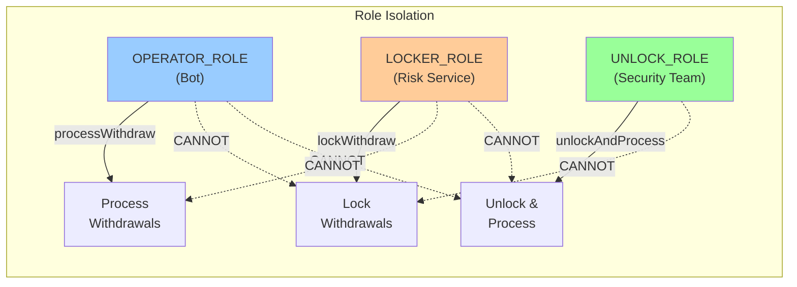
```mermaid
flowchart LR
    subgraph "Role Isolation"
        OP["OPERATOR_ROLE\n(Bot)"] -->|"processWithdraw"| PROC["Process\nWithdrawals"]
        LK["LOCKER_ROLE\n(Risk Service)"] -->|"lockWithdraw"| LOCK["Lock\nWithdrawals"]
        UL["UNLOCK_ROLE\n(Security Team)"] -->|"unlockAndProcess"| UNLOCK["Unlock &\nProcess"]
    end

    OP -.->|"CANNOT"| LOCK
    OP -.->|"CANNOT"| UNLOCK
    LK -.->|"CANNOT"| PROC
    LK -.->|"CANNOT"| UNLOCK
    UL -.->|"CANNOT"| LOCK

    style OP fill:#9cf
    style LK fill:#fc9
    style UL fill:#9f9
```

| Role | Can Lock? | Can Unlock? | Can Process? |
|------|-----------|-------------|-------------|
| OPERATOR_ROLE | NO | NO | YES |
| LOCKER_ROLE | YES | NO | NO |
| UNLOCK_ROLE | NO | YES | NO (only via unlockAndProcess) |

**Why:** Prevents the bot from unilaterally freezing and releasing funds. A higher-level authority (UNLOCK_ROLE) must approve unlocks.

### 12.3 Bot Checklist for Risk

- [ ] LOCKER_ROLE: call `lockWithdraw` when risk detected (during security window)
- [ ] After locking: notify admin/security team
- [ ] Monitor `WithdrawLocked` events: cancel any scheduled `processWithdraw`
- [ ] Do NOT attempt `processWithdraw` on LOCKED status before cooldown (reverts `NotAccepted`)
- [ ] After cooldown expires: LOCKED withdrawals become processable (the lock is no longer effective)
- [ ] For LOCKED STANDARD after finalization: only UNLOCK_ROLE can resolve

#### Numeric Example: LOCKED INSTANT — All Resolution Paths

```
Scenario: INSTANT withdrawal gets risk-locked — bot navigates four possible outcomes

Setup:
  INSTANT 500 USDC (generalAmount = 350, affiliateAmount = 150)
  acceptedAt = T=0, cooldownEndTime = T+43200 (T+12h)
  securityWindow = 20s, tolerancePeriod = 60s
  sponsorCoverage locked = 5 USDC, fee = 2.5 USDC, operatorFee = 0.5 USDC
  creditAmount = 100 (credit line reservation active on CLM)
  lockedGeneralBalance includes 350, lockedAffiliateBalances[aff] includes 150

Step 1 — Bot sees: WithdrawLocked(user, reqId) event at T=5s
  Bot reads on-chain: withdrawInfos[user][reqId].status == LOCKED
  Bot checks: Was this lock triggered by my LOCKER service or an external party?
  Decision: Cancel the scheduled processWithdraw task for (user, reqId).
            This withdrawal cannot be processed via normal flow while LOCKED.
            Monitor for one of four resolution paths below.

--- Path A: unlockAndProcess (false alarm) ---

Step 2A — Bot sees: WithdrawUnlockedAndProcessed(user, reqId) at T=300s
  Bot reads on-chain: status == PROCESSED
  Bot checks: Were pool deductions applied?
    - lockedGeneralBalance decreased by 350
    - lockedAffiliateBalances[aff] decreased by 150
    - generalBalance decreased by 350, affiliateBalances[aff] decreased by 150
    - Credit line debt activated and advanced from SYMMIO (100 USDC)
    - Fees collected: 2.5 (affiliate) + 0.5 (operator); sponsor covered 5 -> userFee = 0
  Decision: No further action needed on ExpressProvider side.
            Schedule finalizeWithdrawRequest on SYMMIO at T+43200 (cooldown end)
            so pools get replenished when SYMMIO reimburses.

--- Path B: processWithdraw after cooldown (lock expired) ---

Step 2B — Bot sees: block.timestamp reaches T+43200 (cooldown expired)
  Bot reads on-chain: status == LOCKED, cooldownEndTime = T+43200
  Bot checks: isLockedAfterCooldown?
    - status == LOCKED: yes
    - now (T+43200) >= cooldownEndTime (T+43200): yes
    - processableAt = cooldownEndTime = T+43200 for OPERATOR_ROLE
    - No suspension was issued during the 12h window -> risk window elapsed
  Decision: Call processWithdraw(user, reqId, parts) as OPERATOR_ROLE.
            The lock is bypassed because the full SYMMIO cooldown elapsed
            without any suspension. Contract treats this as safe to release.

  What if bot misses this window?
    At T+43260 (cooldownEndTime + tolerancePeriod = 43200 + 60), anyone can
    call processWithdraw permissionlessly. Bot should act before T+43260.

--- Path C: Suspended by SYMMIO ---

Step 2C — Bot sees: WithdrawSuspended(user, reqId) at T=600s
  Bot reads on-chain: status == SUSPENDED
  Bot checks: What did _releaseWithdraw clean up?
    - lockedGeneralBalance decreased by 350 (INSTANT unlocks general lock)
    - lockedAffiliateBalances[aff] decreased by 150 (INSTANT unlocks affiliate lock)
    - Credit line reservation released (if creditAmount > 0)
    - sponsorBalances[aff] += 5 (sponsor coverage refunded)
  Decision: Withdrawal is terminated. Cancel ALL scheduled actions for
            (user, reqId). Do not attempt processWithdraw (reverts NotAccepted)
            or finalizeWithdrawRequest (withdrawal is dead on SYMMIO side).
            Update internal pool tracking: all balances restored to pre-lock state.

--- Path D: LOCKED STANDARD with finalization (for comparison) ---

Step 2D — Bot sees: WithdrawFinalized(user, reqId) at T+43200
  Bot reads on-chain: status == LOCKED (still!), finalizedAt = T+43200
  Bot checks: Why is status still LOCKED after finalization?
    - onWithdrawComplete found status == LOCKED, so it set finalizedAt but
      did NOT transition to FINALIZED (lock is preserved)
    - 500 USDC tokens are sitting on ExpressProvider, held by the lock
    - forceCancel -> would REVERT (finalizedAt != 0, InvalidStatusForForceCancel)
    - suspend -> would REVERT (finalizedAt != 0, InvalidStatusForSuspend)
  Decision: The ONLY resolution is unlockAndProcess by UNLOCK_ROLE.
            Bot escalates to the admin/authority holding UNLOCK_ROLE.
            Bot cannot resolve this itself (OPERATOR_ROLE is insufficient).
```

---

## 13. Cancellation & Suspension

### 13.1 Cancellation Decision Tree

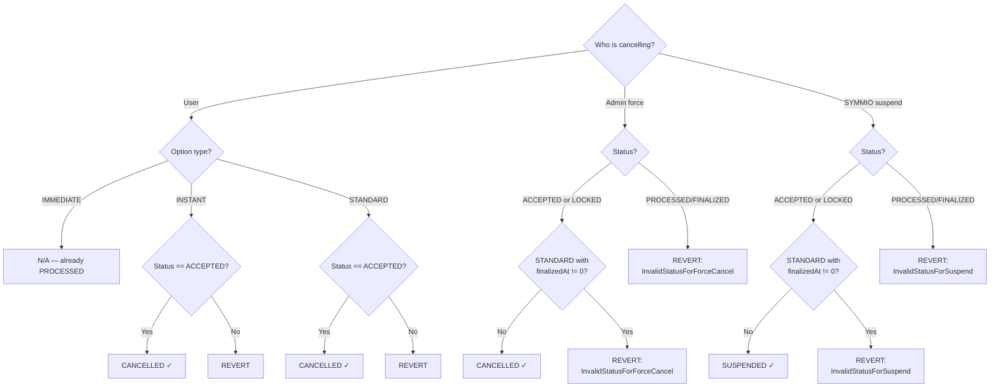
```mermaid
flowchart TD
    A{Who is cancelling?} -->|User| B{Option type?}
    A -->|Admin force| C{Status?}
    A -->|SYMMIO suspend| D{Status?}

    B -->|IMMEDIATE| B1["N/A — already PROCESSED"]
    B -->|INSTANT| B2{"Status == ACCEPTED?"}
    B -->|STANDARD| B4{"Status == ACCEPTED?"}

    B2 -->|Yes| OK1["CANCELLED ✓"]
    B2 -->|No| FAIL1["REVERT"]
    B4 -->|Yes| OK2["CANCELLED ✓"]
    B4 -->|No| FAIL2["REVERT"]

    C -->|ACCEPTED or LOCKED| C1{"STANDARD with\nfinalizedAt != 0?"}
    C1 -->|No| OK3["CANCELLED ✓"]
    C1 -->|Yes| FAIL3["REVERT:\nInvalidStatusForForceCancel"]
    C -->|PROCESSED/FINALIZED| FAIL4["REVERT:\nInvalidStatusForForceCancel"]

    D -->|ACCEPTED or LOCKED| D1{"STANDARD with\nfinalizedAt != 0?"}
    D1 -->|No| OK4["SUSPENDED ✓"]
    D1 -->|Yes| FAIL5["REVERT:\nInvalidStatusForSuspend"]
    D -->|PROCESSED/FINALIZED| FAIL6["REVERT:\nInvalidStatusForSuspend"]
```

### 13.2 Cancellation Matrix

| Option Type | User Cancel | Force Cancel | Suspend |
|-------------|-----------|------------|---------|
| IMMEDIATE | N/A (already PROCESSED) | N/A (already PROCESSED) | N/A (already PROCESSED) |
| INSTANT | YES if ACCEPTED | YES if ACCEPTED or LOCKED | YES if ACCEPTED or LOCKED |
| STANDARD | YES if ACCEPTED | YES if ACCEPTED or LOCKED (pre-finalize) | YES if ACCEPTED or LOCKED (pre-finalize) |
| STANDARD (finalized) | N/A | NO (`InvalidStatusForForceCancel`) | NO (`InvalidStatusForSuspend`) |

### 13.3 What Gets Released on Cancel/Suspend

All of the following are restored/cleaned up:
- [ ] `lockedGeneralBalance -= generalAmount` (INSTANT/IMMEDIATE only)
- [ ] `lockedAffiliateBalances[affiliate] -= affiliateAmount` (INSTANT/IMMEDIATE only)
- [ ] `generalBalance` and `affiliateBalances` values unchanged (locks are released, not balances)
- [ ] Credit line reservation released via `cancelReservation` (if creditAmount > 0)
- [ ] Sponsor coverage refunded: `sponsorBalances[affiliate] += sponsorCoverage`
- [ ] Status set to CANCELLED or SUSPENDED

### 13.4 Bot Reactions to Cancel/Suspend

- [ ] Cancel ALL scheduled actions for the affected (user, requestId)
- [ ] Do not attempt `processWithdraw` (will revert)
- [ ] Do not attempt `finalizeWithdrawRequest` on SYMMIO (withdrawal is terminated)
- [ ] Update internal liquidity tracking (pools restored)
- [ ] Update sponsor balance tracking (coverage refunded)

---

## 14. Permissionless Fallback

### 14.1 Processing Timeline

```mermaid
gantt
    title Processing Windows (INSTANT example)
    dateFormat X
    axisFormat %s

    section Operator Window
    securityWindow (20s)      :crit, 0, 20
    Operator can process      :active, 20, 80

    section Anyone Window
    tolerancePeriod (60s)     :crit, 20, 80
    Anyone can process        :active, 80, 120
```

### 14.2 When Anyone Can Process

| Option | Operator processableAt | Anyone processableAt |
|--------|----------------------|---------------------|
| INSTANT | `acceptedAt + securityWindow` | `acceptedAt + securityWindow + tolerancePeriod` |
| STANDARD | `finalizedAt` | `finalizedAt + tolerancePeriod` |
| LOCKED (after cooldown) | `cooldownEndTime` | `cooldownEndTime + tolerancePeriod` |

### 14.3 Bot Must Handle

- [ ] If a user calls `processWithdraw` permissionlessly, detect `WithdrawProcessed` event and cancel bot's scheduled processing
- [ ] Anyone can call `finalizeWithdrawRequest` on SYMMIO -- bot should still schedule it but handle the case where it's already finalized
- [ ] State sync: always check on-chain status before attempting actions

#### Numeric Example: Permissionless Processing Timeline

```
Scenario: Bot races against permissionless window across three option types

Setup:
  securityWindow = 20s, tolerancePeriod = 60s

--- Sub-scenario 1: INSTANT ---

Step 1 — Bot sees: WithdrawAccepted(user, reqId, INSTANT) at T=100
  Bot reads on-chain: acceptedAt = 100, status = ACCEPTED
  Bot checks: When can I (OPERATOR_ROLE) call processWithdraw?
    - processableAt = acceptedAt + securityWindow = 100 + 20 = 120
    - At T=119: too early (block.timestamp 119 < 120) -> would REVERT TooEarly
  Decision: Schedule processWithdraw for T=120.

Step 2 — Bot decides at T=120: Call processWithdraw now.
  Bot checks: Am I still within operator exclusivity?
    - Anyone's processableAt = 100 + 20 + 60 = 180
    - Current time 120 < 180 -> yes, only OPERATOR_ROLE can process right now
  Decision: Execute processWithdraw(user, reqId, parts). Bot has 60s of
            exclusivity (T=120 to T=180) before anyone else can call it.

  What if bot fails to process by T=180?
    Any address can call processWithdraw at T=180.
    Bot should monitor for WithdrawProcessed event and cancel its own task
    if someone else processes it first.

--- Sub-scenario 2: STANDARD ---

Step 1 — Bot sees: WithdrawFinalized(user, reqId) at T=43200
  Bot reads on-chain: status = FINALIZED, finalizedAt = 43200
  Bot checks: When can I call processWithdraw?
    - processableAt = finalizedAt = 43200 for OPERATOR_ROLE
    - STANDARD has no additional securityWindow (12h cooldown was the safety window)
  Decision: Call processWithdraw immediately — operator can process right now.

Step 2 — Bot checks: What is the permissionless deadline?
    - Anyone's processableAt = finalizedAt + tolerancePeriod = 43200 + 60 = 43260
    - At T=43259: user would REVERT TooEarly
    - At T=43260: anyone can process
  Decision: Execute processWithdraw now. If bot misses T=43260, any user can
            step in and complete the withdrawal permissionlessly.

--- Sub-scenario 3: LOCKED INSTANT after cooldown ---

Step 1 — Bot sees: block.timestamp approaching T=43200 (cooldownEndTime)
  Bot reads on-chain: status = LOCKED, cooldownEndTime = 43200
  Bot checks: isLockedAfterCooldown?
    - At T=43199: now (43199) < cooldownEndTime (43200) -> no, still locked
      processWithdraw would REVERT (not ACCEPTED and not isLockedAfterCooldown)
    - At T=43200: now (43200) >= cooldownEndTime (43200) -> yes
      processableAt = cooldownEndTime = 43200 for OPERATOR_ROLE
  Decision: Schedule processWithdraw for T=43200.

Step 2 — Bot checks: When does exclusivity end?
    - Anyone's processableAt = cooldownEndTime + tolerancePeriod = 43200 + 60 = 43260
  Decision: Execute at T=43200. Bot has 60s before permissionless fallback
            opens at T=43260. If another party processes first, bot detects
            WithdrawProcessed event and cancels its task.
```

---

## 15. Timing Reference

### 15.1 Complete Timing Diagram

```mermaid
gantt
    title Withdrawal Lifecycle Timing
    dateFormat X
    axisFormat %Hh

    section IMMEDIATE
    Accept+Transfer (same tx) :done, 0, 1
    SYMMIO Cooldown (12h)     :active, 0, 43200
    Finalization              :milestone, 43200, 43200

    section INSTANT
    Accept                    :done, 0, 1
    Security Window (20s)     :crit, 0, 20
    Process                   :milestone, 20, 20
    SYMMIO Cooldown (12h)     :active, 0, 43200
    Finalization              :milestone, 43200, 43200

    section STANDARD
    Accept                    :done, 0, 1
    SYMMIO Cooldown (12h)     :active, 0, 43200
    Finalization              :milestone, 43200, 43200
    Process                   :milestone, 43201, 43201
```

### 15.2 Configurable Parameters

| Parameter | Default | Setter | Description |
|-----------|---------|--------|-------------|
| `securityWindow` | 20s | SETTER_ROLE | Min delay before operator `processWithdraw` for INSTANT |
| `tolerancePeriod` | 60s | SETTER_ROLE | Extra delay for permissionless processing |
| `validatorApprovalTimeout` | 30s | SETTER_ROLE | Max age of validator signatures |
| `minValidatorSignatures` | 0 | SETTER_ROLE | Required validator attestation count |

### 15.3 Fixed Timing

| Timing | Value | Source |
|--------|-------|--------|
| SYMMIO withdrawal cooldown | 12 hours | SYMMIO core |
| `cooldownEndTime` | `max(deallocateTimestamp + 12h, block.timestamp)` | Computed from SYMMIO |

### 15.4 processableAt Lookup Table

The `processableAt` timestamp determines when `processWithdraw` can be called. It varies
by option type, status, and caller role. This table is the definitive reference.

| Option Type | Status | processableAt (OPERATOR_ROLE) | processableAt (Anyone) |
|-------------|--------|-------------------------------|------------------------|
| INSTANT | ACCEPTED | `acceptedAt + securityWindow` | `acceptedAt + securityWindow + tolerancePeriod` |
| INSTANT | LOCKED | `cooldownEndTime` (only if `block.timestamp >= cooldownEndTime`) | `cooldownEndTime + tolerancePeriod` |
| STANDARD | FINALIZED | `finalizedAt` | `finalizedAt + tolerancePeriod` |
| STANDARD | LOCKED | `cooldownEndTime` (only if `block.timestamp >= cooldownEndTime`) | `cooldownEndTime + tolerancePeriod` |
| IMMEDIATE | N/A | N/A (processed atomically inside `onWithdrawRequest`) | N/A |

Notes:
- For LOCKED withdrawals, `processWithdraw` only becomes callable once `block.timestamp >= cooldownEndTime`.
  At that point the risk window is over and the lock becomes ineffective.
- For LOCKED STANDARD withdrawals with `finalizedAt == 0`, `processWithdraw` calls
  `finalizeWithdrawRequest` on SYMMIO first to retrieve tokens before processing.
- The `tolerancePeriod` is the permissionless fallback window. If the bot goes down,
  anyone can process after an additional `tolerancePeriod` delay.

#### Numeric Scenarios: Bot Computes processableAt

```
Scenario: Bot computes processableAt for various withdrawals

Shared parameters:
  securityWindow   = 20
  tolerancePeriod  = 60

────────────────────────────────────────────────────────────
Withdrawal A (INSTANT, ACCEPTED):
  acceptedAt = 1700000000

  Bot (OPERATOR_ROLE):
    processableAt = acceptedAt + securityWindow
                  = 1700000000 + 20
                  = 1700000020
    Wait until block.timestamp >= 1700000020, then call processWithdraw.

  Anyone (no OPERATOR_ROLE):
    processableAt = acceptedAt + securityWindow + tolerancePeriod
                  = 1700000000 + 20 + 60
                  = 1700000080
    Permissionless fallback available 80s after acceptance.

────────────────────────────────────────────────────────────
Withdrawal B (STANDARD, FINALIZED):
  finalizedAt = 1700043200 (12h after acceptance, SYMMIO sent tokens)

  Bot (OPERATOR_ROLE):
    processableAt = finalizedAt
                  = 1700043200
    SYMMIO's 12h cooldown already served as the security window.
    Call processWithdraw immediately after finalization.

  Anyone (no OPERATOR_ROLE):
    processableAt = finalizedAt + tolerancePeriod
                  = 1700043200 + 60
                  = 1700043260

────────────────────────────────────────────────────────────
Withdrawal C (INSTANT, LOCKED — cooldown expired):
  acceptedAt      = 1700000000
  cooldownEndTime = 1700043200 (12h later)
  block.timestamp = 1700050000 (well past cooldown)

  Status is LOCKED but block.timestamp >= cooldownEndTime, so the
  risk window is over. processWithdraw treats it as processable.

  Bot (OPERATOR_ROLE):
    processableAt = cooldownEndTime
                  = 1700043200
    Already past -> call processWithdraw now.

  Anyone (no OPERATOR_ROLE):
    processableAt = cooldownEndTime + tolerancePeriod
                  = 1700043200 + 60
                  = 1700043260
    Already past -> anyone can call processWithdraw now.

────────────────────────────────────────────────────────────
Withdrawal D (STANDARD, LOCKED — cooldown expired, not yet finalized):
  acceptedAt      = 1700000000
  cooldownEndTime = 1700043200
  finalizedAt     = 0 (SYMMIO hasn't finalized yet)
  block.timestamp = 1700050000

  Bot (OPERATOR_ROLE):
    processableAt = cooldownEndTime = 1700043200 (already past)
    processWithdraw detects isLockedAfterCooldown && finalizedAt == 0,
    so it calls finalizeWithdrawRequest(user, requestId) on SYMMIO first.
    SYMMIO sends tokens -> then processWithdraw forwards them to the user.

  Anyone (no OPERATOR_ROLE):
    processableAt = cooldownEndTime + tolerancePeriod
                  = 1700043200 + 60
                  = 1700043260
    Same auto-finalize behavior applies.

────────────────────────────────────────────────────────────
Withdrawal E (IMMEDIATE):
  Not applicable. IMMEDIATE withdrawals are processed atomically inside
  onWithdrawRequest. The status goes directly to PROCESSED. There is no
  processWithdraw call and no processableAt computation.
```

### 15.5 Special Timing Cases

| Case | Behavior |
|------|----------|
| `securityWindow = 0` | Operator can process INSTANT immediately (same block) |
| `tolerancePeriod = 0` | Anyone can process as soon as operator window opens |
| Cooldown already elapsed (`deallocateTimestamp + 12h < now`) | `cooldownEndTime = block.timestamp`, finalization possible immediately |
| LOCKED after cooldown | processableAt = cooldownEndTime (lock becomes ineffective) |

#### Numeric Example: Cooldown Already Elapsed

```
Scenario: Bot detects pre-expired cooldown and fast-tracks a STANDARD withdrawal

Setup:
  block.timestamp             = 1_700_000_000
  securityWindow              = 20s
  tolerancePeriod             = 60s
  Alice deallocateTimestamp    = 1_699_913_600  (24 hours ago)
  cooldownEndTime             = max(1_699_913_600 + 43_200, 1_700_000_000)
                              = max(1_699_956_800, 1_700_000_000)
                              = 1_700_000_000   (cooldown already passed)
  generalBalance              = 10_000 USDC
  Status for (Alice, req#42)  = NONE

Step 1 — Bot sees: WithdrawAccepted event for Alice, 500 USDC STANDARD, req#42
  Bot reads on-chain:
    withdrawInfos[Alice][42].status          = ACCEPTED
    withdrawInfos[Alice][42].cooldownEndTime = 1_700_000_000
  Bot checks: cooldownEndTime <= block.timestamp?
    1_700_000_000 <= 1_700_000_000 --> yes, cooldown already expired
  Decision: call finalizeWithdrawRequest(Alice, 42) immediately
    (no need to schedule a 12-hour timer)

Step 2 — Bot sees: WithdrawFinalized event for (Alice, req#42)
  Bot reads on-chain:
    withdrawInfos[Alice][42].status      = FINALIZED
    withdrawInfos[Alice][42].finalizedAt = 1_700_000_000
  Bot checks: for STANDARD, processableAt = finalizedAt = 1_700_000_000
    Is block.timestamp >= 1_700_000_000? --> yes
  Decision: call processWithdraw(Alice, 42, parts) in the next block
    Total user wait: ~2 blocks (a few seconds)

What-if: same withdrawal as INSTANT instead of STANDARD?
  Bot checks: processableAt = acceptedAt + securityWindow
    = 1_700_000_000 + 20 = 1_700_000_020
  Decision: wait 20s for the risk-check window, then call processWithdraw
  But finalization can happen almost immediately after processing
  Pool replenishment: ~20s instead of the usual ~12h
```

---

## 16. Error Catalog

### 16.1 Error Decision Tree

```mermaid
flowchart TD
    E[Transaction Reverted] --> A{Error type?}

    A -->|Signature| S{Which?}
    S --> S1["InvalidSigner → Check SIGNER_ROLE"]
    S --> S2["OptionExpired → Re-sign with later deadline"]
    S --> S3["InvalidNonce → Re-read nonces(user)"]
    S --> S4["InvalidValidator → Re-gather from valid validators"]
    S --> S5["DuplicateValidator → Sort & deduplicate"]
    S --> S6["ValidatorApprovalExpired → Re-gather fresh sigs"]

    A -->|Liquidity| L{Which?}
    L --> L1["InsufficientGeneralBalance → Reduce or wait"]
    L --> L2["InsufficientAffiliateBalance → Reduce affiliateAmount"]

    A -->|Fee| F{Which?}
    F --> F1["FeeMismatch → Re-read feeRate"]
    F --> F2["OperatorFeeMismatch → Re-read operatorFee"]
    F --> F3["FeesExceedExpressAmount → Reduce fees"]
    F --> F4["UserFeeExceedsMaximum → Increase maxUserFee"]

    A -->|State| ST{Which?}
    ST --> ST1["NotAccepted → Check status first"]
    ST --> ST2["NotFinalized → Wait for onWithdrawComplete"]
    ST --> ST3["TooEarly → Wait for correct timestamp"]
    ST --> ST4["PartsMismatch → Use stored parts"]
    ST --> ST5["NotProcessed → Wait for processWithdraw"]
    ST --> ST6["InvalidStatusForStandard → Check status is ACCEPTED or LOCKED"]

    A -->|Validation| V{Which?}
    V --> V1["InvalidOptionType → Use optionType 0-2"]
    V --> V2["ValidatorsRequiredForImmediate → Enable validators"]
    V --> V3["InvalidAddressBytesLength → Fix receiver encoding"]

```

### 16.2 Signature & Auth Errors

| Error | Cause | Bot Action |
|-------|-------|------------|
| `InvalidSigner` | Recovered signer lacks SIGNER_ROLE | Check signing key has SIGNER_ROLE |
| `OptionExpired` | `block.timestamp > opt.deadline` | Extend deadline or re-sign |
| `InvalidNonce` | Option nonce != `nonces[user]` | Re-read nonce, re-sign |
| `OnlySymmio` | Non-SYMMIO calling callback | N/A (contract architecture issue) |
| `InvalidValidator` | Recovered validator lacks VALIDATOR_ROLE | Re-gather from valid validators |
| `DuplicateValidator` | Same validator signed twice | Sort and deduplicate |
| `InsufficientValidatorSignatures` | Fewer sigs than `minValidatorSignatures` | Gather more |
| `ValidatorApprovalExpired` | Timestamp too old or future-dated | Re-gather with fresh timestamps |
| `ArrayLengthMismatch` | signatures.length != timestamps.length | Fix encoding |

### 16.3 Liquidity Errors

| Error | Cause | Bot Action |
|-------|-------|------------|
| `InsufficientGeneralBalance` | INSTANT/IMMEDIATE generalAmount > available | Reduce amount or wait for pool refill |
| `InsufficientAffiliateBalance` | affiliateAmount > available affiliate balance | Reduce affiliateAmount |
| `InsufficientUnlockedGeneralBalance` | Withdraw attempt touches locked funds | Wait for withdrawals to complete |
| `InsufficientUnlockedAffiliateBalance` | Same for affiliate pool | Wait for withdrawals to complete |

### 16.4 Fee Errors

| Error | Cause | Bot Action |
|-------|-------|------------|
| `FeeMismatch` | Signed fee != on-chain computed fee | Re-read `feeRate`, recompute |
| `OperatorFeeMismatch` | Signed operatorFee != on-chain config | Re-read `operatorFee` |
| `FeesExceedExpressAmount` | `fee + operatorFee > feeBasis` | Reduce fees or increase amount |
| `UserFeeExceedsMaximum` | User fee after sponsor > maxUserFee | Increase maxUserFee or ensure sponsor coverage |
| `FeeRateExceeds100Percent` | feeRate > 10000 on config | Admin error |
| `NoFeesToClaim` | `collectedFees == 0` | No action needed |
| `NoOperatorFeesToClaim` | `collectedOperatorFees == 0` | No action needed |
| `InsufficientSponsorBalance` | Withdraw exceeds sponsor balance | Reduce amount |

### 16.5 State Errors

| Error | Cause | Bot Action |
|-------|-------|------------|
| `NotAccepted` | `processWithdraw` on non-ACCEPTED (or lock on non-ACCEPTED) | Check status first |
| `NotFinalized` | `processWithdraw` on STANDARD before finalization | Wait for `onWithdrawComplete` |
| `NotLocked` | `unlockAndProcess` on non-LOCKED status | Check status first |
| `NotProcessed` | `onWithdrawComplete` on INSTANT/IMMEDIATE before processing | Wait for `processWithdraw` to complete first |
| `InvalidStatusForStandard` | `onWithdrawComplete` on STANDARD when status is not ACCEPTED or LOCKED | Check status -- may already be CANCELLED or SUSPENDED |
| `TooEarly` | Processing before allowed time | Wait for correct timestamp (see [processableAt lookup table](#154-processableat-lookup-table)) |
| `PartsMismatch` | Parts array doesn't match stored hash | Use exact same parts |
| `InvalidStatusForForceCancel` | Force cancel on PROCESSED or LOCKED+finalized | Cannot cancel at this stage |
| `InvalidStatusForSuspend` | Suspend on PROCESSED, FINALIZED, or LOCKED+finalized | Cannot suspend at this stage |

### 16.6 Validation Errors

| Error | Cause | Bot Action |
|-------|-------|------------|
| `InvalidOptionType` | `opt.optionType > 2` in `onWithdrawRequest` | Use only 0 (IMMEDIATE), 1 (INSTANT), or 2 (STANDARD) |
| `ValidatorsRequiredForImmediate` | IMMEDIATE option when `minValidatorSignatures == 0` | Do not offer IMMEDIATE unless validators are configured; fall back to INSTANT |
| `InvalidAddressBytesLength` | `parts[i].receiver` is not exactly 20 bytes | Ensure all receiver fields are valid 20-byte Ethereum addresses |

### 16.7 Bot Scenarios for Key Errors

#### InvalidOptionType

```
Bot sees: User requests a withdrawal. Bot has option type value from config/logic.

Bot checks:
  optionType must be 0 (IMMEDIATE), 1 (INSTANT), or 2 (STANDARD).
  Any value > 2 will cause onWithdrawRequest to revert InvalidOptionType.

Decision:
  Validate optionType before signing the EIP-712 option. If the bot's logic
  produces an out-of-range value (e.g., from a misconfigured enum), fix the
  configuration. Never sign an option with optionType > 2.

Scenario:
  Bot computes optionType = 3 (bug in routing logic)
  -> Signs option with optionType = 3
  -> User submits to SYMMIO -> onWithdrawRequest called
  -> Contract checks: 3 > 2 -> REVERT InvalidOptionType
  -> Bot detects revert, fixes routing logic, re-signs with correct type
```

#### ValidatorsRequiredForImmediate

```
Bot sees: User requests fastest possible withdrawal. Bot considers IMMEDIATE.

Bot checks:
  Read minValidatorSignatures on-chain.
  If minValidatorSignatures == 0, IMMEDIATE is not available.
  Contract enforces: if optionType == IMMEDIATE && minValidatorSignatures == 0,
  revert ValidatorsRequiredForImmediate.

Decision:
  If minValidatorSignatures == 0:
    Do NOT offer IMMEDIATE. Fall back to INSTANT (next fastest option).
    INSTANT provides funds after securityWindow (default 20s), which is still fast.
  If minValidatorSignatures > 0:
    Gather at least minValidatorSignatures validator attestations, then sign IMMEDIATE.

Scenario:
  minValidatorSignatures = 0 (validators not yet configured)
  Bot signs IMMEDIATE option for Alice, 1000 USDC
  -> onWithdrawRequest checks: ot == IMMEDIATE && minValidatorSignatures == 0
  -> REVERT ValidatorsRequiredForImmediate
  -> Bot reads minValidatorSignatures = 0
  -> Bot re-signs as INSTANT instead. User gets funds after 20s security window.
```

#### FeesExceedExpressAmount

```
Bot sees: User requests withdrawal. Bot computes fee and operatorFee from on-chain config.

Bot checks:
  feeBasis = expressAmount
  fee = (feeBasis * feeRate) / 10000
  operatorFee = affiliateConfigs[affiliate].operatorFee
  Is fee + operatorFee <= feeBasis?
  If not, the contract will revert FeesExceedExpressAmount.

Decision:
  If fee + operatorFee > feeBasis:
    The withdrawal amount is too small to cover fees. Bot should NOT sign the option.
    Inform the user that the withdrawal amount is below the minimum viable amount.
    Minimum viable amount = operatorFee / (1 - feeRate/10000), rounded up.

Scenario:
  feeRate = 50 bps (0.5%), operatorFee = 5 USDC (5e6)
  User requests 5 USDC express withdrawal (feeBasis = 5e6)
  fee = (5e6 * 50) / 10000 = 25000 (0.025 USDC)
  fee + operatorFee = 25000 + 5e6 = 5025000
  feeBasis = 5e6
  5025000 > 5000000 -> REVERT FeesExceedExpressAmount
  Bot should reject: minimum viable amount ~ 5.03 USDC for this config.
```

#### InvalidAddressBytesLength

```
Bot sees: processWithdraw or onWithdrawRequest reverts with InvalidAddressBytesLength.

Bot checks:
  Each parts[i].receiver must be exactly 20 bytes (a valid Ethereum address).
  The contract calls bytesToAddress(parts[i].receiver) which reverts if
  data.length != 20.

Decision:
  This is a data encoding error. Check the WithdrawReceiverPart[] construction.
  Ensure every receiver is encoded as abi.encodePacked(address) = 20 bytes.
  If the receiver field comes from user input, validate its length before signing.

Scenario:
  parts[0].receiver = hex"abcdef" (3 bytes, not 20)
  -> bytesToAddress checks: data.length = 3 != 20
  -> REVERT InvalidAddressBytesLength
  -> Bot validates receiver byte lengths before accepting the withdrawal request.
```

#### NotProcessed / InvalidStatusForStandard

```
Bot sees: onWithdrawComplete callback reverts.

Bot checks:
  NotProcessed: For INSTANT/IMMEDIATE, onWithdrawComplete requires
    status == PROCESSED. If the bot hasn't called processWithdraw yet, SYMMIO's
    finalization attempt will revert. This is a SYMMIO callback, so the bot
    doesn't call it directly -- but the bot must ensure processWithdraw completes
    before the 12h cooldown ends.

  InvalidStatusForStandard: For STANDARD, onWithdrawComplete requires
    status == ACCEPTED or LOCKED. If the withdrawal was already CANCELLED or
    SUSPENDED, the finalization will revert.

Decision:
  NotProcessed: Ensure the bot's processWithdraw runs before SYMMIO's
    finalizeWithdrawRequest. For INSTANT, this means processing within 12h
    (easily met with the 20s security window). If something blocked processing,
    investigate and resolve before finalization.
  InvalidStatusForStandard: No bot action needed -- the withdrawal was
    already cancelled/suspended. The bot should have cleaned up its tracking.
```

---

## 17. Edge Cases & Race Conditions

### 17.1 Liquidity Race Conditions

```mermaid
sequenceDiagram
    participant U1 as User 1
    participant U2 as User 2
    participant EP as ExpressProvider

    Note over EP: generalBalance = 10,000\nlockedGeneralBalance = 0

    U1->>EP: INSTANT 8,000 USDC
    Note over EP: Lock 8,000\nlockedGeneral = 8,000\navailable = 2,000

    U2->>EP: INSTANT 8,000 USDC
    Note over EP: 8,000 > available 2,000
    EP-->>U2: REVERT: InsufficientGeneralBalance

    Note over EP: User1 cancels
    U1->>EP: cancel → lockedGeneral = 0\navailable = 10,000

    U2->>EP: INSTANT 8,000 USDC (retry)
    Note over EP: 8,000 <= 10,000 ✓
    EP-->>U2: ACCEPTED
```

| Scenario | Behavior |
|----------|----------|
| Two INSTANT withdrawals for more than half the pool | Second reverts `InsufficientGeneralBalance` |
| First withdrawal cancelled, second retried | Succeeds (pool freed) |
| Two IMMEDIATE withdrawals racing | Second reverts (funds transferred atomically in first's tx) |
| Sponsor balance drained between sign and execution | Reverts `UserFeeExceedsMaximum` if maxUserFee too low |

### 17.2 Config Changes Mid-Flight

```mermaid
sequenceDiagram
    participant Bot
    participant Admin
    participant EP as ExpressProvider
    participant User

    Bot->>EP: Read feeRate = 50 bps
    Bot->>Bot: Sign option with fee = 25 USDC

    Admin->>EP: setAffiliateConfig(feeRate = 100)
    Note over EP: feeRate now 100 bps

    User->>EP: initiateWithdraw (with bot's signed option)
    Note over EP: On-chain: fee should be 50 USDC\nBot signed: 25 USDC
    EP-->>User: REVERT: FeeMismatch
```

| Config Change | Impact on In-Flight Withdrawals |
|---------------|---------------------------------|
| `feeRate` changed | Options signed with old rate will revert `FeeMismatch` |
| `operatorFee` changed | Options signed with old value will revert `OperatorFeeMismatch` |
| `minValidatorSignatures` raised | Pending options with insufficient sigs will revert |
| `validatorApprovalTimeout` reduced | Previously valid sigs may expire |
| `securityWindow` changed | Affects timing for unprocessed INSTANT withdrawals |
| `tolerancePeriod` changed | Affects permissionless processing window |
| SIGNER_ROLE revoked | All options signed by that key become invalid |
| VALIDATOR_ROLE revoked | Pending validator sigs from that key become invalid |

### 17.3 Nonce Edge Cases

| Scenario | Behavior |
|----------|----------|
| Nonce replay (same nonce used twice) | Reverts `InvalidNonce` |
| Nonce skip (nonce 0, then nonce 2) | Reverts `InvalidNonce` |
| Nonce read at sign time, but another withdrawal consumed it | Reverts `InvalidNonce` -- re-read and re-sign |
| Concurrent options for same user | Only one can succeed (nonce is sequential) |

#### Numeric Example: Nonce Race Condition

```
Scenario: Bot detects stale nonce, aborts a signature, and retries

Setup:
  nonces(Alice) = 5
  Alice has two pending withdrawal requests queued in bot's inbox:
    Request A: 500 USDC INSTANT
    Request B: 300 USDC STANDARD

Step 1 — Bot sees: two withdrawal requests from Alice arrive nearly simultaneously
  Bot reads on-chain:
    nonces(Alice) = 5
  Bot checks: can I sign both with nonce=5?
    No -- nonces are sequential; each acceptance increments the nonce by 1
  Decision: serialize. Sign request A with nonce=5 first, hold request B

Step 2 — Bot sees: WithdrawAccepted event for request A (nonce=5 consumed)
  Bot reads on-chain:
    nonces(Alice) = 6  (incremented by A's acceptance)
  Bot checks: nonce for B must be 6, not 5
  Decision: sign request B with nonce=6, send to Alice

Step 3 — Bot sees: WithdrawAccepted event for request B (nonce=6 consumed)
  Bot reads on-chain:
    nonces(Alice) = 7
  Both withdrawals accepted successfully

What-if: bot mistakenly signs both A and B with nonce=5?
  A lands first --> nonces(Alice) incremented to 6
  B arrives with nonce=5, but on-chain nonce is now 6
  Contract reverts: InvalidNonce
  Bot detects the revert, reads nonces(Alice) = 6, re-signs B with nonce=6
  Wasted gas on one failed tx -- serialization avoids this

What-if: Alice submits A herself before the bot sends B?
  Same outcome: A consumes nonce=5, bot must read fresh nonce (6) before signing B
```

#### Numeric Example: Nonce Serialization — Multiple Users vs Same User

```
Scenario: Bot handles concurrent requests from different users and the same user

Setup:
  nonces(Alice) = 5
  nonces(Bob)   = 3
  Bot receives three withdrawal requests nearly simultaneously:
    Request 1: Alice, 500 USDC INSTANT
    Request 2: Bob,   300 USDC INSTANT
    Request 3: Alice, 200 USDC STANDARD

--- Different users CAN be signed in parallel (independent nonces) ---

Step 1 — Bot sees: Request 1 (Alice) and Request 2 (Bob)
  Bot reads on-chain:
    nonces(Alice) = 5
    nonces(Bob)   = 3
  Bot checks: Alice and Bob have independent nonce counters
  Decision: sign both in parallel
    Sign Request 1 with nonce=5 (for Alice)
    Sign Request 2 with nonce=3 (for Bob)

Step 2 — Both txs submitted concurrently:
  Request 1 mines: nonces(Alice) = 5 → 6  ✓
  Request 2 mines: nonces(Bob)   = 3 → 4  ✓
  Both succeed — no conflict because nonces are per-user

--- Same user MUST be serialized (shared nonce counter) ---

Step 3 — Bot sees: Request 3 (Alice, 200 USDC STANDARD) still pending
  Bot reads on-chain:
    nonces(Alice) = 6  (incremented by Request 1)
  Decision: sign Request 3 with nonce=6

Step 4 — Request 3 tx mines:
  nonces(Alice) = 6 → 7  ✓

--- What-if: bot signs Request 1 and Request 3 for Alice in parallel? ---

  Bot signs Request 1 with nonce=5, Request 3 with nonce=5
  Request 1 lands first: nonces(Alice) = 5 → 6  ✓
  Request 3 arrives with nonce=5, but on-chain nonce is now 6
  Contract reverts: InvalidNonce
  Wasted gas + user experience degradation

  Even if bot guesses nonce=6 for Request 3:
    Bot signs Request 1 with nonce=5, Request 3 with nonce=6
    If Request 3 lands BEFORE Request 1 (due to gas price / mempool ordering):
      Request 3 expects nonce=6, but on-chain nonce is still 5 → REVERT InvalidNonce
    Nonce ordering is NOT guaranteed to match tx landing order

Correct strategy:
  - Maintain a per-user queue in the bot
  - Different users: sign and submit in parallel (independent nonces)
  - Same user: strictly serialize — wait for WithdrawAccepted event (nonce consumed)
    before signing the next option for that user
  - Never pre-sign multiple options for the same user with speculative nonces
```

### 17.4 Timing Edge Cases

| Scenario | Behavior |
|----------|----------|
| `processWithdraw` at exact securityWindow boundary | Succeeds (uses `>=` check) |
| Finalization at exact `cooldownEndTime` | Succeeds |
| LOCKED after cooldown + tolerancePeriod | Anyone can process |
| cooldownEndTime in the past (user deallocated long ago) | Cooldown already expired, finalization possible immediately |
| `securityWindow = 0` | Operator can process same block as acceptance |
| `tolerancePeriod = 0` | Anyone can process as soon as operator can |

### 17.5 Credit Line Edge Cases

| Scenario | Behavior |
|----------|----------|
| Cancel with active credit reservation | `cancelReservation` releases reserved debt |
| Credit line paused between signing and acceptance | `reserveDebt` reverts (paused) |
| User blacklisted between signing and acceptance | `reserveDebt` reverts (blacklisted) |
| Credit amount exceeds debt cap | `reserveDebt` reverts (cap exceeded) |
| Muon attestation expired | `reserveDebt` reverts (freshness check fails) |
| Credit used with STANDARD | Reverts `CreditNotSupportedForStandard` |
| Post-payout rollback with credit | Affiliate pool absorbs credit loss via `coverLoss` |

### 17.6 STANDARD-Specific Edge Cases

| Scenario | Behavior |
|----------|----------|
| Process before finalization | Reverts `NotFinalized` |
| LOCKED then finalized | Status stays LOCKED, `finalizedAt` set |
| LOCKED + finalized then force cancel | Reverts `InvalidStatusForForceCancel` (tokens already on contract) |
| LOCKED + finalized then suspend | Reverts `InvalidStatusForSuspend` |
| LOCKED + finalized: resolution | Only `unlockAndProcess` (UNLOCK_ROLE) |
| LOCKED + NOT finalized + cooldown expired | `processWithdraw` calls `finalizeWithdrawRequest` on SYMMIO first, then processes |
| `affiliateAmount + creditAmount > expressAmount` | Reverts `FundingSplitExceedsExpress`. Bot must ensure the sum never exceeds expressAmount |
| Credit with STANDARD | Reverts `CreditNotSupportedForStandard`. Bot must set creditAmount = 0 for STANDARD |

### 17.7 Admin / Configuration Change Scenarios

These scenarios cover race conditions and operational impacts when admin configuration
changes occur while the bot has in-flight withdrawals, pending options, or scheduled actions.

#### Scenario 1: Fee Config Change Race Condition

```
Scenario: Admin changes affiliate fee rate while bot's signed option is in the mempool

Setup:
  affiliateConfigs[0xAffiliate].feeRate     = 50 bps
  affiliateConfigs[0xAffiliate].operatorFee = 1 USDC
  User: Alice, withdrawal amount: 5,000 USDC INSTANT
  Bot signed fee = 5,000 * 50 / 10,000 = 25 USDC, operatorFee = 1 USDC

Step 1 — Bot sees: Alice requests a withdrawal option
  Bot reads on-chain:
    affiliateConfigs[0xAffiliate].feeRate     = 50
    affiliateConfigs[0xAffiliate].operatorFee = 1 USDC
  Bot checks: fee = 5,000 * 50 / 10,000 = 25 USDC
  Decision: sign option with fee=25 USDC, operatorFee=1 USDC, send to Alice

Step 2 — Admin calls: setAffiliateConfig(0xAffiliate, 100, 2_000000)
  On-chain state changes:
    affiliateConfigs[0xAffiliate].feeRate     = 100 bps (was 50)
    affiliateConfigs[0xAffiliate].operatorFee = 2 USDC   (was 1)
  Event emitted: AffiliateConfigUpdated(0xAffiliate, 100, 2_000000)
  Alice's tx is still in the mempool

Step 3 — Alice's tx mines: initiateWithdraw with bot's signed option (fee=25 USDC, operatorFee=1 USDC)
  On-chain validation:
    expected fee = 5,000 * 100 / 10,000 = 50 USDC
    signed fee   = 25 USDC
    50 != 25 --> REVERT: FeeMismatch
  Alice's withdrawal fails

Step 4 — Bot sees: AffiliateConfigUpdated(0xAffiliate, 100, 2_000000)
  Bot reads on-chain:
    affiliateConfigs[0xAffiliate].feeRate     = 100
    affiliateConfigs[0xAffiliate].operatorFee = 2 USDC
  Bot checks:
    Any pending (unsigned or signed-but-not-yet-mined) options for 0xAffiliate?
    Yes — Alice's option was signed with feeRate=50, now stale
  Decision:
    1. Invalidate ALL pending options for affiliate 0xAffiliate
    2. Re-compute fee: 5,000 * 100 / 10,000 = 50 USDC
    3. Re-sign option with fee=50 USDC, operatorFee=2 USDC
    4. Send new signed option to Alice (she must re-submit her tx)

  What if bot does NOT invalidate pending options?
    Every pending option signed with the old feeRate will revert FeeMismatch
    Users experience unexplained failures and must request new options manually
    Bot wastes gas if it is the one submitting the txs

  What if operatorFee also changed?
    Old operatorFee=1, new operatorFee=2
    Even if feeRate matched, the option would revert OperatorFeeMismatch
    Bot must re-sign with BOTH updated values
```

#### Scenario 2: Security Window Change Impact

```
Scenario: Admin increases securityWindow while bot has a scheduled processWithdraw

Setup:
  securityWindow = 20s
  User: Alice, requestId: 42, INSTANT withdrawal, 3,000 USDC
  withdrawInfos[Alice][42].status     = ACCEPTED
  withdrawInfos[Alice][42].acceptedAt = T

Step 1 — Bot sees: WithdrawAccepted(Alice, 42, INSTANT) at T=0s
  Bot reads on-chain:
    securityWindow = 20s
    acceptedAt     = T
  Bot checks:
    processableAt = acceptedAt + securityWindow = T + 20s
  Decision: schedule processWithdraw(Alice, 42, parts) for T+20s

Step 2 — Admin calls: setSecurityWindow(60) at T=5s
  On-chain state changes:
    securityWindow = 60 (was 20)
  NOTE: No event is emitted for setSecurityWindow

Step 3 — Bot's scheduled processWithdraw fires at T=20s
  On-chain validation:
    processableAt = acceptedAt + securityWindow = T + 60s
    block.timestamp = T + 20s
    T+20s < T+60s --> REVERT: TooEarly
  Bot's processWithdraw fails

Step 4 — Bot sees: processWithdraw reverted with TooEarly
  Bot reads on-chain:
    securityWindow = 60  (changed since bot last read it)
  Bot checks:
    new processableAt = T + 60s
    current time T+20s < T+60s — still too early
  Decision: reschedule processWithdraw(Alice, 42, parts) for T+60s

Correct strategy — re-read securityWindow before EVERY processWithdraw call:
  Before calling processWithdraw, bot always does:
    1. Read securityWindow from contract
    2. Read withdrawInfos[user][requestId].acceptedAt
    3. Compute processableAt = acceptedAt + securityWindow
    4. If block.timestamp < processableAt, reschedule for processableAt
    5. Only call processWithdraw if block.timestamp >= processableAt

  What if securityWindow is DECREASED (e.g., 60s -> 10s)?
    Bot's scheduled processWithdraw at T+60s is unnecessarily late but still succeeds
    No revert — just delayed processing (T+10s would have been enough)
    Not harmful, but suboptimal for user experience
    Re-reading before every call also helps here: bot can process earlier

  What if securityWindow is set to 0?
    processableAt = acceptedAt + 0 = acceptedAt
    Bot can call processWithdraw in the same block as acceptance
    No TooEarly revert possible
```

#### Scenario 3: Credit Line Manager Change

```
Scenario: Admin changes CreditLineManager mapping while bot has signed options using credit

Setup:
  creditLineManagers[0xAffiliate] = CLM1 (at address 0xCLM1)
  CLM1.totalDebt() = 500 USDC, protocolMaxDebt = 10,000 USDC
  Bot has signed 2 pending options for affiliate 0xAffiliate using credit:
    Option A: Alice, 2,000 USDC (creditAmount=500 from CLM1)
    Option B: Bob,   3,000 USDC (creditAmount=1,000 from CLM1)

Step 1 — Admin calls: setCreditLineManager(0xAffiliate, 0xCLM2)
  On-chain state changes:
    creditLineManagers[0xAffiliate] = 0xCLM2 (was 0xCLM1)
  NOTE: No event is emitted for setCreditLineManager
  Bot has NO immediate notification of this change

Step 2 — Alice submits her withdrawal tx (Option A, signed with creditAmount=500)
  On-chain:
    Contract reads creditLineManagers[0xAffiliate] = 0xCLM2
    reserveDebt called on CLM2, NOT CLM1
    CLM2 may have different debt caps, different state
  Outcome depends on CLM2's configuration:
    - If CLM2 has sufficient capacity: tx succeeds, debt reserved on CLM2
    - If CLM2 is paused or at capacity: REVERT from reserveDebt

Step 3 — Bot sees: Option A reverted or succeeded against different CLM
  Bot reads on-chain:
    creditLineManagers[0xAffiliate] = 0xCLM2
  Bot checks:
    Cached CLM for 0xAffiliate was 0xCLM1, now 0xCLM2
    Option B was signed based on CLM1's capacity
    CLM2 may have different caps — this option may fail
  Decision:
    1. Invalidate pending option B
    2. Read CLM2 state: totalDebt(), protocolMaxDebt, paused, etc.
    3. Re-sign options with creditAmounts that respect CLM2's capacity
    4. Update cached CLM mapping: 0xAffiliate -> 0xCLM2

Correct strategy — poll creditLineManagers periodically:
  Since setCreditLineManager emits NO event, the bot CANNOT rely on event-driven detection.
  Bot must:
    - Poll creditLineManagers[affiliate] on a regular interval (e.g., every 30s or every block)
    - Before signing any option with creditAmount > 0, read creditLineManagers[affiliate] fresh
    - Compare against cached value; if changed, invalidate all pending credit-referencing options
    - Read new CLM's state to update capacity estimates
```

#### Scenario 4: Role Grant / Revoke

```
Scenario: Bot's SIGNER_ROLE key is revoked while options signed by that key are pending

Setup:
  Bot signing key: 0xBotSigner (has SIGNER_ROLE)
  Bot has 5 pending signed options (not yet submitted or in mempool):
    Options for Alice, Bob, Carol, Dave, Eve — all signed by 0xBotSigner

Step 1 — Admin calls: revokeRole(SIGNER_ROLE, 0xBotSigner)
  Event emitted: RoleRevoked(SIGNER_ROLE, 0xBotSigner, admin)
  On-chain: hasRole(SIGNER_ROLE, 0xBotSigner) = false

Step 2 — Alice submits her withdrawal tx with option signed by 0xBotSigner
  On-chain validation:
    EIP-712 signature recovery -> recovers 0xBotSigner
    hasRole(SIGNER_ROLE, 0xBotSigner) = false
    --> REVERT: InvalidSigner
  All 5 pending options become unusable

Step 3 — Bot sees: RoleRevoked(SIGNER_ROLE, 0xBotSigner, admin)
  Bot reads on-chain:
    hasRole(SIGNER_ROLE, 0xBotSigner) = false
  Bot checks:
    0xBotSigner is the bot's own signing key — ALL options signed by this key are now invalid
  Decision:
    1. Invalidate ALL pending options signed by 0xBotSigner (all 5)
    2. Alert operations team: "SIGNER_ROLE revoked for 0xBotSigner"
    3. If a new signer key (0xNewSigner) has been granted SIGNER_ROLE:
       - Switch to 0xNewSigner for future option signing
       - Re-sign all 5 invalidated options with 0xNewSigner
    4. If no new signer key is available:
       - STOP signing new options (all sign requests return error)
       - Continue processing already-ACCEPTED withdrawals (OPERATOR_ROLE is separate)

  What if OPERATOR_ROLE is revoked instead?
    Bot can still sign options (SIGNER_ROLE unaffected)
    Bot CANNOT call processWithdraw — ACCEPTED withdrawals will wait for:
      a) OPERATOR_ROLE to be re-granted, or
      b) Permissionless fallback after securityWindow + tolerancePeriod
    Alert: "OPERATOR_ROLE revoked — processWithdraw disabled"

  What if LOCKER_ROLE is revoked?
    Bot cannot call lockWithdraw for risk detection
    ACCEPTED withdrawals proceed normally (no risk-lock capability)
    Alert: "LOCKER_ROLE revoked — risk lock disabled"

Critical roles to monitor (via RoleGranted / RoleRevoked events):
  - SIGNER_ROLE:    affects option signing — invalidates all pending options
  - OPERATOR_ROLE:  affects processWithdraw — delays user fund delivery
  - LOCKER_ROLE:    affects risk detection — reduces security capabilities
  - UNLOCK_ROLE:    affects locked withdrawal resolution
  - VALIDATOR_ROLE: affects validator attestations for IMMEDIATE withdrawals
```

#### Scenario 5: Sponsor Replacement

```
Scenario: A new sponsor deposits for an affiliate that already has a sponsor

Setup:
  sponsors[0xAffiliate]        = Sponsor A (0xSponsorA)
  sponsorBalances[0xAffiliate] = 100 USDC (deposited by Sponsor A)
  sponsorConfigs[0xAffiliate]  = { maxFeePerWithdraw: 5, maxWithdrawAmount: 0 }
  Bot is signing options that assume sponsor coverage of up to 5 USDC per withdrawal

Step 1 — Sponsor B calls: depositSponsorBalance(0xAffiliate, 50 USDC)
  On-chain state changes:
    sponsorBalances[0xAffiliate] = 100 + 50 = 150 USDC
    sponsors[0xAffiliate]        = 0xSponsorA  (UNCHANGED — only set when previously address(0))
  Event emitted: SponsorDeposit(0xAffiliate, 50)

Step 2 — Consequences:
  Sponsor A's identity is preserved (sponsors[0xAffiliate] remains 0xSponsorA)
  Sponsor B's 50 USDC is added to the pool but the sponsor identity is still A
  The sponsor identity is only set on the FIRST deposit (when sponsors[affiliate] == address(0))
  withdrawSponsorBalance is SPONSOR_MANAGER_ROLE-gated — admin controls withdrawals

Step 3 — Bot sees: SponsorDeposit(0xAffiliate, 50)
  Bot reads on-chain:
    sponsorBalances[0xAffiliate] = 150 USDC
    sponsors[0xAffiliate]        = 0xSponsorA (unchanged — only set on first deposit)
  Bot checks:
    Sponsor identity unchanged — deposit just increased balance
    sponsorConfigs[0xAffiliate] unchanged — same fee coverage limits
    sponsorBalances increased — more coverage available (150 vs 100)
  Decision:
    1. Update cached sponsorBalance: 150 USDC
    2. Pending options are NOT invalidated (sponsor identity does not affect
       option validity — only sponsorBalances and sponsorConfigs matter)

  What if SPONSOR_MANAGER_ROLE admin withdraws, draining the balance?
    Admin calls withdrawSponsorBalance(0xAffiliate, 150, to) — withdraws 150 USDC
    sponsorBalances[0xAffiliate] = 0
    Bot sees: SponsorWithdraw(0xAffiliate, 150)
    All pending options with sponsor coverage assumptions become risky:
      - If maxUserFee was set low (expecting sponsor coverage), withdrawal will
        revert UserFeeExceedsMaximum when sponsor balance is insufficient
    Decision: re-evaluate all pending options for 0xAffiliate
      - Re-read sponsorBalances[0xAffiliate] = 0
      - Options that rely on sponsor coverage must be re-signed with higher maxUserFee
        (or user must accept paying fees themselves)

  What if sponsors[0xAffiliate] was address(0) initially?
    First depositor (anyone) becomes the recorded sponsor identity.
    Subsequent depositors do NOT change the sponsor identity — they only add to the balance.
    The sponsor identity field is informational; withdrawSponsorBalance is SPONSOR_MANAGER_ROLE-gated.
```

### 17.8 LOCKED Scenario

### 17.9 STANDARD processWithdraw Too Early

```
Scenario: Bot accidentally calls processWithdraw on STANDARD before finalization

Setup:
  STANDARD 1,000 USDC, status = ACCEPTED, finalizedAt = 0

Step 1 — Bot sees: WithdrawAccepted(user, reqId, STANDARD) at T=0
  Bot reads: status = ACCEPTED, optionType = STANDARD
  Bot INCORRECTLY schedules processWithdraw at T+20s (confusing with INSTANT logic)

Step 2 — Bot calls processWithdraw at T+20s
  Contract checks: optionType == STANDARD, status != FINALIZED, not isLockedAfterCooldown
  → Reverts: NotFinalized

Correct behavior:
  For STANDARD, bot should NOT schedule processWithdraw at acceptance.
  Instead, wait for WithdrawFinalized event (onWithdrawComplete callback at ~T+12h).
  Then call processWithdraw immediately after finalization.
```

### 17.10 Non-Existent Withdrawal

```
Scenario: Bot references a (user, requestId) that was never accepted

Setup: No withdrawal exists for (Alice, requestId=99)

Step 1 — Bot calls processWithdraw(Alice, 99, parts)
  Contract reads: withdrawInfos[Alice][99] — all fields zero-initialized
  status = 0 (NONE), optionType = 0 (IMMEDIATE), generalAmount = 0, etc.
  Contract checks: status != ACCEPTED → reverts NotAccepted

Bot mitigation: Always track accepted withdrawals via WithdrawAccepted events.
  Never call processWithdraw/lockWithdraw for IDs not in the bot's accepted set.
```

### 17.11 Zero-Amount Parts

```
Scenario: A part with amount = 0 in the parts array

Setup: parts = [{amount: 500, vp: 0x0}, {amount: 0, vp: 0x0}, {amount: 300, vp: 0x0}]

On-chain behavior:
  computeAmounts: part[1] contributes 0 to expressAmount. Harmless.
  transferToReceivers: toSend for part[1] = 0. Skipped by if-guard.

Bot consideration: Zero-amount parts waste gas but don't cause reverts.
  Decision: Filter out zero-amount parts before signing. No benefit to including them.
```

### 17.12 IMMEDIATE Cannot Be Locked / Cancelled / Suspended

```
Scenario: IMMEDIATE withdrawal — impossible state transitions documented

Setup: IMMEDIATE 1,000 USDC, accepted and processed atomically in same tx

Impossible actions (all revert):
  lockWithdraw: status is PROCESSED (not ACCEPTED) → NotAccepted
  onWithdrawCancelRequest: status is PROCESSED (not ACCEPTED) → NotAccepted
  onForceWithdrawCancel: status is PROCESSED → InvalidStatusForForceCancel
  onWithdrawSuspend: status is PROCESSED → InvalidStatusForSuspend
  processWithdraw: status is PROCESSED (not ACCEPTED) → NotAccepted

Bot implication: Risk for IMMEDIATE must be caught BEFORE acceptance.
  This is why minValidatorSignatures > 0 is required for IMMEDIATE.
  Validators serve as the pre-acceptance risk check since post-acceptance intervention is impossible.
  If validators are unavailable, bot MUST offer INSTANT instead (which allows post-acceptance locking).
```

### 17.13 Duplicate Finalization Callback

```
Scenario: onWithdrawComplete called twice for same withdrawal

Setup: INSTANT 500 USDC, status = PROCESSED after normal processing

Step 1 — onWithdrawComplete called (T+12h):
  Status: PROCESSED → FINALIZED. Pools replenished.

Step 2 — onWithdrawComplete called again (hypothetical):
  Contract checks: status == PROCESSED? NO (it's FINALIZED)
  → Reverts: NotProcessed

Bot implication: No action needed. SYMMIO won't call twice.
  Bot does not need to guard against duplicate finalization.
```

---

## 18. Pool Management

### 18.1 Pool Lifecycle Diagram

```mermaid
flowchart TD
    subgraph "INSTANT/IMMEDIATE Lifecycle"
        A1["depositToGeneral\n+10,000"] --> B1["Lock on accept\nlockedGeneral += 500"]
        B1 --> C1["Process: deduct\ngeneralBalance -= 500\nUser gets 500"]
        C1 --> D1["Finalize: replenish\ngeneralBalance += 500\n(SYMMIO sends tokens back)"]
    end

    subgraph "STANDARD Lifecycle"
        A2["No pool lock\n(pools untouched)"] --> B2["Finalize: tokens arrive\nfrom SYMMIO (500)"]
        B2 --> C2["Process: forward\ntokens to user (500)"]
    end

    subgraph "Cancel/Suspend"
        X["Unlock all\nlockedGeneral -= 500\nPools restored"] --> Y["No capital loss"]
    end
```

### 18.2 Pool Types

| Pool | Funded By | Used For | Locked During |
|------|-----------|----------|---------------|
| General (`generalBalance`) | `depositToGeneral` | INSTANT/IMMEDIATE general portion | `lockedGeneralBalance` |
| Affiliate (`affiliateBalances[affiliate]`) | `depositToAffiliate` | Express affiliate portion | `lockedAffiliateBalances[affiliate]` |
| Credit Line (`CreditLineManager`) | Muon-attested eligible balances | Credit-backed portions (non-STANDARD) | `reservedDebt` / `activeDebt` |
| Sponsor (`sponsorBalances[affiliate]`) | `depositSponsorBalance` | Fee coverage | `info.sponsorCoverage` (stored on WithdrawInfo) |

### 18.3 Available Liquidity Formulas

```
availableGeneral = generalBalance - lockedGeneralBalance
availableAffiliate = affiliateBalances[affiliate] - lockedAffiliateBalances[affiliate]
availableCredit = creditLineManager.protocolMaxDebt - creditLineManager.totalDebt() (if configured)
totalAvailable = availableGeneral + availableAffiliate + availableCredit
```

### 18.4 Bot Pool Monitoring

- [ ] Track available liquidity across all pools
- [ ] Alert when available liquidity drops below threshold
- [ ] Do not offer INSTANT/IMMEDIATE if insufficient liquidity
- [ ] Monitor `GeneralDeposit`/`GeneralWithdraw` and `AffiliateDeposit`/`AffiliateWithdraw` events
- [ ] Verify `withdrawFromGeneral` / `withdrawFromAffiliate` cannot touch locked funds (enforced on-chain)
- [ ] Monitor CreditLineManager `totalDebt()`, `paused`, and debt cap headroom

#### Numeric Example: Pool Utilization Tracking

```
Scenario: Bot monitors pool health under load and picks the right option type

Setup:
  generalBalance             = 10_000 USDC
  lockedGeneralBalance       = 0
  affiliateBalances[FrontA]  = 5_000 USDC
  lockedAffiliateBalances[FrontA] = 0
  Available general          = 10_000 - 0     = 10_000
  Available affiliate        = 5_000  - 0     = 5_000
  Total available            = 15_000

Step 1 — Bot sees: 3 INSTANT withdrawals accepted in rapid succession
  W1: 3_000 USDC (general=2_000, affiliate=1_000)
  W2: 4_000 USDC (general=3_000, affiliate=1_000)
  W3: 2_000 USDC (general=1_500, affiliate=500)
  Bot reads on-chain after all three lock:
    lockedGeneralBalance            = 6_500
    lockedAffiliateBalances[FrontA] = 2_500
  Bot checks remaining capacity:
    Available general   = 10_000 - 6_500 = 3_500
    Available affiliate = 5_000  - 2_500 = 2_500
    Total available     = 6_000

Step 2 — Bot sees: new request from Bob for 5_000 USDC via FrontA
  Bot reads on-chain (same state as above):
    Available general   = 3_500
    Available affiliate = 2_500
  Bot checks: can INSTANT work?
    If affiliateAmount = 1_500, generalAmount = 3_500
      3_500 <= 3_500 available general --> fits (barely)
    If affiliateAmount = 1_000, generalAmount = 4_000
      4_000 > 3_500 available general --> would revert InsufficientGeneralBalance
  Decision tree:
    INSTANT with affiliateAmount=1_500 --> sign it (tight but feasible)
    INSTANT with affiliateAmount=1_000 --> reject (insufficient general)
    STANDARD                           --> always available (no pool lock)

Step 3 — Bot sees: WithdrawFinalized event for W1 (pools replenished)
  Bot reads on-chain:
    generalBalance = 10_000  (unchanged -- replenished the 2_000 deducted at process)
    lockedGeneralBalance = 3_500  (W2 + W3 locks remain)
    affiliateBalances[FrontA] = 5_000  (replenished the 1_000 deducted at process)
    lockedAffiliateBalances[FrontA] = 1_500  (W2 + W3 locks remain)
  Bot checks:
    Available general   = 10_000 - 3_500 = 6_500
    Available affiliate = 5_000  - 1_500 = 3_500
    Total available     = 10_000
  Decision: capacity restored; resume offering INSTANT for larger requests
```

---

## 19. Role Reference

### 19.1 Role Interaction Diagram

```mermaid
flowchart TD
    subgraph "Admin Roles"
        ADMIN["DEFAULT_ADMIN_ROLE\n(Multisig)"]
        SETTER["SETTER_ROLE"]
        WITHDRAWER["WITHDRAWER_ROLE"]
        SPONSOR_MGR["SPONSOR_MANAGER_ROLE"]
        FEE_CLAIMER["FEE_CLAIMER_ROLE"]
    end

    subgraph "Operational Roles"
        OPERATOR["OPERATOR_ROLE\n(Bot)"]
        SIGNER["SIGNER_ROLE\n(Bot key)"]
        LOCKER["LOCKER_ROLE\n(Risk service)"]
        UNLOCKER["UNLOCK_ROLE\n(Security team)"]
        VALIDATOR["VALIDATOR_ROLE\n(Monitors)"]
    end

    ADMIN -->|grants/revokes| SETTER & WITHDRAWER & SPONSOR_MGR & FEE_CLAIMER
    ADMIN -->|grants/revokes| OPERATOR & SIGNER & LOCKER & UNLOCKER & VALIDATOR
    ADMIN -->|diamondCut| EP["ExpressProvider"]

    OPERATOR -->|processWithdraw| EP
    SIGNER -->|signs options| EP
    LOCKER -->|lockWithdraw| EP
    UNLOCKER -->|unlockAndProcess| EP
    VALIDATOR -->|signs attestations| EP
    SETTER -->|set* config| EP
    WITHDRAWER -->|withdraw pools| EP
    FEE_CLAIMER -->|claim fees| EP
    SPONSOR_MGR -->|withdraw sponsor| EP
```

### 19.2 ExpressProvider Roles

| Role | Constant | Holder | Functions |
|------|----------|--------|-----------|
| Diamond Owner | N/A | Admin/multisig | `diamondCut` (add/replace/remove facets), `grantRole`/`revokeRole` |
| `SETTER_ROLE` | `keccak256("SETTER_ROLE")` | Admin | All `set*` config functions |
| `OPERATOR_ROLE` | `keccak256("OPERATOR_ROLE")` | Bot service | `processWithdraw` (preferred caller) |
| `LOCKER_ROLE` | `keccak256("LOCKER_ROLE")` | Risk service | `lockWithdraw` |
| `UNLOCK_ROLE` | `keccak256("UNLOCK_ROLE")` | Security team | `unlockAndProcess` |
| `SIGNER_ROLE` | `keccak256("SIGNER_ROLE")` | Bot signing key | EIP-712 option signatures (verified on-chain) |
| `VALIDATOR_ROLE` | `keccak256("VALIDATOR_ROLE")` | Monitoring services | EIP-712 validator attestations |
| `WITHDRAWER_ROLE` | `keccak256("WITHDRAWER_ROLE")` | Admin | `withdrawFromGeneral`, `withdrawFromAffiliate` |
| `SPONSOR_MANAGER_ROLE` | `keccak256("SPONSOR_MANAGER_ROLE")` | Admin | `withdrawSponsorBalance` |
| `FEE_CLAIMER_ROLE` | `keccak256("FEE_CLAIMER_ROLE")` | Admin | `claimFees`, `claimOperatorFees` |

### 19.3 CreditLineManager Roles

| Role | Holder | Functions |
|------|--------|-----------|
| `DEFAULT_ADMIN_ROLE` | Admin | Upgrade contract, manage roles |
| `EXPRESS_PROVIDER_ROLE` | ExpressProvider contract | `reserveDebt`, `activateDebt`, `settleDebt`, `cancelReservation` |
| `PROTOCOL_ADMIN_ROLE` | Admin | `setProtocolConfig`, `setSignatureVerifier`, `setMuonAppId` |
| `AFFILIATE_ADMIN_ROLE` | Affiliate operator | `setAffiliateConfig`, `setBlacklisted`, `setPaused` |

### 19.4 SYMMIO-Gated Functions (no role, `msg.sender == symmio`)

`onWithdrawRequest`, `onWithdrawComplete`, `onWithdrawCancelRequest`, `onForceWithdrawCancel`, `onWithdrawSuspend`

---

## 20. Operational Invariants

### 20.1 Invariant Check Diagram

```mermaid
flowchart TD
    A["Token balance check"] --> B["collateral.balanceOf(EP) >= \ngeneralBalance + Σ(affiliateBalances)\n+ Σ(collectedFees) + Σ(collectedOperatorFees)\n+ Σ(sponsorBalances)\n+ finalized STANDARD tokens"]

    C["Credit line invariant"] --> D["CLM.totalDebt() ==\nCLM.reservedDebt + CLM.activeDebt"]

    E["Lock invariants"] --> F["lockedGeneralBalance <= generalBalance"]
    E --> G["lockedAffiliateBalances[a] <= affiliateBalances[a]"]

    J["State invariant"] --> K["Each (user, reqId) has\nexactly one status"]
```

### 20.2 Accounting Invariants

- [ ] `collateral.balanceOf(expressProvider) >= generalBalance + sum(affiliateBalances) + sum(collectedFees) + sum(collectedOperatorFees) + sum(sponsorBalances) + (tokens from finalized STANDARD awaiting processing)`
- [ ] `CreditLineManager.totalDebt() == reservedDebt + activeDebt` (credit line accounting)
- [ ] `lockedGeneralBalance <= generalBalance`
- [ ] `lockedAffiliateBalances[a] <= affiliateBalances[a]` for all affiliates
- [ ] Each `(user, requestId)` pair has exactly one status and follows valid transitions

### 20.3 Bot Reliability Requirements

- [ ] **Idempotent event handling:** Duplicate events must not cause duplicate actions
- [ ] **State sync on restart:** Read on-chain state to rebuild pending action queue
- [ ] **Permissionless detection:** Monitor for user-triggered processing and cancel own schedule
- [ ] **Config change detection:** Monitor all config events and invalidate stale signed options
- [ ] **Nonce serialization:** For same user, only one withdrawal can be in-flight at a time (sequential nonces)
- [ ] **Gas management:** Ensure sufficient gas for `processWithdraw` and `finalizeWithdrawRequest`
- [ ] **Block time awareness:** Account for block time when computing deadlines (validator timeouts, security windows)
- [ ] **Re-org handling:** Handle chain re-orgs that may reverse accepted/processed states

### 20.4 Graceful Degradation

| Failure Mode | System Behavior |
|--------------|-----------------|
| Bot offline | Users can `processWithdraw` permissionlessly after `tolerancePeriod`. STANDARD always works without bot |
| Bot fails to finalize | Anyone can call `finalizeWithdrawRequest` on SYMMIO after cooldown |
| Validator service offline | IMMEDIATE unavailable; other types still work if `minValidatorSignatures == 0` |
| Insufficient pool liquidity | Only STANDARD available (no capital fronting) |
| Sponsor drained | Users pay full fees; system still functional |
| Config change invalidates pending sigs | Re-sign options with updated config |

#### Numeric Example: Invariant Verification After Multiple Operations

```
Scenario: Bot runs periodic sanity checks and detects a broken invariant

Setup:
  ExpressProvider has processed several withdrawals across two affiliates.
  Bot runs its invariant-check loop every 60 seconds.

Step 1 — Bot runs: scheduled invariant check (all passing)
  Bot reads on-chain:
    collateral.balanceOf(ExpressProvider)     = 15_500 USDC
    generalBalance                            = 10_000
    affiliateBalances[FrontendA]              = 3_000
    affiliateBalances[FrontendB]              = 1_000
    collectedFees[FrontendA]                  = 50
    collectedFees[FrontendB]                  = 20
    collectedOperatorFees[FrontendA]          = 10
    collectedOperatorFees[FrontendB]          = 5
    sponsorBalances[FrontendA]                = 200
    sponsorBalances[FrontendB]                = 0
    Finalized STANDARD awaiting processing    = 1_215

  Bot checks: token balance invariant
    Expected minimum = 10_000 + 3_000 + 1_000 + 50 + 20 + 10 + 5
                       + 200 + 0 + 1_215
                     = 15_500
    Actual balance   = 15_500
    15_500 >= 15_500 --> PASS

  Bot checks: lock invariants
    lockedGeneralBalance       = 2_000  <= generalBalance (10_000)       --> PASS
    lockedAffiliateBalances[A] = 500    <= affiliateBalances[A] (3_000)  --> PASS
    lockedAffiliateBalances[B] = 0      <= affiliateBalances[B] (1_000)  --> PASS

  Bot checks: Credit line invariant
    CLM(FrontendA).totalDebt()    = 500
    CLM(FrontendA).reservedDebt() = 200
    CLM(FrontendA).activeDebt()   = 300
    200 + 300 = 500 = totalDebt --> PASS
  Decision: all invariants hold; continue normal operations

Step 2 — Bot runs: next invariant check (failure detected)
  Bot reads on-chain (after an unexpected external token transfer out):
    collateral.balanceOf(ExpressProvider)     = 14_200 USDC
    (all accounting variables unchanged from Step 1)
  Bot checks: token balance invariant
    Expected minimum = 15_500  (same sum as before)
    Actual balance   = 14_200
    14_200 < 15_500 --> FAIL (shortfall of 1_300 USDC)
  Decision:
    1. Emit critical alert to ops channel
    2. Stop signing new withdrawal options (prevent further outflows)
    3. Do NOT call processWithdraw for any pending withdrawals
    4. Log the shortfall amount (1_300) and last-known-good block number

What-if: lock invariant fails instead (lockedGeneralBalance > generalBalance)?
  This should be impossible via contract logic -- it indicates a bug or
  corrupted state read. Bot treats this as a critical alert and halts
  all operations until manual investigation confirms root cause.

What-if: credit line invariant fails (totalDebt != reservedDebt + activeDebt)?
  Bot stops offering credit-backed withdrawals for that affiliate.
  Pool-only withdrawals from the general and affiliate pools can continue.
  Bot alerts ops to investigate the CreditLineManager state.
```

---

## Quick Reference: Complete Bot Action Timeline

```mermaid
sequenceDiagram
    participant User
    participant Bot
    participant SYMMIO
    participant EP as ExpressProvider

    User->>Bot: Request withdrawal options
    Bot->>EP: Read nonce, config, liquidity, sponsor
    Bot->>Bot: Compute fees, gather validators
    Bot->>Bot: Sign EIP-712 option
    Bot-->>User: Return options

    User->>SYMMIO: initiateWithdraw(parts, providerData)
    SYMMIO->>EP: onWithdrawRequest
    EP->>SYMMIO: acceptWithdrawRequest
    EP-->>Bot: WithdrawAccepted event

    alt IMMEDIATE
        Note over EP: Funds already transferred
        Note over EP: Status = PROCESSED
    else INSTANT
        Note over Bot: Wait 20s (securityWindow)
        Bot->>EP: processWithdraw
        Note over EP: Status = PROCESSED
    else STANDARD
        Note over Bot: Wait 12h
    end

    Bot->>SYMMIO: finalizeWithdrawRequest (at cooldownEndTime)
    SYMMIO->>EP: onWithdrawComplete
    Note over EP: Pools replenished / tokens arrive

    alt STANDARD
        Bot->>EP: processWithdraw (forward tokens)
        Note over EP: Status = PROCESSED
    end

    Note over EP: Cycle complete
```

---

## 21. Complete State x Option Type Decision Matrix

This section provides a definitive lookup table for every combination of **ExpressProvider Status** (7 values: NONE, ACCEPTED, LOCKED, PROCESSED, FINALIZED, CANCELLED, SUSPENDED) and **OptionType** (3 values: IMMEDIATE, INSTANT, STANDARD). That is 21 cells total.

Each cell tells the bot exactly what to do, what to watch for, what actions are available (and to whom), what will revert, and what timers should be running. Impossible combinations -- those that can never occur due to the state machine design -- are marked as such with an explanation.

**Default contract parameters used in numeric scenarios:**
- `securityWindow = 20s`
- `tolerancePeriod = 60s`
- `validatorApprovalTimeout = 30s`

---

### IMMEDIATE x NONE

**Bot situation:** No withdrawal exists yet for this (user, requestId). The bot may be about to sign an IMMEDIATE option.

**Bot should:**
1. Pre-sign the EIP-712 WithdrawOption with `optionType = 0 (IMMEDIATE)`
2. Ensure `minValidatorSignatures > 0` (contract reverts otherwise: `ValidatorsRequiredForImmediate`)
3. Gather validator signatures (each from a `VALIDATOR_ROLE` holder, within `validatorApprovalTimeout`)
4. Verify sufficient general + affiliate pool liquidity for the express amount
5. Verify credit line capacity (if creditAmount > 0)

**Available actions:**
- User: calls `initiateWithdraw` on SYMMIO, which triggers `onWithdrawRequest` on ExpressProvider
- No bot action needed after signing -- IMMEDIATE processes entirely within `onWithdrawRequest`

**Will revert:**
- `processWithdraw`: status is `NONE`, reverts with `NotAccepted` (INSTANT path) or `NotFinalized` (STANDARD path)
- `lockWithdraw`: reverts with `NotAccepted`
- `unlockAndProcess`: reverts with `NotLocked`

**Timers:** None. IMMEDIATE is fire-and-forget from the bot's perspective.

---

### IMMEDIATE x ACCEPTED

**Impossible.** IMMEDIATE withdrawals skip ACCEPTED entirely. In `onWithdrawRequest`, when `optionType == IMMEDIATE`, the contract sets `info.status = Status.PROCESSED` directly after the same-tx transfer. The `else` branch that sets `Status.ACCEPTED` is not reached for IMMEDIATE.

---

### IMMEDIATE x LOCKED

**Impossible.** `lockWithdraw` requires `info.status == ACCEPTED` (reverts with `NotAccepted` otherwise). Since IMMEDIATE never enters ACCEPTED, it can never be locked.

---

### IMMEDIATE x PROCESSED

**Bot situation:** IMMEDIATE withdrawal completed in one transaction. Funds already transferred to the user. Awaiting SYMMIO's 12-hour finalization to replenish pools.

**Bot should:**
1. Timer set: call `finalizeWithdrawRequest(user, reqId)` on SYMMIO at `cooldownEndTime`
2. Monitor for: `WithdrawFinalized` event (from `onWithdrawComplete`)
3. No further user-facing action needed -- the user already has their funds

**Available actions:**
- OPERATOR_ROLE: call `finalizeWithdrawRequest` on SYMMIO (at `cooldownEndTime`)
- SYMMIO (callback): `onWithdrawComplete` transitions to FINALIZED and replenishes pools

**Will revert:**
- `processWithdraw`: `NotAccepted` (status is PROCESSED, not ACCEPTED)
- `lockWithdraw`: `NotAccepted`
- `onWithdrawCancelRequest`: `NotAccepted` (already processed)
- `onWithdrawSuspend`: `InvalidStatusForSuspend`
- `onWithdrawComplete` before SYMMIO cooldown: SYMMIO-side revert (not an ExpressProvider check)
- `onForceWithdrawCancel`: `InvalidStatusForForceCancel`

**Timers:**
- Finalization timer: `cooldownEndTime` (typically `acceptedAt + 12 hours`)

**Numeric scenario:**
```
acceptedAt = 1700000000, cooldownEndTime = 1700043200
Bot reads: status = PROCESSED, block.timestamp = 1700040000
Decision: Wait until cooldownEndTime = 1700043200

At T=1700043200:
Bot calls: SYMMIO.finalizeWithdrawRequest(user, reqId)
SYMMIO calls: EP.onWithdrawComplete(...)
Result: status -> FINALIZED, generalBalance += generalAmount, affiliateBalances[aff] += affiliateAmount
```

---

### IMMEDIATE x FINALIZED

**Bot situation:** Terminal state. SYMMIO has finalized and pools are replenished. No further action needed.

**Bot should:**
1. Archive this withdrawal in the database
2. Remove all timers for this (user, requestId)

**Available actions:** None. All state-changing functions will revert.

**Will revert:**
- `processWithdraw`: `NotAccepted`
- `lockWithdraw`: `NotAccepted`
- `onWithdrawComplete`: `NotProcessed` (already finalized)
- `onWithdrawCancelRequest`: `NotAccepted`
- `onWithdrawSuspend`: `InvalidStatusForSuspend`

**Timers:** None.

---

### IMMEDIATE x CANCELLED

**Impossible.** IMMEDIATE goes directly from NONE to PROCESSED in `onWithdrawRequest`. The `onWithdrawCancelRequest` callback requires `status == ACCEPTED`, and `onForceWithdrawCancel` requires `status == ACCEPTED || status == LOCKED`. Since IMMEDIATE never enters either state, cancellation is unreachable.

---

### IMMEDIATE x SUSPENDED

**Impossible.** `onWithdrawSuspend` requires `status == ACCEPTED || status == LOCKED`. Since IMMEDIATE never enters either state, suspension is unreachable.

---

### INSTANT x NONE

**Bot situation:** No withdrawal exists yet. The bot may be about to sign an INSTANT option.

**Bot should:**
1. Check that `generalBalance - lockedGeneralBalance >= generalAmount` (else `InsufficientGeneralBalance`)
2. Check that `affiliateBalances[aff] - lockedAffiliateBalances[aff] >= affiliateAmount` (else `InsufficientAffiliateBalance`)
3. Check credit line capacity (if creditAmount > 0)
4. Sign the EIP-712 WithdrawOption with `optionType = 1 (INSTANT)`, `availableAt = 0`
5. Optionally gather validator signatures (if `minValidatorSignatures > 0`)

**Available actions:**
- User: calls `initiateWithdraw` on SYMMIO

**Will revert:**
- All ExpressProvider functions targeting this (user, requestId): no info exists yet

**Timers:** None yet.

---

### INSTANT x ACCEPTED

**Bot situation:** INSTANT withdrawal accepted, funds locked in pools. Waiting for securityWindow before processing.

**Bot should:**
1. Risk check is running
2. Timer set: `processWithdraw` at `acceptedAt + securityWindow`
3. Monitoring for: `WithdrawLocked`, `WithdrawCancelled`, `WithdrawSuspended`

**Available actions:**
- OPERATOR_ROLE: `processWithdraw(user, reqId, parts)` after `acceptedAt + securityWindow`
- LOCKER_ROLE: `lockWithdraw(user, reqId)` anytime while ACCEPTED
- Anyone: `processWithdraw(user, reqId, parts)` after `acceptedAt + securityWindow + tolerancePeriod`
- SYMMIO (callback): `onWithdrawCancelRequest` transitions to CANCELLED
- SYMMIO (callback): `onForceWithdrawCancel` transitions to CANCELLED
- SYMMIO (callback): `onWithdrawSuspend` transitions to SUSPENDED

**Will revert:**
- `processWithdraw` before `acceptedAt + securityWindow`: `TooEarly`
- `processWithdraw` by non-operator before `acceptedAt + securityWindow + tolerancePeriod`: `TooEarly`
- `lockWithdraw` if status already changed: `NotAccepted`
- `unlockAndProcess`: `NotLocked` (status is ACCEPTED, not LOCKED)
- `onWithdrawComplete`: `NotProcessed` (not yet processed)

**Numeric scenario:**
```
acceptedAt = 1700000000, securityWindow = 20s, tolerancePeriod = 60s
Bot reads: status = ACCEPTED, block.timestamp = 1700000015
Bot checks: 1700000015 < 1700000020? YES -- too early
Decision: Wait 5 more seconds

At T=1700000021:
Bot reads: status still ACCEPTED
Bot checks: 1700000021 >= 1700000020? YES
Decision: Call processWithdraw(user, reqId, parts)

Non-operator at T=1700000075:
Checks: 1700000075 >= 1700000020 + 60 = 1700000080? NO -- too early
Must wait until T=1700000080

At T=1700000081:
Anyone can call processWithdraw(user, reqId, parts)
```

---

### INSTANT x LOCKED

**Bot situation:** INSTANT withdrawal was risk-flagged by the LOCKER_ROLE. Funds remain locked in pools. Processing is blocked.

**Bot should:**
1. Investigate the risk flag
2. If false alarm: request UNLOCK_ROLE holder to call `unlockAndProcess`
3. If confirmed threat: request SYMMIO operator to suspend via `onWithdrawSuspend`
4. Monitor for: `WithdrawUnlockedAndProcessed`, `WithdrawSuspended`, `WithdrawCancelled`
5. Fallback: if investigation takes too long and cooldownEndTime passes, OPERATOR_ROLE or anyone can call `processWithdraw` (the `isLockedAfterCooldown` path)

**Available actions:**
- UNLOCK_ROLE: `unlockAndProcess(user, reqId, parts)` (immediate, no time gate)
- OPERATOR_ROLE: `processWithdraw(user, reqId, parts)` after `cooldownEndTime` (locked-after-cooldown path)
- Anyone: `processWithdraw(user, reqId, parts)` after `cooldownEndTime + tolerancePeriod`
- SYMMIO (callback): `onForceWithdrawCancel` transitions to CANCELLED
- SYMMIO (callback): `onWithdrawSuspend` transitions to SUSPENDED

**Will revert:**
- `processWithdraw` before `cooldownEndTime`: `NotAccepted` (status is LOCKED, `isLockedAfterCooldown` is false)
- `lockWithdraw`: `NotAccepted` (already LOCKED)
- `onWithdrawCancelRequest`: `NotAccepted` (status is LOCKED, not ACCEPTED)
- `onWithdrawComplete`: `NotProcessed`

**Numeric scenario:**
```
acceptedAt = 1700000000, cooldownEndTime = 1700043200
Bot reads: status = LOCKED, block.timestamp = 1700000100
isLockedAfterCooldown = (LOCKED && 1700000100 >= 1700043200)? NO
Decision: Cannot process. Await UNLOCK_ROLE or SYMMIO suspend.

At T=1700043201 (cooldown expired, still LOCKED):
isLockedAfterCooldown = (LOCKED && 1700043201 >= 1700043200)? YES
OPERATOR_ROLE can call processWithdraw now.
processableAt = cooldownEndTime = 1700043200
1700043201 >= 1700043200? YES -- proceed

Non-operator at T=1700043261:
processableAt = 1700043200 + 60 = 1700043260
1700043261 >= 1700043260? YES -- permissionless process
```

---

### INSTANT x PROCESSED

**Bot situation:** Funds have been transferred to the user. Awaiting SYMMIO finalization to replenish pools.

**Bot should:**
1. Timer set: call `finalizeWithdrawRequest(user, reqId)` on SYMMIO at `cooldownEndTime`
2. Monitor for: `WithdrawFinalized` event

**Available actions:**
- OPERATOR_ROLE: call `finalizeWithdrawRequest` on SYMMIO at `cooldownEndTime`
- SYMMIO (callback): `onWithdrawComplete` replenishes pools and transitions to FINALIZED

**Will revert:**
- `processWithdraw`: `NotAccepted`
- `lockWithdraw`: `NotAccepted`
- `onWithdrawCancelRequest`: `NotAccepted`
- `onWithdrawSuspend`: `InvalidStatusForSuspend`
- `onForceWithdrawCancel`: `InvalidStatusForForceCancel`

**Timers:**
- Finalization timer: `cooldownEndTime`

**Numeric scenario:**
```
acceptedAt = 1700000000, cooldownEndTime = 1700043200
Bot reads: status = PROCESSED, block.timestamp = 1700042000
Decision: Wait until 1700043200, then call SYMMIO.finalizeWithdrawRequest(user, reqId)

At T=1700043200:
Bot calls: SYMMIO.finalizeWithdrawRequest(user, reqId)
SYMMIO calls: EP.onWithdrawComplete(...)
Result: status -> FINALIZED
  generalBalance += generalAmount
  affiliateBalances[affiliate] += affiliateAmount
```

---

### INSTANT x FINALIZED

**Bot situation:** Terminal state. SYMMIO finalized, pools replenished. No further action.

**Bot should:**
1. Archive this withdrawal
2. Remove all timers

**Available actions:** None.

**Will revert:** All state-changing functions revert (same as IMMEDIATE x FINALIZED).

**Timers:** None.

---

### INSTANT x CANCELLED

**Bot situation:** Terminal state. The withdrawal was cancelled (by user via `onWithdrawCancelRequest` or by admin via `onForceWithdrawCancel`). All pool counter locks released, credit reservation released, sponsor coverage refunded.

**Bot should:**
1. Archive this withdrawal
2. Remove all timers
3. Note: pool balances have been restored -- no reimbursement needed

**Available actions:** None.

**Will revert:** All state-changing functions revert.

**Timers:** None.

---

### INSTANT x SUSPENDED

**Bot situation:** Terminal state. A SYMMIO operator suspended this withdrawal. All pool locks released, credit reservation released, sponsor coverage refunded.

**Bot should:**
1. Archive this withdrawal
2. Remove all timers
3. Log the suspension for compliance review

**Available actions:** None.

**Will revert:** All state-changing functions revert.

**Timers:** None.

---

### STANDARD x NONE

**Bot situation:** No withdrawal exists yet. The bot may be about to sign a STANDARD option. STANDARD means no capital fronting -- Express acts as an intermediary and forwards tokens after SYMMIO's 12-hour cooldown.

**Bot should:**
1. No pool liquidity check needed (no capital is fronted)
2. Sign the EIP-712 WithdrawOption with `optionType = 2 (STANDARD)`, `availableAt = 0`
3. Optionally gather validator signatures (if `minValidatorSignatures > 0`)

**Available actions:**
- User: calls `initiateWithdraw` on SYMMIO

**Will revert:**
- All ExpressProvider functions targeting this (user, requestId): no info exists yet

**Timers:** None yet.

---

### STANDARD x ACCEPTED

**Bot situation:** STANDARD withdrawal accepted. No pools locked, no capital fronted. Waiting for SYMMIO's 12-hour cooldown to complete, at which point `onWithdrawComplete` will deliver the tokens and transition to FINALIZED.

**Bot should:**
1. Timer set: call `finalizeWithdrawRequest(user, reqId)` on SYMMIO at `cooldownEndTime`
2. Risk check is running (LOCKER_ROLE can lock during the 12h window)
3. Monitoring for: `WithdrawLocked`, `WithdrawCancelled`, `WithdrawSuspended`, `WithdrawFinalized`

**Available actions:**
- LOCKER_ROLE: `lockWithdraw(user, reqId)` anytime while ACCEPTED
- SYMMIO (callback): `onWithdrawComplete` transitions to FINALIZED (tokens arrive)
- SYMMIO (callback): `onWithdrawCancelRequest` transitions to CANCELLED
- SYMMIO (callback): `onForceWithdrawCancel` transitions to CANCELLED
- SYMMIO (callback): `onWithdrawSuspend` transitions to SUSPENDED

**Will revert:**
- `processWithdraw`: `NotFinalized` (status is ACCEPTED, not FINALIZED, and not locked-after-cooldown)
- `unlockAndProcess`: `NotLocked`
- `onWithdrawComplete` before SYMMIO cooldown: SYMMIO-side revert

**Timers:**
- Finalization timer: `cooldownEndTime`

**Numeric scenario:**
```
acceptedAt = 1700000000, cooldownEndTime = 1700043200
Bot reads: status = ACCEPTED, block.timestamp = 1700020000
Decision: Wait until cooldownEndTime to finalize

At T=1700043200:
Bot calls: SYMMIO.finalizeWithdrawRequest(user, reqId)
SYMMIO calls: EP.onWithdrawComplete(...)
  status == ACCEPTED? YES -> status = FINALIZED
  finalizedAt = block.timestamp
  Tokens are now held by ExpressProvider

Bot immediately calls: processWithdraw(user, reqId, parts)
  status == FINALIZED? YES
  processableAt = finalizedAt (STANDARD, operator)
  block.timestamp >= finalizedAt? YES
  Decision: Transfer tokens to receivers, status -> PROCESSED
```

---

### STANDARD x LOCKED

**Bot situation:** STANDARD withdrawal was risk-flagged during the 12-hour cooldown. When `onWithdrawComplete` is called by SYMMIO, the contract preserves the LOCKED status (does NOT transition to FINALIZED), but sets `finalizedAt` so that tokens are known to have arrived.

**Bot should:**
1. Investigate the risk flag
2. If false alarm AND `finalizedAt != 0` (tokens arrived): request UNLOCK_ROLE holder to call `unlockAndProcess`
3. If false alarm AND `finalizedAt == 0` (tokens not yet arrived): wait for `onWithdrawComplete` first, then `unlockAndProcess`
4. If confirmed threat: request SYMMIO operator to suspend (only if `finalizedAt == 0`, else `InvalidStatusForSuspend`)
5. Fallback: after `cooldownEndTime`, OPERATOR_ROLE can call `processWithdraw` which will auto-finalize from SYMMIO if needed

**Available actions:**
- UNLOCK_ROLE: `unlockAndProcess(user, reqId, parts)` (requires `finalizedAt != 0`, else `NotFinalized`)
- OPERATOR_ROLE: `processWithdraw(user, reqId, parts)` after `cooldownEndTime`
  - If `finalizedAt == 0`: auto-calls `SYMMIO.finalizeWithdrawRequest` first (the `isLockedAfterCooldown` path)
  - Then processes normally
- Anyone: `processWithdraw(user, reqId, parts)` after `cooldownEndTime + tolerancePeriod`
- SYMMIO (callback): `onWithdrawComplete` sets `finalizedAt` but keeps LOCKED
- SYMMIO (callback): `onForceWithdrawCancel` transitions to CANCELLED (only if `finalizedAt == 0`)
- SYMMIO (callback): `onWithdrawSuspend` transitions to SUSPENDED (only if `finalizedAt == 0`)

**Will revert:**
- `lockWithdraw`: `NotAccepted` (already LOCKED)
- `onWithdrawCancelRequest`: `NotAccepted` (status is LOCKED)
- `unlockAndProcess` when `finalizedAt == 0`: `NotFinalized`
- `onForceWithdrawCancel` when `finalizedAt != 0`: `InvalidStatusForForceCancel`
- `onWithdrawSuspend` when `finalizedAt != 0`: `InvalidStatusForSuspend`
- `processWithdraw` before `cooldownEndTime` (while locked): `NotFinalized` and `isLockedAfterCooldown` is false

**Numeric scenario:**
```
acceptedAt = 1700000000, cooldownEndTime = 1700043200

Scenario A -- LOCKED before finalization:
  Bot reads: status = LOCKED, finalizedAt = 0, block.timestamp = 1700020000
  unlockAndProcess? Reverts: NotFinalized (finalizedAt == 0)
  Decision: Wait for onWithdrawComplete or request SYMMIO suspend

  At T=1700043200:
  Bot calls: SYMMIO.finalizeWithdrawRequest(user, reqId)
  SYMMIO calls: EP.onWithdrawComplete(...)
    status == LOCKED -> stays LOCKED, finalizedAt = 1700043200

  Now UNLOCK_ROLE can call unlockAndProcess:
    status == LOCKED? YES
    finalizedAt != 0? YES (= 1700043200)
    Transfers tokens to receivers, status -> PROCESSED

Scenario B -- locked-after-cooldown path:
  At T=1700043201 (cooldown passed, still LOCKED, finalizedAt may be 0):
  OPERATOR_ROLE calls processWithdraw:
    isLockedAfterCooldown = (LOCKED && 1700043201 >= 1700043200)? YES
    STANDARD path: finalizedAt == 0? Calls SYMMIO.finalizeWithdrawRequest first
    Then processes normally, status -> PROCESSED
```

---

### STANDARD x PROCESSED

**Bot situation:** Tokens have been forwarded to the user. For STANDARD, this is the effective terminal state from the user's perspective. The FINALIZED transition already happened before PROCESSED.

Note: Unlike INSTANT/IMMEDIATE where PROCESSED -> FINALIZED, for STANDARD the flow is ACCEPTED -> FINALIZED -> PROCESSED (or LOCKED -> PROCESSED via unlockAndProcess/locked-after-cooldown). The `onWithdrawComplete` callback that would transition PROCESSED -> FINALIZED does not apply here because STANDARD's `onWithdrawComplete` requires `status == ACCEPTED || status == LOCKED`.

**Bot should:**
1. Archive this withdrawal
2. Remove all timers
3. No pool replenishment step -- STANDARD never fronted capital from pools

**Available actions:** None meaningful. The withdrawal lifecycle is complete.

**Will revert:**
- `processWithdraw`: `NotFinalized` (status is PROCESSED, not FINALIZED)
- `lockWithdraw`: `NotAccepted`
- `onWithdrawComplete`: `InvalidStatusForStandard` (expects ACCEPTED or LOCKED)
- `onWithdrawCancelRequest`: `NotAccepted`
- `onWithdrawSuspend`: `InvalidStatusForSuspend`
- `onForceWithdrawCancel`: `InvalidStatusForForceCancel`

**Timers:** None.

---

### STANDARD x FINALIZED

**Bot situation:** SYMMIO has sent the tokens to ExpressProvider via `onWithdrawComplete`. The contract holds the tokens and is ready for the bot to forward them to the user via `processWithdraw`.

**Bot should:**
1. Immediately call `processWithdraw(user, reqId, parts)` to forward tokens to receivers
2. For STANDARD, `processableAt = finalizedAt` (operator) or `finalizedAt + tolerancePeriod` (anyone)
3. Since finalization just happened, the operator can typically process in the same block or next block

**Available actions:**
- OPERATOR_ROLE: `processWithdraw(user, reqId, parts)` immediately (processableAt = finalizedAt, which is now)
- Anyone: `processWithdraw(user, reqId, parts)` after `finalizedAt + tolerancePeriod`

**Will revert:**
- `processWithdraw` by non-operator before `finalizedAt + tolerancePeriod`: `TooEarly`
- `lockWithdraw`: `NotAccepted`
- `unlockAndProcess`: `NotLocked`
- `onWithdrawComplete`: `InvalidStatusForStandard`
- `onWithdrawCancelRequest`: `NotAccepted`
- `onWithdrawSuspend`: `InvalidStatusForSuspend`
- `onForceWithdrawCancel`: `InvalidStatusForForceCancel`

**Numeric scenario:**
```
acceptedAt = 1700000000, cooldownEndTime = 1700043200
At T=1700043200:
Bot calls: SYMMIO.finalizeWithdrawRequest(user, reqId)
SYMMIO calls: EP.onWithdrawComplete(...)
  status = FINALIZED, finalizedAt = 1700043200

Bot immediately calls: processWithdraw(user, reqId, parts)
  status == FINALIZED? YES
  processableAt = finalizedAt = 1700043200
  hasRole(OPERATOR_ROLE)? YES -> no tolerancePeriod added
  block.timestamp = 1700043200 >= 1700043200? YES
  Decision: Transfer tokens to receivers, status -> PROCESSED

Non-operator at T=1700043250:
  processableAt = 1700043200 + 60 = 1700043260
  1700043250 >= 1700043260? NO -- TooEarly, wait 10s
```

---

### STANDARD x CANCELLED

**Bot situation:** Terminal state. Withdrawal was cancelled (by user via `onWithdrawCancelRequest` or by admin via `onForceWithdrawCancel`). Since STANDARD does not front capital, there are no pool locks to release. Credit reservation is released, sponsor coverage is refunded.

**Bot should:**
1. Archive this withdrawal
2. Remove all timers

**Available actions:** None.

**Will revert:** All state-changing functions revert.

**Timers:** None.

---

### STANDARD x SUSPENDED

**Bot situation:** Terminal state. SYMMIO operator suspended the withdrawal. Since STANDARD does not front capital, there are no pool locks to release. Credit reservation is released, sponsor coverage is refunded.

**Bot should:**
1. Archive this withdrawal
2. Remove all timers
3. Log for compliance review

**Available actions:** None.

**Will revert:** All state-changing functions revert.

**Timers:** None.

---

### Summary Matrix

The table below provides a quick-reference view. "I" = Impossible combination. Terminal states (FINALIZED, CANCELLED, SUSPENDED) are marked with their nature.

| Status \ OptionType | IMMEDIATE | INSTANT | STANDARD |
|---|---|---|---|
| **NONE** | Sign option, gather validators | Sign option, check pool liquidity | Sign option, no liquidity needed |
| **ACCEPTED** | **I** -- skips to PROCESSED | Wait securityWindow, then processWithdraw | Wait for onWithdrawComplete (12h) |
| **LOCKED** | **I** -- never ACCEPTED | Await UNLOCK_ROLE or cooldown expiry | Await UNLOCK_ROLE or cooldown expiry + finalize |
| **PROCESSED** | Await finalization (12h) | Await finalization (12h) | Terminal (no pool replenishment) |
| **FINALIZED** | Terminal (pools replenished) | Terminal (pools replenished) | Forward tokens via processWithdraw |
| **CANCELLED** | **I** -- never ACCEPTED/LOCKED | Terminal (locks released) | Terminal (locks released) |
| **SUSPENDED** | **I** -- never ACCEPTED/LOCKED | Terminal (locks released) | Terminal (locks released) |

### Key Differences by Option Type

| Aspect | IMMEDIATE | INSTANT | STANDARD |
|---|---|---|---|
| **Capital fronted?** | Yes (same-tx) | Yes (pools locked) | No |
| **Validators required?** | Always | Only if `minValidatorSignatures > 0` | Only if `minValidatorSignatures > 0` |
| **processWithdraw needed?** | No | Yes | Yes (after finalization) |
| **processableAt (operator)** | N/A | `acceptedAt + securityWindow` | `finalizedAt` |
| **processableAt (anyone)** | N/A | `acceptedAt + securityWindow + tolerancePeriod` | `finalizedAt + tolerancePeriod` |
| **User-cancellable?** | No (already processed) | Yes (while ACCEPTED) | Yes (while ACCEPTED) |
| **Force-cancellable?** | No (already processed) | Yes (ACCEPTED or LOCKED) | Yes (ACCEPTED or LOCKED, if `finalizedAt == 0`) |
| **Suspendable?** | No (already processed) | Yes (ACCEPTED or LOCKED) | Yes (ACCEPTED or LOCKED, if `finalizedAt == 0`) |
| **Pool replenishment** | `onWithdrawComplete` | `onWithdrawComplete` | N/A (no pool capital used) |
| **Lifecycle order** | NONE->PROCESSED->FINALIZED | NONE->ACCEPTED->PROCESSED->FINALIZED | NONE->ACCEPTED->FINALIZED->PROCESSED |
