# Express Withdrawal System - Design Document

This document describes the implemented Express withdrawal system for SYMMIO. It covers the architecture, contract interfaces, every user/bot/admin flow, the signature scheme, the ring-buffer-based liquidity scheduler, and the credit line system.

## 1. System Overview

SYMMIO enforces a 12-hour withdrawal cooldown. This system lets users withdraw faster by introducing provider contracts that front the funds.

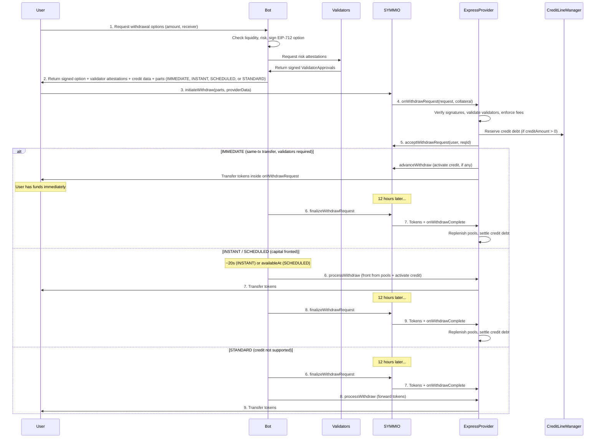

**Four withdrawal options:**

| Option | Name | When user gets funds | Capital source |
|--------|------|---------------------|----------------|
| IMMEDIATE | Immediate | Same transaction | Express pools front it, transferred in onWithdrawRequest |
| INSTANT | Instant | ~20 seconds | Express pools front it (general + affiliate + credit line) |
| SCHEDULED | Scheduled | 1-11 hours | Both general and affiliate portions are reserved via ring buffers against future liquidity; credit line debt is reserved immediately |
| STANDARD | Standard | 12 hours | SYMMIO sends to Express after cooldown, Express forwards to user (credit not supported) |

All four options go through the ExpressProvider. This gives the bot full control over the withdrawal lifecycle for every option, including finalization after cooldown. The per-affiliate operator fee discourages dust withdrawals by making them uneconomical for griefers.

## 2. Components

### 2.1 Deployment Topology

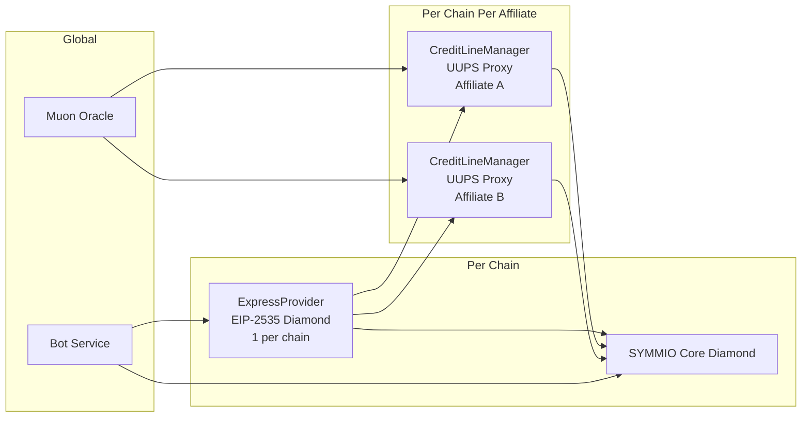

| Component | Count | Upgradeable | Description |
|-----------|-------|-------------|-------------|
| **ExpressProvider** | 1 per chain | Yes (EIP-2535 Diamond) | Main coordinator. Manages liquidity pools, validates bot signatures, locks/transfers funds. Split into AdminFacet, SymmioHookFacet, OperatorFacet, ViewFacet. |
| **CreditLineManager** | 1 per chain per affiliate | Yes (UUPS proxy) | Manages per-affiliate credit lines backed by Muon oracle attestations. Tracks reserved/active debt and enforces protocol/affiliate caps. |
| **Bot Service** | 1 global | N/A | Off-chain. Provides options API, signs options, monitors events, calls `processWithdraw` and `finalizeWithdrawRequest`. |

### 2.2 Trust Relationships

- ExpressProvider is registered as an **Express Provider** on SYMMIO
- ExpressProvider holds `EXPRESS_PROVIDER_ROLE` on each CreditLineManager for `reserveDebt` / `activateDebt` / `settleDebt` / `cancelReservation`
- CreditLineManager verifies Muon oracle attestations to validate credit eligibility
- Bot holds `OPERATOR_ROLE` and `SIGNER_ROLE` on ExpressProvider
- Validators hold `VALIDATOR_ROLE` on ExpressProvider — their EIP-712 signatures are verified during onWithdrawRequest

### 2.3 Access Control (ExpressProvider)

| Role | Who | Can do |
|------|-----|--------|
| Diamond Owner | Deployer/multisig | Diamond cut (add/replace/remove facets), grant/revoke roles |
| `WITHDRAWER_ROLE` | Deployer/multisig | Withdraw liquidity from general and affiliate pools (`withdrawFromGeneral`, `withdrawFromAffiliate`) |
| `SETTER_ROLE` | Deployer/multisig | Set all contract parameters: affiliate configs, security window, tolerance period, bucket config, validators, virtual providers |
| `SPONSOR_MANAGER_ROLE` | Deployer/multisig | Withdraw sponsor balances (`withdrawSponsorBalance`) |
| `FEE_CLAIMER_ROLE` | Deployer/multisig | Claim accumulated fees (`claimFees`, `claimOperatorFees`) |
| `OPERATOR_ROLE` | Bot service | `processWithdraw` |
| `LOCKER_ROLE` | Risk detection service | `lockWithdraw` (separated from operator so the processing key cannot freeze funds) |
| `UNLOCK_ROLE` | Deployer/multisig | `unlockAndProcess` (separated from bot to prevent lock-unlock hostage attacks) |
| `SIGNER_ROLE` | Bot signer key | Signs withdrawal options (verified on-chain via EIP-712) |
| `VALIDATOR_ROLE` | Anomaly detectors / monitoring services | Signs `ValidatorApproval` attestations verified on-chain |

Roles are stored in diamond storage and managed via `grantRole`/`revokeRole` on AdminFacet (owner-only).

## 3. Liquidity Model

### 3.1 Balance Pools

The ExpressProvider maintains two types of pools, plus an optional credit line per affiliate:

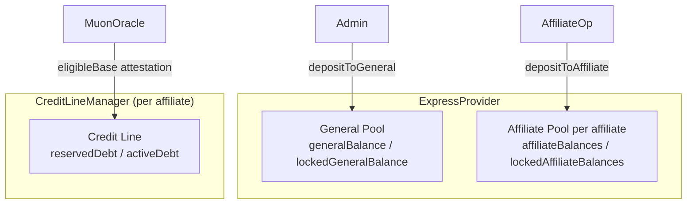

**General Pool**: System-wide, available to all users. Funded by operators via `depositToGeneral()`.

**Affiliate Pool**: Per-affiliate, available only to that affiliate's users. Funded by affiliate operators via `depositToAffiliate(affiliate, amount)`.

**Credit Line** (in CreditLineManager): Per-affiliate, allows withdrawals backed by Muon-attested eligible balances. The CreditLineManager tracks reserved and active debt, enforces protocol and affiliate caps, and verifies Muon oracle signatures. Credit is not supported for STANDARD withdrawals.

### 3.2 Liquidity Priority (for Express-Fronted Source Selection)

When constructing an IMMEDIATE or INSTANT option, and when choosing the pool split for a SCHEDULED option, the bot chooses funding sources in this order:

1. **Affiliate Pool** (lowest system risk -- affiliate's own capital)
2. **Credit Line** (backed by Muon-attested eligible balances, not supported for STANDARD)
3. **General Pool** (system-wide fallback)

The bot encodes its decision into the signed option as `affiliateAmount` (how much from the affiliate pool) and `creditAmount` (how much from the credit line). The remainder comes from the general pool: `generalAmount = expressAmount - affiliateAmount - creditAmount`.

For SCHEDULED withdrawals, both general and affiliate amounts are reserved via their respective ring buffers, relying on future liquidity forecasting. No counter locks are used for SCHEDULED -- ring buffers handle everything.

### 3.3 Funding Cycle

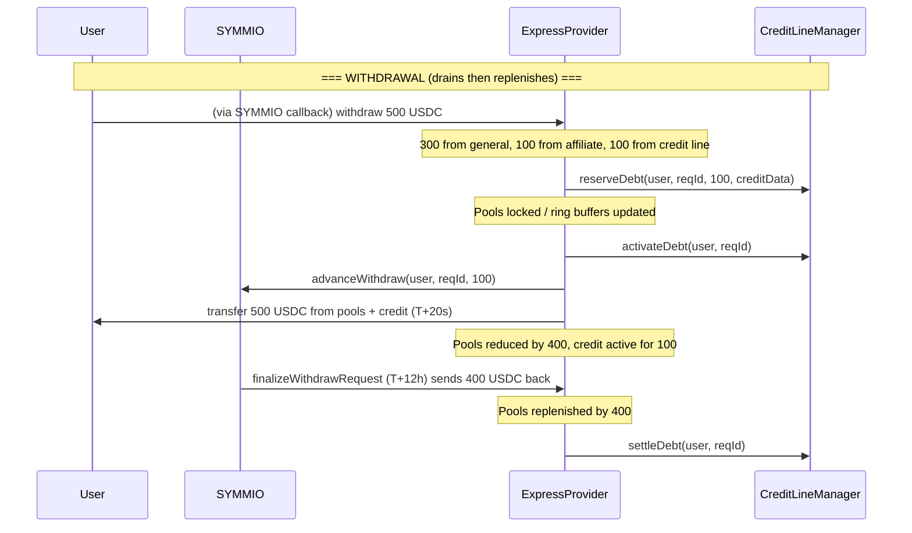

## 4. Signature Scheme (EIP-712)

The bot signs withdrawal options using EIP-712 typed data. The ExpressProvider verifies these signatures on-chain in the `onWithdrawRequest` callback.

### 4.1 Domain

```
name: "ExpressProvider"
version: "1"
chainId: <chain id>
verifyingContract: <ExpressProvider proxy address>
```

### 4.2 Type

```
WithdrawOption(
    address user,
    uint256 nonce,
    uint8 optionType,      // 0 = IMMEDIATE, 1 = INSTANT, 2 = SCHEDULED, 3 = STANDARD
    uint256 availableAt,   // 0 for IMMEDIATE/INSTANT/STANDARD, timestamp for SCHEDULED
    address affiliate,      // affiliate pool to use
    uint256 affiliateAmount,// how much from affiliate pool
    uint256 creditAmount,  // how much from credit line (must be 0 for STANDARD)
    uint256 fee,           // affiliate fee in collateral decimals
    uint256 operatorFee,   // fixed operator fee in collateral decimals
    uint256 maxUserFee,    // max fee the user pays (reverts if exceeded)
    bytes32 partsHash,     // keccak256(abi.encode(parts))
    uint256 deadline       // signature expiry timestamp
)
```

### 4.3 Provider Data Encoding

The signed option, validator attestations, and credit data are packed into `providerData` which the user passes to `SYMMIO.initiateWithdraw(parts, speedUp, providerData)`. The encoding is nested:

```
providerData = abi.encode(optionData, validatorData, creditDataRaw)

optionData = abi.encode(
    uint256 nonce,
    uint8   optionType,
    uint256 availableAt,
    address affiliate,
    uint256 affiliateAmount,
    uint256 creditAmount,   // how much from credit line (0 if not using credit)
    uint256 fee,
    uint256 operatorFee,
    uint256 maxUserFee,
    uint256 deadline,
    bytes   signature       // bot's EIP-712 signature
)

validatorData = abi.encode(
    bytes[]   signatures,   // validator EIP-712 signatures (ordered by ascending signer address)
    uint256[] timestamps,   // corresponding signing timestamps
    uint256   symmioNonce   // user's SYMMIO nonce at validation time (read via getUserNonce)
)

creditDataRaw = abi.encode(CreditData) // empty bytes if creditAmount == 0
// CreditData contains:
//   bytes   reqId,             // Muon request ID
//   uint256 eligibleBase,      // Muon-verified eligible balance
//   uint256 timestamp,         // Muon signature timestamp
//   bytes   gatewaySignature,  // Gateway signature from Muon
//   SchnorrSign sigs           // Schnorr signatures
```

### 4.4 Nonce Management

Each user has a per-user nonce stored in `ExpressProvider.nonces[user]`. The bot must read the current nonce before signing. The nonce is consumed (incremented) atomically when `onWithdrawRequest` succeeds.

**Bot must**: Call `expressProvider.nonces(user)` to get current nonce before signing.

### 4.5 Parts Hash

The `partsHash` binds the signature to exact withdrawal parts. Computed as:

```solidity
partsHash = keccak256(abi.encode(parts))
```

Where `parts` is an array of `WithdrawReceiverPart`:

```solidity
struct WithdrawReceiverPart {
    uint256 id;
    uint256 amount;          // collateral decimals (e.g. 6 for USDC)
    int256  chainId;
    bytes   receiver;        // 20 bytes, the receiver address
    address virtualProvider; // DEPRECATED: must be address(0), reverts VirtualProviderDeprecated otherwise
    address expressProvider; // ExpressProvider address
}
```

### 4.6 Validator Approval Signature

Validators sign a separate EIP-712 message attesting to user legitimacy:

**Type:**
```
ValidatorApproval(
    address user,       // the withdrawing user
    uint256 nonce,      // must match the bot option nonce (ties to specific withdrawal)
    uint256 amount,     // total withdrawal amount (expressAmount)
    uint256 timestamp,  // when the validator signed (freshness check)
    uint256 symmioNonce // user's current nonce on SYMMIO (invalidates if user acts on SYMMIO)
)
```

Uses the same EIP-712 domain as the bot option (same contract, chain).

**On-chain validation (in `onWithdrawRequest`):**
1. Check `signatures.length >= minValidatorSignatures`
2. Verify `symmioNonce == ISymmio(symmio).getUserNonce(user)` — if the user acted on SYMMIO since validators signed, the nonce won't match and the withdrawal is rejected
3. For each signature:
   - Reject future timestamps (`timestamp > block.timestamp`)
   - Verify `block.timestamp - timestamp <= validatorApprovalTimeout` (default 30s)
   - Recover signer from EIP-712 digest (includes `symmioNonce`)
   - Verify signer has `VALIDATOR_ROLE`
   - Verify signer address is strictly greater than the previous (ascending order = no duplicates)
4. If any check fails → revert (withdrawal auto-rejected)

When `minValidatorSignatures == 0`, the validator check is skipped entirely.

## 5. Fee Model

The system supports per-affiliate fee configuration. Fees are charged on the total express amount (sum of all parts routed through this ExpressProvider) and accumulated for later collection by the admin.

### 5.1 Affiliate Configuration

Each affiliate (frontend) has an `AffiliateConfig`:

```solidity
struct AffiliateConfig {
    uint256 feeRate;              // fee in basis points (1 bp = 0.01%, max 10000)
    uint256 operatorFee;          // fixed operator fee in collateral decimals (covers bot gas)
}
```

The admin sets this via:

```solidity
function setAffiliateConfig(
    address affiliate,
    uint256 feeRate,
    uint256 operatorFee
) external onlyRole(SETTER_ROLE);
```

- `feeRate` is in basis points (e.g., 50 = 0.50%).
- `operatorFee` is a fixed fee per withdrawal in collateral decimals (e.g., 1e6 = 1 USDC). Set per-affiliate to allow different operator fees for different frontends.

### 5.2 Fee Calculation and Signing

The bot computes the fee off-chain before signing the EIP-712 option:

```
fee = expressAmount * feeRate / 10000
```

Where `expressAmount` is the total amount from all parts routed through this ExpressProvider (i.e., parts where `expressProvider == address(this)`). This includes amounts funded from general pool, affiliate pool, and credit line. The computed `fee` is included as a field in the signed `WithdrawOption` typed data, binding it to the signature.

### 5.3 On-Chain Validation

When `onWithdrawRequest` decodes and validates the signed option, the contract independently re-derives the fee from the on-chain `affiliateConfigs` and rejects any mismatch:

```solidity
uint256 feeBasis = amounts.expressAmount;
if (opt.fee != feeBasis * affiliateConfigs[opt.affiliate].feeRate / 10000) revert FeeMismatch();
if (opt.operatorFee != affiliateConfigs[opt.affiliate].operatorFee) revert OperatorFeeMismatch();
if (opt.fee + opt.operatorFee > feeBasis) revert FeesExceedExpressAmount();
```

This ensures the bot cannot overcharge or undercharge -- the contract is the source of truth for fee calculation. A malicious or buggy bot signing incorrect fees will have its transaction reverted. The bot must use the exact `feeRate` and `operatorFee` from the affiliate's on-chain config.

### 5.4 Fee Deduction

Fees are deducted during `processWithdraw`, `unlockAndProcess`, or inline within `onWithdrawRequest` for IMMEDIATE:

- The contract first attempts to pay the fee from the affiliate's `sponsorBalances`. Whatever the sponsor balance cannot cover is deducted from the user's withdrawal amount.
- Fees are deducted from the collateral transfers by cascading across parts: the `userFee` is subtracted from the first part(s) until exhausted. The user receives `partAmount - deduction` for affected parts.
- Parts where `expressProvider != address(this)` are skipped (not subject to fees from this provider).
- For **STANDARD**: the fee is deducted from the forwarded tokens during `processWithdraw`, same as for INSTANT/SCHEDULED.
- The full fee is always added to `collectedFees[affiliate]` regardless of whether the sponsor or user paid it.
- **Operator fee**: Accumulated separately per affiliate in `collectedOperatorFees[affiliate]`. Claimable by admin via `claimOperatorFees(affiliate)`. Combined with the affiliate fee for total fee deduction.
- **maxUserFee guarantee**: After sponsor coverage is locked at acceptance, the contract validates `actualUserFee <= maxUserFee`. If the sponsor balance was drained and the user would pay more than promised, the tx reverts.

### 5.5 Fee Accumulation and Collection

Deducted fees are accumulated per affiliate:

```solidity
mapping(address => uint256) public collectedFees;          // affiliate => accumulated fees
mapping(address => uint256) public collectedOperatorFees;  // affiliate => accumulated operator fees (per-affiliate)
```

The admin claims accumulated fees via:

```solidity
function claimFees(address affiliate, address to) external onlyRole(FEE_CLAIMER_ROLE);
function claimOperatorFees(address affiliate, address to) external onlyRole(FEE_CLAIMER_ROLE);
```

`claimFees` transfers the full `collectedFees[affiliate]` balance to the specified `to` address and resets the mapping to zero. `claimOperatorFees` transfers the full `collectedOperatorFees[affiliate]` balance to the specified `to` address and resets it to zero.

### 5.6 Fee Flow

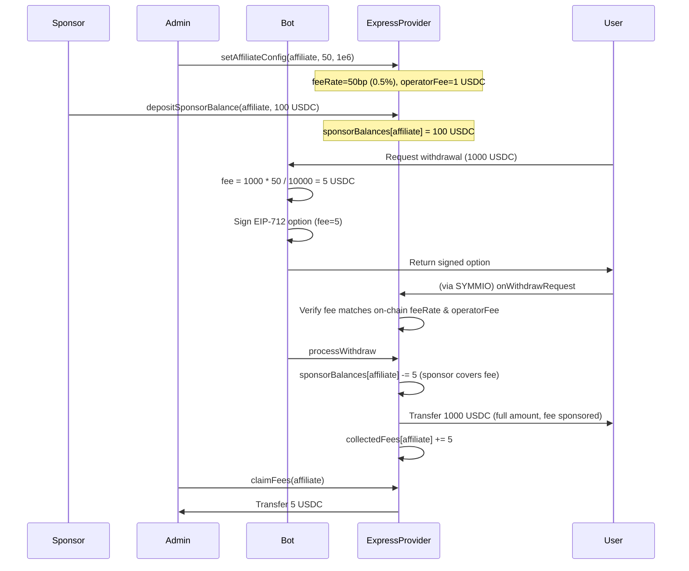

**When sponsor balance is insufficient:**

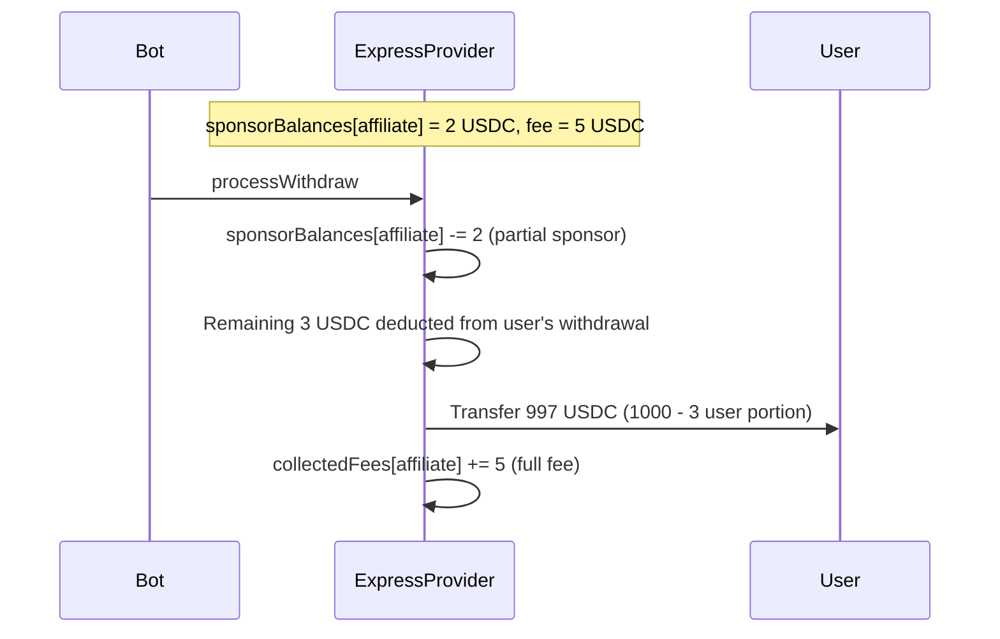

### 5.7 Fee Sponsorship

Fee sponsorship is a deposit-based on-chain mechanism that allows sponsors to fund withdrawal fees on behalf of an affiliate's users.

#### Sponsor Balance Management

Each affiliate has a `sponsorBalances` mapping that holds collateral deposited by sponsors:

```solidity
mapping(address => uint256) public sponsorBalances;  // affiliate => sponsor balance
```

- **`depositSponsorBalance(address affiliate, uint256 amount)`** -- Anyone can deposit collateral to fund fee sponsorship for an affiliate. The caller must have approved the collateral token for the ExpressProvider. The `sponsors[affiliate]` mapping tracks the last depositor.
- **`withdrawSponsorBalance(address affiliate, uint256 amount, address to)`** -- `SPONSOR_MANAGER_ROLE` only. Withdraws unused sponsor funds to the specified `to` address.
- **`setSponsorConfig(address affiliate, uint256 maxFeePerWithdraw, uint256 maxWithdrawAmount)`** -- `SETTER_ROLE` only. Configures caps on sponsorship: `maxFeePerWithdraw` limits how much the sponsor covers per withdrawal (0 = no limit), and `maxWithdrawAmount` restricts sponsorship to withdrawals whose total fee-bearing amount (`expressAmount`) is at or below this size (0 = no limit).

#### Sponsorship Logic During Withdrawal Processing

When `processWithdraw`, `unlockAndProcess`, or the inline IMMEDIATE path processes a withdrawal with a fee:

1. The contract checks `sponsorBalances[affiliate]`.
2. If the sponsor balance can cover the full fee: the entire fee is deducted from `sponsorBalances[affiliate]`, and the user receives the full withdrawal amount with no fee deduction.
3. If the sponsor balance can partially cover the fee: the available sponsor balance is consumed entirely, and the remainder is deducted from the user's withdrawal amount.
4. If the sponsor balance is zero: the full fee is deducted from the user's withdrawal amount (same as the legacy behavior).
5. In all cases, the full fee amount is added to `collectedFees[affiliate]`.

#### Key Properties

- **Permissionless deposits**: Anyone (the affiliate operator, a third party, or the protocol itself) can deposit sponsor funds. This enables flexible sponsorship arrangements.
- **Role-controlled withdrawals**: Only `SPONSOR_MANAGER_ROLE` can withdraw unused sponsor funds (to a specified `to` address), preventing unauthorized draining.
- **Deterministic coverage locking**: Sponsor coverage is locked at acceptance time (in `onWithdrawRequest`), making the fee split deterministic. If the withdrawal is cancelled or suspended, the locked sponsor coverage is refunded.
- **Coverage as lump sum**: Sponsorship covers up to `totalFee` (affiliate fee + operator fee) as a single amount. There is no priority ordering between fee types -- the sponsor covers whatever it can of the combined total.
- **Graceful degradation**: When the sponsor balance runs out, the system falls back to deducting fees from the user's withdrawal. There is no hard dependency on sponsorship being funded.
- **Full fee accounting**: `collectedFees` always reflects the total fee charged, regardless of who paid. This keeps fee accounting clean for the admin.

## 6. Withdrawal Flows

### 6.1 INSTANT -- Instant Withdrawal (~20 seconds)

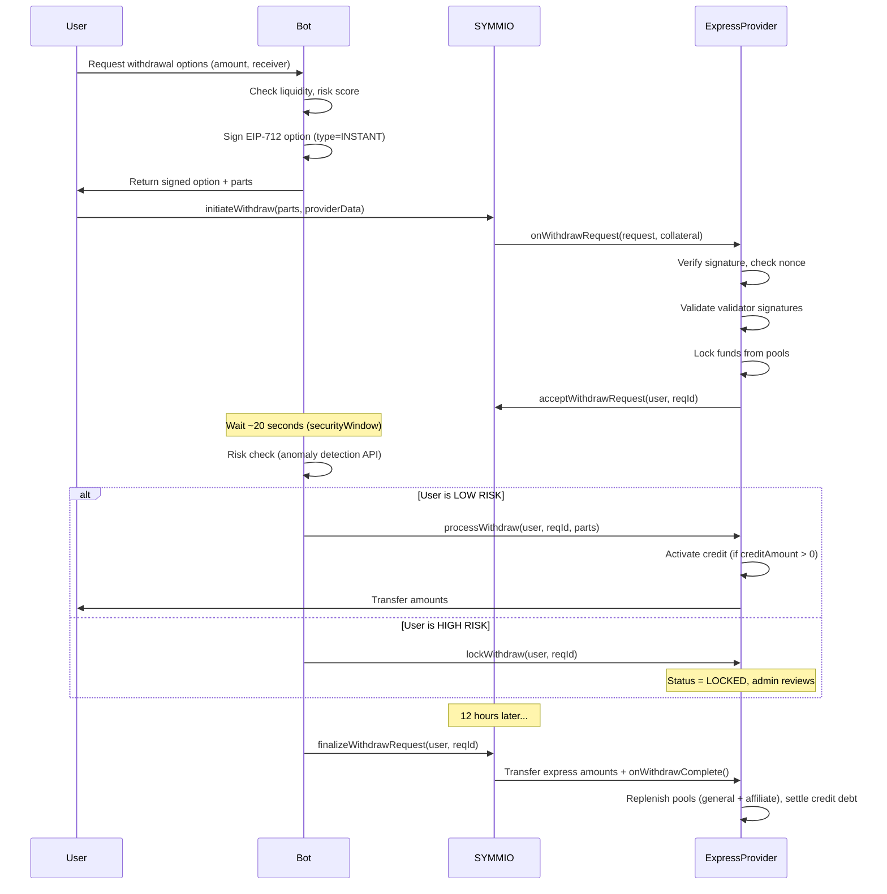

**Timing:**
- `processWithdraw` by operator: allowed after `acceptedAt + securityWindow` (default 20s)
- `processWithdraw` by anyone (permissionless fallback): allowed after `acceptedAt + securityWindow + tolerancePeriod` (default 80s)

### 6.2 SCHEDULED -- Scheduled Withdrawal (1-11 hours)

Same as INSTANT except:

1. **Both general and affiliate use ring buffers** -- no counter locks are used for SCHEDULED. Both the general and affiliate amounts are reserved via `addReservedOutflow` and verified via `isLiquidityAvailableBy` in their respective ring buffers
2. **Credit debt is reserved on accept** -- just like other non-STANDARD options
3. **Acceptance includes on-chain feasibility checks** -- if the promised `generalAmount` is not reachable by `availableAt` in the general ring, or the `affiliateAmount` is not reachable by `availableAt` in the affiliate ring, acceptance reverts
4. **Processing happens at `availableAt`** instead of `acceptedAt + 20s`
5. **Non-cancellable** -- once accepted, SCHEDULED cannot be cancelled (protects bucket integrity)

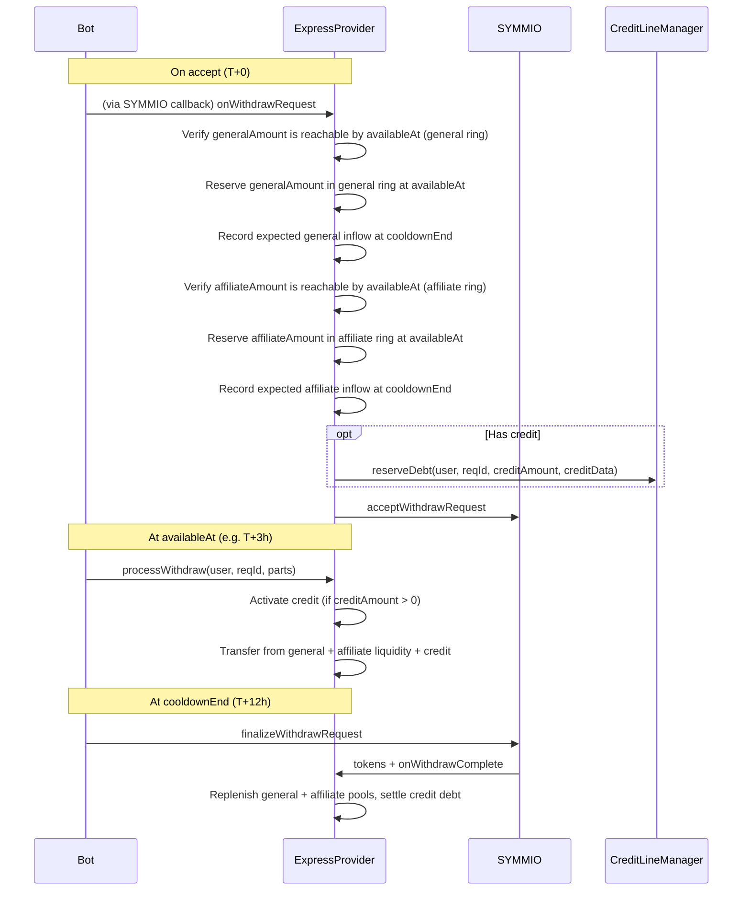

### 6.3 STANDARD -- Standard Withdrawal (12 hours)

STANDARD goes through ExpressProvider but does **not front any capital** and **does not support credit lines** (`CreditNotSupportedForStandard` error). Express acts as an intermediary so the bot controls finalization.

```mermaid
sequenceDiagram
    participant User
    participant Bot
    participant SYMMIO
    participant Express as ExpressProvider

    User->>Bot: Request withdrawal options
    Bot->>Bot: No instant/scheduled liquidity available
    Bot->>Bot: Sign EIP-712 option (type=STANDARD, creditAmount=0)
    Bot->>User: Return STANDARD + parts

    User->>SYMMIO: initiateWithdraw(parts, providerData)
    SYMMIO->>Express: onWithdrawRequest(request, collateral)
    Express->>Express: Verify signature, NO pool locking
    Express->>SYMMIO: acceptWithdrawRequest(user, reqId)
    Note over Express: Status = ACCEPTED, pools untouched

    Note over SYMMIO: 12 hours later (cooldown expires)

    Bot->>SYMMIO: finalizeWithdrawRequest(user, reqId)
    SYMMIO->>Express: Transfer express tokens + onWithdrawComplete()
    Note over Express: Status = FINALIZED, tokens held for user

    Bot->>Express: processWithdraw(user, reqId, parts)
    Express->>User: Forward express tokens to receiver
    Note over Express: No risk check needed — 12h cooldown was the security window
```

**Key differences from INSTANT/SCHEDULED:**
- No express pool locking on accept (no capital fronted)
- No bucket reservation and no scheduler inflow forecast
- Credit lines are not supported (`creditAmount` must be 0)
- `onWithdrawComplete` sets status to FINALIZED (tokens arrive from SYMMIO)
- `processWithdraw` requires FINALIZED status (not ACCEPTED)
- `processWithdraw` forwards express tokens to the user
- Cancellable before finalization (unlike SCHEDULED)
- Once finalized, `forceCancel` and `suspend` are no longer valid; a LOCKED STANDARD can be resolved via `unlockAndProcess` or via `processWithdraw` after cooldown expiry (which also triggers finalization from SYMMIO if needed)

### 6.4 IMMEDIATE -- Same-Transaction Transfer

IMMEDIATE transfers funds to the user inside `onWithdrawRequest` itself — the user gets funds in the same transaction as `initiateWithdraw`. This requires validators to be enabled (`minValidatorSignatures > 0`).

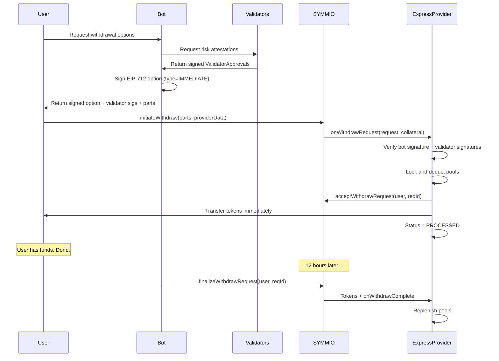

**Key properties:**
- Validators are mandatory — `ValidatorsRequiredForImmediate` error if `minValidatorSignatures == 0`
- Status goes directly NONE → PROCESSED (skips ACCEPTED)
- `processWithdraw` cannot be called (already PROCESSED)
- Lock/cancel/suspend not applicable (funds already transferred)
- Finalization works identically to INSTANT (pools replenished at cooldown)
- `nonReentrant` guard on `onWithdrawRequest` prevents reentrancy during transfers
- User pays gas for the transfer (included in their `initiateWithdraw` tx)

### 6.5 Cancellation

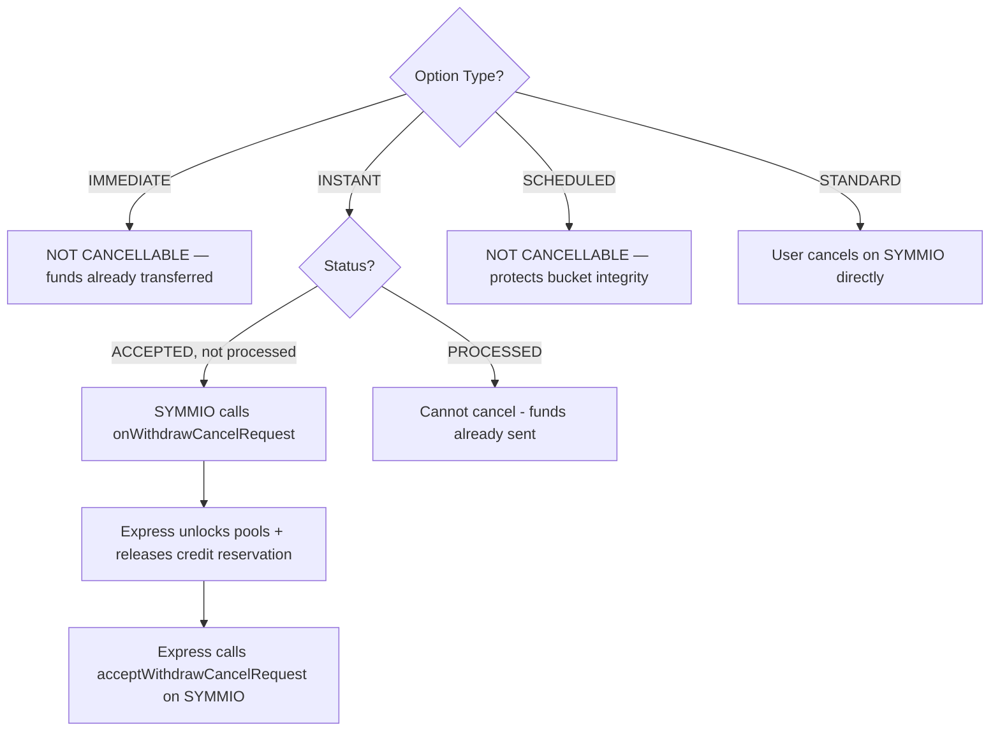

**IMMEDIATE is non-cancellable** because funds are already transferred to the user in the same transaction.
**SCHEDULED is non-cancellable** because cancelling would invalidate bucket reservations that other SCHEDULED withdrawals depend on.

`forceCancel` is separate from user cancellation: SYMMIO can still force-cancel ACCEPTED or LOCKED withdrawals (including SCHEDULED) before payout. Once a withdrawal is already PROCESSED, or a STANDARD withdrawal has already finalized, `forceCancel` is invalid.

### 6.6 Suspension

An operator with `SUSPENDER_ROLE` on SYMMIO can suspend a user's withdrawal (e.g., for compliance). SYMMIO calls `onWithdrawSuspend` on the ExpressProvider, which:

1. Unlocks pool counter locks (for INSTANT/IMMEDIATE only — SCHEDULED uses ring buffers, not counter locks; not applicable for IMMEDIATE after processing — funds already transferred)
2. Releases credit line reservation (if `creditAmount > 0`)
3. Removes forecast inflows from both general and affiliate ring buffers, and clears any SCHEDULED reservations from both ring buffers
4. Refunds sponsor coverage to sponsor balance
5. Sets status to `SUSPENDED`

If the withdrawal was already PROCESSED, `_handleProcessedRollback` is called instead, which covers credit loss from the affiliate pool and removes expected inflows.

Note: IMMEDIATE withdrawals cannot be suspended after acceptance because the funds are already transferred in the same transaction. The suspension would need to happen before the user's `initiateWithdraw` tx is mined. STANDARD withdrawals can only be suspended before finalization; once `onWithdrawComplete` has delivered the tokens, suspension is invalid.

### 6.7 Risk Lock

If the anomaly detection API flags a user as risky between acceptance and processing:

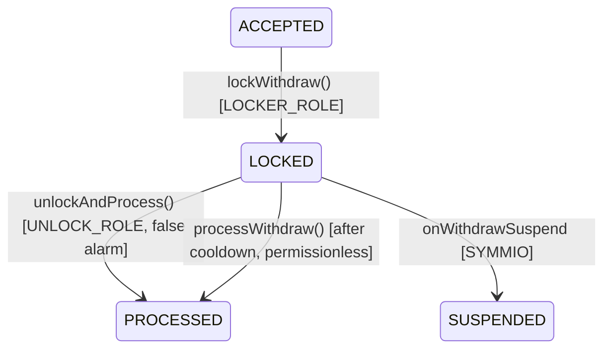

While locked, `processWithdraw` normally reverts. However, once the SYMMIO cooldown expires without suspension, `processWithdraw` accepts LOCKED withdrawals — the risk window is over and the withdrawal can be processed like any other (including the permissionless fallback after `tolerancePeriod`). An `UNLOCK_ROLE` holder can also unlock early via `unlockAndProcess` (false alarm). `UNLOCK_ROLE` and `LOCKER_ROLE` are intentionally separated from `OPERATOR_ROLE` so the bot cannot lock, unlock, or hold user funds hostage.

## 7. State Machine

### 7.1 ExpressProvider Status

**INSTANT / SCHEDULED (capital fronted):**

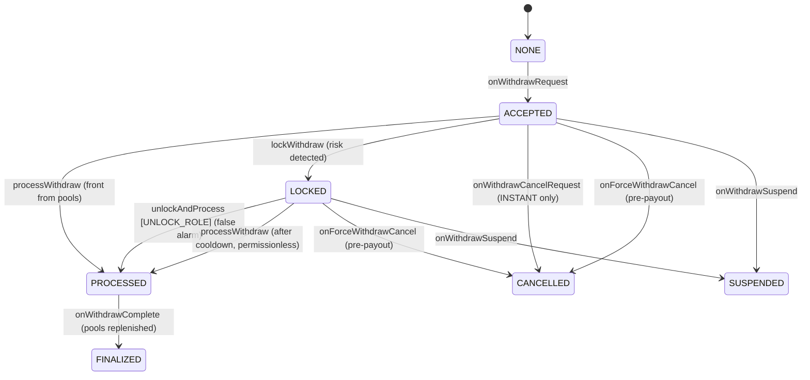

**IMMEDIATE (same-tx, validators required):**

```
NONE → PROCESSED (onWithdrawRequest: validated + transferred)
PROCESSED → FINALIZED (onWithdrawComplete: pools replenished)
```

**STANDARD (no fronting):**

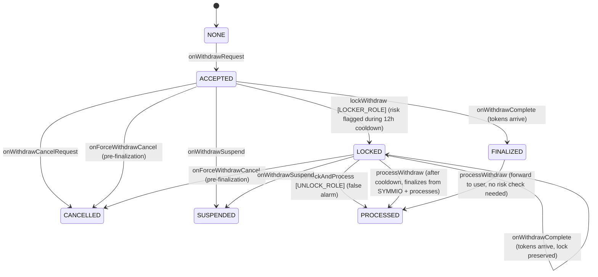

Note: For STANDARD, risk locking happens **during** the 12-hour cooldown (before SYMMIO finalizes), not after. Once SYMMIO has finalized and sent the tokens, the cooldown period itself served as the security window — no additional risk check is needed. If a withdrawal is LOCKED when `onWithdrawComplete` fires, the status stays LOCKED (tokens arrive but can't be forwarded until `unlockAndProcess`), and `forceCancel` / `suspend` are no longer valid after finalization. However, once the cooldown expires, `processWithdraw` accepts LOCKED withdrawals (for STANDARD, it calls `finalizeWithdrawRequest` on SYMMIO first to retrieve tokens), ensuring users are never indefinitely blocked.

### 7.2 SYMMIO Withdrawal Status (for reference)

| Status | Description |
|--------|-------------|
| `PENDING` | Created by initiateWithdraw. Awaiting provider. |
| `PROVIDER_ACCEPTED` | Provider accepted. Awaiting cooldown/processing. |
| `PROVIDER_REJECTED` | Provider rejected. Funds refunded. |
| `CANCEL_REQUESTED` | User requested cancellation. Awaiting provider response. |
| `CANCELLED` | Cancelled. Funds refunded to user. |
| `SUSPENDED` | Operator suspended. Funds refunded to user. |
| `COMPLETED` | Finalized. Tokens transferred. |

## 8. Bucket Ring Buffer (Liquidity Scheduler)

The ExpressProvider uses configurable ring buffers to forecast liquidity for all non-STANDARD withdrawal types. INSTANT and IMMEDIATE record expected inflows; SCHEDULED additionally records reserved outflows and verifies future liquidity availability.

### 8.1 Structure

```
Configurable: bucketDuration (default 1 hour), schedulingWindow (default 12 hours)
numBuckets = schedulingWindow / bucketDuration + 1 (derived, includes headroom bucket, e.g. 13, 25, 49)

Examples:
  1h buckets  → 13 buckets over 12h (default, includes 1 headroom bucket)
  30min       → 25 buckets over 12h (finer granularity, higher gas on sync)
  15min       → 49 buckets over 12h (finest, for cheap-gas chains)

Two ring buffer instances exist: one for the general pool (s.generalRing) and one per
affiliate (s.affiliateRings[affiliate]). Both share global config (bucketDuration,
schedulingWindow) and use a configNonce for lazy reset on bucket reconfig.

Each bucket:
  - expectedInflow:  projected reimbursements from SYMMIO finalizations in this window
  - reservedOutflow: liquidity committed for SCHEDULED payouts in this window
```

### 8.2 How It Works

**On accepting any express withdrawal (IMMEDIATE, INSTANT, or SCHEDULED):**
- Record `expectedInflow` for `generalAmount` in the general ring buffer at the bucket where `cooldownEndTime` falls
- Record `expectedInflow` for `affiliateAmount` in the affiliate ring buffer at the bucket where `cooldownEndTime` falls (so future SCHEDULED checks can forecast returning affiliate liquidity)

**On accepting a SCHEDULED withdrawal:**
- Reserve credit debt on CreditLineManager (if `creditAmount > 0`)
- Verify `generalAmount` is reachable by `availableAt` in the general ring buffer
- Verify `affiliateAmount` is reachable by `availableAt` in the affiliate ring buffer
- Record `reservedOutflow` for `generalAmount` in the general ring buffer at the bucket where `availableAt` falls
- Record `reservedOutflow` for `affiliateAmount` in the affiliate ring buffer at the bucket where `availableAt` falls

**Cleanup:**
- When a non-STANDARD withdrawal finalizes (`onWithdrawComplete`), its projected `expectedInflow` is removed from both general and affiliate ring buffers because the money is no longer "future" — it is already real balance.
- If a non-STANDARD withdrawal is cancelled or suspended before finalization, the invalidated inflow forecasts and any SCHEDULED reservations are removed from both general and affiliate ring buffers.
- STANDARD withdrawals never create ring buffer forecasts.

**Sync mechanism:**
Every state-changing function calls `LibRingBuffer.sync()` on each ring buffer it touches, which advances the ring buffer by clearing expired buckets (periods that have passed). If the ring's `configNonce` doesn't match the global `configNonce`, the ring is lazily reset first — this handles bucket reconfigurations without needing to iterate all per-affiliate rings.

### 8.3 Earliest Availability Query

```solidity
function getEarliestExpressAvailability(
    address affiliate,
    uint256 amount
) external view returns (bool available, uint256 availableAt)
```

**Algorithm:**
1. Start with current unlocked balance (general + current affiliate for the selected affiliate)
2. Simulate syncs for both the general and affiliate ring buffers (read-only)
3. Walk both rings in parallel, accumulating `expectedInflow` and `reservedOutflow` from both general and affiliate ring buffers at each step
4. Return the first bucket where accumulated inflows cover the deficit (amount beyond current balance)

The bot calls this to determine if a SCHEDULED option is feasible and what `availableAt` to offer. Both general and affiliate ring buffers contribute forecasted inflows and reserved outflows to the availability calculation.

**Note:** This function excludes credit-line capacity (which depends on per-request Muon data, not an on-chain snapshot). The bot should consider available credit separately when constructing options.

## 9. Bot Responsibilities

### 9.1 Options API

When a user requests withdrawal options:

1. Read `expressProvider.nonces(user)` for current nonce
2. Check anomaly detection API for user risk
3. Calculate available liquidity across pools
4. Generate up to 4 options:

| Check | Option Generated |
|-------|-----------------|
| Sufficient instant liquidity + validators enabled | **IMMEDIATE** (optionType=0) |
| Sufficient instant liquidity + low risk | **INSTANT** (optionType=1) |
| Insufficient now, but `getEarliestExpressAvailability` returns a time | **SCHEDULED** (optionType=2) |
| Always | **STANDARD** (optionType=3) |

All four options use the same EIP-712 signature and go through ExpressProvider.

5. Collect validator attestations: query N validator services with `(user, nonce, amount)`. Each validator signs `ValidatorApproval` with current timestamp.
6. Read `affiliateConfigs(affiliate)` to get `feeRate` and `operatorFee`
7. Compute `fee = expressAmount * feeRate / 10000`
8. If using credit line: obtain Muon attestation (`CreditData`) for the user's eligible balance. Credit is not supported for STANDARD.
9. For SCHEDULED, both `generalAmount` and `affiliateAmount` are reserved via their respective ring buffers; both use forecasted liquidity rather than requiring current unlocked balance
10. Construct `WithdrawReceiverPart[]` with the correct `expressProvider` (set `virtualProvider` to `address(0)`)
11. Sign EIP-712 typed data (including `creditAmount`, `fee`, `operatorFee`, and `maxUserFee` fields)
12. Return to user: `{ parts, providerData (includes option + validator signatures + credit data), estimatedTime, fee, operatorFee, maxUserFee }`

### 9.2 Event Monitoring

The bot must monitor these events on the ExpressProvider:

| Event | Action |
|-------|--------|
| `WithdrawAccepted(user, requestId, optionType)` | For IMMEDIATE: no action needed (already processed). Otherwise, schedule `processWithdraw` at the right time |
| `WithdrawProcessed(user, requestId)` | Schedule `finalizeWithdrawRequest` on SYMMIO at cooldownEndTime |
| `WithdrawLocked(user, requestId)` | Cancel scheduled processing, notify admin |
| `WithdrawCancelled(user, requestId)` | Cancel all scheduled actions for this withdrawal |
| `WithdrawSuspended(user, requestId)` | Cancel all scheduled actions for this withdrawal |
| `WithdrawFinalized(user, requestId)` | Confirm cycle complete, update internal state |

### 9.3 Scheduled Actions

```mermaid
gantt
    title Bot Schedule for INSTANT (Instant)
    dateFormat X
    axisFormat %s

    section Withdrawal
    Accept (T+0)           :milestone, 0, 0
    Risk check + processWithdraw :active, 20, 25
    Finalize on SYMMIO     :43200, 43205

    section Fallback
    User can process permissionlessly :crit, 80, 85
```

| Option | finalizeWithdrawRequest | processWithdraw |
|--------|------------------------|-----------------|
| IMMEDIATE | cooldownEndTime (~12h) | N/A (transferred in onWithdrawRequest) |
| INSTANT | `cooldownEndTime` (~12h) | `acceptedAt + securityWindow` (20s) |
| SCHEDULED | `cooldownEndTime` (~12h) | `availableAt` |
| STANDARD | `cooldownEndTime` (~12h) | Operator: immediately after finalization. Anyone: after `tolerancePeriod`. |

### 9.4 Permissionless Fallback

If the bot fails to call `processWithdraw`, any address can call it after `processableAt + tolerancePeriod` (default 60s extra). The bot must detect user-initiated processing (via `WithdrawProcessed` events) and cancel its own scheduled call.

### 9.5 Risk Handling

**IMMEDIATE — no post-acceptance risk check:**

Funds are transferred in the same transaction as acceptance. The only risk gating is pre-acceptance: validators must attest to user legitimacy before the bot signs the option. Once the user submits `initiateWithdraw`, the transfer is atomic and irreversible.

**INSTANT / SCHEDULED — risk check between acceptance and processing:**

1. Query anomaly detection API during the `securityWindow` (~20s for INSTANT, before `availableAt` for SCHEDULED)
2. If **LOW RISK**: call `processWithdraw`
3. If **HIGH RISK**: `LOCKER_ROLE` holder calls `lockWithdraw` to prevent permissionless processing, then notifies admin
4. Admin (holding `UNLOCK_ROLE`) reviews and either:
   - Calls `unlockAndProcess` (false alarm)
   - Calls SYMMIO's `suspendWithdrawRequest` (confirmed bad actor)

**STANDARD — risk check during the 12-hour cooldown:**

1. `LOCKER_ROLE` holder can flag risky users any time during the 12h cooldown by calling `lockWithdraw` (from ACCEPTED)
2. When SYMMIO finalizes, `onWithdrawComplete` preserves the LOCKED status — tokens arrive but can't be forwarded
3. No post-finalization risk check needed — the 12h cooldown itself is the security window
4. Before finalization, admin may still suspend via SYMMIO; after finalization, the locked withdrawal must be resolved via `unlockAndProcess` (requires `UNLOCK_ROLE`)

## 10. Credit Line System

The credit line system allows users to withdraw against their eligible balance (as attested by the Muon oracle) without requiring the full amount to be available in express pools. Credit is only supported for IMMEDIATE, INSTANT, and SCHEDULED withdrawals — not STANDARD.

### 10.1 Architecture

Each affiliate can have a dedicated `CreditLineManager` contract (UUPS proxy), linked via `setCreditLineManager(affiliate, manager)`.

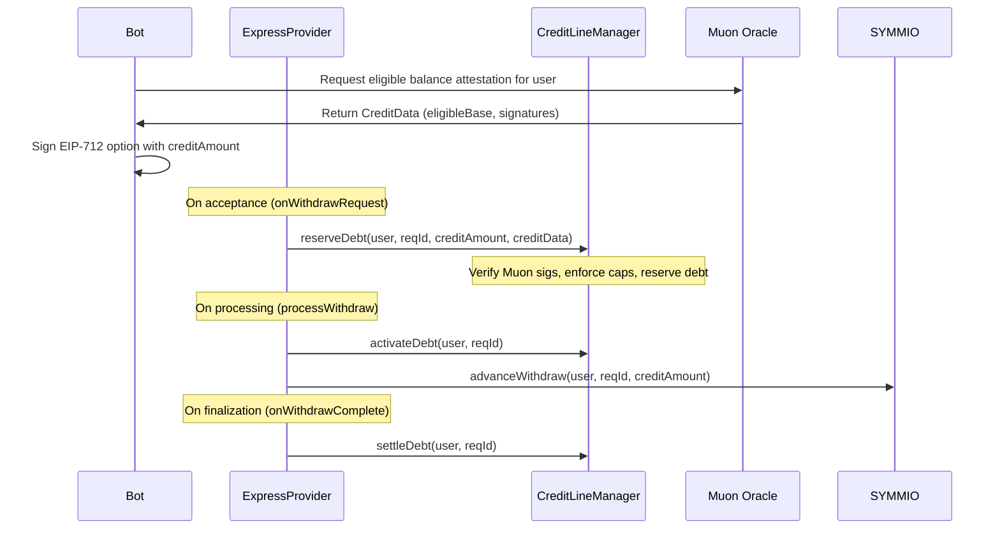

### 10.2 CreditLineManager

The CreditLineManager tracks two types of debt:
- **Reserved debt**: Debt that has been committed but the withdrawal hasn't been processed yet
- **Active debt**: Debt where the withdrawal has been processed (funds advanced from SYMMIO)

**Debt caps** are enforced at two levels:
- **Protocol level**: `protocolMaxDebt` (absolute) and `protocolMaxDebtBps` (percentage of eligible base)
- **Affiliate level**: `affiliateMaxDebt` and `affiliateMaxDebtBps` (must be <= protocol limits)

The effective cap is the stricter of the two levels.

**Muon verification**: `reserveDebt` validates the Muon oracle attestation (signature, freshness within `muonFreshnessWindow`), ensuring the user's `eligibleBase` is current and authentic.

### 10.3 Credit Lifecycle

| Phase | Trigger | CreditLineManager Action |
|-------|---------|--------------------------|
| Reserve | `onWithdrawRequest` | `reserveDebt` — validates Muon data, checks caps, adds to `reservedDebt` |
| Activate | `processWithdraw` / `unlockAndProcess` / IMMEDIATE inline | `activateDebt` — moves from `reservedDebt` to `activeDebt` |
| Settle | `onWithdrawComplete` | `settleDebt` — removes from `activeDebt`, deletes request state |
| Cancel | `onWithdrawCancelRequest` / `onForceWithdrawCancel` (pre-payout) | `cancelReservation` — removes from `reservedDebt` |
| Cover Loss | `onForceWithdrawCancel` / `onWithdrawSuspend` (post-payout) | `settleDebt` — deducts `creditAmount` from affiliate pool to cover the loss |

### 10.4 User Blacklisting and Pause

The CreditLineManager supports:
- **User blacklisting**: `setBlacklisted(user, true)` prevents a user from using credit
- **Pause**: `setPaused(true)` disables all credit reservations system-wide

## 11. Contract Interfaces

### 11.1 ExpressProvider

#### SYMMIO Callbacks (called by SYMMIO, not by bot)

```solidity
// Called when user initiates a withdrawal with express parts
function onWithdrawRequest(WithdrawRequest memory request, address collateral) external;

// Called when SYMMIO finalizes the withdrawal (12h later, sends tokens)
function onWithdrawComplete(WithdrawRequest memory request) external;

// Called when user requests cancellation
function onWithdrawCancelRequest(WithdrawRequest memory request) external;

// Called on force cancel by admin
function onForceWithdrawCancel(WithdrawRequest memory request) external;

// Called when operator suspends the withdrawal
function onWithdrawSuspend(WithdrawRequest memory request) external;
```

#### Bot/Operator Functions

```solidity
// Transfer funds to user. Operator: after securityWindow. Anyone: after +tolerancePeriod.
function processWithdraw(address user, uint256 requestId, WithdrawReceiverPart[] calldata parts) external;

// Lock a withdrawal due to risk detection. LOCKER_ROLE only.
function lockWithdraw(address user, uint256 requestId) external;

// Unlock and process after false alarm. UNLOCK_ROLE only (separate from operator).
function unlockAndProcess(address user, uint256 requestId, WithdrawReceiverPart[] calldata parts) external;
```

#### Admin Functions

```solidity
function depositToGeneral(uint256 amount) external;                        // Anyone can fund
function withdrawFromGeneral(uint256 amount) external;                     // WITHDRAWER_ROLE
function depositToAffiliate(address affiliate, uint256 amount) external;     // Anyone can fund
function withdrawFromAffiliate(address affiliate, uint256 amount) external;  // WITHDRAWER_ROLE
function claimFees(address affiliate, address to) external;                 // FEE_CLAIMER_ROLE
function claimOperatorFees(address affiliate, address to) external;        // FEE_CLAIMER_ROLE

// Setter functions (SETTER_ROLE)
function setCreditLineManager(address affiliate, address manager) external; // Setter only
function setSecurityWindow(uint256 seconds) external;                      // Setter only
function setTolerancePeriod(uint256 seconds) external;                     // Setter only
function setBucketDuration(uint256 seconds) external;                      // Setter only, clears general ring + increments configNonce (affiliate rings lazily reset)
function setSchedulingWindow(uint256 seconds) external;                    // Setter only, clears general ring + increments configNonce (affiliate rings lazily reset)
function setAffiliateConfig(
    address affiliate,
    uint256 feeRate,
    uint256 operatorFee
) external;                                                                // Setter only
function setMinValidatorSignatures(uint256 count) external;                // Setter only
function setValidatorApprovalTimeout(uint256 seconds) external;            // Setter only

// Fee sponsorship
function depositSponsorBalance(address affiliate, uint256 amount) external; // Anyone
function withdrawSponsorBalance(address affiliate, uint256 amount, address to) external; // SPONSOR_MANAGER_ROLE
function setSponsorConfig(address affiliate, uint256 maxFeePerWithdraw, uint256 maxWithdrawAmount) external; // Setter only

// Role management (owner-only, via AdminFacet)
function grantRole(bytes32 role, address account) external;   // Diamond owner only
function revokeRole(bytes32 role, address account) external;  // Diamond owner only
```

#### View Functions

```solidity
function bucketDuration() external view returns (uint256);
function schedulingWindow() external view returns (uint256);
function numBuckets() external view returns (uint256);             // derived: schedulingWindow / bucketDuration + 1 (includes headroom)
function nonces(address user) external view returns (uint256);
function getWithdrawInfo(address user, uint256 requestId) external view returns (WithdrawInfo memory);
function generalBalance() external view returns (uint256);
function lockedGeneralBalance() external view returns (uint256);
function affiliateBalances(address affiliate) external view returns (uint256);
function lockedAffiliateBalances(address affiliate) external view returns (uint256);
function creditLineManagers(address affiliate) external view returns (address);

// Fee queries
function affiliateConfigs(address affiliate) external view returns (uint256 feeRate, uint256 operatorFee);
function collectedFees(address affiliate) external view returns (uint256);
function sponsorBalances(address affiliate) external view returns (uint256);
function collectedOperatorFees(address affiliate) external view returns (uint256);
function sponsors(address affiliate) external view returns (address);
function sponsorConfigs(address affiliate) external view returns (uint256 maxFeePerWithdraw, uint256 maxWithdrawAmount);

// Ring buffer getters
function generalAnchorTimestamp() external view returns (uint256);
function generalStartIndex() external view returns (uint256);
function affiliateAnchorTimestamp(address affiliate) external view returns (uint256);
function affiliateStartIndex(address affiliate) external view returns (uint256);

// Security getters
function securityWindow() external view returns (uint256);
function tolerancePeriod() external view returns (uint256);

// Validator queries
function minValidatorSignatures() external view returns (uint256);
function validatorApprovalTimeout() external view returns (uint256);

// Access control
function hasRole(bytes32 role, address account) external view returns (bool);

// Returns earliest time the amount can be paid, considering ring buffer projections
// Note: excludes credit-line capacity (depends on per-request Muon data)
function getEarliestExpressAvailability(address affiliate, uint256 amount)
    external view returns (bool available, uint256 availableAt);
```

### 11.2 CreditLineManager (UUPS Proxy)

```solidity
// Initializer (called once on proxy deployment)
function initialize(
    address admin,
    address _symmio,
    address _expressProvider,
    address _signatureVerifier,
    uint256 _muonAppId
) external;

// Called only by EXPRESS_PROVIDER_ROLE holders (ExpressProvider)
function reserveDebt(address user, uint256 requestId, uint256 creditAmount, CreditData calldata data) external;
function activateDebt(address user, uint256 requestId) external;
function settleDebt(address user, uint256 requestId) external;
function cancelReservation(address user, uint256 requestId) external;

// View
function totalDebt() external view returns (uint256);    // reservedDebt + activeDebt
function reservedDebt() external view returns (uint256);
function activeDebt() external view returns (uint256);

// Protocol admin (PROTOCOL_ADMIN_ROLE)
function setProtocolConfig(uint256 _maxDebt, uint256 _maxDebtBps, uint256 _muonFreshnessWindow) external;
function setSignatureVerifier(address _signatureVerifier) external;
function setMuonAppId(uint256 _muonAppId) external;

// Affiliate admin (AFFILIATE_ADMIN_ROLE)
function setAffiliateConfig(uint256 _maxDebt, uint256 _maxDebtBps) external;
function setBlacklisted(address user, bool _blacklisted) external;
function setPaused(bool _paused) external;

// Role management (inherited from AccessControl)
function grantRole(bytes32 role, address account) external;   // Admin only
function revokeRole(bytes32 role, address account) external;  // Admin only

// Upgrade (UUPS)
function upgradeToAndCall(address newImplementation, bytes calldata data) external; // Admin only
```

**Roles:**

| Role | Who | Can do |
|------|-----|--------|
| `DEFAULT_ADMIN_ROLE` | Deployer/multisig | Upgrade contract, grant/revoke roles |
| `EXPRESS_PROVIDER_ROLE` | ExpressProvider | `reserveDebt`, `activateDebt`, `settleDebt`, `cancelReservation` |
| `PROTOCOL_ADMIN_ROLE` | Deployer/multisig | Set protocol-level debt caps and Muon config |
| `AFFILIATE_ADMIN_ROLE` | Affiliate operator | Set affiliate-level debt caps, blacklist users, pause |

## 12. Data Types Reference

```solidity
// ExpressProvider enums
enum Status { NONE, ACCEPTED, LOCKED, PROCESSED, FINALIZED, CANCELLED, SUSPENDED }
enum OptionType { IMMEDIATE, INSTANT, SCHEDULED, STANDARD }

// ExpressProvider structs
struct AffiliateConfig {
    uint256 feeRate;              // basis points (0-10000)
    uint256 operatorFee;          // fixed operator fee in collateral decimals (per-affiliate)
}

struct WithdrawInfo {
    Status  status;
    OptionType optionType;
    uint256 availableAt;          // SCHEDULED: when funds available. 0 for IMMEDIATE/INSTANT/STANDARD.
    uint256 expressAmount;        // total amount from express provider (general + affiliate + credit)
    uint256 generalAmount;        // how much of expressAmount from general pool
    uint256 affiliateAmount;      // how much of expressAmount from affiliate pool
    uint256 creditAmount;         // how much of expressAmount from credit line (0 for STANDARD)
    address affiliate;            // which affiliate pool was used
    address creditLineManager;    // CreditLineManager address (address(0) if no credit used)
    uint256 acceptedAt;           // block.timestamp when accepted
    uint256 finalizedAt;          // block.timestamp when onWithdrawComplete called (STANDARD only)
    uint256 cooldownEndTime;      // when SYMMIO's 12h cooldown expires
    bytes32 partsHash;            // keccak256(abi.encode(parts)) for integrity check
    uint256 fee;                  // affiliate fee in collateral decimals
    uint256 sponsorCoverage;      // how much of the fee the sponsor covers (locked at acceptance)
}

struct DecodedOption {
    uint256 nonce;
    uint8   optionType;           // 0=IMMEDIATE, 1=INSTANT, 2=SCHEDULED, 3=STANDARD
    uint256 availableAt;          // 0 for IMMEDIATE/INSTANT/STANDARD, timestamp for SCHEDULED
    address affiliate;
    uint256 affiliateAmount;
    uint256 creditAmount;         // how much from credit line (must be 0 for STANDARD)
    uint256 fee;                  // affiliate fee in collateral decimals
    uint256 operatorFee;          // fixed operator fee in collateral decimals
    uint256 maxUserFee;           // max fee user pays (reverts if exceeded)
    uint256 deadline;
    bytes   signature;
}

struct ComputedAmounts {
    uint256 expressAmount;        // total from express (general + affiliate + credit)
    uint256 generalAmount;        // expressAmount - affiliateAmount - creditAmount
}

struct SponsorConfig {
    uint256 maxFeePerWithdraw;    // max fee sponsor covers per withdrawal (0 = no limit)
    uint256 maxWithdrawAmount;    // only sponsor withdrawals whose express fee-bearing amount <= this (0 = no limit)
}

struct Bucket {
    uint256 expectedInflow;       // projected reimbursements from SYMMIO finalizations in this window
    uint256 reservedOutflow;      // liquidity committed for SCHEDULED payouts in this window
}

struct RingBuffer {
    mapping(uint256 => Bucket) buckets; // per-bucket data indexed by ring position
    uint256 anchorTimestamp;            // start of the current ring window
    uint256 startIndex;                 // index of the oldest active bucket
    uint256 configNonce;                // must match global configNonce or ring is lazily reset on next sync
}

// ExpressProvider roles
OPERATOR_ROLE        = keccak256("OPERATOR_ROLE")
LOCKER_ROLE          = keccak256("LOCKER_ROLE")
SIGNER_ROLE          = keccak256("SIGNER_ROLE")
VALIDATOR_ROLE       = keccak256("VALIDATOR_ROLE")
SETTER_ROLE          = keccak256("SETTER_ROLE")
SPONSOR_MANAGER_ROLE = keccak256("SPONSOR_MANAGER_ROLE")
FEE_CLAIMER_ROLE     = keccak256("FEE_CLAIMER_ROLE")
UNLOCK_ROLE          = keccak256("UNLOCK_ROLE")
WITHDRAWER_ROLE      = keccak256("WITHDRAWER_ROLE")

// Configurable parameters (defaults)
securityWindow    = 20 seconds   // delay before operator can process INSTANT
tolerancePeriod   = 60 seconds   // extra delay for permissionless processing
bucketDuration    = 1 hour       // duration of each ring buffer bucket (configurable per chain)
schedulingWindow  = 12 hours     // total scheduling window (should match SYMMIO cooldown)
numBuckets()      = derived      // schedulingWindow / bucketDuration + 1 (e.g. 13, 25, 49; includes headroom bucket)
operatorFee           = per-affiliate // fixed fee per withdrawal (collateral decimals), covers bot gas; set via setAffiliateConfig
minValidatorSignatures = 0           // number of validator attestations required (0 = disabled)
validatorApprovalTimeout = 30 seconds // max age of validator signatures
```

```solidity
// SYMMIO types (must match perps-core ABI)
struct WithdrawReceiverPart {
    uint256 id;
    uint256 amount;          // collateral decimals
    int256  chainId;
    bytes   receiver;        // 20 bytes
    address virtualProvider; // DEPRECATED: must be address(0)
    address expressProvider;
}

// Credit line types
struct CreditData {
    bytes   reqId;             // Muon request ID
    uint256 eligibleBase;      // Muon-verified eligible balance
    uint256 timestamp;         // Muon signature timestamp
    bytes   gatewaySignature;  // Gateway signature from Muon
    SchnorrSign sigs;          // Schnorr signatures
}

struct WithdrawRequest {
    uint256 id;
    address user;
    WithdrawReceiverPart[] parts;
    uint256 timestamp;
    uint256 cooldownEndTime;
    WithdrawStatus status;
    bool speedUp;
    bool isCooldownModified;
    address provider;
    bool isPureVirtual;
    bytes providerData;
    uint256 totalAmount;
    uint256 totalVirtualAmount;
}
```

## 13. Known Risks

### 13.1 Suspension Risk (SCHEDULED)

If a withdrawal that contributed projected inflow to a ring buffer bucket gets suspended or force-cancelled before finalization, that inflow never materializes. Other already-accepted SCHEDULED withdrawals that relied on that projected inflow may find insufficient liquidity at their `availableAt`. This applies to both general and affiliate ring buffers.

**Scenario:** User A's withdrawal has `generalAmount = 500 USDC` and `affiliateAmount = 200 USDC`, expected to finalize at H+5, contributing inflow to both the general and affiliate ring buffers. User B subsequently receives a SCHEDULED quote that depends on those H+5 inflows. If User A is suspended before finalization, SYMMIO refunds User A directly, and the inflows never reach the ExpressProvider. At H+5, User B's scheduled payout may find less liquidity than originally projected in either or both pools.

**Mitigation:** The contract removes invalidated forecasts from both general and affiliate ring buffers when the cancellation/suspension/finalization callback happens, so future quotes stop relying on the vanished inflow. But already-accepted SCHEDULED withdrawals may still have been priced using the old assumption.

### 13.2 SCHEDULED Non-Cancellable

SCHEDULED withdrawals cannot be cancelled once accepted. Cancelling would invalidate bucket reservations that subsequent SCHEDULED withdrawals depend on.

**User impact:** Frontends must clearly warn users before they confirm a SCHEDULED selection. Unlike INSTANT (cancellable before processing) and STANDARD (cancellable before finalization), both IMMEDIATE and SCHEDULED provide no cancellation path.

| Option | Cancellable | Condition | Rationale |
|--------|-------------|-----------|-----------|
| IMMEDIATE | No | Never | Funds already transferred in same tx |
| INSTANT | Yes | If status is ACCEPTED (not yet processed) | Funds locked but not transferred; unlocking is safe |
| SCHEDULED | No | Never | Protects bucket reservations and inflow guarantees |
| STANDARD | Yes | If status is ACCEPTED (before SYMMIO finalization) | No capital fronted; Express just releases acceptance |

### 13.3 Credit Line Loss on Post-Payout Rollback

If a withdrawal with credit is force-cancelled or suspended after being PROCESSED (funds already sent to user), the credit amount cannot be recovered from the user. The contract covers this loss by deducting `creditAmount` from the affiliate's pool balance (`affiliateBalances[affiliate] -= creditAmount`). This is a design trade-off: the affiliate pool absorbs credit losses from post-payout rollbacks.

**Note:** In practice, SYMMIO's `forceCancelWithdraw` requires `block.timestamp < cooldownEndTime`, so this path cannot be triggered for PROCESSED express withdrawals (which are processed well before cooldown ends). This is a safety net for edge cases.

### 13.4 Liquidity Fragmentation

Affiliate pools are isolated. An affiliate user cannot access another affiliate's pool. The General Pool serves as the cross-affiliate fallback. This is intentional -- affiliate-specific pools let affiliates guarantee service levels at their own capital risk.

### 13.5 Bot Failure

If the bot goes down, users can call `processWithdraw` permissionlessly after `tolerancePeriod`. STANDARD always works without the bot. The system degrades gracefully -- users just wait longer.

## 14. Bot Operational Requirements

### 14.1 Event Idempotency

The bot MUST handle duplicate or replayed event IDs idempotently. If the bot processes the same `WithdrawAccepted` event twice (e.g., due to a chain reorg or indexer replay), it must not schedule duplicate `processWithdraw` calls or corrupt internal state.

### 14.2 Performance Targets

| Metric | Target |
|--------|--------|
| Immediate withdrawal end-to-end latency | Same transaction as `initiateWithdraw` (user pays gas) |
| Instant withdrawal end-to-end latency | < 30 seconds (20s security window + processing) |
| Options API response time | < 2 seconds |
| Finalization scheduling accuracy | Within 1 block of `cooldownEndTime` |

### 14.3 State Synchronization

When a user calls `processWithdraw` permissionlessly (after the tolerance period), the bot must detect the resulting `WithdrawProcessed` event and cancel its own scheduled processing for that withdrawal. Failure to do so results in a reverted transaction (harmless but wasteful).

## 15. Deployment

### Prerequisites

- SYMMIO core deployed with withdraw system enabled
- Collateral token (e.g. USDC) address known
- ExpressProvider registered as Express Provider on SYMMIO
- Muon oracle and signature verifier deployed (if using credit lines)

### Deploy via Hardhat task

```bash
# Deploy ExpressProvider (diamond) and CreditLineManager(s)
npx hardhat deploy \
  --symmio 0x<SYMMIO_ADDRESS> \
  --collateral 0x<USDC_ADDRESS> \
  --admin 0x<ADMIN_ADDRESS> \
  --network sepolia

# Upgrade ExpressProvider
npx hardhat upgrade \
  --proxy 0x<EXPRESS_PROXY_ADDRESS> \
  --network sepolia

# Upgrade CreditLineManager
npx hardhat upgrade \
  --proxy 0x<CLM_PROXY_ADDRESS> \
  --contract CreditLineManager \
  --network sepolia
```

### Post-deployment setup

```bash
# On SYMMIO: register provider (requires SYMMIO admin)
symmio.registerExpressProvider(expressProviderProxy)

# On ExpressProvider: configure roles
expressProvider.grantRole(OPERATOR_ROLE, botAddress)
expressProvider.grantRole(SIGNER_ROLE, botSignerAddress)

# On ExpressProvider: link credit line manager to affiliate
expressProvider.setCreditLineManager(affiliateAddress, creditLineManagerAddress)

# On ExpressProvider: configure validators
expressProvider.grantRole(VALIDATOR_ROLE, validator1Address)
expressProvider.grantRole(VALIDATOR_ROLE, validator2Address)
expressProvider.setMinValidatorSignatures(2)

# Fund pools
usdc.approve(expressProvider, amount)
expressProvider.depositToGeneral(amount)
expressProvider.depositToAffiliate(affiliateAddress, amount)
```
