# Express Withdrawal System - Design Document

## 1. The Problem

SYMMIO enforces a 12-hour withdrawal cooldown on all user withdrawals. This cooldown exists for security, but it creates a poor user experience -- users who want to move funds quickly are stuck waiting half a day. The Express Withdrawal System solves this by introducing a provider that fronts funds to users immediately or near-immediately, then gets reimbursed when SYMMIO releases the actual tokens after cooldown.

## 2. The Solution

An ExpressProvider contract fronts funds from liquidity pools and credit lines so users can withdraw in seconds instead of hours, then automatically gets reimbursed when SYMMIO's 12-hour cooldown expires.

## 3. How It Works (High Level)

The system offers three withdrawal speeds, all routed through the same ExpressProvider contract:

| Option | Name | When user gets funds | Capital source |
|--------|------|---------------------|----------------|
| IMMEDIATE | Immediate | Same transaction | Express pools front it, transferred in onWithdrawRequest |
| INSTANT | Instant | ~20 seconds | Express pools front it (general + affiliate + credit line) |
| STANDARD | Standard | 12 hours | SYMMIO sends to Express after cooldown, Express forwards to user (credit not supported) |

All three options go through the ExpressProvider. This gives the bot full control over the withdrawal lifecycle for every option, including finalization after cooldown. The per-affiliate operator fee discourages dust withdrawals by making them uneconomical for griefers.

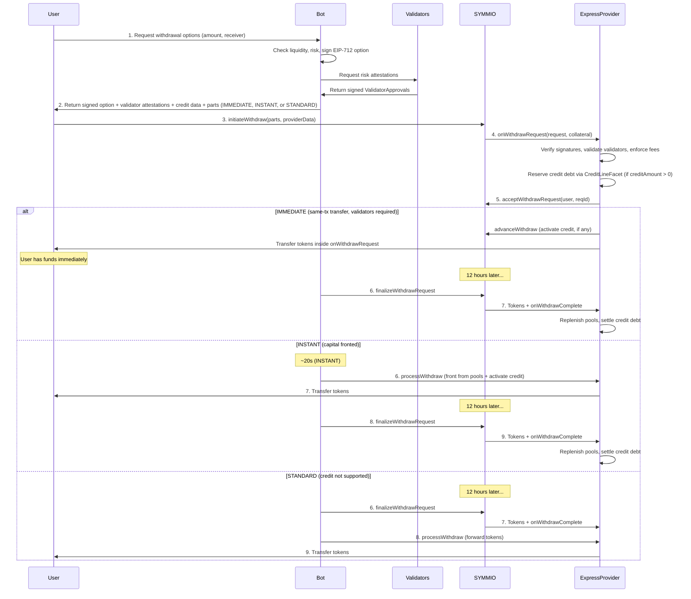

## 4. Where the Money Comes From

### 4.1 Balance Pools

The ExpressProvider maintains two types of liquidity pools:

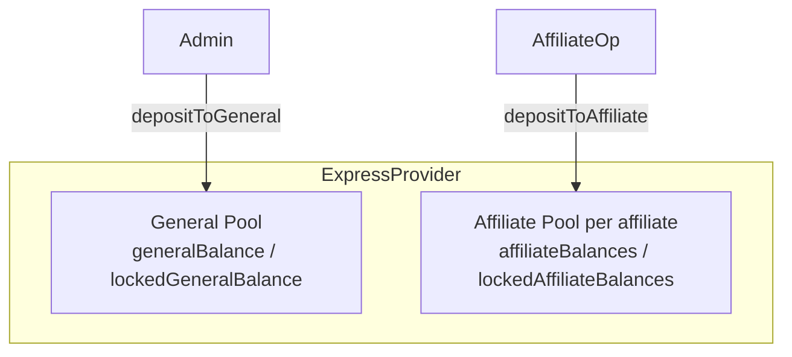

**General Pool**: System-wide, available to all users. Funded by operators via `depositToGeneral()`.

**Affiliate Pool**: Per-affiliate, available only to that affiliate's users. Funded by affiliate operators via `depositToAffiliate(affiliate, amount)`.

When the ExpressProvider fronts an IMMEDIATE or INSTANT withdrawal, it deducts from these pools. Pools are replenished when SYMMIO releases the actual tokens after cooldown.

### 4.2 Credit Line

Pools have a hard limit: the operator must have pre-deposited enough tokens. The **credit line** removes this constraint by letting the ExpressProvider borrow against collateral that's already locked inside SYMMIO — specifically, the affiliate's *eligible balance* as attested by the Muon oracle.

**How it works:**

Each affiliate on SYMMIO has capital committed by its users (allocated balances, open positions, etc.). A portion of that capital is "eligible" — it's locked in SYMMIO and will eventually be claimable. The Muon oracle computes this off-chain and signs an attestation: "Affiliate X has Y eligible base." The ExpressProvider trusts this attestation to extend credit up to configured caps.

When a withdrawal uses credit, the ExpressProvider doesn't front its own tokens for the credit portion. Instead, it calls `advanceWithdraw` on SYMMIO, which releases the credit amount directly from SYMMIO's locked collateral to the provider. This is effectively a loan against the affiliate's locked capital — the provider takes on debt, and the debt is settled when the withdrawal finalizes.

**The debt lifecycle:**

```
RESERVE ──→ ACTIVATE ──→ SETTLE
   │                        ↑
   └── CANCEL (if withdrawal cancelled before processing)
```

1. **Reserve** (on acceptance): Validates the Muon attestation, checks debt caps, records the debt as "reserved"
2. **Activate** (on processing): Moves debt from "reserved" to "active", calls `advanceWithdraw` to pull tokens from SYMMIO
3. **Settle** (on finalization): Clears the debt — SYMMIO has released the tokens, the loan is repaid
4. **Cancel** (if withdrawal is cancelled pre-processing): Releases the reservation, no tokens were moved

**Caps and controls:**

- **Protocol caps**: `protocolMaxDebt` (absolute cap) and `protocolMaxDebtBps` (percentage of eligible base). Set by admin. Cannot be loosened by affiliates.
- **Affiliate caps**: `affiliateMaxDebt` and `affiliateMaxDebtBps`. Must be stricter than or equal to protocol caps.
- **Effective cap** = min(protocol cap, affiliate cap). Both absolute and BPS caps must pass.
- **Pause**: `setCreditLinePaused(affiliate, true)` disables all credit for an affiliate.
- **Blacklist**: `setCreditLineBlacklisted(affiliate, user, true)` blocks a specific user from using credit.

Credit is **not supported for STANDARD withdrawals** — only IMMEDIATE and INSTANT, because STANDARD doesn't front capital.

All credit line logic lives inside the ExpressProvider diamond (`CreditLineFacet` for admin/views, `LibCreditLine` for debt operations). State is stored in `CreditLineStorage` (diamond storage, keyed by affiliate). See Section 9 for technical details.

### 4.3 Liquidity Priority

When constructing an IMMEDIATE or INSTANT option, the bot chooses funding sources in this order:

1. **Affiliate Pool** (lowest system risk -- affiliate's own capital)
2. **Credit Line** (backed by Muon-attested eligible balances, not supported for STANDARD)
3. **General Pool** (system-wide fallback)

The bot encodes its decision into the signed option as `affiliateAmount` (how much from the affiliate pool) and `creditAmount` (how much from the credit line). The remainder comes from the general pool: `generalAmount = expressAmount - affiliateAmount - creditAmount`.

### 4.4 Funding Cycle

When the ExpressProvider fronts funds for IMMEDIATE or INSTANT withdrawals, it temporarily depletes its pools. Those pools are replenished when SYMMIO releases the actual tokens after the 12-hour cooldown:

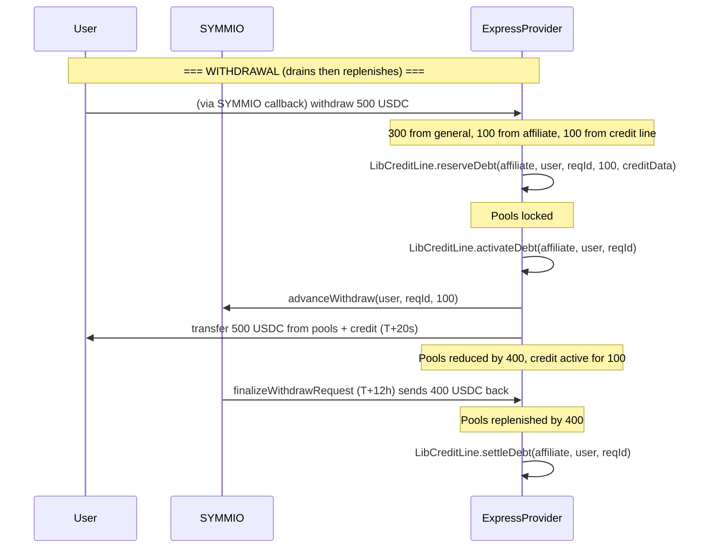

## 5. The Withdrawal Flows

### 5.1 STANDARD -- Standard Withdrawal (12 hours)

STANDARD is the simplest flow. Express does **not front any capital** and **does not support credit lines** (`CreditNotSupportedForStandard` error). ExpressProvider acts as an intermediary so the bot controls finalization.

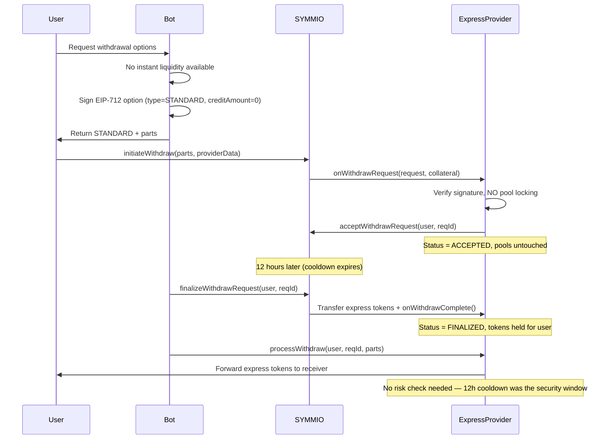

**Key properties:**
- No express pool locking on accept (no capital fronted)
- Credit lines are not supported (`creditAmount` must be 0)
- `onWithdrawComplete` sets status to FINALIZED (tokens arrive from SYMMIO)
- `processWithdraw` requires FINALIZED status (not ACCEPTED)
- `processWithdraw` forwards express tokens to the user
- Cancellable before finalization
- Once finalized, `forceCancel` and `suspend` are no longer valid; a LOCKED STANDARD can be resolved via `unlockAndProcess` or via `processWithdraw` after cooldown expiry (which also triggers finalization from SYMMIO if needed)

### 5.2 INSTANT -- Instant Withdrawal (~20 seconds)

INSTANT fronts capital from the ExpressProvider's pools. The user gets funds after a short security window during which the bot performs a risk check.

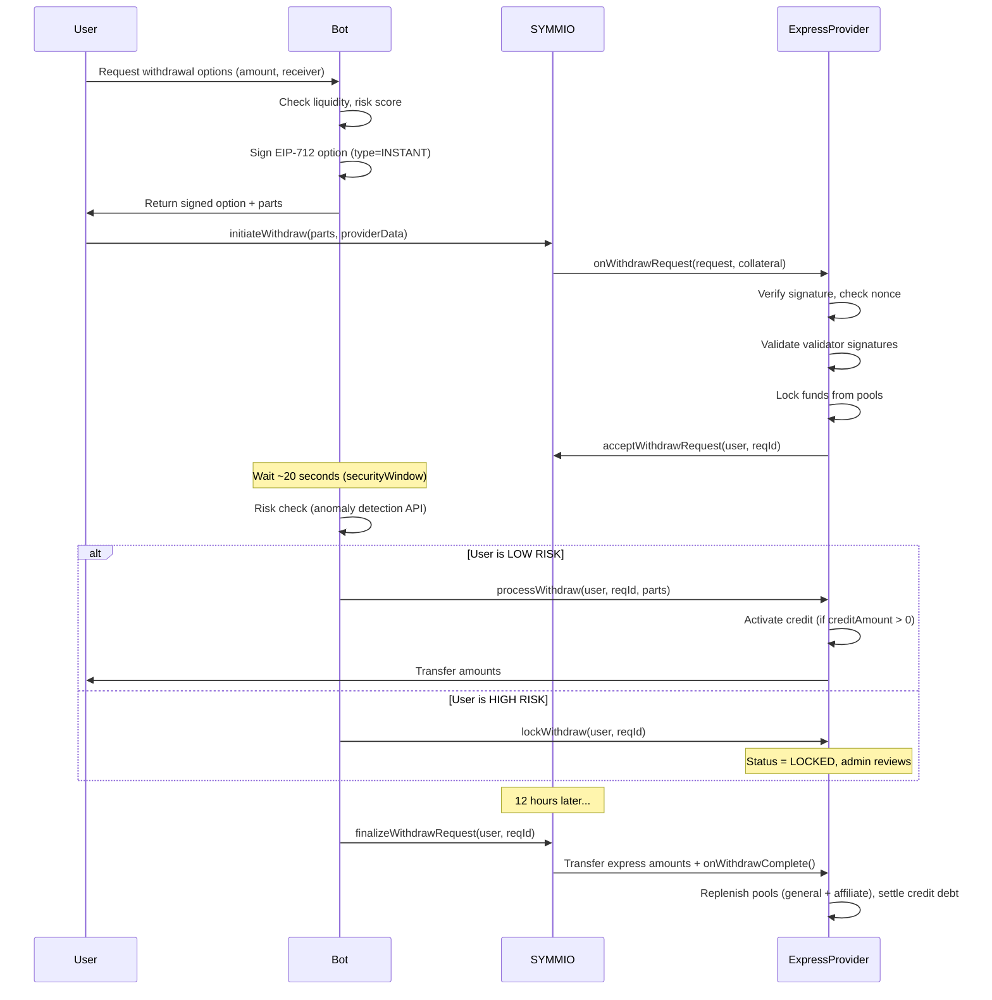

**Timing:**
- `processWithdraw` by operator: allowed after `acceptedAt + securityWindow` (default 20s)
- `processWithdraw` by anyone (permissionless fallback): allowed after `acceptedAt + securityWindow + tolerancePeriod` (default 80s)

### 5.3 IMMEDIATE -- Same-Transaction Transfer

IMMEDIATE transfers funds to the user inside `onWithdrawRequest` itself -- the user gets funds in the same transaction as `initiateWithdraw`. This requires validators to be enabled (`minValidatorSignatures(affiliate) > 0`).

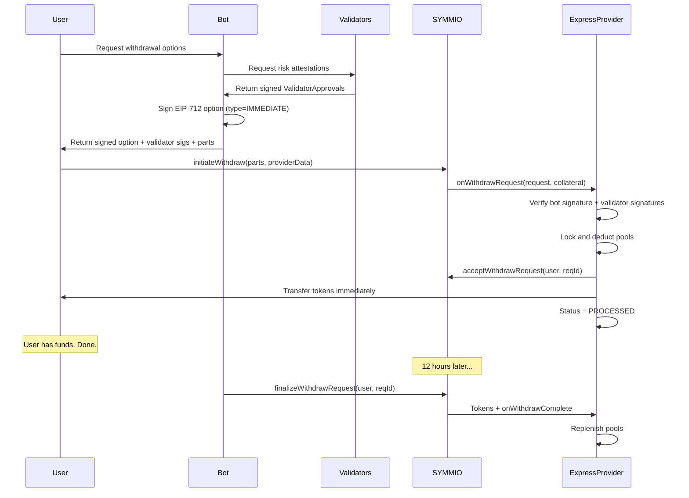

**Key properties:**
- Validators are mandatory -- `ValidatorsRequiredForImmediate` error if `minValidatorSignatures(affiliate) == 0`
- Status goes directly NONE -> PROCESSED (skips ACCEPTED)
- `processWithdraw` cannot be called (already PROCESSED)
- Lock/cancel/suspend not applicable (funds already transferred)
- Finalization works identically to INSTANT (pools replenished at cooldown)
- `nonReentrant` guard on `onWithdrawRequest` prevents reentrancy during transfers
- User pays gas for the transfer (included in their `initiateWithdraw` tx)

## 6. Safety Mechanisms

### 6.1 Security Window

The security window (default 20 seconds) is the delay between acceptance and processing for INSTANT withdrawals. During this window, the bot performs a risk check via an anomaly detection API. For IMMEDIATE, there is no post-acceptance window -- the only risk gating is the validator attestations that are verified during acceptance. For STANDARD, the 12-hour SYMMIO cooldown itself serves as the security window.

### 6.2 Risk Locking

If the anomaly detection API flags a user as risky between acceptance and processing:

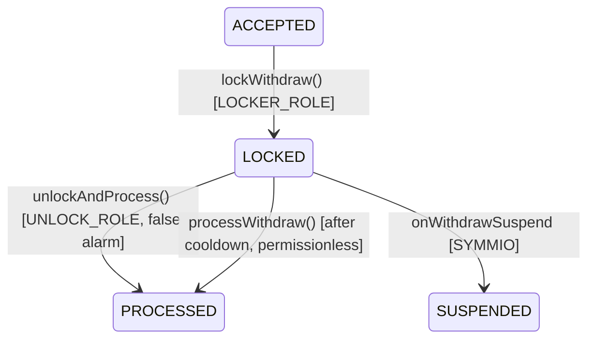

While locked, `processWithdraw` normally reverts. However, once the SYMMIO cooldown expires without suspension, `processWithdraw` accepts LOCKED withdrawals -- the risk window is over and the withdrawal can be processed like any other (including the permissionless fallback after `tolerancePeriod`). An `UNLOCK_ROLE` holder can also unlock early via `unlockAndProcess` (false alarm). `UNLOCK_ROLE` and `LOCKER_ROLE` are intentionally separated from `OPERATOR_ROLE` so the bot cannot lock, unlock, or hold user funds hostage.

**IMMEDIATE -- no post-acceptance risk check:**

Funds are transferred in the same transaction as acceptance. The only risk gating is pre-acceptance: validators must attest to user legitimacy before the bot signs the option. Once the user submits `initiateWithdraw`, the transfer is atomic and irreversible.

**INSTANT -- risk check between acceptance and processing:**

1. Query anomaly detection API during the `securityWindow` (~20s)
2. If **LOW RISK**: call `processWithdraw`
3. If **HIGH RISK**: `LOCKER_ROLE` holder calls `lockWithdraw` to prevent permissionless processing, then notifies admin
4. Admin (holding `UNLOCK_ROLE`) reviews and either:
   - Calls `unlockAndProcess` (false alarm)
   - Calls SYMMIO's `suspendWithdrawRequest` (confirmed bad actor)

**STANDARD -- risk check during the 12-hour cooldown:**

1. `LOCKER_ROLE` holder can flag risky users any time during the 12h cooldown by calling `lockWithdraw` (from ACCEPTED)
2. When SYMMIO finalizes, `onWithdrawComplete` preserves the LOCKED status -- tokens arrive but can't be forwarded
3. No post-finalization risk check needed -- the 12h cooldown itself is the security window
4. Before finalization, admin may still suspend via SYMMIO; after finalization, the locked withdrawal must be resolved via `unlockAndProcess` (requires `UNLOCK_ROLE`)

### 6.3 Cancellation

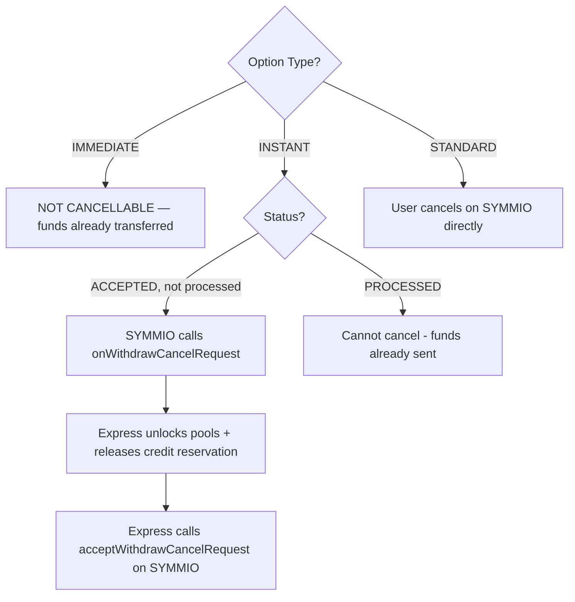

**IMMEDIATE is non-cancellable** because funds are already transferred to the user in the same transaction.

`forceCancel` is separate from user cancellation: SYMMIO can still force-cancel ACCEPTED or LOCKED withdrawals before payout. Once a withdrawal is already PROCESSED, or a STANDARD withdrawal has already finalized, `forceCancel` is invalid.

### 6.4 Suspension

An operator with `SUSPENDER_ROLE` on SYMMIO can suspend a user's withdrawal (e.g., for compliance). SYMMIO calls `onWithdrawSuspend` on the ExpressProvider, which:

1. Unlocks pool counter locks (for INSTANT/IMMEDIATE only; not applicable for IMMEDIATE after processing -- funds already transferred)
2. Releases credit line reservation (if `creditAmount > 0`)
3. Refunds sponsor coverage to sponsor balance
4. Sets status to `SUSPENDED`

If the withdrawal was already PROCESSED, `_handleProcessedRollback` is called instead, which covers credit loss from the affiliate pool and removes expected inflows.

Note: IMMEDIATE withdrawals cannot be suspended after acceptance because the funds are already transferred in the same transaction. The suspension would need to happen before the user's `initiateWithdraw` tx is mined. STANDARD withdrawals can only be suspended before finalization; once `onWithdrawComplete` has delivered the tokens, suspension is invalid.

### 6.5 State Machines

**INSTANT (capital fronted):**

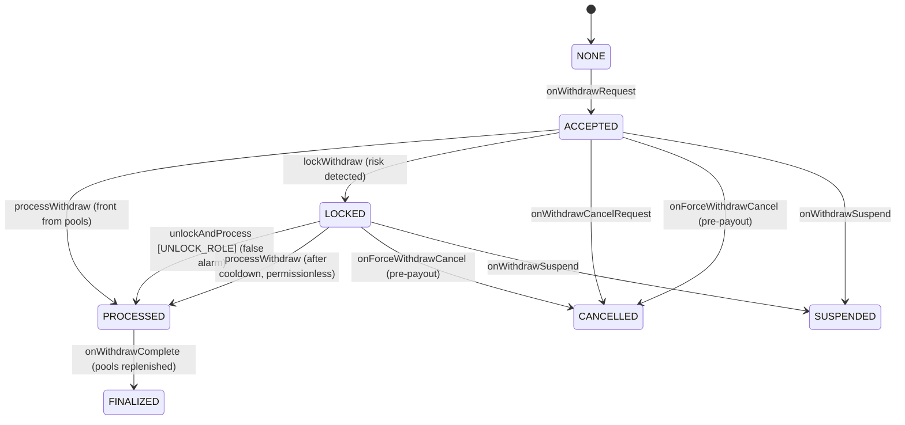

**IMMEDIATE (same-tx, validators required):**

```
NONE → PROCESSED (onWithdrawRequest: validated + transferred)
PROCESSED → FINALIZED (onWithdrawComplete: pools replenished)
```

**STANDARD (no fronting):**

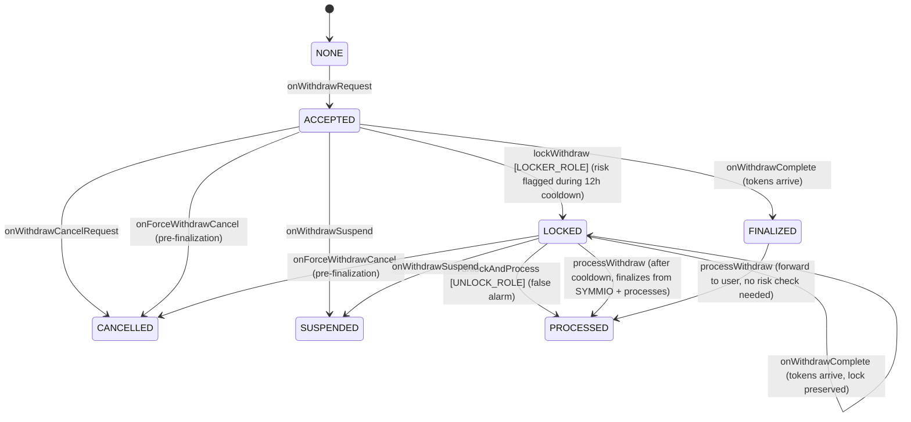

Note: For STANDARD, risk locking happens **during** the 12-hour cooldown (before SYMMIO finalizes), not after. Once SYMMIO has finalized and sent the tokens, the cooldown period itself served as the security window -- no additional risk check is needed. If a withdrawal is LOCKED when `onWithdrawComplete` fires, the status stays LOCKED (tokens arrive but can't be forwarded until `unlockAndProcess`), and `forceCancel` / `suspend` are no longer valid after finalization. However, once the cooldown expires, `processWithdraw` accepts LOCKED withdrawals (for STANDARD, it calls `finalizeWithdrawRequest` on SYMMIO first to retrieve tokens), ensuring users are never indefinitely blocked.

**SYMMIO Withdrawal Status (for reference):**

| Status | Description |
|--------|-------------|
| `PENDING` | Created by initiateWithdraw. Awaiting provider. |
| `PROVIDER_ACCEPTED` | Provider accepted. Awaiting cooldown/processing. |
| `PROVIDER_REJECTED` | Provider rejected. Funds refunded. |
| `CANCEL_REQUESTED` | User requested cancellation. Awaiting provider response. |
| `CANCELLED` | Cancelled. Funds refunded to user. |
| `SUSPENDED` | Operator suspended. Funds refunded to user. |
| `COMPLETED` | Finalized. Tokens transferred. |

## 7. The Signature Scheme (EIP-712)

The bot signs withdrawal options using EIP-712 typed data. The ExpressProvider verifies these signatures on-chain in the `onWithdrawRequest` callback.

### 7.1 Domain

```
name: "ExpressProvider"
version: "1"
chainId: <chain id>
verifyingContract: <ExpressProvider proxy address>
```

### 7.2 Option Type

```
WithdrawOption(
    address user,
    uint256 nonce,
    uint8 optionType,      // 0 = IMMEDIATE, 1 = INSTANT, 2 = STANDARD
    uint256 availableAt,   // 0 (reserved field, not currently used)
    address affiliate,      // affiliate pool to use
    uint256 affiliateAmount,// how much from affiliate pool
    uint256 creditAmount,  // how much from credit line (must be 0 for STANDARD)
    uint256 fee,           // affiliate fee in collateral decimals
    uint256 operatorFee,   // fixed operator fee in collateral decimals
    uint256 maxUserFee,    // max fee the user pays (reverts if exceeded)
    bytes32 partsHash,     // keccak256(abi.encode(parts))
    uint256 deadline       // signature expiry timestamp
)
```

### 7.3 Nonce Management

Each user has a per-user nonce stored in `ExpressProvider.nonces[user]`. The bot must read the current nonce before signing. The nonce is consumed (incremented) atomically when `onWithdrawRequest` succeeds.

**Bot must**: Call `expressProvider.nonces(user)` to get current nonce before signing.

### 7.4 Parts Hash

The `partsHash` binds the signature to exact withdrawal parts. Computed as:

```solidity
partsHash = keccak256(abi.encode(parts))
```

Where `parts` is an array of `WithdrawReceiverPart`:

```solidity
struct WithdrawReceiverPart {
    uint256 id;
    uint256 amount;          // collateral decimals (e.g. 6 for USDC)
    int256  chainId;
    bytes   receiver;        // 20 bytes, the receiver address
    address virtualProvider; // DEPRECATED: must be address(0), reverts VirtualProviderDeprecated otherwise
    address expressProvider; // ExpressProvider address
}
```

### 7.5 Validator Approval Signature

Validators sign a separate EIP-712 message attesting to user legitimacy:

**Type:**
```
ValidatorApproval(
    address user,       // the withdrawing user
    uint256 nonce,      // must match the bot option nonce (ties to specific withdrawal)
    uint256 amount,     // total withdrawal amount (expressAmount)
    uint256 timestamp,  // when the validator signed (freshness check)
    uint256 symmioNonce // user's current nonce on SYMMIO (invalidates if user acts on SYMMIO)
)
```

Uses the same EIP-712 domain as the bot option (same contract, chain).

**On-chain validation (in `onWithdrawRequest`):**
1. Check `signatures.length >= minValidatorSignatures(affiliate)` (falls back to `minValidatorSignatures(address(0))` if affiliate-specific not set)
2. Verify `symmioNonce == ISymmio(symmio).nonceOfPartyA(user)` -- if the user acted on SYMMIO since validators signed, the nonce won't match and the withdrawal is rejected
3. For each signature:
   - Reject future timestamps (`timestamp > block.timestamp`)
   - Verify `block.timestamp - timestamp <= validatorApprovalTimeout(affiliate)` (falls back to `validatorApprovalTimeout(address(0))` if affiliate-specific not set, default 30s)
   - Recover signer from EIP-712 digest (includes `symmioNonce`)
   - Verify signer is a valid validator for the affiliate via `isValidator(affiliate, signer)` -- checks affiliate-specific registration first, then falls back to `address(0)` default
   - Verify signer address is strictly greater than the previous (ascending order = no duplicates)
4. If any check fails -> revert (withdrawal auto-rejected)

When `minValidatorSignatures(affiliate) == 0` (and no default set), the validator check is skipped entirely.

### 7.6 Provider Data Encoding

The signed option, validator attestations, and credit data are packed into `providerData` which the user passes to `SYMMIO.initiateWithdraw(parts, speedUp, providerData)`. The encoding is nested:

```
providerData = abi.encode(optionData, validatorData, creditDataRaw)

optionData = abi.encode(
    uint256 nonce,
    uint8   optionType,
    uint256 availableAt,
    address affiliate,
    uint256 affiliateAmount,
    uint256 creditAmount,   // how much from credit line (0 if not using credit)
    uint256 fee,
    uint256 operatorFee,
    uint256 maxUserFee,
    uint256 deadline,
    bytes   signature       // bot's EIP-712 signature
)

validatorData = abi.encode(
    bytes[]   signatures,   // validator EIP-712 signatures (ordered by ascending signer address)
    uint256[] timestamps,   // corresponding signing timestamps
    uint256   symmioNonce   // user's SYMMIO nonce at validation time (read via nonceOfPartyA)
)

creditDataRaw = abi.encode(CreditData) // empty bytes if creditAmount == 0
// CreditData contains:
//   bytes   reqId,             // Muon request ID
//   uint256 eligibleBase,      // Muon-verified affiliate-level eligible balance
//   uint256 timestamp,         // Muon signature timestamp
//   bytes   gatewaySignature,  // Gateway signature from Muon
//   SchnorrSign sigs           // Schnorr signatures
```

## 8. Fee Model

The system supports per-affiliate fee configuration. Fees are charged on the total express amount (sum of all parts routed through this ExpressProvider) and accumulated for later collection by the admin.

### 8.1 Affiliate Configuration

Each affiliate (frontend) has an `AffiliateConfig`:

```solidity
struct AffiliateConfig {
    uint256 feeRate;              // fee in basis points (1 bp = 0.01%, max 10000)
    uint256 operatorFee;          // fixed operator fee in collateral decimals (covers bot gas)
}
```

The admin sets this via:

```solidity
function setAffiliateConfig(
    address affiliate,
    uint256 feeRate,
    uint256 operatorFee
) external onlyRole(SETTER_ROLE);
```

- `feeRate` is in basis points (e.g., 50 = 0.50%).
- `operatorFee` is a fixed fee per withdrawal in collateral decimals (e.g., 1e6 = 1 USDC). Set per-affiliate to allow different operator fees for different frontends.

### 8.2 Fee Calculation and Signing

The bot computes the fee off-chain before signing the EIP-712 option:

```
fee = expressAmount * feeRate / 10000
```

Where `expressAmount` is the total amount from all parts routed through this ExpressProvider (i.e., parts where `expressProvider == address(this)`). This includes amounts funded from general pool, affiliate pool, and credit line. The computed `fee` is included as a field in the signed `WithdrawOption` typed data, binding it to the signature.

### 8.3 On-Chain Validation

When `onWithdrawRequest` decodes and validates the signed option, the contract independently re-derives the fee from the on-chain `affiliateConfigs` and rejects any mismatch:

```solidity
uint256 feeBasis = amounts.expressAmount;
if (opt.fee != feeBasis * affiliateConfigs[opt.affiliate].feeRate / 10000) revert FeeMismatch();
if (opt.operatorFee != affiliateConfigs[opt.affiliate].operatorFee) revert OperatorFeeMismatch();
if (opt.fee + opt.operatorFee > feeBasis) revert FeesExceedExpressAmount();
```

This ensures the bot cannot overcharge or undercharge -- the contract is the source of truth for fee calculation. A malicious or buggy bot signing incorrect fees will have its transaction reverted. The bot must use the exact `feeRate` and `operatorFee` from the affiliate's on-chain config.

### 8.4 Fee Deduction

Fees are deducted during `processWithdraw`, `unlockAndProcess`, or inline within `onWithdrawRequest` for IMMEDIATE:

- The contract first attempts to pay the fee from the affiliate's `sponsorBalances`. Whatever the sponsor balance cannot cover is deducted from the user's withdrawal amount.
- Fees are deducted from the collateral transfers by cascading across parts: the `userFee` is subtracted from the first part(s) until exhausted. The user receives `partAmount - deduction` for affected parts.
- Parts where `expressProvider != address(this)` are skipped (not subject to fees from this provider).
- For **STANDARD**: the fee is deducted from the forwarded tokens during `processWithdraw`, same as for INSTANT.
- The full fee is always added to `collectedFees[affiliate]` regardless of whether the sponsor or user paid it.
- **Operator fee**: Accumulated separately per affiliate in `collectedOperatorFees[affiliate]`. Claimable by admin via `claimOperatorFees(affiliate)`. Combined with the affiliate fee for total fee deduction.
- **maxUserFee guarantee**: After sponsor coverage is locked at acceptance, the contract validates `actualUserFee <= maxUserFee`. If the sponsor balance was drained and the user would pay more than promised, the tx reverts.

### 8.5 Fee Accumulation and Collection

Deducted fees are accumulated per affiliate:

```solidity
mapping(address => uint256) public collectedFees;          // affiliate => accumulated fees
mapping(address => uint256) public collectedOperatorFees;  // affiliate => accumulated operator fees (per-affiliate)
```

The admin claims accumulated fees via:

```solidity
function claimFees(address affiliate, address to) external onlyRole(FEE_CLAIMER_ROLE);
function claimOperatorFees(address affiliate, address to) external onlyRole(FEE_CLAIMER_ROLE);
```

`claimFees` transfers the full `collectedFees[affiliate]` balance to the specified `to` address and resets the mapping to zero. `claimOperatorFees` transfers the full `collectedOperatorFees[affiliate]` balance to the specified `to` address and resets it to zero.

### 8.6 Fee Flow

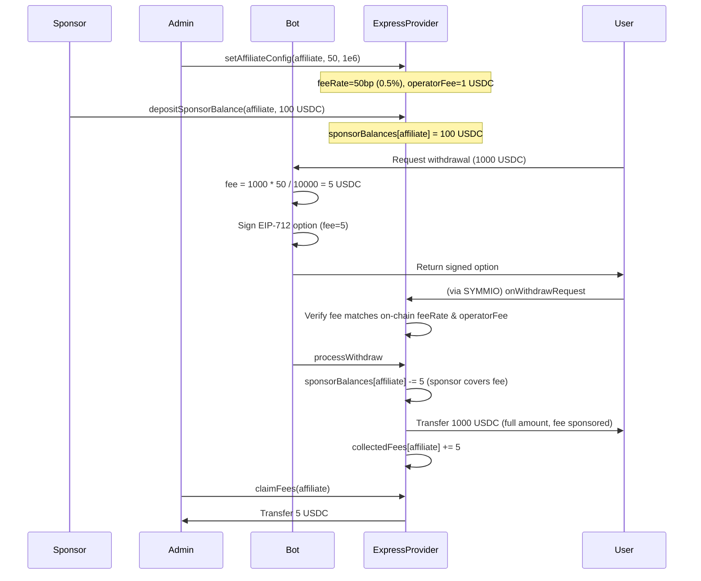

**When sponsor balance is insufficient:**

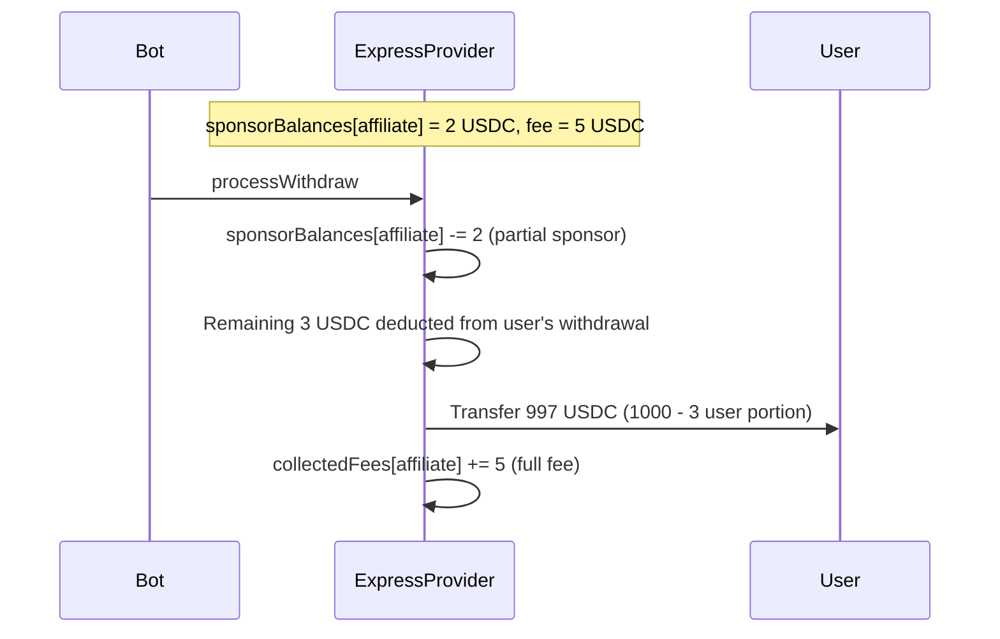

### 8.7 Fee Sponsorship

Fee sponsorship is a deposit-based on-chain mechanism that allows sponsors to fund withdrawal fees on behalf of an affiliate's users.

#### Sponsor Balance Management

Each affiliate has a `sponsorBalances` mapping that holds collateral deposited by sponsors:

```solidity
mapping(address => uint256) public sponsorBalances;  // affiliate => sponsor balance
```

- **`depositSponsorBalance(address affiliate, uint256 amount)`** -- Anyone can deposit collateral to fund fee sponsorship for an affiliate. The caller must have approved the collateral token for the ExpressProvider. The `sponsors[affiliate]` mapping tracks the last depositor.
- **`withdrawSponsorBalance(address affiliate, uint256 amount, address to)`** -- `SPONSOR_MANAGER_ROLE` only. Withdraws unused sponsor funds to the specified `to` address.
- **`setSponsorConfig(address affiliate, uint256 maxFeePerWithdraw, uint256 maxWithdrawAmount)`** -- `SETTER_ROLE` only. Configures caps on sponsorship: `maxFeePerWithdraw` limits how much the sponsor covers per withdrawal (0 = no limit), and `maxWithdrawAmount` restricts sponsorship to withdrawals whose total fee-bearing amount (`expressAmount`) is at or below this size (0 = no limit).

#### Sponsorship Logic During Withdrawal Processing

When `processWithdraw`, `unlockAndProcess`, or the inline IMMEDIATE path processes a withdrawal with a fee:

1. The contract checks `sponsorBalances[affiliate]`.
2. If the sponsor balance can cover the full fee: the entire fee is deducted from `sponsorBalances[affiliate]`, and the user receives the full withdrawal amount with no fee deduction.
3. If the sponsor balance can partially cover the fee: the available sponsor balance is consumed entirely, and the remainder is deducted from the user's withdrawal amount.
4. If the sponsor balance is zero: the full fee is deducted from the user's withdrawal amount (same as the legacy behavior).
5. In all cases, the full fee amount is added to `collectedFees[affiliate]`.

#### Key Properties

- **Permissionless deposits**: Anyone (the affiliate operator, a third party, or the protocol itself) can deposit sponsor funds. This enables flexible sponsorship arrangements.
- **Role-controlled withdrawals**: Only `SPONSOR_MANAGER_ROLE` can withdraw unused sponsor funds (to a specified `to` address), preventing unauthorized draining.
- **Deterministic coverage locking**: Sponsor coverage is locked at acceptance time (in `onWithdrawRequest`), making the fee split deterministic. If the withdrawal is cancelled or suspended, the locked sponsor coverage is refunded.
- **Coverage as lump sum**: Sponsorship covers up to `totalFee` (affiliate fee + operator fee) as a single amount. There is no priority ordering between fee types -- the sponsor covers whatever it can of the combined total.
- **Graceful degradation**: When the sponsor balance runs out, the system falls back to deducting fees from the user's withdrawal. There is no hard dependency on sponsorship being funded.
- **Full fee accounting**: `collectedFees` always reflects the total fee charged, regardless of who paid. This keeps fee accounting clean for the admin.

## 9. Credit Line — Technical Reference

See Section 4.2 for the conceptual overview. This section covers implementation details.

### 9.1 Architecture

Credit line logic lives inside the ExpressProvider diamond:
- **`CreditLineFacet`** — admin setters (Muon config, protocol/affiliate caps, pause, blacklist) and view functions
- **`LibCreditLine`** — debt operations (`reserveDebt`, `activateDebt`, `settleDebt`, `cancelReservation`) called internally by `SymmioHookFacetImpl` and `OperatorFacetImpl`
- **`CreditLineStorage`** — diamond storage with per-affiliate mappings (`AffiliateCredit` struct)

### 9.2 Muon Verification

When `reserveDebt` is called, `LibCreditLine` validates the Muon oracle attestation:

1. **Freshness**: `block.timestamp <= data.timestamp + muonFreshnessWindow` (default 60s)
2. **Signature**: The hash `keccak256(muonAppId, reqId, affiliate, eligibleBase, timestamp, chainId)` is verified via `IMuonSignatureVerifier`. The hash uses the **affiliate address** (not the diamond address) to scope attestations per affiliate.
3. **Caps**: New total debt (`reservedDebt + activeDebt + creditAmount`) must not exceed `effectiveMaxDebt` (absolute) or `effectiveMaxBps` (BPS of `eligibleBase`)

### 9.3 Debt Lifecycle (detailed)

| Phase | Trigger | LibCreditLine Action |
|-------|---------|----------------------|
| Reserve | `onWithdrawRequest` | `reserveDebt` — validates Muon data, checks caps, adds to `reservedDebt` |
| Activate | `processWithdraw` / `unlockAndProcess` / IMMEDIATE inline | `activateDebt` — moves from `reservedDebt` to `activeDebt`, calls `advanceWithdraw` on SYMMIO |
| Settle | `onWithdrawComplete` | `settleDebt` — removes from `activeDebt`, deletes request state |
| Cancel | `onWithdrawCancelRequest` / `onForceWithdrawCancel` (pre-payout) | `cancelReservation` — removes from `reservedDebt` |
| Cover Loss | `onForceWithdrawCancel` / `onWithdrawSuspend` (post-payout) | `settleDebt` — deducts `creditAmount` from affiliate pool to cover the loss |

## 10. Access Control & Roles

### 10.1 ExpressProvider Roles

| Role | Who | Can do |
|------|-----|--------|
| Diamond Owner | Deployer/multisig | Diamond cut (add/replace/remove facets), grant/revoke roles |
| `WITHDRAWER_ROLE` | Deployer/multisig | Withdraw liquidity from general and affiliate pools (`withdrawFromGeneral`, `withdrawFromAffiliate`) |
| `SETTER_ROLE` | Deployer/multisig | Set all contract parameters: affiliate configs, security window, tolerance period, validators, credit line configs (protocol, affiliate, Muon, pause, blacklist) |
| `SPONSOR_MANAGER_ROLE` | Deployer/multisig | Withdraw sponsor balances (`withdrawSponsorBalance`) |
| `FEE_CLAIMER_ROLE` | Deployer/multisig | Claim accumulated fees (`claimFees`, `claimOperatorFees`) |
| `OPERATOR_ROLE` | Bot service | `processWithdraw` |
| `LOCKER_ROLE` | Risk detection service | `lockWithdraw` (separated from operator so the processing key cannot freeze funds) |
| `UNLOCK_ROLE` | Deployer/multisig | `unlockAndProcess` (separated from bot to prevent lock-unlock hostage attacks) |
| `SIGNER_ROLE` | Bot signer key | Signs withdrawal options (verified on-chain via EIP-712) |

Roles are stored in diamond storage and managed via `grantRole`/`revokeRole` on AdminFacet (owner-only).

### 10.2 Credit Line Access Control

Credit line operations no longer use separate OZ AccessControl roles. Since the credit line logic is integrated into the ExpressProvider diamond:

- **Configuration** (Muon config, protocol caps, affiliate caps, pause, blacklist): Controlled by `SETTER_ROLE` on the diamond
- **Debt lifecycle** (`reserveDebt`, `activateDebt`, `settleDebt`, `cancelReservation`): Called internally by `LibCreditLine` from within the diamond's facets -- no external role needed
- The old `EXPRESS_PROVIDER_ROLE`, `PROTOCOL_ADMIN_ROLE`, and `AFFILIATE_ADMIN_ROLE` on the standalone CreditLineManager no longer exist

### 10.3 Validator Registration

Validators are not a role -- they are registered per-affiliate via `setValidator(affiliate, validator, enabled)` (SETTER_ROLE). Using `address(0)` as affiliate sets a default validator for all affiliates. The fallback logic checks affiliate-specific registration first, then falls back to the `address(0)` default.

### 10.4 Trust Relationships

- ExpressProvider is registered as an **Express Provider** on SYMMIO
- Credit line logic runs inside the ExpressProvider diamond (via `CreditLineFacet` / `LibCreditLine`) -- no cross-contract trust needed for debt operations
- `LibCreditLine` verifies Muon oracle attestations to validate credit eligibility
- Bot holds `OPERATOR_ROLE` and `SIGNER_ROLE` on ExpressProvider
- Validators are registered per-affiliate on ExpressProvider via `setValidator(affiliate, validator, enabled)` -- their EIP-712 signatures are verified during onWithdrawRequest. Validators registered for `address(0)` serve as defaults for all affiliates

## 11. The Bot

### 11.1 Options API

When a user requests withdrawal options:

1. Read `expressProvider.nonces(user)` for current nonce
2. Check anomaly detection API for user risk
3. Calculate available liquidity across pools
4. Generate up to 3 options:

| Check | Option Generated |
|-------|-----------------|
| Sufficient instant liquidity + validators enabled for affiliate | **IMMEDIATE** (optionType=0) |
| Sufficient instant liquidity + low risk | **INSTANT** (optionType=1) |
| Always | **STANDARD** (optionType=2) |

All three options use the same EIP-712 signature and go through ExpressProvider.

5. Collect validator attestations: query N validator services registered for this affiliate (or the `address(0)` default) with `(user, nonce, amount)`. Each validator signs `ValidatorApproval` with current timestamp.
6. Read `affiliateConfigs(affiliate)` to get `feeRate` and `operatorFee`
7. Compute `fee = expressAmount * feeRate / 10000`
8. If using credit line: obtain Muon attestation (`CreditData`) for the affiliate's aggregate eligible balance. Credit is not supported for STANDARD.
9. Construct `WithdrawReceiverPart[]` with the correct `expressProvider` (set `virtualProvider` to `address(0)`)
10. Sign EIP-712 typed data (including `creditAmount`, `fee`, `operatorFee`, and `maxUserFee` fields)
11. Return to user: `{ parts, providerData (includes option + validator signatures + credit data), estimatedTime, fee, operatorFee, maxUserFee }`

### 11.2 Event Monitoring

The bot must monitor these events on the ExpressProvider:

| Event | Action |
|-------|--------|
| `WithdrawAccepted(user, requestId, optionType)` | For IMMEDIATE: no action needed (already processed). Otherwise, schedule `processWithdraw` at the right time |
| `WithdrawProcessed(user, requestId)` | Schedule `finalizeWithdrawRequest` on SYMMIO at cooldownEndTime |
| `WithdrawLocked(user, requestId)` | Cancel scheduled processing, notify admin |
| `WithdrawCancelled(user, requestId)` | Cancel all scheduled actions for this withdrawal |
| `WithdrawSuspended(user, requestId)` | Cancel all scheduled actions for this withdrawal |
| `WithdrawFinalized(user, requestId)` | Confirm cycle complete, update internal state |

### 11.3 Scheduled Actions

```mermaid
gantt
    title Bot Schedule for INSTANT (Instant)
    dateFormat X
    axisFormat %s

    section Withdrawal
    Accept (T+0)           :milestone, 0, 0
    Risk check + processWithdraw :active, 20, 25
    Finalize on SYMMIO     :43200, 43205

    section Fallback
    User can process permissionlessly :crit, 80, 85
```

| Option | finalizeWithdrawRequest | processWithdraw |
|--------|------------------------|-----------------|
| IMMEDIATE | cooldownEndTime (~12h) | N/A (transferred in onWithdrawRequest) |
| INSTANT | `cooldownEndTime` (~12h) | `acceptedAt + securityWindow` (20s) |
| STANDARD | `cooldownEndTime` (~12h) | Operator: immediately after finalization. Anyone: after `tolerancePeriod`. |

### 11.4 Permissionless Fallback

If the bot fails to call `processWithdraw`, any address can call it after `processableAt + tolerancePeriod` (default 60s extra). The bot must detect user-initiated processing (via `WithdrawProcessed` events) and cancel its own scheduled call.

### 11.5 Event Idempotency

The bot MUST handle duplicate or replayed event IDs idempotently. If the bot processes the same `WithdrawAccepted` event twice (e.g., due to a chain reorg or indexer replay), it must not schedule duplicate `processWithdraw` calls or corrupt internal state.

### 11.6 Performance Targets

| Metric | Target |
|--------|--------|
| Immediate withdrawal end-to-end latency | Same transaction as `initiateWithdraw` (user pays gas) |
| Instant withdrawal end-to-end latency | < 30 seconds (20s security window + processing) |
| Options API response time | < 2 seconds |
| Finalization scheduling accuracy | Within 1 block of `cooldownEndTime` |

### 11.7 State Synchronization

When a user calls `processWithdraw` permissionlessly (after the tolerance period), the bot must detect the resulting `WithdrawProcessed` event and cancel its own scheduled processing for that withdrawal. Failure to do so results in a reverted transaction (harmless but wasteful).

## 12. Contract Interfaces

### 12.1 ExpressProvider

#### Deployment Topology

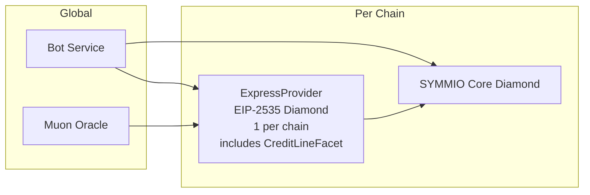

| Component | Count | Upgradeable | Description |
|-----------|-------|-------------|-------------|
| **ExpressProvider** | 1 per chain | Yes (EIP-2535 Diamond) | Main coordinator. Manages liquidity pools, validates bot signatures, locks/transfers funds, and handles credit lines. Split into AdminFacet, SymmioHookFacet, OperatorFacet, ViewFacet, CreditLineFacet. Credit line state is stored in `CreditLineStorage` (diamond storage) with per-affiliate mappings. |
| **Bot Service** | 1 global | N/A | Off-chain. Provides options API, signs options, monitors events, calls `processWithdraw` and `finalizeWithdrawRequest`. |

#### SYMMIO Callbacks (called by SYMMIO, not by bot)

```solidity
// Called when user initiates a withdrawal with express parts
function onWithdrawRequest(WithdrawRequest memory request, address collateral) external;

// Called when SYMMIO finalizes the withdrawal (12h later, sends tokens)
function onWithdrawComplete(WithdrawRequest memory request) external;

// Called when user requests cancellation
function onWithdrawCancelRequest(WithdrawRequest memory request) external;

// Called on force cancel by admin
function onForceWithdrawCancel(WithdrawRequest memory request) external;

// Called when operator suspends the withdrawal
function onWithdrawSuspend(WithdrawRequest memory request) external;
```

#### Bot/Operator Functions

```solidity
// Transfer funds to user. Operator: after securityWindow. Anyone: after +tolerancePeriod.
function processWithdraw(address user, uint256 requestId, WithdrawReceiverPart[] calldata parts) external;

// Lock a withdrawal due to risk detection. LOCKER_ROLE only.
function lockWithdraw(address user, uint256 requestId) external;

// Unlock and process after false alarm. UNLOCK_ROLE only (separate from operator).
function unlockAndProcess(address user, uint256 requestId, WithdrawReceiverPart[] calldata parts) external;
```

#### Admin Functions

```solidity
function depositToGeneral(uint256 amount) external;                        // Anyone can fund
function withdrawFromGeneral(uint256 amount) external;                     // WITHDRAWER_ROLE
function depositToAffiliate(address affiliate, uint256 amount) external;     // Anyone can fund
function withdrawFromAffiliate(address affiliate, uint256 amount) external;  // WITHDRAWER_ROLE
function claimFees(address affiliate, address to) external;                 // FEE_CLAIMER_ROLE
function claimOperatorFees(address affiliate, address to) external;        // FEE_CLAIMER_ROLE

// Setter functions (SETTER_ROLE)
function setSecurityWindow(uint256 seconds) external;                      // Setter only
function setTolerancePeriod(uint256 seconds) external;                     // Setter only
function setAffiliateConfig(
    address affiliate,
    uint256 feeRate,
    uint256 operatorFee
) external;                                                                // Setter only
function setValidator(address affiliate, address validator, bool enabled) external; // Setter only
function setMinValidatorSignatures(address affiliate, uint256 count) external;     // Setter only
function setValidatorApprovalTimeout(address affiliate, uint256 seconds) external; // Setter only

// Credit line setter functions (SETTER_ROLE, on CreditLineFacet)
function setCreditLineMuonConfig(
    address signatureVerifier,
    uint256 muonAppId,
    PublicKey memory muonPublicKey
) external;                                                                // Setter only
function setCreditLineProtocolConfig(
    address affiliate,
    uint256 maxDebt,
    uint256 maxDebtBps,
    uint256 muonFreshnessWindow
) external;                                                                // Setter only
function setCreditLineAffiliateConfig(
    address affiliate,
    uint256 maxDebt,
    uint256 maxDebtBps
) external;                                                                // Setter only
function setCreditLinePaused(address affiliate, bool paused) external;     // Setter only
function setCreditLineBlacklisted(address affiliate, address user, bool blacklisted) external; // Setter only

// Fee sponsorship
function depositSponsorBalance(address affiliate, uint256 amount) external; // Anyone
function withdrawSponsorBalance(address affiliate, uint256 amount, address to) external; // SPONSOR_MANAGER_ROLE
function setSponsorConfig(address affiliate, uint256 maxFeePerWithdraw, uint256 maxWithdrawAmount) external; // Setter only

// Role management (owner-only, via AdminFacet)
function grantRole(bytes32 role, address account) external;   // Diamond owner only
function revokeRole(bytes32 role, address account) external;  // Diamond owner only
```

#### View Functions

```solidity
function nonces(address user) external view returns (uint256);
function getWithdrawInfo(address user, uint256 requestId) external view returns (WithdrawInfo memory);
function generalBalance() external view returns (uint256);
function lockedGeneralBalance() external view returns (uint256);
function affiliateBalances(address affiliate) external view returns (uint256);
function lockedAffiliateBalances(address affiliate) external view returns (uint256);
// Credit line queries (on CreditLineFacet)
function creditLineTotalDebt(address affiliate) external view returns (uint256);
function creditLineReservedDebt(address affiliate) external view returns (uint256);
function creditLineActiveDebt(address affiliate) external view returns (uint256);

// Fee queries
function affiliateConfigs(address affiliate) external view returns (uint256 feeRate, uint256 operatorFee);
function collectedFees(address affiliate) external view returns (uint256);
function sponsorBalances(address affiliate) external view returns (uint256);
function collectedOperatorFees(address affiliate) external view returns (uint256);
function sponsors(address affiliate) external view returns (address);
function sponsorConfigs(address affiliate) external view returns (uint256 maxFeePerWithdraw, uint256 maxWithdrawAmount);

// Security getters
function securityWindow() external view returns (uint256);
function tolerancePeriod() external view returns (uint256);

// Validator queries
function minValidatorSignatures(address affiliate) external view returns (uint256);
function validatorApprovalTimeout(address affiliate) external view returns (uint256);
function isValidator(address affiliate, address validator) external view returns (bool);

// Access control
function hasRole(bytes32 role, address account) external view returns (bool);

```

### 12.2 CreditLineFacet (Diamond Facet)

All credit line functions are accessed on the ExpressProvider diamond address. Configuration requires `SETTER_ROLE`. Debt lifecycle functions (`reserveDebt`, `activateDebt`, `settleDebt`, `cancelReservation`) are internal to `LibCreditLine` and called by other facets within the diamond -- they are not externally callable.

```solidity
// Configuration (SETTER_ROLE)
function setCreditLineMuonConfig(
    address signatureVerifier,
    uint256 muonAppId,
    PublicKey memory muonPublicKey
) external;
function setCreditLineProtocolConfig(
    address affiliate,
    uint256 maxDebt,
    uint256 maxDebtBps,
    uint256 muonFreshnessWindow
) external;
function setCreditLineAffiliateConfig(
    address affiliate,
    uint256 maxDebt,
    uint256 maxDebtBps
) external;
function setCreditLinePaused(address affiliate, bool paused) external;
function setCreditLineBlacklisted(address affiliate, address user, bool blacklisted) external;

// View
function creditLineTotalDebt(address affiliate) external view returns (uint256);    // reservedDebt + activeDebt
function creditLineReservedDebt(address affiliate) external view returns (uint256);
function creditLineActiveDebt(address affiliate) external view returns (uint256);
```

## 13. Data Types Reference

```solidity
// ExpressProvider enums
enum Status { NONE, ACCEPTED, LOCKED, PROCESSED, FINALIZED, CANCELLED, SUSPENDED }
enum OptionType { IMMEDIATE, INSTANT, STANDARD }

// ExpressProvider structs
struct AffiliateConfig {
    uint256 feeRate;              // basis points (0-10000)
    uint256 operatorFee;          // fixed operator fee in collateral decimals (per-affiliate)
}

struct WithdrawInfo {
    Status  status;
    OptionType optionType;
    uint256 availableAt;          // Reserved field, not currently used. Always 0.
    uint256 expressAmount;        // total amount from express provider (general + affiliate + credit)
    uint256 generalAmount;        // how much of expressAmount from general pool
    uint256 affiliateAmount;      // how much of expressAmount from affiliate pool
    uint256 creditAmount;         // how much of expressAmount from credit line (0 for STANDARD)
    address affiliate;            // which affiliate pool was used
    uint256 acceptedAt;           // block.timestamp when accepted
    uint256 finalizedAt;          // block.timestamp when onWithdrawComplete called (STANDARD only)
    uint256 cooldownEndTime;      // when SYMMIO's 12h cooldown expires
    bytes32 partsHash;            // keccak256(abi.encode(parts)) for integrity check
    uint256 fee;                  // affiliate fee in collateral decimals
    uint256 sponsorCoverage;      // how much of the fee the sponsor covers (locked at acceptance)
}

struct DecodedOption {
    uint256 nonce;
    uint8   optionType;           // 0=IMMEDIATE, 1=INSTANT, 2=STANDARD
    uint256 availableAt;          // Reserved field, not currently used. Always 0.
    address affiliate;
    uint256 affiliateAmount;
    uint256 creditAmount;         // how much from credit line (must be 0 for STANDARD)
    uint256 fee;                  // affiliate fee in collateral decimals
    uint256 operatorFee;          // fixed operator fee in collateral decimals
    uint256 maxUserFee;           // max fee user pays (reverts if exceeded)
    uint256 deadline;
    bytes   signature;
}

struct ComputedAmounts {
    uint256 expressAmount;        // total from express (general + affiliate + credit)
    uint256 generalAmount;        // expressAmount - affiliateAmount - creditAmount
}

struct SponsorConfig {
    uint256 maxFeePerWithdraw;    // max fee sponsor covers per withdrawal (0 = no limit)
    uint256 maxWithdrawAmount;    // only sponsor withdrawals whose express fee-bearing amount <= this (0 = no limit)
}

// ExpressProvider roles
OPERATOR_ROLE        = keccak256("OPERATOR_ROLE")
LOCKER_ROLE          = keccak256("LOCKER_ROLE")
SIGNER_ROLE          = keccak256("SIGNER_ROLE")
SETTER_ROLE          = keccak256("SETTER_ROLE")
SPONSOR_MANAGER_ROLE = keccak256("SPONSOR_MANAGER_ROLE")
FEE_CLAIMER_ROLE     = keccak256("FEE_CLAIMER_ROLE")
UNLOCK_ROLE          = keccak256("UNLOCK_ROLE")
WITHDRAWER_ROLE      = keccak256("WITHDRAWER_ROLE")

// Validators (per-affiliate, not a role)
// Tracked in: mapping(address => mapping(address => bool)) validators
// Registered via: setValidator(affiliate, validator, enabled)
// address(0) as affiliate = default validator for all affiliates
// Fallback: affiliate-specific checked first, then address(0) default

// Configurable parameters (defaults)
securityWindow    = 20 seconds   // delay before operator can process INSTANT
tolerancePeriod   = 60 seconds   // extra delay for permissionless processing
operatorFee           = per-affiliate // fixed fee per withdrawal (collateral decimals), covers bot gas; set via setAffiliateConfig
minValidatorSignatures = mapping(address => uint256) // per-affiliate, number of validator attestations required (0 = disabled), address(0) = default
validatorApprovalTimeout = mapping(address => uint256) // per-affiliate, max age of validator signatures, address(0) = default (30 seconds)
```

```solidity
// SYMMIO types (must match perps-core ABI)
struct WithdrawReceiverPart {
    uint256 id;
    uint256 amount;          // collateral decimals
    int256  chainId;
    bytes   receiver;        // 20 bytes
    address virtualProvider; // DEPRECATED: must be address(0)
    address expressProvider;
}

// Credit line types
struct CreditData {
    bytes   reqId;             // Muon request ID
    uint256 eligibleBase;      // Muon-verified affiliate-level eligible balance
    uint256 timestamp;         // Muon signature timestamp
    bytes   gatewaySignature;  // Gateway signature from Muon
    SchnorrSign sigs;          // Schnorr signatures
}

struct WithdrawRequest {
    uint256 id;
    address user;
    WithdrawReceiverPart[] parts;
    uint256 timestamp;
    uint256 cooldownEndTime;
    WithdrawStatus status;
    bool speedUp;
    bool isCooldownModified;
    address provider;
    bool isPureVirtual;
    bytes providerData;
    uint256 totalAmount;
    uint256 totalVirtualAmount;
}
```

## 14. Deployment

### Prerequisites

- SYMMIO core deployed with withdraw system enabled
- Collateral token (e.g. USDC) address known
- ExpressProvider registered as Express Provider on SYMMIO
- Muon signature verifier address and app ID known (if using credit lines)

### Deploy via Hardhat task

```bash
# Deploy ExpressProvider (diamond, includes CreditLineFacet)
npx hardhat deploy \
  --symmio 0x<SYMMIO_ADDRESS> \
  --collateral 0x<USDC_ADDRESS> \
  --admin 0x<ADMIN_ADDRESS> \
  --network sepolia

# Upgrade ExpressProvider (diamond cut to add/replace facets)
npx hardhat upgrade \
  --proxy 0x<EXPRESS_PROXY_ADDRESS> \
  --network sepolia
```

### Post-deployment setup

```bash
# On SYMMIO: register provider (requires SYMMIO admin)
symmio.registerExpressProvider(expressProviderProxy)

# On ExpressProvider: configure roles
expressProvider.grantRole(OPERATOR_ROLE, botAddress)
expressProvider.grantRole(SIGNER_ROLE, botSignerAddress)

# On ExpressProvider: configure credit line (if using credit lines)
expressProvider.setCreditLineMuonConfig(signatureVerifierAddress, muonAppId, muonPublicKey)
expressProvider.setCreditLineProtocolConfig(affiliateAddress, maxDebt, maxDebtBps, muonFreshnessWindow)
expressProvider.setCreditLineAffiliateConfig(affiliateAddress, maxDebt, maxDebtBps)

# On ExpressProvider: configure validators (per-affiliate, or address(0) for default)
expressProvider.setValidator(address(0), validator1Address, true)   # default validator for all affiliates
expressProvider.setValidator(address(0), validator2Address, true)   # default validator for all affiliates
expressProvider.setMinValidatorSignatures(address(0), 2)            # default min signatures for all affiliates
# Optionally configure affiliate-specific validators:
# expressProvider.setValidator(affiliateAddress, validator3Address, true)
# expressProvider.setMinValidatorSignatures(affiliateAddress, 3)

# Fund pools
usdc.approve(expressProvider, amount)
expressProvider.depositToGeneral(amount)
expressProvider.depositToAffiliate(affiliateAddress, amount)
```

## 15. Known Risks

### 15.1 Cancellation Rules

| Option | Cancellable | Condition | Rationale |
|--------|-------------|-----------|-----------|
| IMMEDIATE | No | Never | Funds already transferred in same tx |
| INSTANT | Yes | If status is ACCEPTED (not yet processed) | Funds locked but not transferred; unlocking is safe |
| STANDARD | Yes | If status is ACCEPTED (before SYMMIO finalization) | No capital fronted; Express just releases acceptance |

### 15.2 Credit Line Loss on Post-Payout Rollback

If a withdrawal with credit is force-cancelled or suspended after being PROCESSED (funds already sent to user), the credit amount cannot be recovered from the user. The contract covers this loss by deducting `creditAmount` from the affiliate's pool balance (`affiliateBalances[affiliate] -= creditAmount`). This is a design trade-off: the affiliate pool absorbs credit losses from post-payout rollbacks.

**Note:** In practice, SYMMIO's `forceCancelWithdraw` requires `block.timestamp < cooldownEndTime`, so this path cannot be triggered for PROCESSED express withdrawals (which are processed well before cooldown ends). This is a safety net for edge cases.

### 15.3 Liquidity Fragmentation

Affiliate pools are isolated. An affiliate user cannot access another affiliate's pool. The General Pool serves as the cross-affiliate fallback. This is intentional -- affiliate-specific pools let affiliates guarantee service levels at their own capital risk.

### 15.4 Bot Failure

If the bot goes down, users can call `processWithdraw` permissionlessly after `tolerancePeriod`. STANDARD always works without the bot. The system degrades gracefully -- users just wait longer.
